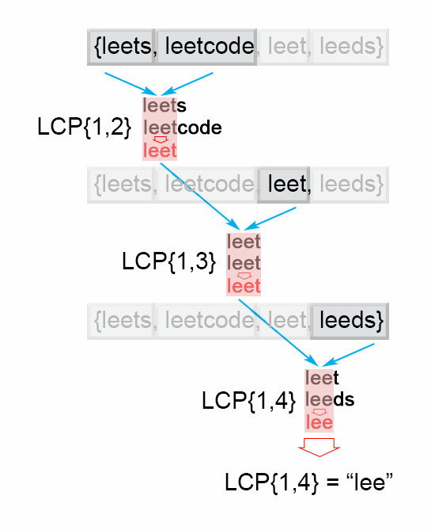
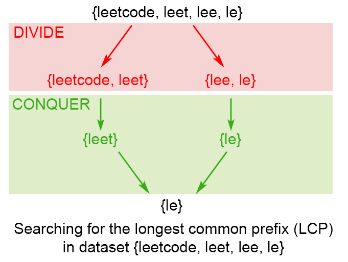
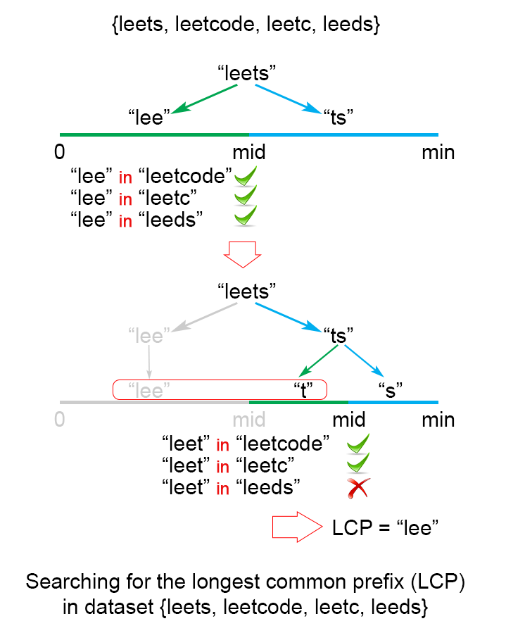
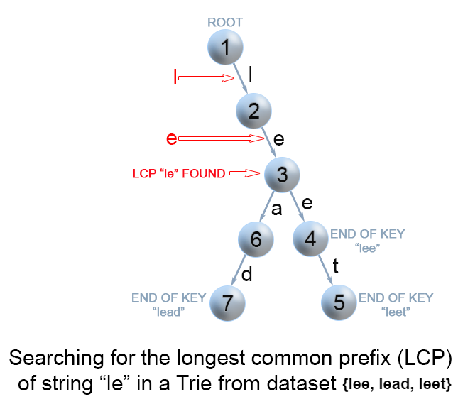

[TOC]

## Video Solution
---

<div>
    <div class="video-container">
        <iframe src="https://player.vimeo.com/video/801372731" width="640" height="360" frameborder="0" allow="autoplay; fullscreen" allowfullscreen></iframe>
    </div>
</div>

<div>
</div>

## Solution Article

---

### Approach 1: Horizontal scanning

#### Intuition

For a start we will describe a simple way of finding the longest prefix shared by a set of strings $LCP(S_1  \ldots  S_n)$.
We will use the observation that :

$LCP(S_1 \ldots S_n) = LCP(LCP(LCP(S_1, S_2),S_3),\ldots S_n)$

#### Algorithm

 To employ this idea, the algorithm iterates through the strings $[S_1  \ldots  S_n]$, finding at each iteration $i$ the longest common prefix of strings $LCP(S_1  \ldots  S_i)$ When $LCP(S_1  \ldots  S_i)$ is an empty string, the algorithm ends. Otherwise after $n$ iterations, the algorithm returns $LCP(S_1  \ldots  S_n)$.

 {:width="539px"}

 *Figure 1. Finding the longest common prefix (Horizontal scanning)*

#### Implementation

```python
class Solution:
    def longestCommonPrefix(self, strs: List[str]) -> str:
        if len(strs) == 0:
            return ""
        prefix = strs[0]
        for i in range(1, len(strs)):
            while strs[i].find(prefix) != 0:
                prefix = prefix[0 : len(prefix) - 1]
                if prefix == "":
                    return ""
        return prefix
```

#### Complexity Analysis

* Time complexity : $O(S)$ , where S is the sum of all characters in all strings.

    In the worst case all $n$ strings are the same. The algorithm compares the string $S1$ with the other strings $[S_2 \ldots S_n]$ There are $S$ character comparisons, where $S$ is the sum of all characters in the input array.

* Space complexity : $O(1)$. We only used constant extra space.

---

### Approach 2: Vertical scanning

#### Algorithm

Imagine a very short string is the common prefix at the end of the array. The above approach will still do $S$ comparisons. One way to optimize this case is to do vertical scanning. We compare characters from top to bottom on the same column (same character index of  the strings) before moving on to the next column.

#### Implementation

```python
class Solution:
    def longestCommonPrefix(self, strs: List[str]) -> str:
        if strs == None or len(strs) == 0:
            return ""
        for i in range(len(strs[0])):
            c = strs[0][i]
            for j in range(1, len(strs)):
                if i == len(strs[j]) or strs[j][i] != c:
                    return strs[0][0:i]
        return strs[0]
```

#### Complexity Analysis

* Time complexity : $O(S)$ , where S is the sum of all characters in all strings.
In the worst case there will be $n$ equal strings with length $m$ and the algorithm performs  $S = m \cdot n$ character comparisons.
Even though the worst case is still the same as [Approach 1](#approach-1-horizontal-scanning), in the best case there are at most $n \cdot minLen$ comparisons where $minLen$ is the length of the shortest string in the array.
* Space complexity : $O(1)$. We only used constant extra space.

---

### Approach 3: Divide and conquer

#### Intuition

The idea of the algorithm comes from the associative property of LCP operation. We notice that :
$LCP(S_1 \ldots S_n) = LCP(LCP(S_1 \ldots S_k), LCP (S_{k+1} \ldots S_n))$
, where $LCP(S_1 \ldots S_n)$ is the longest common prefix in set of strings $[S_1 \ldots S_n]$ , $1 < k < n$

#### Algorithm

To apply the observation above, we use divide and conquer technique, where we split the $LCP(S_i \ldots S_j)$ problem into two subproblems $LCP(S_i \ldots S_{mid})$   and $LCP(S_{mid+1} \ldots S_j)$, where `mid` is $\frac{i + j}{2}$. We use their solutions `lcpLeft` and `lcpRight` to construct the solution of the main problem $LCP(S_i \ldots S_j)$. To accomplish this we compare one by one the characters of `lcpLeft` and `lcpRight` till there is no character match. The found common prefix of `lcpLeft` and `lcpRight` is the solution of the  $LCP(S_i \ldots S_j)$.

{:width="539px"}

*Figure 2. Finding the longest common prefix of strings using divide and conquer technique*

#### Implementation

```python
class Solution:
    def longestCommonPrefix(self, strs):
        if not strs:
            return ""

        def LCP(left, right):
            min_len = min(len(left), len(right))
            for i in range(min_len):
                if left[i] != right[i]:
                    return left[:i]
            return left[:min_len]

        def divide_and_conquer(strs, l, r):
            if l == r:
                return strs[l]
            else:
                mid = (l + r) // 2
                lcpLeft = divide_and_conquer(strs, l, mid)
                lcpRight = divide_and_conquer(strs, mid + 1, r)
                return LCP(lcpLeft, lcpRight)

        return divide_and_conquer(strs, 0, len(strs) - 1)
```

#### Complexity Analysis

In the worst case we have $n$ equal strings with length $m$

* Time complexity : $O(S)$, where $S$ is the number of all characters in the array, $S = m \cdot n$
 Time complexity is $2 \cdot T\left ( \frac{n}{2} \right ) + O(m)$. Therefore time complexity is $O(S)$.
  In the best case this algorithm performs  $O(minLen \cdot n)$ comparisons, where  $minLen$ is the shortest string of the array

* Space complexity : $O(m \cdot \log n)$

    There is a memory overhead since we store recursive calls in the execution stack. There are $\log n$ recursive calls, each store need $m$ space to store the result,  so space complexity is $O(m \cdot \log n)$

---

### Approach 4: Binary search

#### Intuition

The idea is to apply binary search method to find the string with maximum value `L`, which is common prefix of all of the strings. The algorithm searches space is the interval $(0 \ldots minLen)$, where `minLen` is minimum string length and the maximum possible common prefix. Each time search space is divided in two equal parts, one of them is discarded, because it is sure that it doesn't contain the solution. There are two possible cases:
* `S[1...mid]` is not a common string. This means that for each `j > i S[1..j]` is not a common string and we discard the second half of the  search space.
* `S[1...mid]` is common string. This means that for each `i < j S[1..i]` is a common string and we discard the first half of the search space, because we try to find longer common prefix.

{:width="539px"}

*Figure 3. Finding the longest common prefix of strings using binary search technique*

#### Implementation

```python
class Solution:
    def longestCommonPrefix(self, strs: List[str]) -> str:
        if not strs:
            return ""
        minLen = min(len(x) for x in strs)
        low, high = 1, minLen
        while low <= high:
            middle = (low + high) // 2
            if self.isCommonPrefix(strs, middle):
                low = middle + 1
            else:
                high = middle - 1
        return strs[0][: (low + high) // 2]

    def isCommonPrefix(self, strs, l):
        str1 = strs[0][:l]
        for i in range(1, len(strs)):
            if not strs[i].startswith(str1):
                return False
        return True
```

#### Complexity Analysis

In the worst case we have $n$ equal strings with length $m$

* Time complexity : $O(S \cdot \log m)$, where $S$ is the sum of all characters in all strings.

    The algorithm makes $\log m$ iterations, for each of them there are $S = m \cdot n$ comparisons, which gives in total $O(S \cdot \log m)$ time complexity.

* Space complexity : $O(1)$. We only used constant extra space.

---

### Further Thoughts / Follow up

Let's take a look at a slightly different problem:

> Given a set of keys S = $[S_1,S_2 \ldots S_n]$, find the longest common prefix among a string `q` and S. This LCP query will be called frequently.

We could optimize LCP queries by storing the set of keys S in a Trie. For more information about Trie, please see this article [Implement a trie (Prefix trie)](https://leetcode.com/articles/implement-trie-prefix-tree/). In a Trie, each node descending from the root represents a common prefix of some keys. But we need to find the longest common prefix of a string `q` and all key strings. This means that we have to find the deepest path from the root, which satisfies the following conditions:
* it is prefix of query string `q`
* each node along the path must contain only one child element. Otherwise the found path will not be a common prefix among all strings.
* the path doesn't comprise of nodes which are marked as end of key. Otherwise the path couldn't be a prefix a of key which is shorter than itself.

#### Algorithm

The only question left, is how to find the deepest path in the Trie, that fulfills the requirements above. The most effective way is to build a trie from $[S_1 \ldots   S_n]$ strings. Then find the prefix of query string `q` in the Trie. We traverse the Trie from the root, till it is impossible to continue the path in the Trie because one of the conditions above is not satisfied.



*Figure 4. Finding the longest common prefix of strings using Trie*

#### Implementation

```python
class TrieNode:
    def __init__(self):
        self.children = {}
        self.isEnd = False
        self.linkCount = 0

    def addChild(self, char):
        if char not in self.children:
            self.children[char] = TrieNode()
            self.linkCount += 1

class Trie:
    def __init__(self):
        self.root = TrieNode()

    def insert(self, word):
        node = self.root
        for char in word:
            if char not in node.children:
                node.addChild(char)
            node = node.children[char]
        node.isEnd = True

    def searchLongestPrefix(self, word):
        node = self.root
        chars = []
        for char in word:
            if char in node.children and node.linkCount == 1 and not node.isEnd:
                chars.append(char)
                node = node.children[char]
            else:
                break
        return "".join(chars)

class Solution:
    def longestCommonPrefix(self, q, strs):
        if not strs:
            return ""
        if len(strs) == 1:
            return strs[0]
        trie = Trie()
        for s in strs[1:]:
            trie.insert(s)
        return trie.searchLongestPrefix(q)
```

#### Complexity Analysis

In the worst case query $q$ has length $m$ and it is equal to all $n$ strings of the array.

* Time complexity : preprocessing $O(S)$, where $S$ is the number of all characters in the array, LCP query $O(m)$.

    Trie build has $O(S)$ time complexity. To find the common prefix of $q$ in the Trie takes in the worst case $O(m)$.

* Space complexity : $O(S)$. We only used additional  $S$ extra space for the Trie.