## Video Solution
---

<div>
    <div class="video-container">
        <iframe src="https://player.vimeo.com/video/842873305" width="640" height="360" frameborder="0" allow="autoplay; fullscreen" allowfullscreen></iframe>
    </div>
</div>

<div>
</div>

## Solution Article

---

This problem is a follow-up of Two Sum, and it is a good idea to first take a look at [Two Sum](https://leetcode.com/articles/two-sum/) and [Two Sum II](https://leetcode.com/articles/two-sum-ii-input-array-is-sorted/). An interviewer may ask to solve Two Sum first, and then throw 3Sum at you. Pay attention to subtle differences in problem description and try to re-use existing solutions!

Two Sum, Two Sum II and 3Sum share a similarity that the sum of elements must match the target exactly. A difference is that, instead of exactly one answer, we need to find all unique triplets that sum to zero.

Before jumping in, let's check the existing solutions and determine the best conceivable runtime (BCR) for 3Sum:

1. [Two Sum](https://leetcode.com/articles/two-sum/) uses a hashmap to find complement values, and therefore achieves $\mathcal{O}(N)$ time complexity.
2. [Two Sum II](https://leetcode.com/articles/two-sum-ii-input-array-is-sorted/) uses the two pointers pattern and also has $\mathcal{O}(N)$ time complexity for a sorted array. We can use this approach for any array if we sort it first, which bumps the time complexity to $\mathcal{O}(n\log{n})$.

Considering that there is one more dimension in 3Sum, it sounds reasonable to shoot for $\mathcal{O}(n^2)$ time complexity as our BCR.

---

### Approach 1: Two Pointers <a name="approach1"></a>

We will follow the same two pointers pattern as in [Two Sum II](https://leetcode.com/articles/two-sum-ii-input-array-is-sorted/). It requires the array to be sorted, so we'll do that first. As our BCR is $\mathcal{O}(n^2)$, sorting the array would not change the overall time complexity.

To make sure the result contains unique triplets, we need to skip duplicate values. It is easy to do because repeating values are next to each other in a sorted array.

> If you are wondering how to solve this problem without sorting the array, go over the ["No-Sort"](#approach3) approach below. There are cases when that approach is preferable, and your interviewer may probe your knowledge there.

After sorting the array, we move our pivot element $\text{nums}[i]$ and analyze elements to its right. We find all pairs whose sum is equal $-\text{nums}[i]$ using the two pointers pattern, so that the sum of the pivot element ($\text{nums}[i]$) and the pair ($-\text{nums}[i]$) is equal to zero.

As a quick refresher, the pointers are initially set to the first and the last element respectively. We compare the sum of these two elements to the target. If it is smaller, we increment the lower pointer `lo`. Otherwise, we decrement the higher pointer `hi`. Thus, the sum always moves toward the target, and we "prune" pairs that would move it further away. Again, this works only if the array is sorted. Head to the [Two Sum II](https://leetcode.com/articles/two-sum-ii-input-array-is-sorted/) solution for the detailed explanation.

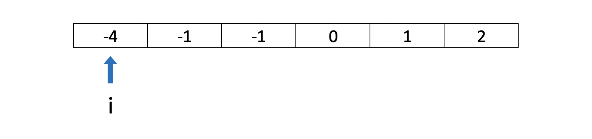

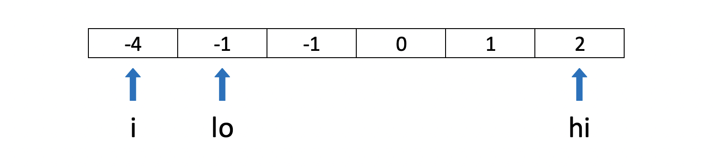

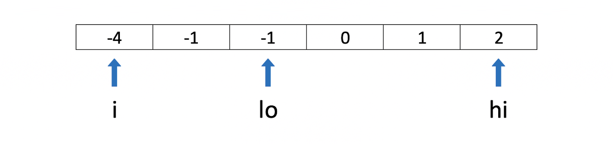

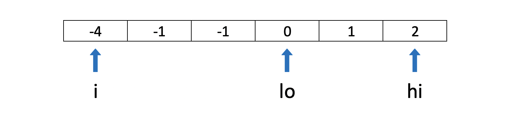

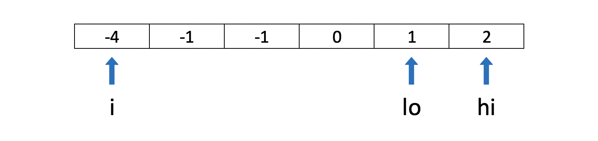

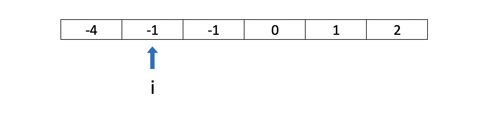

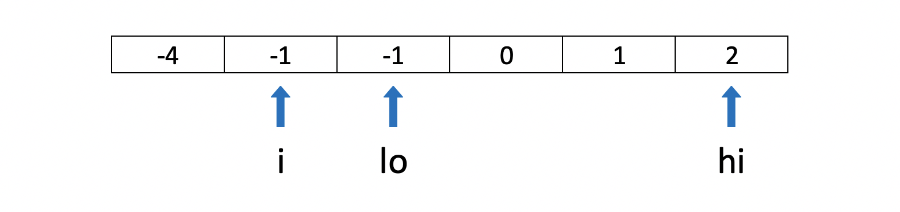

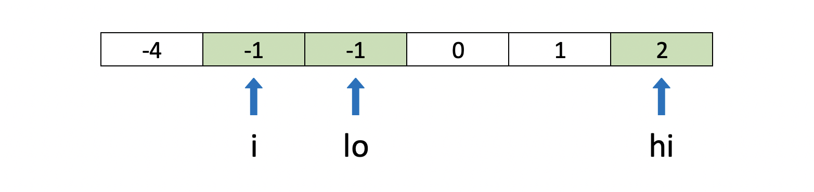

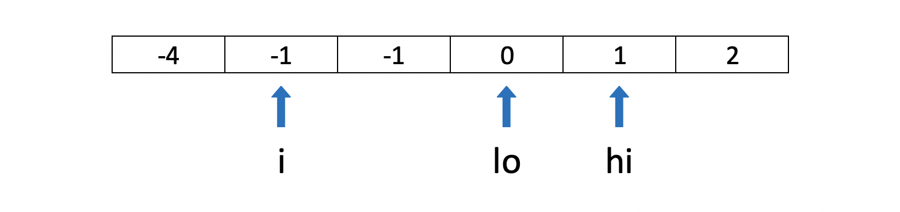

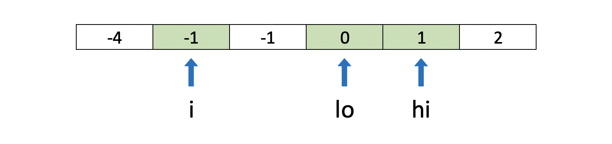

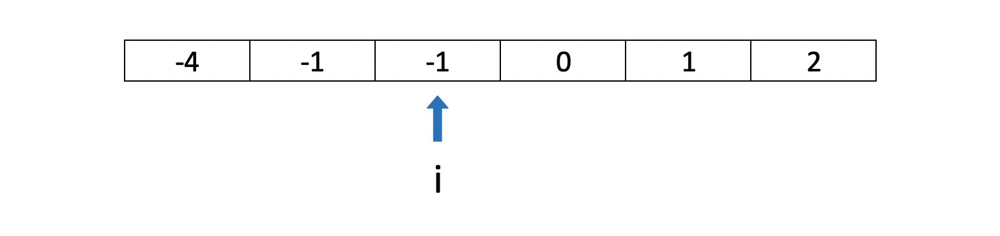

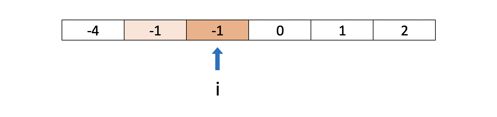

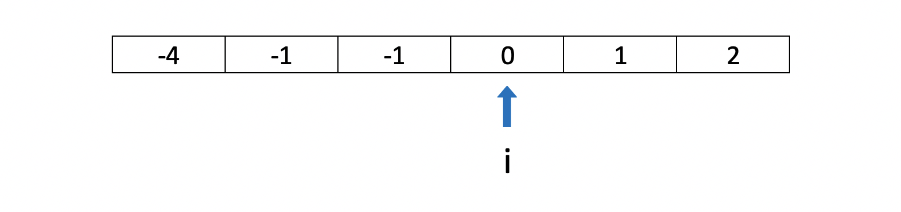

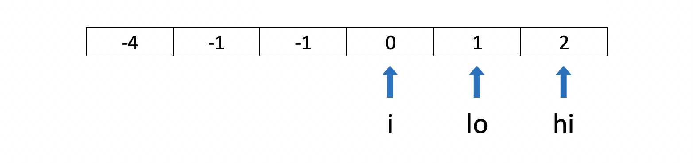

**Algorithm**

The implementation is straightforward - we just need to modify `twoSumII` to produce triplets and skip repeating values.

1. For the main function:
- Sort the input array `nums`.
- Iterate through the array:
- If the current value is greater than zero, break from the loop. Remaining values cannot sum to zero.
- If the current value is the same as the one before, skip it.
- Otherwise, call `twoSumII` for the current position `i`.

2. For `twoSumII` function:
- Set the low pointer `lo` to $i + 1$, and high pointer `hi` to the last index.
- While low pointer is smaller than high:
- If `sum` of $\text{nums}[i] + \text{nums}[lo] + \text{nums}[hi]$ is less than zero, increment `lo`.
- If `sum` is greater than zero, decrement `hi`.
- Otherwise, we found a triplet:
- Add it to the result `res`.
- Decrement `hi` and increment `lo`.
- Increment `lo` while the next value is the same as before to avoid duplicates in the result.

3. Return the result `res`.

```python
class Solution:
    def threeSum(self, nums: List[int]) -> List[List[int]]:
        res = []
        nums.sort()
        for i in range(len(nums)):
            if nums[i] > 0:
                break
            if i == 0 or nums[i - 1] != nums[i]:
                self.twoSumII(nums, i, res)
        return res

    def twoSumII(self, nums: List[int], i: int, res: List[List[int]]):
        lo, hi = i + 1, len(nums) - 1
        while lo < hi:
            sum = nums[i] + nums[lo] + nums[hi]
            if sum < 0:
                lo += 1
            elif sum > 0:
                hi -= 1
            else:
                res.append([nums[i], nums[lo], nums[hi]])
                lo += 1
                hi -= 1
                while lo < hi and nums[lo] == nums[lo - 1]:
                    lo += 1
```

**Complexity Analysis**

- Time Complexity: $\mathcal{O}(n^2)$. `twoSumII` is $\mathcal{O}(n)$, and we call it $n$ times.

    Sorting the array takes $\mathcal{O}(n\log{n})$, so overall complexity is $\mathcal{O}(n\log{n} + n^2)$. This is asymptotically equivalent to $\mathcal{O}(n^2)$.

- Space Complexity: from $\mathcal{O}(\log{n})$ to $\mathcal{O}(n)$, depending on the implementation of the sorting algorithm. For the purpose of complexity analysis, we ignore the memory required for the output.

---

### Approach 2: Hashset

Since triplets must sum up to the target value, we can try the hash table approach from the [Two Sum](https://leetcode.com/articles/two-sum/) solution. This approach won't work, however, if the sum is not necessarily equal to the target, like in [3Sum Smaller](https://leetcode.com/problems/3sum-smaller/) and [3Sum Closest](https://leetcode.com/problems/3sum-closest/).

We move our pivot element $\text{nums}[i]$ and analyze elements to its right. We find all pairs whose sum is equal $-\text{nums}[i]$ using the [Two Sum: One-pass Hash Table](https://leetcode.com/articles/two-sum/#approach-3-one-pass-hash-table) approach, so that the sum of the pivot element ($\text{nums}[i]$) and the pair ($-\text{nums}[i]$) is equal to zero.

To do that, we process each element $\text{nums}[j]$ to the right of the pivot, and check whether a complement $-\text{nums}[i] - \text{nums}[j]$ is already in the hashset. If it is, we found a triplet. Then, we add $\text{nums}[j]$ to the hashset, so it can be used as a complement from that point on.

Like in the approach above, we will also sort the array so we can skip repeated values. We provide a different way to avoid duplicates in the ["No-Sort"](#approach3) approach below.

**Algorithm**

The main function is the same as in the [Two Pointers](#approach1) approach above. Here, we use `twoSum` (instead of `twoSumII`), modified to produce triplets and skip repeating values.

1. For the main function:
- Sort the input array `nums`.
- Iterate through the array:
- If the current value is greater than zero, break from the loop. Remaining values cannot sum to zero.
- If the current value is the same as the one before, skip it.
- Otherwise, call `twoSum` for the current position `i`.

2. For `twoSum` function:
- For each index `j > i` in `A`:
- Compute `complement` value as $-\text{nums}[i] - \text{nums}[j]$.
- If `complement` exists in hashset `seen`:
- We found a triplet - add it to the result `res`.
- Increment `j` while the next value is the same as before to avoid duplicates in the result.
- Add $\text{nums}[j]$ to hashset `seen`

3. Return the result `res`.

```python
class Solution:
    def threeSum(self, nums: List[int]) -> List[List[int]]:
        res = []
        nums.sort()
        for i in range(len(nums)):
            if nums[i] > 0:
                break
            if i == 0 or nums[i - 1] != nums[i]:
                self.twoSum(nums, i, res)
        return res

    def twoSum(self, nums: List[int], i: int, res: List[List[int]]):
        seen = set()
        j = i + 1
        while j < len(nums):
            complement = -nums[i] - nums[j]
            if complement in seen:
                res.append([nums[i], nums[j], complement])
                while j + 1 < len(nums) and nums[j] == nums[j + 1]:
                    j += 1
            seen.add(nums[j])
            j += 1
```

- Time Complexity: $\mathcal{O}(n^2)$. `twoSum` is $\mathcal{O}(n)$, and we call it $n$ times.

    Sorting the array takes $\mathcal{O}(n\log{n})$, so overall complexity is $\mathcal{O}(n\log{n} + n^2)$. This is asymptotically equivalent to $\mathcal{O}(n^2)$.

- Space Complexity: $\mathcal{O}(n)$ for the hashset.

---

### Approach 3: "Hash with Triplet Sorting for Duplicate Elimination" <a name="approach3"></a>

What if you cannot modify the input array, and you want to avoid copying it due to memory constraints?

We can adapt the hashset approach above to work for an unsorted array. We can put a combination of three values into a hashset to avoid duplicates. Values in a combination should be ordered (e.g. ascending). Otherwise, we can have results with the same values in the different positions.

**Algorithm**

The algorithm is similar to the hashset approach above. We just need to add few optimizations so that it works efficiently for repeated values:

1. Use another hashset `dups` to skip duplicates in the outer loop.
- Without this optimization, the submission will time out for the test case with 3,000 zeroes. This case is handled naturally when the array is sorted.
2. Instead of re-populating a hashset every time in the inner loop, we can use a hashmap and populate it once. Values in the hashmap will indicate whether we have encountered that element in the current iteration. When we process $\text{nums}[j]$ in the inner loop, we set its hashmap value to `i`. This indicates that we can now use $\text{nums}[j]$ as a complement for $\text{nums}[i]$.
- This is more like a trick to compensate for container overheads. The effect varies by language, e.g. for C++ it cuts the runtime in half. Without this trick the submission may time out.

```python
class Solution:
    def threeSum(self, nums: List[int]) -> List[List[int]]:
        res, dups = set(), set()
        seen = {}
        for i, val1 in enumerate(nums):
            if val1 not in dups:
                dups.add(val1)
                for j, val2 in enumerate(nums[i + 1 :]):
                    complement = -val1 - val2
                    if complement in seen and seen[complement] == i:
                        res.add(tuple(sorted((val1, val2, complement))))
                    seen[val2] = i
        return [list(x) for x in res]
```

**Complexity Analysis**

- Time Complexity: $\mathcal{O}(n^2)$. We have outer and inner loops, each going through $n$ elements.

    While the asymptotic complexity is the same, this algorithm is generally slower than the previous approach due to the overhead of hashset lookups and triplet sorting. However, the relative performance is language-dependent. For example, in C++, the hashmap reuse optimization (populating it once and using index markers) can make this approach faster in practice by avoiding the repeated allocation and deallocation of per-iteration hashsets in Approach 2.

- Space Complexity: $\mathcal{O}(n)$ for the hashset/hashmap.

    For the purpose of complexity analysis, we ignore the memory required for the output. However, in this approach we also store output in the hashset for deduplication. In the worst case, there could be $\mathcal{O}(n^2)$ triplets in the output, like for this example: `[-k, -k + 1, ..., -1, 0, 1, ... k - 1, k]`. Adding a new number to this sequence will produce $n / 3$ new triplets.

---

### Further Thoughts

This is a well-known problem with many variations and its own [Wikipedia page](https://en.wikipedia.org/wiki/3SUM).

For an interview, we recommend focusing on the Two Pointers approach above. It's easier to get it right and adapt for other variations of 3Sum. Interviewers love asking follow-up problems like [3Sum Smaller](https://leetcode.com/problems/3sum-smaller/) and [3Sum Closest](https://leetcode.com/problems/3sum-closest/)!