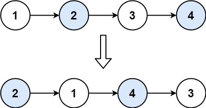

## Description

Given a linked list, swap every two adjacent nodes and return its head. You must solve the problem without modifying the values in the list's nodes (i.e., only nodes themselves may be changed.)
### Function Contract

**Inputs**

- `head`: The head of the linked list whose adjacent nodes will be swapped.

**Return value**

Return the head after swapping the first node with the second, the third with the fourth, and so on. Leave an unpaired final node in place.

### Examples

#### Example 1

**Input:** head = [1,2,3,4]

**Output:** [2,1,4,3]

**Explanation:**

#### Example 2

**Input:** head = []

**Output:** []

#### Example 3

**Input:** head = [1]

**Output:** [1]

#### Example 4

**Input:** head = [1,2,3]

**Output:** [2,1,3]

### Constraints

- The number of nodes in the list is in the range `[0, 100]`.

- $0 \le \text{Node.val} \le 100$