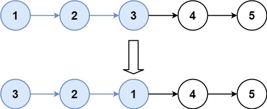

## Description

Given the `head` of a linked list, reverse the nodes of the list `k` at a time, and return *the modified list*.

`k` is a positive integer and is less than or equal to the length of the linked list. If the number of nodes is not a multiple of `k` then left-out nodes, in the end, should remain as it is.

You may not alter the values in the list's nodes, only nodes themselves may be changed.
### Function Contract

**Inputs**

- `head`: The head of the linked list to transform.
- `k`: The positive size of each reversal group.

Let $n$ be the number of nodes in `head`.

**Return value**

Return the head after reversing every complete group of $k$ nodes and retaining any incomplete suffix.

### Examples

#### Example 1

- **Input:** $head = [1,2,3,4,5], k = 2$
- **Output:** `[2,1,4,3,5]`
#### Example 2

- **Input:** $head = [1,2,3,4,5], k = 3$
- **Output:** `[3,2,1,4,5]`
### Constraints

- The number of nodes in the list is `n`.

- $1 \le k \le n \le 5000$

- $0 \le \text{Node.val} \le 1000$
### Follow-up Can you solve the problem in `O(1)` extra memory space?