[TOC]

## Video Solution
---

<div>
    <div class="video-container">
        <iframe src="https://player.vimeo.com/video/784866294" width="640" height="360" frameborder="0" allow="autoplay; fullscreen" allowfullscreen></iframe>
    </div>
</div>

<div>
</div>

## Solution Article

---

### Approach 1: Check All Indices Using a Hash Table

**Intuition**

> Definition: a **valid substring** is a string that is a concatenation of all of the words in our word bank. So if we are given the words "foo" and "bar", then "foobar" and "barfoo" would be valid substrings.

An important detail in the problem description to notice is that **all elements in `words` have the same length**. This gives us valuable information about all valid substrings - we know what length they will be. Each valid substring is the concatenation of `words.length` words which all have the same length, so each valid substring has a length of $\text{words.length} * \text{words}[0].length$.

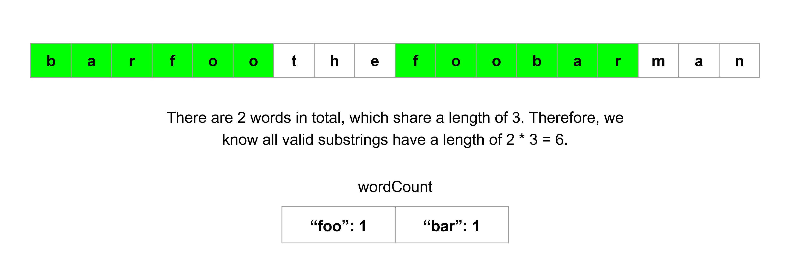<br>

This makes it easy for us to take a given index and check if a valid substring starting at this index exists. Let's say that the elements of `words` have a length of `3`. Then, for a given starting index, we can just look at the string in groups of `3` characters and check if those characters form a word in `words`. Because `words` can have duplicate words, we should use a hash table to maintain a count for each word. As a bonus, a hash table also lets us search for word matches very quickly.

We can write a helper function that takes an index and returns if a valid substring starting at this index exists. Then, we can build our answer by running this function for all candidate indices. The logic for this function can be something along the lines of:

- Iterate from the starting index to the starting index plus the size of a valid substring.
- Iterate $\text{words}[0].length$ characters at a time. At each iteration, we will look at a substring with the same length as the elements in `words`.
- If the substring doesn't exist in `words`, or it does exist but we already found the necessary amount of it, then return false.
- We can use a hash table to keep an updated count of the words between the starting index and the current index.

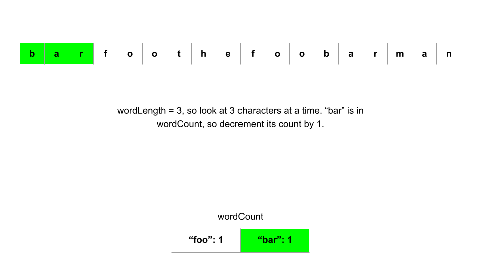

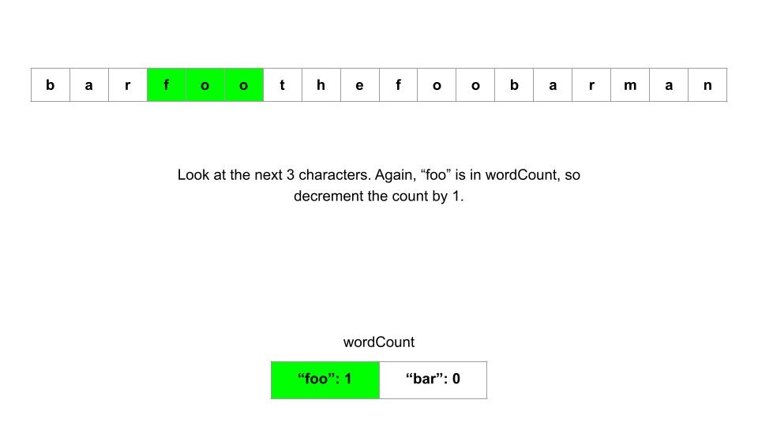

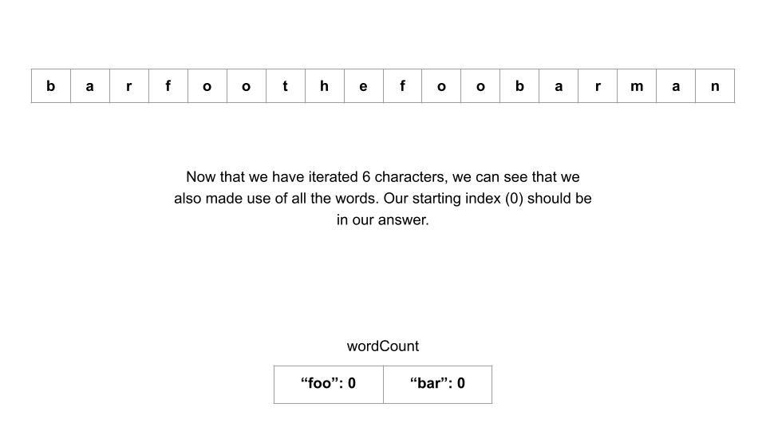

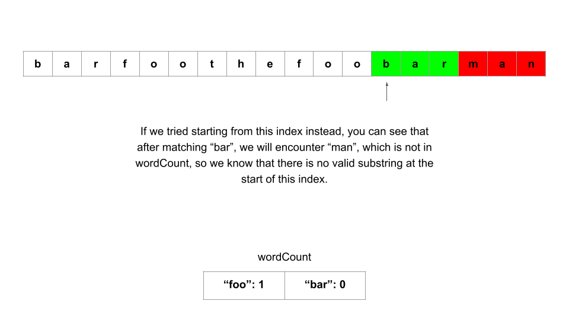

**Algorithm**

1. Initialize some variables:
- `n` as the length of `s`.
- `k` as the length of `words`
- `wordLength` as the length of each word in `words`.
- `substringSize` as $wordLength * k$, which represents the size of each valid substring.
- `wordCount` as a hash table that tracks how many times a word occurs in `words`.

2. Create a function `check` that takes a starting index `i` and returns if a valid substring starts at index `i`:
- Create a copy of `wordCount` to make use of for this particular index. Let's call it `remaining`. Also, initialize an integer `wordsUsed` which tracks how many matches we have found so far.
- Iterate starting from `i`. Iterate until $i + substringSize$ - we know that each valid substring will have this size, so we don't need to go further. At each iteration, we will be checking for a word - and we know each word has a length of `wordLength`, so increment by `wordLength` each time.
- If the variable we are iterating with is `j`, then at each iteration, check for a word $sub = \text{s.substring}(j, j + wordLength)$.
- If `sub` is in `remaining` and has a value greater than `0`, then decrease its count by `1` and increase `wordsUsed` by `1`. Otherwise, `break` out of the loop.
- At the end of it all, if $wordsUsed = k$, that means we used up all the words in `words` and have found a valid substring. Return `true` if so, `false` otherwise.

3. Now that we have this function `check`, we can just check all possible starting indices. Because a valid substring has a length of `substringSize`, we only need to iterate up to $n - substringSize$. Build an array with all indices that pass `check` and return it.

**Implementation**

```python
class Solution:
    def findSubstring(self, s: str, words: List[str]) -> List[int]:
        n = len(s)
        k = len(words)
        word_length = len(words[0])
        substring_size = word_length * k
        word_count = collections.Counter(words)

        def check(i):
            # Copy the original dictionary to use for this index
            remaining = word_count.copy()
            words_used = 0

            # Each iteration will check for a match in words
            for j in range(i, i + substring_size, word_length):
                sub = s[j : j + word_length]
                if remaining[sub] > 0:
                    remaining[sub] -= 1
                    words_used += 1
                else:
                    break

            # Valid if we used all the words
            return words_used == k

        answer = []
        for i in range(n - substring_size + 1):
            if check(i):
                answer.append(i)

        return answer
```

**Complexity Analysis**

Given $n$ as the length of `s`, $a$ as the length of `words`, and $b$ as the length of each word:

* Time complexity: $O(n \cdot a \cdot b - (a \cdot b) ^ 2)$

    First, let's analyze the time complexity of `check`. We start by creating a copy of our hash table, which in the worst case will take $O(a)$ time, when `words` only has unique elements. Then, we iterate $a$ times (from `i` to $i + substringSize$, `wordLength` at a time): $\text{substringSize / wordLength = words.length = } a$. At each iteration, we create a substring, which takes `wordLength` = $b$ time. Then we do a hash table check.

    That means each call to `check` uses $O(a + a \cdot (b + 1))$ time, simplified to $O(a \cdot b)$. How many times do we call `check`? Only $n - substringSize$ times. Recall that `substringSize` is equal to the length of `words` times the length of $\text{words}[0]$, which we have defined as $a$ and $b$ respectively here. That means we call `check` $n - a \cdot b$ times.

    This gives us a time complexity of $O((n - a \cdot b) \cdot a \cdot b)$, which can be expanded to $O(n \cdot a \cdot b - (a \cdot b) ^ 2)$.

* Space complexity: $O(a + b)$

    Most of the time, the majority of extra memory we use is the hash table to store word counts. In the worst-case scenario where `words` only has unique elements, we will store up to $a$ keys.

    We also store substrings in `sub` which requires $O(b)$ space. So the total space complexity of this approach is $O(a + b)$. However, because for this particular problem the upper bound for $b$ is very small (30), we can consider the space complexity to be $O(a)$.

<br/>

---

### Approach 2: Sliding Window

**Intuition**

In the previous approach, we made use of the fact that all elements of `words` share the same length, which allows us to efficiently check for valid substrings. Unfortunately, we repeated a lot of computation - each character of `s` is iterated over many times. Imagine if we had an input like this:

`s = "barfoobarfoo"` and $words = ["bar", "foo"]$

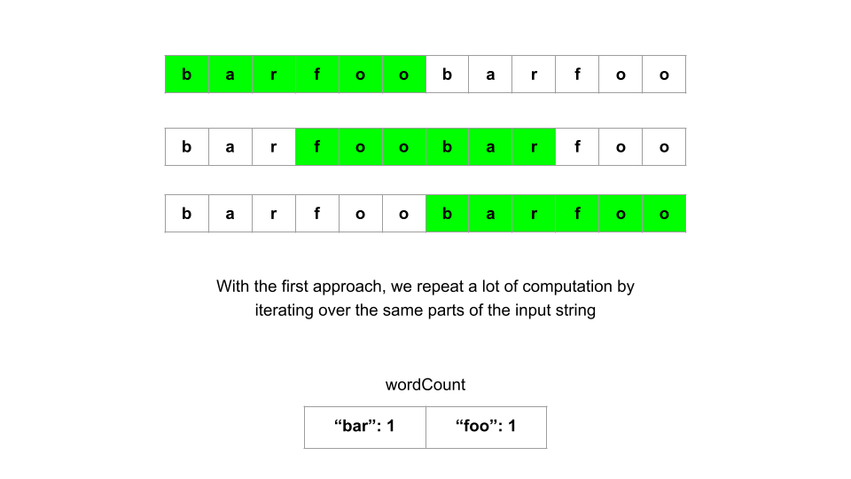<br>

Valid substrings start at index `0`, `3`, and `6`. Notice that the substrings starting at indices `0` and `3` share the same `"foo"`. That means we are iterating over and handling this `"foo"` twice, which shouldn't be necessary. We do it again with the substrings starting at indices `3` and `6` - they use the same `"bar"`. In this specific example it may not seem too bad, but imagine if we had an input like:

`s = "aaaa...aaa", s.length = 10,000` and $words = ["a", "a", ..., "a", "a"], \text{words.length} = 5000$

We would be iterating over the same characters **millions** of times. How can we avoid repeated computation? Let's make use of a sliding window. We can re-use most of the logic from the previous approach, but this time instead of only checking for one valid substring at a time with each call to `check`, we will try to find **all** valid substrings in one pass by sliding our window across `s`.

So how will the left and right bounds of the window move, and how can we tell if we our window is a valid substring? Let's say we start at index `0` and do the same process as the previous approach - iterate `wordLength` at a time, so that at each iteration we are focusing on one potential word. Our iteration variable, say `right`, can be our right bound. We can initialize our left bound at `0`, say $left = 0$.

Now, `right` will move at each iteration, by `wordLength` each time. At each iteration, we have a word $sub = \text{s.substring}(right, right + wordLength)$. If `sub` is not in `words`, we know that we cannot possibly form a valid substring, so we should reset the entire window and try again, starting with the next iteration. If `sub` is in `words`, then we need to keep track of it. Like in the previous approach, we can use a hash table to keep count of all the words in our current window.

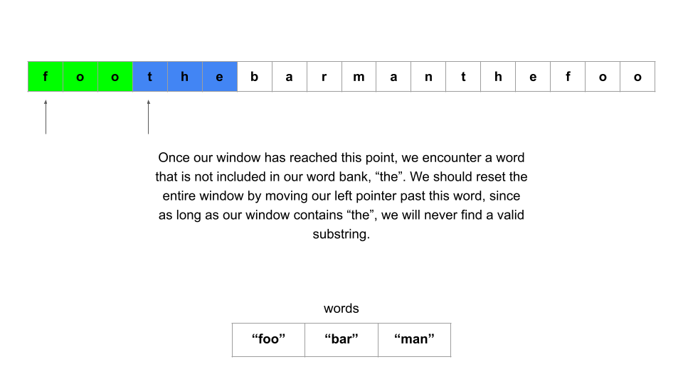<br>

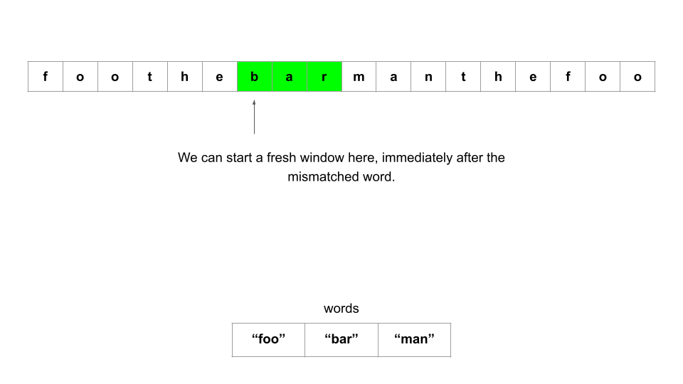<br>

When our window has reached the maximum size (`substringSize`), we can check if it is a valid substring. Like in the previous approach, we can use an integer `wordsUsed` to check if $wordsUsed = \text{words.length}$ to see if we made use of all the elements in `words`, and thus have a valid substring. If we do, then we can add `left` to our answer.

Whether we have a valid substring or not, if our window has reached maximum size, we need to move the left bound. This means we need to find the word we are removing from the window, and perform the necessary logic to keep our hash table up to date.

Another thing to note: we may encounter excess words. For example, with `s = "foofoobar"`, and $words = ["foo", "bar"]$, the two `"foo"` should not be matched together to have $wordsUsed = 2$. Whenever we find that `sub` is in `words`, we should check how many times we have seen `sub` so far in the current window (using our hash table), and if it is greater than the number of times it appears in `words` (which we can find with a second hash table, `wordCount` in the first approach), then we know we have an excess word and should not increment `wordsUsed`.

In fact, so long as we have an excess word, we can never have a valid substring. Therefore, another criterion for moving our left bound should be to remove words from the left until we find the excess word and remove it (which we can accomplish by comparing the hash table values).

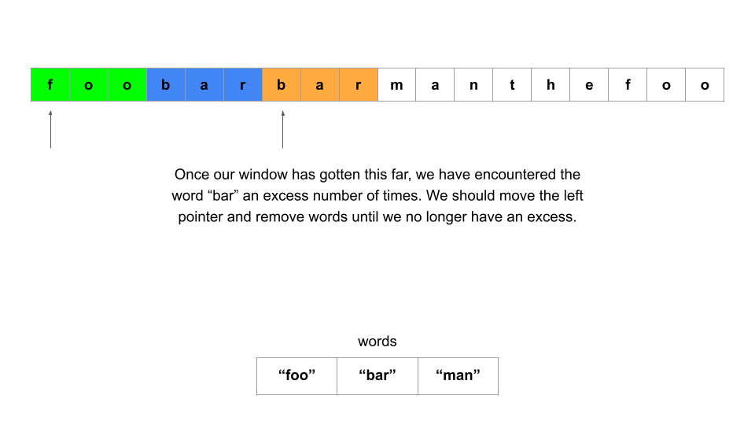<br>

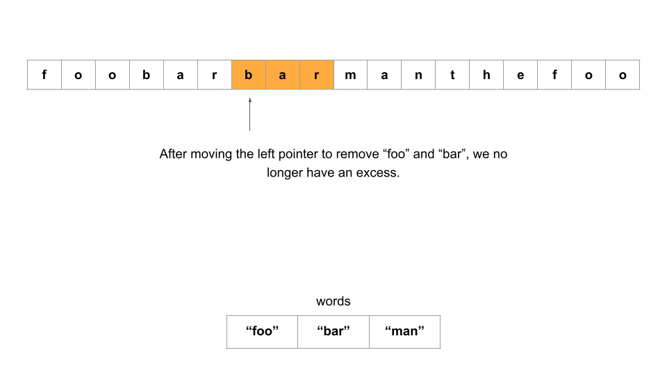<br>

Now that we've described the logic needed for the sliding window, how will we apply the window? In the first approach, we tried every candidate index (all indices up until $n - substringSize$). In this problem, you may notice that starting the process from two indices that are `wordLength` apart is pointless. For example, if we have $words = ["foo", "bar"]$, then starting from index `3` is pointless since by starting at index `0`, we will move over index `3`. However, we will still need to try starting from indices `1` and `2`, in case the input looks something like `s = "xfoobar"` or `s = "xyfoobar"`. As such, we will only need to perform the sliding window `wordLength` amount of times.

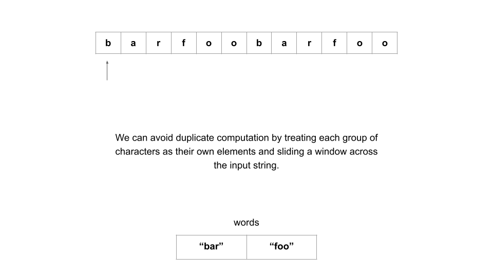

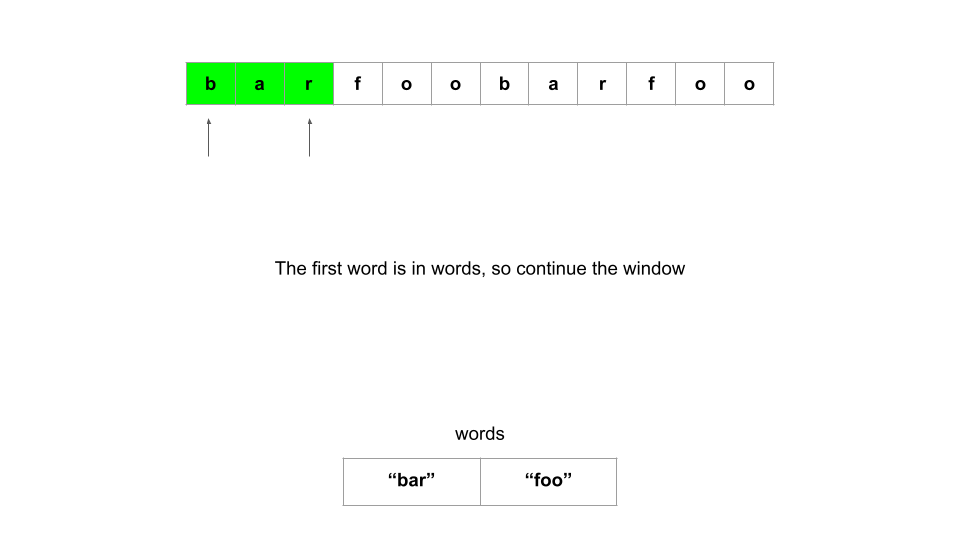

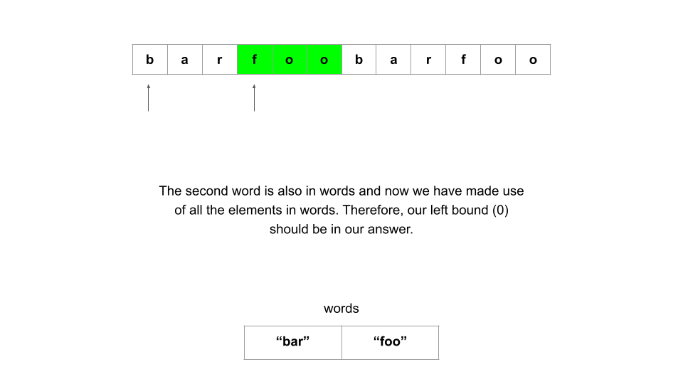

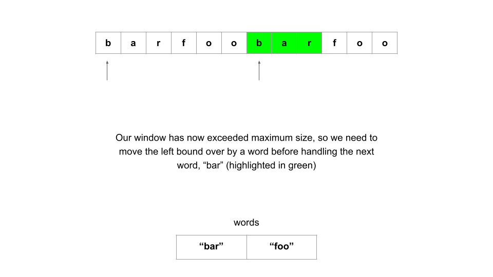

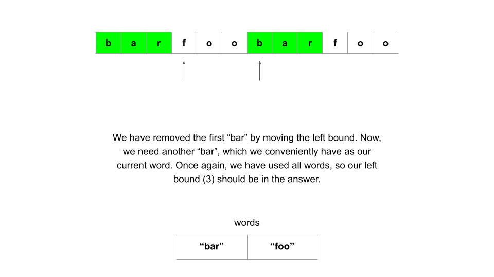

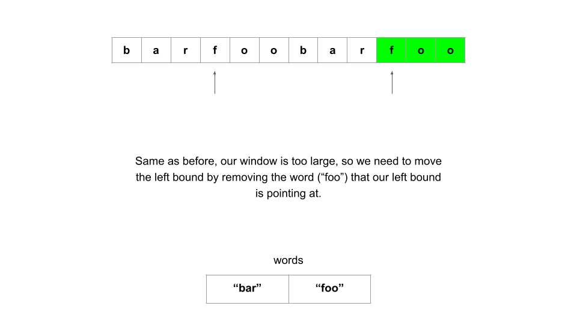

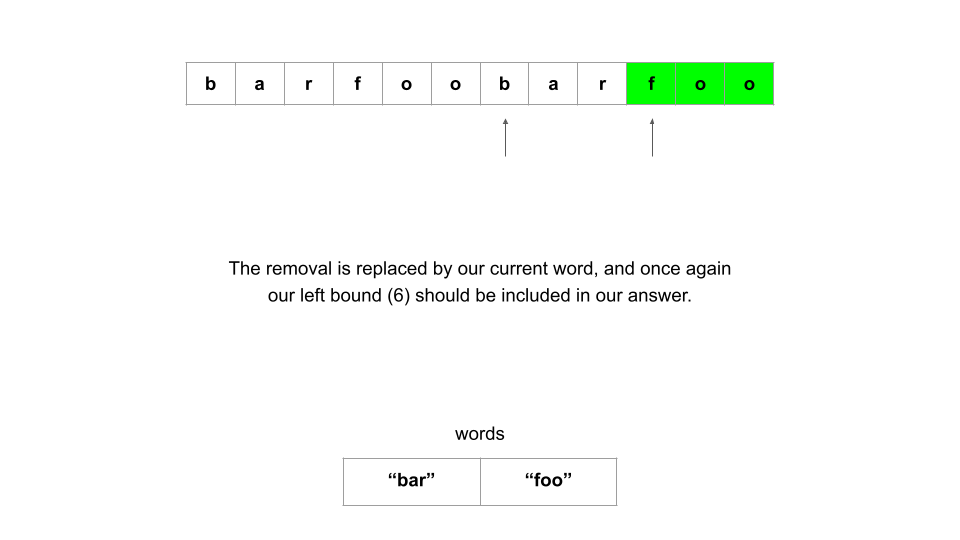

**Algorithm**

1. Initialize some variables:
- `n` as the length of `s`.
- `k` as the length of `words`
- `wordLength` as the length of each word in `words`.
- `substringSize` as $wordLength * k$, which represents the size of each valid substring.
- `wordCount` as a hash table that tracks how many times a word occurs in `words`.
- `answer` as an array that will hold the starting index of every valid substring

2. Create a function `slidingWindow` that takes an index `left` and starts a sliding window from `left`:
- Initialize a hash table `wordsFound` that will keep track of how many times a word appears in our window. Also, an integer $wordsUsed = 0$ to keep track of how many words are in our window, and a boolean $excessWord = false$ that indicates if our window is currently holding an excess word, such as a third `"foo"` if $words = ["foo", "foo"]$.
- Iterate using the right bound of our window, `right`. Start iteration at `left`, until `n`, `wordLength` at a time. At each iteration:
- We are dealing with a word $sub = \text{s.substring}(right, right + wordLength)$. If `sub` is not in `wordCount`, then we must reset the window. Clear our hash table `wordsFound`, and reset our variables $wordsUsed = 0$ and $excessWord = false$. Move `left` to the next index we will handle, which will be $right + wordLength$.
- Otherwise, if `sub` is in `wordCount`, we can continue with our window. First, check if our window is beyond max size or has an excess word. So long as either of these conditions are true, move `left` over while appropriately updating our hash table, integer and boolean variables.
- Now, we can handle `sub`. Increment its value in `wordsFound`, and then compare its value in `wordsFound` to its value in `wordCount`. If the value is less than or equal, then we can make use of this word in a valid substring - increment `wordsUsed`. Otherwise, it is an excess word, and we should set $excessWord = true$.
- At the end of it all, if we have $wordsUsed = k$ without any excess words, then we have a valid substring. Add `left` to `answer`.

3. Call `slidingWindow` with each index from `0` to `wordLength`. Return `answer` once finished.

**Implementation**

```python
class Solution:
    def findSubstring(self, s: str, words: List[str]) -> List[int]:
        n = len(s)
        k = len(words)
        word_length = len(words[0])
        substring_size = word_length * k
        word_count = collections.Counter(words)

        def sliding_window(left):
            words_found = collections.defaultdict(int)
            words_used = 0
            excess_word = False

            # Do the same iteration pattern as the previous approach - iterate
            # word_length at a time, and at each iteration we focus on one word
            for right in range(left, n, word_length):
                if right + word_length > n:
                    break

                sub = s[right : right + word_length]
                if sub not in word_count:
                    # Mismatched word - reset the window
                    words_found = collections.defaultdict(int)
                    words_used = 0
                    excess_word = False
                    left = right + word_length  # Retry at the next index
                else:
                    # If we reached max window size or have an excess word
                    while right - left == substring_size or excess_word:
                        # Move the left bound over continously
                        leftmost_word = s[left : left + word_length]
                        left += word_length
                        words_found[leftmost_word] -= 1

                        if (
                            words_found[leftmost_word]
                            == word_count[leftmost_word]
                        ):
                            # This word was the excess word
                            excess_word = False
                        else:
                            # Otherwise we actually needed it
                            words_used -= 1

                    # Keep track of how many times this word occurs in the window
                    words_found[sub] += 1
                    if words_found[sub] <= word_count[sub]:
                        words_used += 1
                    else:
                        # Found too many instances already
                        excess_word = True

                    if words_used == k and not excess_word:
                        # Found a valid substring
                        answer.append(left)

        answer = []
        for i in range(word_length):
            sliding_window(i)

        return answer
```

**Complexity Analysis**

Given $n$ as the length of `s`, $a$ as the length of `words`, and $b$ as the length of each word:

* Time complexity: $O(a + n \cdot b)$

    First, let's analyze the time complexity of `slidingWindow()`. The for loop in this function iterates from the starting index `left` up to `n`, at increments of `wordLength`. This results in $n / b$ total iterations. At each iteration, we create a substring of length `wordLength`, which costs $O(b)$.

    Although there is a nested while loop, the left pointer can only move over each word once, so this inner loop will only ever perform a total of $n / wordLength$ iterations summed across all iterations of the outer for loop. Inside that while loop, we also take a substring which costs $O(b)$, which means each iteration will cost at most $O(2 \cdot b)$ on average.

    This means that each call to `slidingWindow` costs $O(\dfrac{n}{b} \cdot 2 \cdot b)$, or $O(n)$. How many times do we call `slidingWindow`? `wordLength`, or $b$ times. This means that all calls to `slidingWindow` costs $O(n \cdot b)$.

    On top of the calls to `slidingWindow`, at the start of the algorithm we create a dictionary `wordCount` by iterating through `words`, which costs $O(a)$. This gives us our final time complexity of $O(a + n \cdot b)$.

    Notice that the length of `words` $a$ is not multiplied by anything, which makes this approach **much** more efficient than the first approach due to the bounds of the problem, as $n > a \gg b$.

* Space complexity: $O(a + b)$

    Most of the times, the majority of extra memory we use is due to the hash tables used to store word counts. In the worst-case scenario where `words` only has unique elements, we will store up to $a$ keys in the tables.

    We also store substrings in `sub` which requires $O(b)$ space. So the total space complexity of this approach is $O(a + b)$. However, because for this particular problem the upper bound for $b$ is very small (30), we can consider the space complexity to be $O(a)$.

<br/>

---