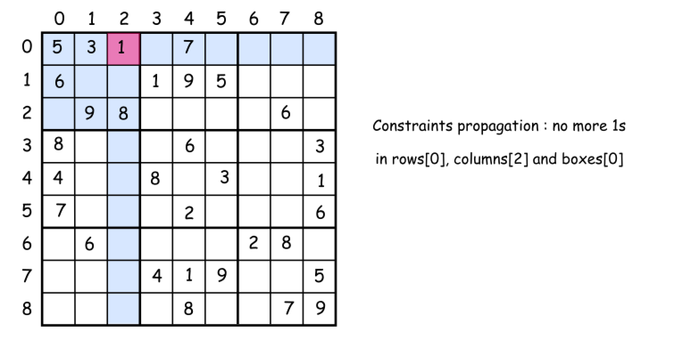
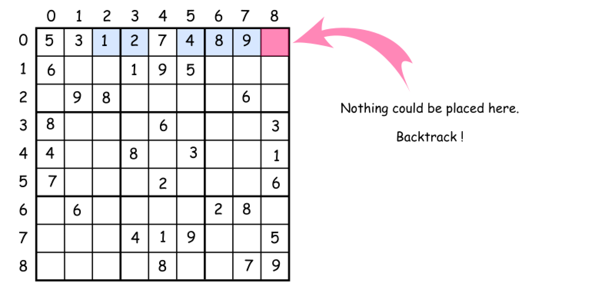
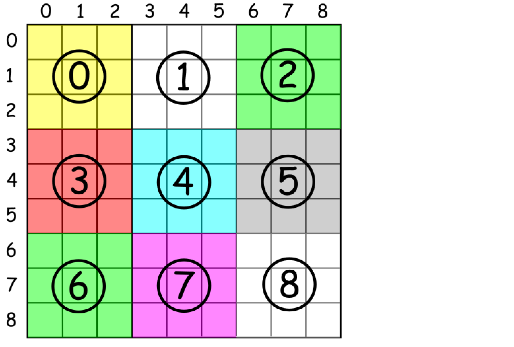

[TOC]

## Solution

---

### Approach 0: Brute Force

The first idea is to use brut-force to generate all possible ways to fill the cells with numbers from `1` to `9`, and then check them to keep the solution only. That means $9^{81}$ operations to do, where $9$ is the number of available digits and $81$ is the number of cells to fill. Hence we're forced to think further about how to optimize.
<br />
<br />

---
### Approach 1: Backtracking

**Conceptions to use**

There are two programming conceptions here that could help.

> The first one is called _constrained programming_.

That basically means to put restrictions after each number placement. One puts a number on the board and that immediately excludes this number from further usage in the current _row_, _column_ and _sub-box_. That propagates _constraints_ and helps to reduce the number of combinations to consider.



> The second one called _backtracking_.

Let's imagine that one has already managed to put several numbers on the board. But the combination chosen is not the optimal one and there is no way to place the further numbers. What to do? _To backtrack_. That means to come back, to change the previously placed number, and try to proceed again. If that does not work either, _backtrack_ again.



**How to enumerate sub-boxes**

> One tip to enumerate sub-boxes: let's use $\text{box}_{index} = (row / 3) * 3 + column / 3$ where `/` is an integer division.



**Algorithm**

Now everything is ready to write down the backtrack function $backtrack(row = 0, col = 0)$.

* Start from the upper left cell $row = 0, col = 0$. Proceed till the first free cell.
* Iterate over the numbers from `1` to `9` and try to put each number `d` in the `(row, col)` cell.

* If number `d` is not yet in the current row, column, and box:

* Place the `d` in a `(row, col)` cell.
* Write down that `d` is now present in the current row, column, and box.
* If we're on the last cell $row = 8, col = 8$:
* That means that we've solved the sudoku.
* Else
* Proceed to place further numbers.
* Backtrack if the solution is not yet here: remove the last number from the `(row, col)` cell.

**Implementation**

```python
from collections import defaultdict

class Solution:
    def solveSudoku(self, board):
        """
        :type board: List[List[str]]
        :rtype: void Do not return anything, modify board in-place instead.
        """

        def could_place(d, row, col):
            """
            Check if one could place a number d in (row, col) cell
            """
            return not (
                d in rows[row]
                or d in columns[col]
                or d in boxes[box_index(row, col)]
            )

        def place_number(d, row, col):
            """
            Place a number d in (row, col) cell
            """
            rows[row][d] += 1
            columns[col][d] += 1
            boxes[box_index(row, col)][d] += 1
            board[row][col] = str(d)

        def remove_number(d, row, col):
            """
            Remove a number that didn't lead to a solution
            """
            rows[row][d] -= 1
            columns[col][d] -= 1
            boxes[box_index(row, col)][d] -= 1
            if rows[row][d] == 0:
                del rows[row][d]
            if columns[col][d] == 0:
                del columns[col][d]
            if boxes[box_index(row, col)][d] == 0:
                del boxes[box_index(row, col)][d]
            board[row][col] = "."

        def place_next_numbers(row, col):
            """
            Call backtrack function in recursion to continue to place numbers
            till the moment we have a solution
            """
            if col == N - 1 and row == N - 1:
                sudoku_solved[0] = True
            else:
                if col == N - 1:
                    backtrack(row + 1, 0)
                else:
                    backtrack(row, col + 1)

        def backtrack(row=0, col=0):
            """
            Backtracking
            """
            if board[row][col] == ".":
                for d in range(1, 10):
                    if could_place(d, row, col):
                        place_number(d, row, col)
                        place_next_numbers(row, col)
                        if sudoku_solved[0]:
                            return
                        remove_number(d, row, col)
            else:
                place_next_numbers(row, col)

        n = 3
        N = n * n
        box_index = lambda row, col: (row // n) * n + col // n

        rows = [defaultdict(int) for _ in range(N)]
        columns = [defaultdict(int) for _ in range(N)]
        boxes = [defaultdict(int) for _ in range(N)]
        for i in range(N):
            for j in range(N):
                if board[i][j] != ".":
                    d = int(board[i][j])
                    place_number(d, i, j)

        sudoku_solved = [False]
        backtrack()
```

**Complexity Analysis**

* Time complexity is constant here since the board size is fixed and there is no N-parameter to measure. Though let's discuss the number of operations needed : $(9!)^9$. Let's consider one row, i.e. not more than $9$ cells to fill. There are not more than $9$ possibilities for the first number to put, not more than $9 \times 8$ for the second one, not more than $9 \times 8 \times 7$ for the third one, etc. In total that results in not more than $9!$ possibilities for just one row, which means no more than $(9!)^9$ operations in total.
Let's compare:

- $9^{81} = 196627050475552913618075908526912116283103450944214766927315415537966391196809$
for the brute force,

- and $(9!)^9 = 109110688415571316480344899355894085582848000000000$
for the standard backtracking, i.e. the number of operations is reduced in $10^{27}$ times!

* Space complexity: the board size is fixed, and the space is used to store board, rows, columns, and box structures, each containing `81` elements.