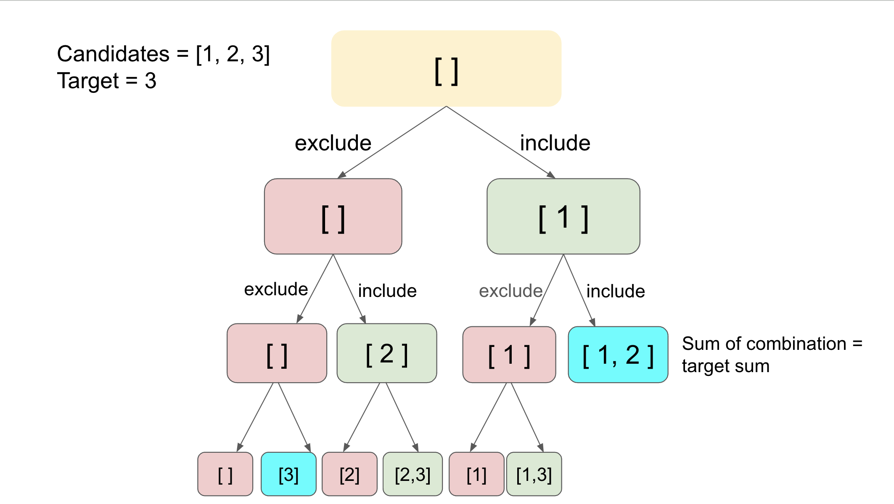
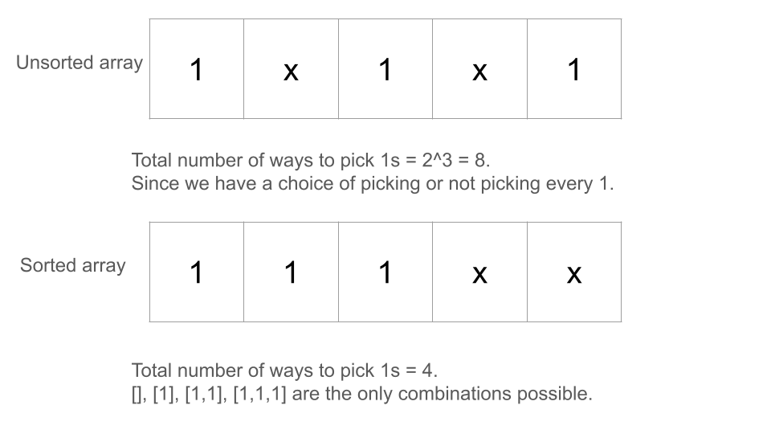

[TOC]

## Solution

---

### Overview

This is one of the problems in the series of combination sums. All these problems can be solved with the same backtracking algorithm.

We recommend trying these similar problems before tackling this one: [Combination Sum](https://leetcode.com/problems/combination-sum/description/) and [Combination Sum III](https://leetcode.com/problems/combination-sum-iii/description/), which are arguably easier and one can tweak the solution a bit to solve this problem.

We also listed some follow-up problems at the end of the article if you are interested in exploring the bactracking algorithm further.

---

### Approach: Backtracking

#### Intuition

In this problem, we need to generate unique combinations with the given sum value. In the worst case, we might need to generate the sum of all combinations in the array. Backtracking can be effectively used to generate all the possible combinations recursively. Backtracking incrementally builds candidates to the solutions and abandons a candidate (backtracks) as soon as it determines that this candidate can't lead to a final solution. For example, in the given problem, we can discard the candidate solution when it exceeds the sum value, provided the array contains non-negative values. Refer to this [backtracking explore card](https://leetcode.com/explore/learn/card/recursion-ii/472/backtracking/2654/) to read more about backtracking.

Using backtracking, we could incrementally build the combinations. When we find the current combination is not valid, we backtrack and try another option. For the first option, we add the current array element to the current combination array and move this combination to the next index recursively. Similarly, for the second option, we remove the element from the current combination array and move this combination to the next index. Therefore, for every index, we explored two possibilities of including and excluding that value and calculated the combination sum of the maintained combination array. If the desired sum is reached, we can append the list to the answer list. To demonstrate the idea, we showcase how it works with a concrete example in the following tree:



Are there any optimizations to reduce the backtracking calls? Since we need to return unique combinations, we can group equal values of the array together. The simplest way to group all elements together is by sorting them. Now, suppose the frequency of an element is `freq`, and you need to make backtracking calls for all its possible frequencies between `0` and `freq`, then we can simply pick them from the beginning of its group in the sorted array.

#### Algorithm

- Create a list `list` to store all the unique combinations that sum up to the target.
- Sort the `candidates` array to handle duplicates and facilitate the backtracking process.
- Call the `backtrack` function with the following parameters:
  - `answer`: List to store the final combinations.
  - `tempList`: Temporary list to store the current combination.
  - `candidates`: Input array of numbers.
  - `totalLeft`: Remaining sum to reach the target.
  - `index`: Starting index for the current recursion.

- Within the `backtrack` function:
  - If `totalLeft` is less than 0, return immediately (invalid path).
  - If `totalLeft` equals 0:
- Add a copy of `tempList` to `answer` (valid combination found).
  - Otherwise:
- Iterate over `candidates` starting from `index`:
      - Skip duplicate numbers by checking if $\text{candidates}[i] = candidates[i - 1]$ for `i > index`.
      - Add $\text{candidates}[i]$ to `tempList`.
      - Recursively call `backtrack` with:
- Updated `totalLeft` reduced by $\text{candidates}[i]$.
- Updated `index` as $i + 1$ to avoid reusing the same element.
      - Remove the last element from `tempList` to backtrack and explore other possibilities.

- Return `list` containing all unique combinations after the recursive calls complete.

#### Implementation

```python
class Solution:
    def combinationSum2(
        self, candidates: List[int], target: int
    ) -> List[List[int]]:
        def backtrack(answer, temp_list, candidates, total_left, index):
            if total_left < 0:
                return
            elif total_left == 0:
                answer.append(temp_list.copy())
            else:
                for i in range(index, len(candidates)):
                    if i > index and candidates[i] == candidates[i - 1]:
                        continue
                    if total_left < candidates[i]:
                        break
                    temp_list.append(candidates[i])
                    backtrack(
                        answer,
                        temp_list,
                        candidates,
                        total_left - candidates[i],
                        i + 1,
                    )
                    temp_list.pop()

        result = []
        candidates.sort()
        backtrack(result, [], candidates, target, 0)
        return result
```

#### Complexity Analysis

Let $N$ be the number of $candidates$ in the array.

- Time complexity: $O(2^N)$

    In the worst case, our algorithm will exhaust all possible combinations from the input array. Again, in the worst case, let us assume that each number is unique. The number of combinations for an array of size $N$ would be $2^N$, i.e. each number is included or excluded in a combination.

    Additionally, it takes $O(N)$ time to build a counter table out of the input array.

    Therefore, the overall time complexity of the algorithm is dominated by the backtracking process, which is $O(2^N)$.

    You must think about how the solution passes the test cases when the value of $N$ goes up to 100. [Pruning](https://en.wikipedia.org/wiki/Decision_tree_pruning) is the process of writing some additional conditions within our recursion code that help us to reduce the size of our recursion trees by removing redundant sections. For example, in this problem, the maximum value of any `candidates` element is given by 50, whereas the maximum `target` value is 30. So, we can stop the recursion when the value of candidates exceeds the `target` value. Sorting the array is another way to prune the recursion tree. Checkout the image for an explanation:

    

- Space complexity: $O(N)$

    We first create a `tempList`, which in the worst case will consume $O(N)$ space to keep track of the combinations. In addition, we apply recursion in the algorithm, which will incur additional memory consumption in the function call stack. In the worst case, the stack will pile up to $O(N)$ space.

    To sum up, the overall space complexity of the algorithm is $O(N)$.

    Note: we did not take into account the space needed to hold the final results of the combination in the above analysis.

---

Here are a series of problems you can solve, with some tweaks of the backtracking algorithm presented in this article.

[Subsets](https://leetcode.com/problems/subsets/description/)
[Subsets II](https://leetcode.com/problems/subsets-ii/description/)
[Permutations](https://leetcode.com/problems/permutations/description/)
[Permutations II](https://leetcode.com/problems/permutations-ii/description/)
[Combinations](https://leetcode.com/problems/combinations/description/)
[Combination Sum](https://leetcode.com/problems/combination-sum/description/)
[Combination Sum III](https://leetcode.com/problems/combination-sum-iii/description/)
[Palindrome Partition](https://leetcode.com/problems/palindrome-partitioning/description/)

---