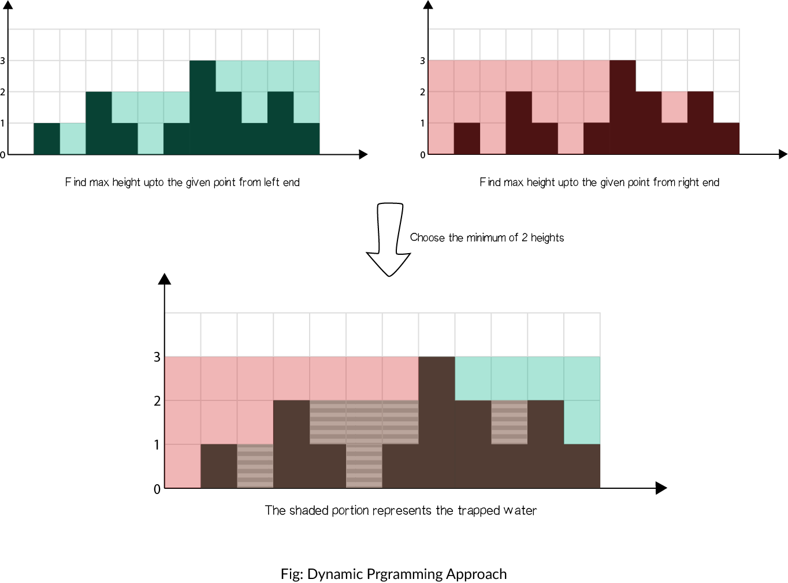

## Solution

---

### Approach 1: Brute force

#### Intuition

Do as directed in question. For each element in the array, we find the maximum level of water it can trap after the rain, which is equal to the minimum of maximum height of bars on both the sides minus its own height.

#### Algorithm

* Initialize $ans=0$
* Iterate the array from left to right:
  + Initialize $\text{left\\_max}=0$ and $\text{right\\_max}=0$
  + Iterate from the current element to the beginning of array updating:
* $\text{left\\_max}=\max(\text{left\\_max},\text{height}[j])$
  + Iterate from the current element to the end of array updating:
* $\text{right\\_max}=\max(\text{right\\_max},\text{height}[j])$
  + Add $\min(\text{left\\_max},\text{right\\_max}) - \text{height}[i]$ to $\text{ans}$

#### Implementation

```python
class Solution:
    def trap(self, height):
        ans = 0
        size = len(height)
        for i in range(1, size - 1):
            left_max = 0
            right_max = 0
            # Search the left part for max bar size
            for j in range(i, -1, -1):
                left_max = max(left_max, height[j])
            # Search the right part for max bar size
            for j in range(i, size):
                right_max = max(right_max, height[j])
            ans += min(left_max, right_max) - height[i]
        return ans
```

#### Complexity Analysis

* Time complexity: $O(n^2)$. For each element of array, we iterate the left and right parts.

* Space complexity: $O(1)$ extra space.

---

### Approach 2: Dynamic Programming

#### Intuition

In brute force, we iterate over the left and right parts again and again just to find the highest bar size upto that index. But, this could be stored. Voila, dynamic programming.

The concept is illustrated as shown:

{:width="500px"}

#### Algorithm

* Find maximum height of bar from the left end upto an index i in the array $\text{left\\_max}$.
* Find maximum height of bar from the right end upto an index i in the array $\text{right\\_max}$.
* Iterate over the $\text{height}$ array and update ans:
    + Add $\min(\text{left\\_max}[i],\text{right\\_max}[i]) - \text{height}[i]$ to $\text{ans}$

#### Implementation

```python
class Solution:
    def trap(self, height: List[int]) -> int:
        # Case of empty height list
        if len(height) == 0:
            return 0
        ans = 0
        size = len(height)
        # Create left and right max arrays
        left_max, right_max = [0] * size, [0] * size
        # Initialize first height into left max
        left_max[0] = height[0]
        for i in range(1, size):
            # update left max with current max
            left_max[i] = max(height[i], left_max[i - 1])
        # Initialize last height into right max
        right_max[size - 1] = height[size - 1]
        for i in range(size - 2, -1, -1):
            # update right max with current max
            right_max[i] = max(height[i], right_max[i + 1])
        # Calculate the trapped water
        for i in range(1, size - 1):
            ans += min(left_max[i], right_max[i]) - height[i]
        # Return amount of trapped water
        return ans
```

#### Complexity Analysis

* Time complexity: $O(n)$.
    + We store the maximum heights upto a point using 2 iterations of $O(n)$ each.
    + We finally update $\text{ans}$ using the stored values in $O(n)$.

* Space complexity: $O(n)$ extra space.
    + Additional $O(n)$ space for $\text{left\\_max}$ and $\text{right\\_max}$ arrays than in [Approach 1](#approach-1-brute-force).

---

### Approach 3: Using stacks

#### Intuition

Instead of storing the largest bar upto an index as in [Approach 2](#approach-2-dynamic-programming), we can use stack to keep track of the bars that are bounded by longer bars and hence, may store water. Using the stack, we can do the calculations in only one iteration.

We keep a stack and iterate over the array. We add the index of the bar to the stack if bar is smaller than or equal to the bar at top of stack, which means that the current bar is bounded by the previous bar in the stack. If we found a bar longer than that at the top, we are sure that the bar at the top of the stack is bounded by the current bar and a previous bar in the stack, hence, we can pop it and add resulting trapped water to $\text{ans}$.

#### Algorithm

* Use stack to store the indices of the bars.
* Iterate the array:
    + While stack is not empty and $\text{\text{height}[current]}>\text{height[st.top()]}$
* It means that the stack element can be popped. Pop the top element as $\text{top}$.
* Find the distance between the current element and the element at top of stack, which is to be filled.
        $\text{distance} = \text{current} - \text{st.top}() - 1$
* Find the bounded height
        $\text{bounded\\_height} = \min(\text{\text{height}[current]}, \text{height[st.top()]}) - \text{\text{height}[top]}$
* Add resulting trapped water to answer $\text{ans} \mathrel{+}= \text{distance} \times \text{bounded\\_height}$
    + Push current index to top of the stack
    + Move $\text{current}$ to the next position

#### Implementation

```python
class Solution:
    def trap(self, height):
        ans = 0
        current = 0
        st = []
        while current < len(height):
            while len(st) != 0 and height[current] > height[st[-1]]:
                top = st[-1]
                st.pop()
                if len(st) == 0:
                    break
                distance = current - st[-1] - 1
                bounded_height = (
                    min(height[current], height[st[-1]]) - height[top]
                )
                ans += distance * bounded_height
            st.append(current)
            current += 1
        return ans
```

#### Complexity Analysis

* Time complexity: $O(n)$.
    + Single iteration of $O(n)$ in which each bar can be touched at most twice(due to  insertion and deletion from stack) and insertion and deletion from stack takes $O(1)$ time.
* Space complexity: $O(n)$. Stack can take upto $O(n)$ space in case of stairs-like or flat structure.

---

### Approach 4: Using 2 pointers

#### Intuition

As in [Approach 2](#approach-2-dynamic-programming), instead of computing the left and right parts separately, we may think of some way to do it in one iteration.
From the figure in dynamic programming approach, notice that as long as $\text{right\\_max}[i]>\text{left\\_max}[i]$ (from element 0 to 6), the water trapped depends upon the left_max, and similar is the case when $\text{left\\_max}[i]>\text{right\\_max}[i]$ (from element 8 to 11).
So, we can say that if there is a larger bar at one end (say right), we are assured that the water trapped would be dependant on height of bar in current direction (from left to right). As soon as we find the bar at other end (right) is smaller, we start iterating in opposite direction (from right to left).
We must maintain $\text{left\\_max}$ and $\text{right\\_max}$ during the iteration, but now we can do it in one iteration using 2 pointers, switching between the two.

#### Algorithm

* Initialize $\text{left}$ pointer to 0 and $\text{right}$ pointer to size-1
* While $\text{left}< \text{right}$, do:
    + If $\text{\text{height}[left]}$ is smaller than $\text{\text{height}[right]}$
* If $\text{\text{height}[left]} \geq \text{left\\_max}$, update $\text{left\\_max}$
* Else add $\text{left\\_max}-\text{\text{height}[left]}$ to $\text{ans}$
* Add 1 to $\text{left}$.
    + Else
* If $\text{\text{height}[right]} \geq \text{right\\_max}$, update $\text{right\\_max}$
* Else add $\text{right\\_max}-\text{\text{height}[right]}$ to $\text{ans}$
* Subtract 1 from $\text{right}$.

Refer to the example for better understanding:
!?!../Documents/42/42_trapping_rain_water.json:1000,662!?!

#### Implementation

```python
class Solution:
    def trap(self, height):
        """
        :type height: List[int]
        :rtype: int
        """
        left, right = 0, len(height) - 1
        ans = 0
        left_max, right_max = 0, 0
        while left < right:
            if height[left] < height[right]:
                left_max = max(left_max, height[left])
                ans += left_max - height[left]
                left += 1
            else:
                right_max = max(right_max, height[right])
                ans += right_max - height[right]
                right -= 1
        return ans
```

#### Complexity Analysis

* Time complexity: $O(n)$. Single iteration of $O(n)$.
* Space complexity: $O(1)$ extra space. Only constant space required for $\text{left}$, $\text{right}$, $\text{left\\_max}$ and $\text{right\\_max}$.