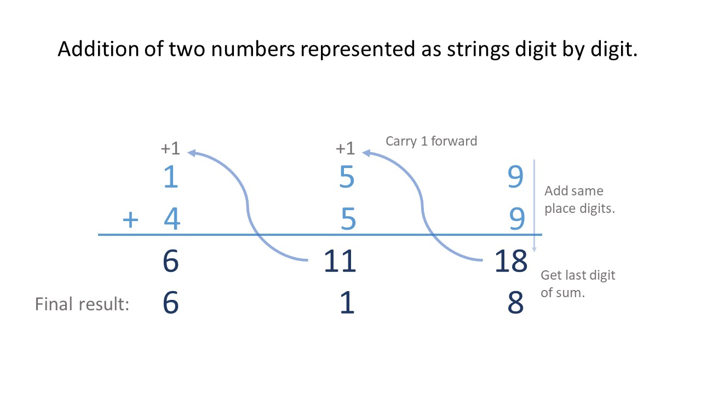
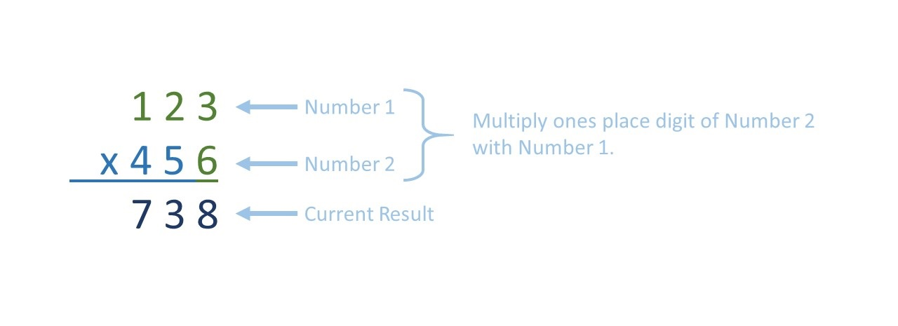
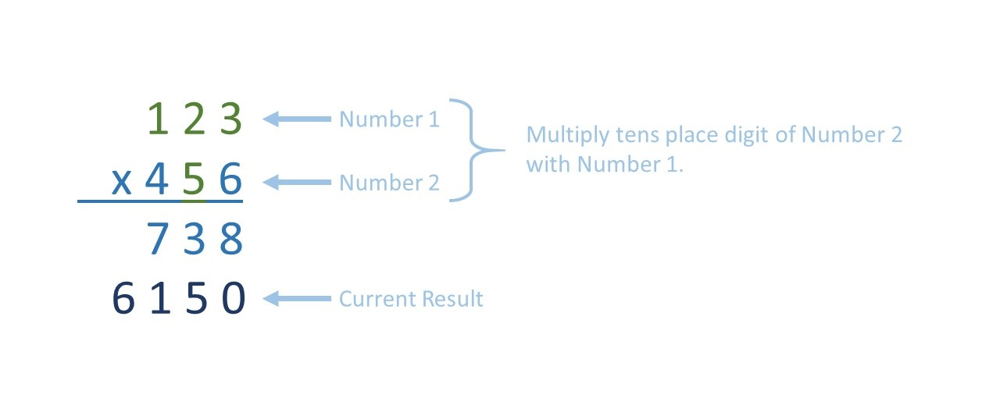
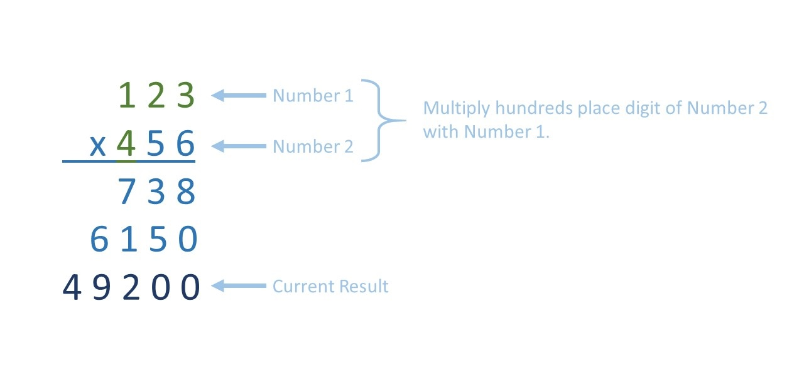
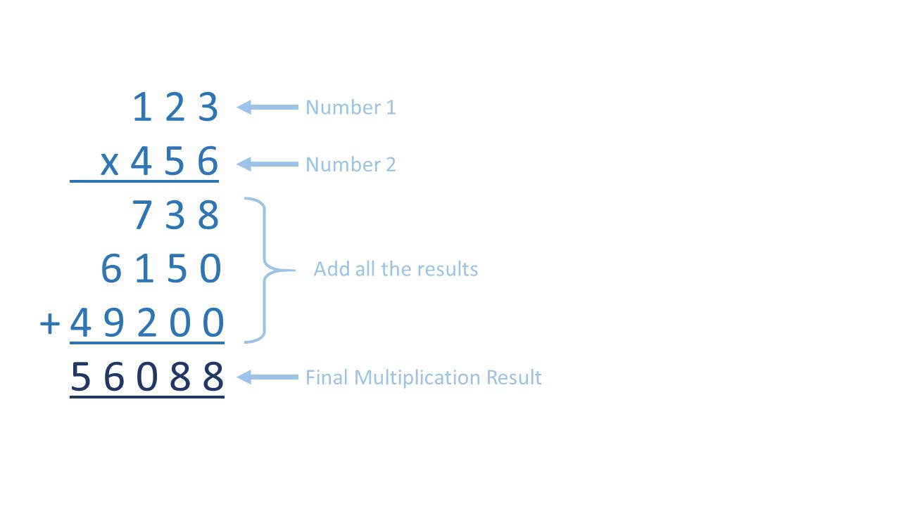
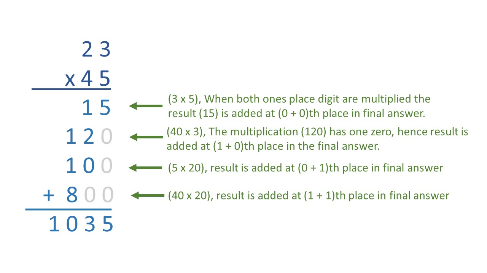

[TOC]

## Solution

---

### Overview

We are given two non-negative integers that are represented as strings and asked to return the product of the two integers, also in the form of a string. There are a few subtle challenges and edge cases that we must consider to solve this problem.  So, before determining how to multiply two numbers in string format, let's first consider a simpler variation of the problem: adding two numbers in string format.
We can add two numbers represented as strings by adding digits from the given numbers in each place.  The sum of two digits must be between 0 and 18. The ones place is added to the result while the tens place is carried and summed with the next pair of digits. When summing two numbers, the carried digit will always be zero or one. This process can be repeated for each digit, as shown below.



Why does learning how to add two integers represented as strings help us solve this problem? As we will soon see, addition is a subproblem of multiplication. Thus we will need to be able to solve the problem of adding two numbers as strings before we can solve the problem of multiplying two numbers as strings.

If this type of problem is new to you and you would like to practice by solving similar problems, we have provided the list below:
1. [66. Plus One](https://leetcode.com/problems/plus-one/)
2. [67. Add Binary](https://leetcode.com/problems/add-binary/)
3. [415. Add Strings](https://leetcode.com/problems/add-strings/)
4. [989. Add to Array-Form of Integer](https://leetcode.com/problems/add-to-array-form-of-integer/)

---

### Approach 1: Elementary Math

#### Intuition

Our goal is to multiply two integer numbers that are represented as strings. However, we are not allowed to use a built-in BigInteger library or convert the inputs to integers directly. So how can we multiply the two input strings? We can try to break the problem down into manageable chunks, as is done in elementary mathematics.  Thus, we will focus on one digit at a time, just like in the addition example, except here we will be multiplying both numbers digit by digit.

**Now, let's recall the process for multiplying two numbers.**
We take the ones place digit of the second number, then multiply it with all digits of the first number consequently going backward, and write the result. We need to remember about carry as well. Note that for multiplication, carry may be any digit between 0 and 8.



<br />

Then we take the tens place digit of the second number and multiply it with all digits of the first number.  Since we used the tens place digit, we will multiply this result by 10.  Then we write this result below the previous result, signifying that we will **add** it to the previous result later.



<br />

Then we continue the same way with hundreds place digit, then with thousands place digit of the second number, and so on, until we have visited every digit in the second number.



<br />

As is evident from the above diagram, this process is equivalent to multiplying each digit of the second number by the entire first number and appending zeros at the end of each intermediate result based on the place in the second number that the digit came from.
Then we add all the results together to get the final product of the first and second numbers.



<br />

Let's look at an example. Consider $123 * 456$, it can be written as,

$\implies (123 * (6 + 50 + 400))$
$\implies (123 * 6) + (123 * 50) + (123 * 400)$
$\implies (123 * 6) + (123 * 5 * 10) + (123 * 4 * 100)$

$\implies \Sigma \space ( firstNumber * j^{th} \space digit \space of \space secondNumber * 10^{(index \space j \space of \space digit \space counting \space from \space the \space end)} )$

The results of the multiplication of each digit of the second number with the first number can be stored in an array of strings, and then we can add all these strings to get the final product.

#### Algorithm

Multiplication of both numbers starts from the ones place digit (the right-most digit), so we should start our multiplication from index $\text{num2.size}() - 1$ and go to index `0`.  Alternatively, we can reverse both inputs and iterate from index `0` to index $\text{num2.size}() - 1$.

For each digit in `num2` that we multiply by `num1` we will get a new intermediate result.  This intermediate result (`currentResult`) will be stored in a list, string, or StringBuilder, depending on the language of choice.  To calculate each intermediate result, we will start by inserting the appropriate number of zeros according to the current digit's place in the second number (i.e. if it is the hundreds place, we append 2 zeros).  Then we will perform the multiplication step as demonstrated in the above diagrams. During this step, we will insert the lower place digits into the `currentResult` before the higher place digits.  Because we are pushing the lower place digits first and always appending to the end, our result will be in reverse order, so once the multiplication and addition steps are complete, we will need to reverse `answer` before returning.

Let's walk through the steps one by one:

1. Reverse both numbers.
2. For each digit in `secondNumber`:
- Keep a `carry` variable, initially equal to `0`.
- Initialize `currentResult` array beginning with the appropriate number of zeros according to the place of the `secondNumber` digit.
- For each digit in `firstNumber`:
- Multiply the `secondNumber`'s digit and the `firstNumber`'s digit and add `carry` to the `multiplication`.
- Take the remainder of `multiplication` with `10` to get the last digit.
- Append the last digit to the `currentResult`.
- Divide `multiplication` by `10` to get the new value for `carry`.
- Append the remaining value for `carry` (if any) to the `currentResult`.
- Push the `currentResult` into the `results` array.
3. Compute the cumulative sum over all the obtained arrays using the `ans` as an answer.
4. Reverse `ans` and return it.

!?!../Documents/43/slideshow1.json:960,540!?!

#### Implementation

```python
class Solution:
    def multiply(self, num1: str, num2: str) -> str:
        if num1 == "0" or num2 == "0":
            return "0"

        # Reverse both numbers.
        first_number = num1[::-1]
        second_number = num2[::-1]

        # For each digit in second_number, multipy the digit by first_number and then
        # store the multiplication result (reversed) in the results array.
        results = []
        for index, digit in enumerate(second_number):
            results.append(self.multiply_one_digit(digit, index, first_number))

        # Add all of the results together to get our final answer (in reverse order)
        answer = self.sum_results(results)

        # Reverse answer and join the digits to get the final answer.
        return "".join(str(digit) for digit in reversed(answer))

    def multiply_one_digit(
        self, digit2: str, num_zeros: int, first_number: List[str]
    ) -> List[int]:
        """Multiplies first_number by a digit from second_number (digit2)."""
        # Insert zeros at the beginning of the current result based on the current digit's place.
        current_result = [0] * num_zeros
        carry = 0

        # Multiply each digit in first_number with the current digit of the second_number.
        for digit1 in first_number:
            multiplication = int(digit1) * int(digit2) + carry
            # Set carry equal to the tens place digit of multiplication.
            carry = multiplication // 10
            # Append last digit to the current result.
            current_result.append(multiplication % 10)

        if carry != 0:
            current_result.append(carry)
        return current_result

    def sum_results(self, results: List[List[int]]) -> List[int]:
        # Initialize answer as a number from results.
        answer = results.pop()

        # Add each result to answer one at a time.
        for result in results:
            new_answer = []
            carry = 0

            # Sum each digit from answer and result. Note: zip_longest is the
            # same as zip, except that it pads the shorter list with fillvalue.
            for digit1, digit2 in zip_longest(result, answer, fillvalue=0):
                # Add current digit from both numbers.
                curr_sum = digit1 + digit2 + carry
                # Set carry equal to the tens place digit of curr_sum.
                carry = curr_sum // 10
                # Append the ones place digit of curr_sum to the new answer.
                new_answer.append(curr_sum % 10)

            if carry != 0:
                new_answer.append(carry)

            # Update answer to new_answer which equals answer + result
            answer = new_answer

        return answer
```

#### Complexity Analysis

Here $N$ and $M$ are the number of digits in `num1` and `num2` respectively.

* Time complexity: $O(M^2 + M \cdot N)$.

  During multiplication, we perform $N$ operations for each of the $M$ digits of the second number; this requires $O(M \cdot N)$ time. Then we add each of the $M$ multiplication results (of length $O(N + M)$) to the answer string; this requires $O(M \cdot (M + N))$ time.

  > When we multiply a number with one digit, the result's maximum length can be at most one more than the number's length _(We can see that when we multiply the max integer of `d` digits, i.e., `9...99` with `9`)_ and there can be at most (M-1) zeroes initially appended to the result. Hence, each result is of order $O(N + M)$.

  Summing the results requires iterating over the length of the current answer for each result.  Since the length of two numbers multiplied together cannot be longer than the sum of the lengths of the two numbers, iterating over each digit in the answer will take $O(M + N)$ time and we will do so $M - 1$ times (for all but one of the $M$ results). So this step takes $O(M \cdot (M + N))$ time.

  Finally, reversing the answer will require $O(M + N)$ time. Taking all steps into consideration, the total time complexity is $O(M^2 + M \cdot N)$.

* Space complexity: $O(M^2 + M \cdot N)$.

  We store each result of multiplication for each digit of `num2` with `num1` in the results array. Each multiplication result can have at most $N + M$ length, and there will be $M$ such results. Thus the space complexity is $O(M \cdot (M + N))$.

<br/>

---

### Approach 2: Elementary math using less intermediate space

#### Intuition

Notice that we are storing the multiplication result for every digit in `num2`. If we know the maximum size of the answer array ahead of time, we can add each multiplication result directly to the final answer. Thus, we can avoid using the extra space required by the `results` array.

First, let's determine what the maximum size of the answer array would be.

Try a few test cases on your own, multiply two numbers, count how many digits are in the result, and compare that to the number of digits in each number.  Notice that whenever two numbers with the number of digits $N$ and $M$ are multiplied, the result never exceeds $(N+M)$ digits.

We could readily accept that <strong>num1.length + num2.length ≥ (num1 · num2).length</strong> without rigorous proof. However, it never hurts to verify a relationship that was derived from observation before accepting it as a fact. Don't worry, you will not be expected to provide a proof like this during the interview, hence you can skip it if you want.

<details>

<summary> The proof that the length of the product of two numbers is always less than or equal to the sum of lengths of the two numbers is as follows: (click to show/hide) </summary>

<br>

> A number $n$ has digits, $d = 1 + \lfloor log_{10}(n) \rfloor$.

Its proof is:
> Suppose that $n$ has $d$ digits, then $10^{d-1} \leq n < 10^{d}$, because $10^{d}$ is the smallest integer with $d+1$ digits.
Now take log base 10, then the inequality becomes $(d-1) \leq \log_{10}(n) < d$.
Now everything between the range $(d-1, \space d)$ is decimal part, so taking floor of $\log_{10}(n)$ we can eliminate all the decimal part and get, $(d-1) = \lfloor \log_{10}(n) \rfloor$.
<br />
Thus, $d = \lfloor \log_{10}(n) \rfloor + 1$.

<br />

Let $firstNumber$ have $N$ digits and $secondNumber$ have $M$ digits.

Let $product = firstNumber \cdot secondNumber$ have $X$ digits. So, number of digits in $product$ is,

$\implies X = 1 + \lfloor log_{10}(result) \rfloor$
$\implies X = 1 + \lfloor log_{10}(firstNumber \cdot secondNumber) \rfloor$
$\implies X = 1 + \lfloor log_{10}(firstNumber) + log_{10}(secondNumber) \rfloor$ <br />

> A real number $a$ can have two parts in it, integral $(I)$ and fractional $(F)$. $a = I_{a} + F_{a}$.

Now, let's say we have two real numbers $a = I_{a} + F_{a}$ and $b = I_{b} + F_{b}$.
<br />

$\lfloor a + b \rfloor = \lfloor I_{a} + F_{a} + I_{b} + F_{b} \rfloor = I_{a} + I_{b} + \lfloor F_{a} + F_{b} \rfloor$
$F_{a}, F_{b}$ are fractional parts both always less than 1.
$0 \leq F_{a} + F_{b} < 2$.
$0 \leq \lfloor F_{a} + F_{b} \rfloor <= 1$. <br />
> So, $I_{a} + I_{b} \leq \lfloor a + b \rfloor \leq  I_{a} + I_{b} + 1$.
<br />

But, $\lfloor a \rfloor + \lfloor b \rfloor = \lfloor I_{a} + F_{a} \rfloor + \lfloor I_{b} + F_{b} \rfloor = I_{a} + I_{b} + \lfloor F_{a} \rfloor + \lfloor F_{b} \rfloor$
$F_{a}, F_{b}$ are fractional parts both always less than $1$.
$0 \leq F_{a}, \space F_{b} < 1$.
Hence, $\lfloor F_{a} \rfloor + \lfloor F_{b} \rfloor = 0$. <br />
> So, $\lfloor a \rfloor + \lfloor b \rfloor = I_{a} + I_{b}$.

> Hence we can conclude here that, <br />
> $\lfloor a \rfloor + \lfloor b \rfloor \leq \lfloor a + b \rfloor \leq \lfloor a \rfloor + \lfloor b \rfloor + 1$

<br />

Number of digits in,
$firstNumber = N, \space secondNumber = M, \space product = X$ <br />
If $a = log_{10}(firstNumber)$ and $b = log_{10}(secondNumber)$.

$N = \lfloor log_{10} (firstNumber) \rfloor + 1 = \lfloor a \rfloor + 1$
$M = \lfloor log_{10} (secondNumber) \rfloor + 1 = \lfloor b \rfloor + 1$
$X = \lfloor log_{10} (firstNumber) + log_{10} (secondNumber) \rfloor + 1 = \lfloor a + b \rfloor + 1$
<br />

$\lfloor a \rfloor = N - 1, \space  \lfloor b \rfloor = M - 1, \space  \lfloor a + b \rfloor = X - 1,$ <br />

as, $\lfloor a \rfloor + \lfloor b \rfloor \leq \lfloor a + b \rfloor \leq \lfloor a \rfloor + \lfloor b \rfloor + 1$

$\implies (N-1) + (M-1) \leq (X - 1) \leq (N-1) + (M-1) + 1$
$\implies (N + M - 1) \leq X \leq (N + M)$

> Hence, $X$ can never exceed $(N + M)$.

</details>

<br />

So an answer string of size $N + M$ is guaranteed to be large enough to hold our final result.  Let's create one and initialize all of its values as zero.
Instead of storing all results of multiplication of each digit of $num2$ with $num1$ like we did in Approach 1, we can directly add the current result to the answer string.

#### Algorithm

1. Reverse both numbers.
2. Initialize `ans` array with $(N+M)$ zeros.
3. For each digit in `secondNumber`:
- Keep a `carry` variable, initially equal to `0`.
- Initialize an array (`currentResult`) that begins with some zeros based on the place of the digit in `secondNumber`.
- For each digit of `firstNumber`:
- Multiply `secondNumber's` digit and `firstNumber's` digit and add previous `carry` to the `multiplication`.
- Take the remainder of `multiplication` with `10` to get the last digit.
- Append the last digit to `currentResult` array.
- Divide the `multiplication` by `10` to obtain the new value for `carry`.
- After iterating over each digit in the first number, if `carry` is not zero, append `carry` to the `currentResult`.
- Add `currentResult` to the `ans`.
4. If the last digit in `ans` is zero, before reversing `ans`, we must pop the zero from `ans`. Otherwise, there would be a leading zero in the final answer.
5. Reverse `ans` and return it.

!?!../Documents/43/slideshow2.json:960,540!?!

#### Implementation

```python
class Solution:
    def multiply(self, num1: str, num2: str) -> str:
        if num1 == "0" or num2 == "0":
            return "0"

        # Reverse both numbers.
        first_number = num1[::-1]
        second_number = num2[::-1]

        # To store the multiplication result of each digit of secondNumber with firstNumber.
        N = len(first_number) + len(second_number)
        answer = [0] * N

        # Multiply each digit in second_number by the first_number
        # and add each result to answer
        for index, digit in enumerate(second_number):
            answer = self.addStrings(
                self.multiplyOneDigit(first_number, digit, index), answer
            )

        # Pop excess zero from the end of answer (if any).
        if answer[-1] == 0:
            answer.pop()

        # Ans is in the reversed order.
        # Reverse it to get the final answer.
        answer.reverse()
        return "".join(str(digit) for digit in answer)

    def multiplyOneDigit(self, first_number: str, digit2: str, num_zeros: int):
        # Insert 0s at the beginning based on the current digit's place.
        currentResult = [0] * num_zeros
        carry = 0

        # Multiply firstNumber with the current digit of secondNumber.
        for digit1 in first_number:
            multiplication = int(digit1) * int(digit2) + carry
            # Set carry equal to the tens place digit of multiplication.
            carry = multiplication // 10
            # Append the ones place digit of multiplication to the current result.
            currentResult.append(multiplication % 10)

        if carry != 0:
            currentResult.append(carry)
        return currentResult

    def addStrings(self, result: list, answer: list) -> list:
        carry = 0
        i = 0
        new_answer = []
        for digit1, digit2 in zip_longest(result, answer, fillvalue=0):
            # Add current digits of both numbers.
            curr_sum = digit1 + digit2 + carry
            carry = curr_sum // 10
            # Append last digit of curr_sum to the answer.
            new_answer.append(curr_sum % 10)
            i += 1

        return new_answer
```

#### Complexity Analysis

Here $N$ and $M$ are the number of elements in num 1 and num 2 strings.

* Time complexity: $O(M \cdot (N+M))$.
   - During multiplication, we perform `N` operations for each of the `M` digits of the second number, so we need $O(M \cdot N)$ time for it.
   - We add the multiplication result to the `ans` string that has a length of $N+M$. There will be $M$ such additions since we have $M$ multiplication results. Therefore, the time consumed here will be $O(M \cdot (N+M))$.
   - It takes linear time to reverse the strings.
   - Overall, this solution takes $O(M \cdot N + M \cdot (N+M) + M + N) =$\mathcal{O}(M \cdot (N+M)$)$ time.

* Space complexity: $O(N + M)$.
   - The answer string and multiplication results will have at most $N + M$ length.

<br/>

---

### Approach 3: Sum the products from all pairs of digits

#### Intuition

As we have seen in the previous approaches, when we multiply two digits, one from the first number and one from the second number, then their product will have some zeros appended at the end. The number of zeros depends on the place of each digit, and (as demonstrated in the image below) when the result is added to the answer, the trailing zeros do not affect the answer (because any number plus zero is itself).
So it is not necessary for us to append zeros at the end of each result before adding the result to the final answer. Instead, we can directly add the multiplication result at the place where the least significant digit will shift to after to appending some zeros.

As an example, when we multiply two tens place digits, two zeros are appended at the end of the multiplication result, and the result will be added at the hundreds place in the final answer. One more example for clarity, if we multiplied a digit in the thousands place (3 trailing zeros) by a digit in the hundreds place (2 trailing zeros), the product will have 5 trailing zeros (the sum of trailing zeros of each digit) so the result will only affect the hundred thousands place and the millions place in the final answer.



<br />

In the previous solution, including the extra zeros was quite costly.  For instance, `multiplyOneDigit` stored these extra zeros for every intermediate result which required an additional $O(N)$ space and time for each multiplication, where $N$ is the number of digits in `num2`.  Furthermore, every time we called `multiplyOneDigit` we added the result to the current `answer`.  This involved iterating over all $M + N$ digits in answer each time we added a new result to the current answer. So let's get a better idea of how we can solve this problem without iterating over all the extra zeros.

Take a moment to study the above example.  Notice that we multiply each digit in `num2` by each digit in `num1` just like before. Each time we will get a 2-digit result with some zeros after it. Since we know how many zeros will follow the product of the two digits based on their places, we know which two places in `answer` to update.  So, instead of updating all $M + N$ elements in `answer` for each of the $N$ digits in `num2`, we only need to update $2$ digits in `answer` for each of the $M \cdot N$ pairs of digits.  The above example highlights the two digits from each result that we will add to the answer and the below example shows precisely how this will be done.

Thus, for each pair of digits, we multiply them together to get a 2-digit result. The ones place of the result will be added at the correct position in `answer` (based on the place of each of the digits). The tens place of the result will be added to the next place in `answer`. This step is effectively the same as carrying the tens place digit in the previous approaches.

Note that the `answer` array will be reversed just like before. So when we multiply a digit in the $i^{th}$ place of the first number by a digit in the $j^{th}$ place of the second number, then the ones place of the result will add to the $(i+j)^{th}$ place in the final answer and the tens place of the result (carry) will be added to the $(i+j+1)^{th}$ place in the final answer.

#### Algorithm

1. Reverse both numbers.
2. Initialize `answer` with $N + M$ zeros.
3. For each digit at position `i` in `secondNumber`:
- For each digit at position `j` in `firstNumber`:
- Multiply the digit from `secondNumber` by the digit from `firstNumber` and add previously carried value to the `multiplication` result.  The previously carried value can be found at position $i + j$ in the `answer`.
- Take the remainder of `multiplication` with `10` to get the ones place digit of the `multiplication` result.
- Put the last digit at current position (position $i + j$) in `answer`.
- Divide the `multiplication` by `10` to get the new value for carry and add it to `answer` at the next position.  Note, the next position is located at $(i + j + 1)$.
4. If the last digit in `answer` is zero, before reversing `answer`, we must pop the zero from `answer`. Otherwise, there would be a leading zero in the final answer.
5. Reverse `answer` and return it.

!?!../Documents/43/slideshow3.json:960,540!?!

#### Implementation

```python
class Solution:
    def multiply(self, num1: str, num2: str) -> str:
        if num1 == "0" or num2 == "0":
            return "0"

        # Initialize answer as a string of zeros of length N.
        N = len(num1) + len(num2)
        answer = [0] * N

        # Reverse num1 and num2
        first_number = num1[::-1]
        second_number = num2[::-1]

        for place2, digit2 in enumerate(second_number):
            # For each digit in second_number multiply the digit by all digits in first_number.
            for place1, digit1 in enumerate(first_number):
                # The number of zeros from multiplying to digits depends on the place
                # of digit2 in second_number and the place of the digit1 in first_number.
                num_zeros = place1 + place2

                # The digit currently at position numZeros in the answer string
                # is carried over and summed with the current result.
                carry = answer[num_zeros]
                multiplication = int(digit1) * int(digit2) + carry

                # Set the ones place of the multiplication result.
                answer[num_zeros] = multiplication % 10

                # Carry the tens place of the multiplication result by
                # adding it to the next position in the answer array.
                answer[num_zeros + 1] += multiplication // 10

        # Pop the excess 0 from the end of answer.
        if answer[-1] == 0:
            answer.pop()

        return "".join(str(digit) for digit in reversed(answer))
```

#### Complexity Analysis

Here $N$ and $M$ are the number of digits in `num1` and `num2` respectively.

* Time complexity: $O(M \cdot N)$.

  During multiplication, we perform `N` operations for each of the `M` digits of the second number, so we need $M \cdot N$ time for it.

* Space complexity: $O(M + N)$.

  The space used to store the output is not included in the space complexity. However, because strings are immutable in Python, Java, and Javascript, a temporary data structure, using $O(M + N)$ space, is required to store the answer while it is updated.

  On the other hand, in C++, strings are mutable, so we do not need a temporary data structure to store answer and can update answer directly.  Thus, the C++ approach is a constant space solution.