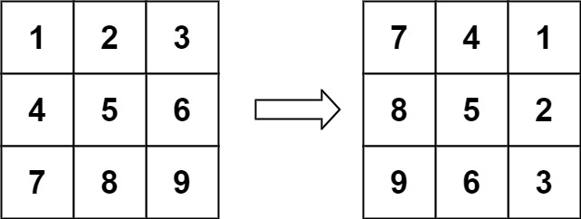

### 1. Description

You are given an `n x n` 2D `matrix` representing an image, rotate the image by **90** degrees (clockwise).

You have to rotate the image <a href="https://en.wikipedia.org/wiki/In-place_algorithm" target="_blank">**in-place**</a>, which means you have to modify the input 2D matrix directly. **DO NOT** allocate another 2D matrix and do the rotation.

### 2. Function Contract

**Inputs**

- `matrix`: The square integer matrix to rotate.

Let $n$ be the number of rows and columns in `matrix`.

**Return value**

Return `None`; rotate `matrix` $90^\circ$ clockwise in place.

### 3. Examples

#### Example 1

- **Input:** $matrix = [[1,2,3],[4,5,6],[7,8,9]]$
- **Output:** `[[7,4,1],[8,5,2],[9,6,3]]`

#### Example 2

- **Input:** $matrix = [[5,1,9,11],[2,4,8,10],[13,3,6,7],[15,14,12,16]]$
- **Output:** `[[15,13,2,5],[14,3,4,1],[12,6,8,9],[16,7,10,11]]`

### 4. Constraints

- $n = \text{matrix.length} = \text{matrix}[i].length$

- $1 \le n \le 20$

- $-1000 \le \text{matrix}[i][j] \le 1000$
