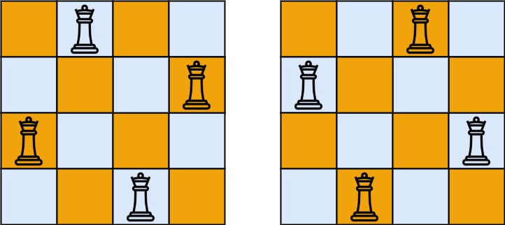

### 1. Description

The **n-queens** puzzle is the problem of placing `n` queens on an `n x n` chessboard such that no two queens attack each other.

Given an integer `n`, return *all distinct solutions to the **n-queens puzzle***. You may return the answer in **any order**.

Each solution contains a distinct board configuration of the n-queens' placement, where `'Q'` and `'.'` both indicate a queen and an empty space, respectively.

### 2. Function Contract

**Inputs**

- `n`: The board dimension and the number of queens to place.

**Return value**

Return all distinct non-attacking board configurations, in any order, using `Q` and `.` characters.

### 3. Examples

#### Example 1

- **Input:** $n = 4$
- **Output:** `[[".Q..","...Q","Q...","..Q."],["..Q.","Q...","...Q",".Q.."]]`
- **Explanation:** There exist two distinct solutions to the 4-queens puzzle as shown above

#### Example 2

- **Input:** $n = 1$
- **Output:** `[["Q"]]`

### 4. Constraints

- $1 \le n \le 9$
