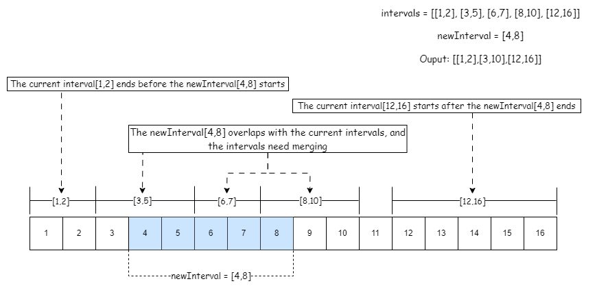

[TOC]

## Solution

---

### Overview

We are given a sorted list of non-overlapping `intervals` and a `newInterval`. The task is to insert the `newInterval` into the `intervals` while maintaining sorted order and ensuring no overlapping intervals. If there is any overlap, the overlapping intervals should be merged. In the end, return the intervals list with the addition of the new intervals.

Two key observations are crucial for this problem:
1. The given intervals are already sorted in ascending order based on the start values.
2. Initially, the intervals are non-overlapping, but inserting a new interval might lead to overlaps that need resolution by merging while maintaining sorted order.

To solve this problem, we break it into three cases when comparing the current interval with the new interval:
Case 1. The current interval ends before the new interval starts.
Case 2. There is an overlap, and the intervals need merging.
Case 3. The current interval starts after the new interval ends.

A visual representation below illustrates all three scenarios:



Now let us consider the given problem description example with `intervals` and a `newInterval`:
```
intervals = [[1, 3], [6, 9]]
newInterval = [2, 5]
```

The first interval starts at 1 and ends at 3, while the second interval starts at 6 and ends at 9. The goal is to insert the `newInterval` into the existing list of `intervals`, maintaining sorted order.

Upon analysis, we observe that the `newInterval` [2, 5] overlaps with the first interval [1, 3] because 2 is less than 3. Now, since we know the intervals need to be merged, we must ensure the merged interval covers the entire overlapping region.

To achieve this, we take the maximum of the end of the first interval and the end of the new interval, as well as the minimum of the start of the first interval and the start of the new interval. Therefore, the merged interval becomes `[min(1, 2), max(3, 5)] = [1, 5]`.

Moving on to the second interval [6, 9], its starting point (6) comes after the new interval's ending point (5). There is no overlap between them. Therefore, the second interval remains unchanged.

| Original Intervals | New Interval | Action                     | Resulting Intervals |
|-------------------- |--------------|---------------------------- |----------------------|
|      [1,3]          |   [2,5]      | New interval overlaps with the first interval [1,3]. Merge intervals by taking [min(1, 2), max(3, 5)] = [1, 5]. |      [1,5]           |
|      [6,9]          |              | No overlap with the new interval [2,5]. Interval remains unchanged. |      [6,9]           |

In conclusion, the final result is [[1, 5], [6, 9]], representing the intervals after inserting and merging the new interval [2, 5].

In a concrete business context, this problem may be presented as follows: Suppose we have an array representing video watch times, where each segment consists of the start and stop times of a user watching a video. The task is to calculate the total number of unique minutes watched across all the video segments. This is fundamentally the same question.

> We recommend solving [Merge Intervals](https://leetcode.com/problems/merge-intervals/) problem before attempting this question, as it provides valuable insights into pattern recognition. This question is an extension of the Merge Intervals concept, building upon the same principles.

---

### Approach 1: Linear Search

#### Intuition

We can do a linear search by iterating through all the intervals and checking which one of the three conditions the intervals fall under:

1. **No Overlaps before Merging:**
   - This occurs when the current interval ends before the new interval starts.

2. **Overlapping and Merging:**
   - This occurs when the starting point of the current interval is less than or equal to the ending point of the new interval ($\text{newInterval}[1]$), indicating an overlap. We can merge the current interval with the new interval by updating the start and end values of the new interval.

3. **No Overlapping after Merging:**
   - This occurs when the current interval starts after the new interval ends.

##### 1. Identifying Non-Overlapping Intervals Before Merging:
We iterate through all intervals, checking whether the endpoint of the current interval ($\text{intervals}[i][1]$) is less than the starting point of the new interval ($\text{newInterval}[0]$). If this condition holds true, it indicates there is no overlap before merging, and we add the current interval to the result.

##### 2. Identifying and Merging Overlapping Intervals:
During the iteration, we identify overlap by comparing the endpoint of the new interval ($\text{newInterval}[1]$) with the starting point of the current interval ($\text{intervals}[i][0]$). When an overlap is detected, we merge the intervals by updating the start and end values of the new interval. The index (`i`) is then incremented to move to the next interval. After merging, the new interval is added to the result.

##### 3. Identifying Non-Overlapping Intervals After Merging:
As we have already added the non-overlapping intervals before `newInterval` and merged overlapping ones, the remaining intervals after are guaranteed not to overlap with the newly merged interval. We simply add these remaining intervals to the result.

The following slideshow illustrates how the linear search algorithm is employed:

!?!../Documents/57/57_LS.json:945,480!?!

#### Algorithm

- Initialize variables `n` and `i` to store the size of intervals and the current index, respectively, and an empty array `res` to store the result.
- Case 1: No Overlap Before Insertion:
- Loop through intervals while `i` is less than `n` and the current interval's endpoint ($\text{intervals}[i][1]$) is less than the new interval's start point ($\text{newInterval}[0]$).
- Add the current interval from intervals to the `res` array.
- Increment `i` to move to the next interval.
- Case 2: Overlap and Merge:
- Loop through intervals while `i` is less than `n` and the new interval's endpoint ($\text{newInterval}[1]$) is greater than or equal to the current interval's start point ($\text{intervals}[i][0]$).
- Update the newInterval's start point to the minimum of its current start and the current interval's start.
- Update the newInterval's endpoint to the maximum of its current end and the current interval's end.
- This essentially merges overlapping intervals into a single larger interval.
- Increment `i` to move to the next interval.
- Add the updated `newInterval` to the `res` array, representing the merged interval.
- Case 3: No overlap after insertion:
- Loop through the remaining intervals (from index `i`) and add them to the `res` array.
- This includes intervals that occur after the new interval and those that don't overlap, as they have already been correctly inserted in the previous iterations (previous two cases).
- Return the `res` array containing all intervals with the new interval inserted correctly.

#### Implementation

```python
class Solution:
    def insert(
        self, intervals: List[List[int]], newInterval: List[int]
    ) -> List[List[int]]:
        n = len(intervals)
        i = 0
        res = []

        # Case 1: No overlapping before merging intervals
        while i < n and intervals[i][1] < newInterval[0]:
            res.append(intervals[i])
            i += 1

        # Case 2: Overlapping and merging intervals
        while i < n and newInterval[1] >= intervals[i][0]:
            newInterval[0] = min(newInterval[0], intervals[i][0])
            newInterval[1] = max(newInterval[1], intervals[i][1])
            i += 1
        res.append(newInterval)

        # Case 3: No overlapping after merging newInterval
        while i < n:
            res.append(intervals[i])
            i += 1

        return res
```

#### Complexity Analysis

Let $N$ be the number of intervals.

* Time complexity: $O(N)$

    We iterate through the intervals once, and each interval is considered and processed only once.

* Space complexity: $O(1)$

    We only use the result (`res`) array to store output, so this could be considered $O(1)$.

---

### Approach 2: Binary Search

#### Intuition

To apply binary search to a problem, a crucial requirement is that the input should have a monotonically increasing or decreasing nature. In our given scenario, it is explicitly stated that the input is already sorted with respect to the start value, indicating a monotonically increasing order. Therefore, we can confidently consider applying binary search.

##### 1. Finding the Insertion Position
As the intervals are sorted by start value, we perform a binary search comparing the starting point of the current interval ($\text{intervals}[mid][0]$) with the starting point of the new interval (`target`). If $\text{intervals}[mid][0]$ is less than the target, it indicates that the insertion point should be to the right of the current position. Consequently, we update `left` to $mid + 1$. If it's greater, the insertion point should be to the left, so we update `right` to $mid - 1$. This process continues until `left` becomes greater than `right`, revealing the correct insertion position.

##### 2. Handling Merging
1. If `res` is empty or the end of the last interval in `res` is less than the starting point of the current interval, it indicates there is no overlap before merging. The current interval is directly added to `res` in such cases.
2. If an overlap is detected, signifying the need for merging, the current interval is merged with the last interval in `res`. The end of the last interval in `res` is updated to the maximum of its current end and the end of the current interval.

The following slideshow illustrates how the binary search algorithm is employed:

!?!../Documents/57/57_BS.json:930,315!?!

#### Algorithm

- If `intervals` is empty, it means there are no existing intervals, so we can simply return a array containing the `newInterval`.
- Perform a binary search to find the correct position to insert the new interval in the `intervals` array. It updates the values of `left` and `right` based on the comparison of the target value with the first element of the interval at the middle index.
- Initialize the variables `target` with the starting point of `newInterval` (i.e., $\text{newInterval}[0]$), `left` with 0, and `right` with $n - 1$ to define the search space in the `intervals` array.
- Perform a binary search by repeatedly dividing the search space in half until `left` is greater than `right`.
- Calculate the middle index `mid` as the average of `left` and `right`.
- If the start of the interval at index `mid` is less than the target value, update `left` to $mid + 1$ to search the right half of the search space. Otherwise, update `right` to $mid - 1$ to search the left half of the search space.
- The search updates `left` and `right` until they converge to the correct position. Repeat until `left` is greater than `right`.
- Use $\text{intervals.insert}(\text{intervals.begin}() + left, newInterval)$ to insert the `newInterval` at the correct position.
- Initialize an empty array `res` to store the result.
- Iterate through the sorted intervals.
- Check if `res` is empty or if the end of the last interval in `res` is less than the start of the current interval. If either condition is true, add the current interval to `res`.
- If there is an overlap, update the endpoint of the last interval in `res` to cover the current interval. This step ensures that non-overlapping intervals are added directly, and overlapping intervals are merged.
- The final merged and inserted intervals are stored in the `res` array, which is then returned.

#### Implementation

```python
class Solution:
    def insert(
        self, intervals: List[List[int]], newInterval: List[int]
    ) -> List[List[int]]:
        # If the intervals vector is empty, return a vector containing the newInterval
        if not intervals:
            return [newInterval]

        n = len(intervals)
        target = newInterval[0]
        left, right = 0, n - 1

        # Binary search to find the position to insert newInterval
        while left <= right:
            mid = (left + right) // 2
            if intervals[mid][0] < target:
                left = mid + 1
            else:
                right = mid - 1

        # Insert newInterval at the found position
        intervals.insert(left, newInterval)

        # Merge overlapping intervals
        res = []
        for interval in intervals:
            # If res is empty or there is no overlap, add the interval to the result
            if not res or res[-1][1] < interval[0]:
                res.append(interval)
            # If there is an overlap, merge the intervals by updating the end of the last interval in res
            else:
                res[-1][1] = max(res[-1][1], interval[1])
        return res
```

#### Complexity Analysis

Let $N$ be the number of intervals.

* Time complexity: $O(N)$

    The binary search for finding the position to insert the `newInterval` has a time complexity of $O(\log N)$. However, the insertion of the `newInterval` into the list may take $O(N)$ time in the worst case, as it could involve shifting elements within the list. Consequently, the overall time complexity is $O(N + \log N)$, which simplifies to $O(N)$.

* Space complexity: $O(N)$

    We use the additional space to store the result (`res`) and perform calculations using `res,` so it does count towards the space complexity. In the worst case, the size of `res` will be proportional to the number of intervals in the input list.