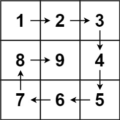

## Description

Given a positive integer `n`, generate an `n x n` `matrix` filled with elements from `1` to $n^{2}$ in spiral order.
### Function Contract

**Inputs**

- `n`: The side length of the square matrix.

**Return value**

Return the $n \times n$ matrix filled from `1` to $n^2$ along a clockwise inward spiral.

### Examples

#### Example 1

- **Input:** $n = 3$
- **Output:** `[[1,2,3],[8,9,4],[7,6,5]]`
#### Example 2

- **Input:** $n = 1$
- **Output:** `[[1]]`
### Constraints

- $1 \le n \le 20$