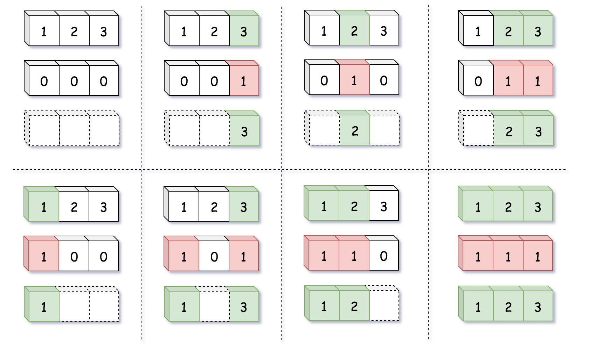
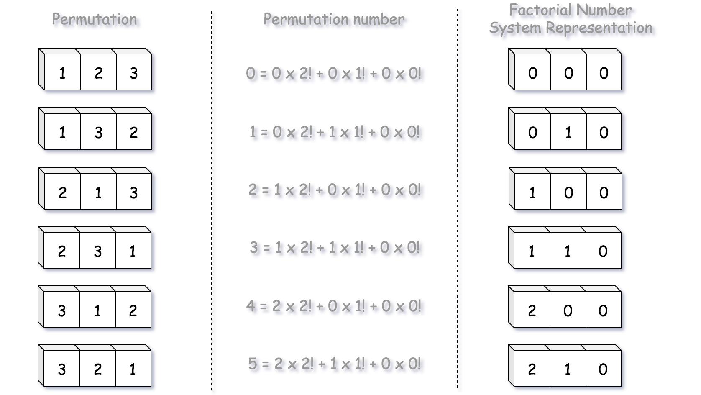
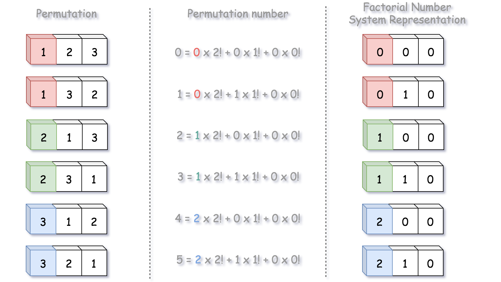
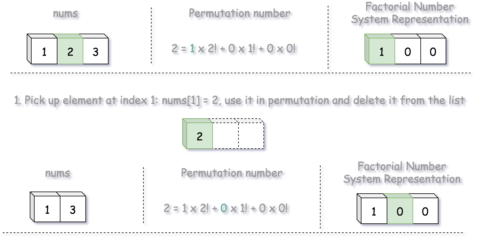
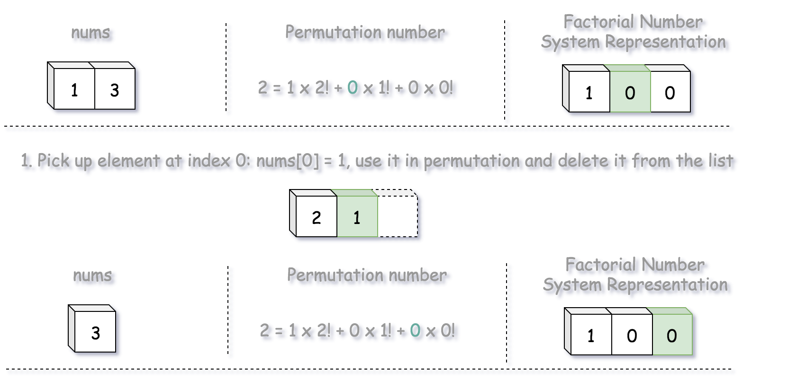
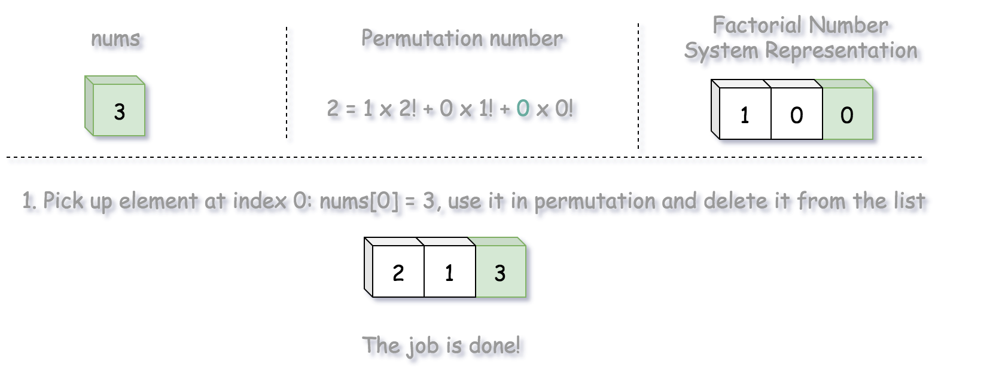

## Solution

---

### Solution Pattern

There are three main types of interview questions about permutations:

- 1. [Generate all permutations](https://leetcode.com/articles/permutations/).

- 2. [Generate next permutation](https://leetcode.com/articles/next-permutation/).

- 3. Generate the permutation number k (current problem).

If the order of generated permutations is not important, one could use ["swap" backtracking](https://leetcode.com/articles/permutations/) to solve the first problem and to generate all $N!$ permutations in $\mathcal{O}(N \times N!)$ time.

Although, it is better to generate permutations in lexicographically sorted order using [D.E. Knuth algorithm](https://leetcode.com/articles/next-permutation/). This algorithm generates a new permutation from the previous one in $\mathcal{O}(N)$ time. The same algorithm could be used to solve the second problem above.

The problem number three is where the fun starts because the above two algorithms do not apply:

- You will be asked to fit into polynomial time complexity, _i.e._ no backtracking.

- The previous permutation is unknown, _i.e._ you cannot use the D.E. Knuth algorithm.

To solve the problem, one could use a pretty elegant idea that is based on the mapping. It's much easier to generate numbers than combinations or permutations.

>So let us generate numbers, and then map them to combinations/subsets/permutations.

This sort of encoding is widely used in password-cracking algorithms.

For example, [in a previous article](https://leetcode.com/articles/subsets/) we discussed how one could map a subset with a binary bitmask of length N, where i*th* `0` means "the element number i is absent" and i*th* `1` means "the element number i is present".

One could do the same for permutations, mapping permutation with the integer in [Factorial Number System Representation](https://en.wikipedia.org/wiki/Factorial_number_system).

---
### Approach 1: Factorial Number System

**Why Do We Need Factorial Number System**

Usually standard decimal or binary [positional system](https://en.wikipedia.org/wiki/Numeral_system#Positional_systems_in_detail) could meet our needs. For example, each subset could be described by a number in binary representation

$k = \sum\limits_{m = 0}^{N - 1}{k_m 2^m}, \qquad 0 \le k_m \le 1$

Here is how it works:



The problem with permutations is that there is a much more permutations than subsets, $N!$ grows up much faster than $2^N$. Therefore, the solution space provided by the positional system with a constant base cannot match with the number of permutations.

Here is where the factorial number system enters the scene. It's a positional system with _non-constant base_ $m!$

$k = \sum\limits_{m = 0}^{N - 1}{k_m m!}, \qquad 0 \le k_m \le m$

Note, that the magnitude of weights is not constant as well and depends on the base: $0 \le k_m \le m$ for the base $m!$, _i.e._ $k_0 = 0$, $0 \le k_1 \le 1$, $0 \le k_2 \le 2$, etc.

Here is how this mapping works:



We could now map all permutations, from permutation number zero: $k = 0 = \sum\limits_{m = 0}^{N - 1}{0 \times m!}$ to permutation number $N! - 1$: $k = N! - 1 = \sum\limits_{m = 0}^{N - 1}{m \times m!}$.

> Hence we have a way to encode permutation numbers into factorial representation. Now let us use this factorial representation to construct the permutation itself.

**How to Construct the Permutation from its Factorial Representation**

Let us pick up $N = 3$, which corresponds to the input array `nums = [1, 2, 3]`, and construct its permutation number $k = 3$. Since we number the permutations from 0 to $N! - 1$ (and _not_ from 1 to $N!$ as in the problem description), for us that will be the permutation number $k = 2$.

Let us first construct the factorial representation of $k = 2$:

$k = 2 = 1 \times 2! + 0 \times 1! + 0 \times 0! = (1, 0, 0)$

> The coefficients in factorial representation are indexes of elements in the input array. These are not direct indexes, but the indexes after the removal of already used elements. That's a consequence of the fact that each element should be used in permutation only once.



Here the first number is `1`, _i.e._ the first element in the permutation is $\text{nums}[1] = 2$. Let us use $\text{nums}[1] = 2$ in the permutation and then delete it from `nums`, since each element should be used only once.



The next coefficient in factorial representation is `0`. Let's use $\text{nums}[0] = 1$ in the permutation and then delete it from `nums`.



The next coefficient in factorial representation is `0`. Let's use $\text{nums}[0] = 3$ in the permutation and then delete it from `nums`. The job is done.



**Algorithm**

- Generate input array `nums` of numbers from $1$ to $N$.

- Compute all factorial bases from $0$ to $(N  - 1)!$.

- Decrease $k$ by 1 to make it fit into $(0, N! - 1)$ interval.

- Compute factorial representation of $k$. Use factorial coefficients to construct the permutation.

- Return the permutation string.

**Implementation**

```python
class Solution:
    def getPermutation(self, n: int, k: int) -> str:
        factorials, nums = [1], ["1"]
        for i in range(1, n):
            # generate factorial system bases 0!, 1!, ..., (n - 1)!
            factorials.append(factorials[i - 1] * i)
            # generate nums 1, 2, ..., n
            nums.append(str(i + 1))

        # Fit k in the interval 0 ... (n! - 1)
        k -= 1

        # Compute the factorial representation of k
        output = []
        for i in range(n - 1, -1, -1):
            idx = k // factorials[i]
            k -= idx * factorials[i]

            output.append(nums[idx])
            del nums[idx]

        return "".join(output)
```

**Complexity Analysis**

* Time complexity: $\mathcal{O}(N^2)$, because to delete elements from the list in a loop one has to perform $N + (N - 1) + ... + 1 = N(N - 1)/2$ operations.

* Space complexity: $\mathcal{O}(N)$.