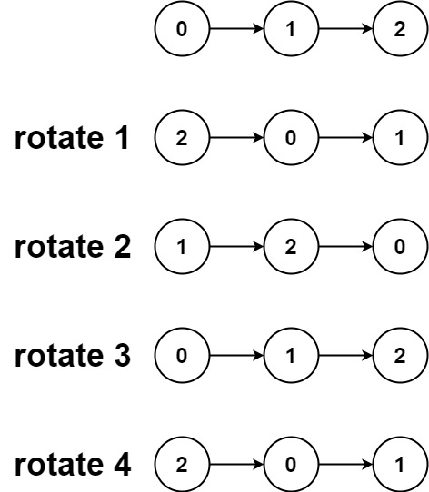

## Description

Given the `head` of a linked list, rotate the list to the right by `k` places.
### Function Contract

**Inputs**

- `head`: The first node of the linked list, or `null` for an empty list.
- `k`: The non-negative number of right rotations.

**Return value**

Return the head of the rotated list.

### Examples

#### Example 1

- **Input:** $head = [1,2,3,4,5], k = 2$
- **Output:** `[4,5,1,2,3]`
#### Example 2

- **Input:** $head = [0,1,2], k = 4$
- **Output:** `[2,0,1]`
### Constraints

- The number of nodes in the list is in the range `[0, 500]`.

- $-100 \le \text{Node.val} \le 100$

- $0 \le k \le 2 * 10^{9}$