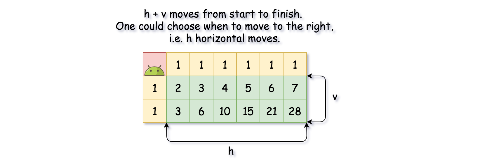

## Solution

---

### Overview

Since robot can move either down or right, there is only one path
to reach the cells in the first row: right->right->...->right.


The same is valid for the first column, though the path here is down->down->
...->down.


What about the "inner" cells `(m, n)`? To such cell one could move
either from the cell on the left $(m, n - 1)$, or from the cell above
$(m - 1, n)$. That means that the total number of paths to move into `(m, n)` cell
is $uniquePaths(m - 1, n) + uniquePaths(m, n - 1)$.


Now, one could transform these ideas into 3-liner recursive solution:

```python
class Solution:
    def uniquePaths(self, m: int, n: int) -> int:
        if m == 1 or n == 1:
            return 1

        return self.uniquePaths(m - 1, n) + self.uniquePaths(m, n - 1)
```

This solution is not fast enough to pass all the testcases, though it
could be used as a starting point for the DP solution.

---
### Approach 1: Dynamic Programming

One could rewrite recursive approach into dynamic programming one.

**Algorithm**

- Initiate 2D array $d[m][n] = number of paths$. To start, put number of paths
equal to 1 for the first row and the first column.
For the simplicity, one could initiate the whole 2D array by ones.

- Iterate over all "inner" cells: $d[col][row] = d[col - 1][row] + d[col][row - 1]$.

- Return $d[m - 1][n - 1]$.

**Implementation**


```python
class Solution:
    def uniquePaths(self, m: int, n: int) -> int:
        d = [[1] * n for _ in range(m)]

        for col in range(1, m):
            for row in range(1, n):
                d[col][row] = d[col - 1][row] + d[col][row - 1]

        return d[m - 1][n - 1]
```

**Complexity Analysis**

* Time complexity: $\mathcal{O}(N \times M)$.

* Space complexity: $\mathcal{O}(N \times M)$.

---
### Approach 2: Math (Python3 only)

Could one do better than $\mathcal{O}(N \times M)$? The answer is yes.

The problem is a classical combinatorial problem: there are
$h + v$ moves to do from start to finish, $h = m - 1$ horizontal moves,
and $v = n - 1$ vertical ones.
One could choose when to move to the right,
i.e. to define $h$ horizontal moves, and that will fix vertical ones.
Or, one could choose when to move down,
i.e. to define $v$ vertical moves, and that will fix horizontal ones.



In other words, we're asked to compute in how many ways one could
choose $p$ elements from $p + k$ elements.
In mathematics, that's called [binomial coefficients](https://en.wikipedia.org/wiki/Binomial_coefficient)

$C_{h + v}^{h} = C_{h + v}^{v} = \frac{(h + v)!}{h! v!}$

The number of horizontal moves to do is $h = m - 1$, the number of vertical
moves is $v = n - 1$. That results in a simple formula

$C_{h + v}^{h} = \frac{(m + n - 2)!}{(m - 1)! (n - 1)!}$

The job is done.
Now time complexity will depend on the algorithm to compute factorial
function $(m + n - 2)!$.
In short, standard computation for $k!$ using the definition requires
$\mathcal{O}(k^2 \log k)$ time, and that will be not as good as DP algorithm.

[The best known algorithm to compute factorial function is done by Peter Borwein](https://www.sciencedirect.com/science/article/abs/pii/0196677485900069).
The idea is to express the factorial as a product of prime powers,
so that $k!$ can be computed in $\mathcal{O}(k (\log k \log \log k)^2)$ time.
That's better than $\mathcal{O}(k^2)$ and hence beats DP algorithm.

The authors prefer not to discuss here various factorial function implementations,
and hence provide Python3 solution only, with built-in
[divide and conquer factorial algorithm](https://bugs.python.org/issue8692).
If you're interested in factorial algorithms,
please check out good review on [this page](http://www.luschny.de/math/factorial/description.html).

**Implementation**

```python
from math import factorial

class Solution:
    def uniquePaths(self, m: int, n: int) -> int:
        return factorial(m + n - 2) // factorial(n - 1) // factorial(m - 1)
```

**Complexity Analysis**

* Time complexity: $\mathcal{O}((M + N) (\log (M + N) \log \log (M + N))^2)$.

* Space complexity: $\mathcal{O}(1)$.