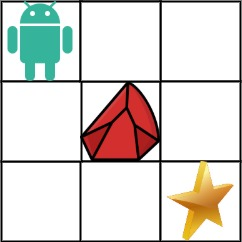

## Description

You are given an `m x n` integer array `grid`. There is a robot initially located at the **top-left corner** (i.e., $\text{grid}[0][0]$). The robot tries to move to the **bottom-right corner** (i.e., $grid[m - 1][n - 1]$). The robot can only move either down or right at any point in time.

An obstacle and space are marked as `1` or `0` respectively in `grid`. A path that the robot takes cannot include **any** square that is an obstacle.

Return *the number of possible unique paths that the robot can take to reach the bottom-right corner*.

The testcases are generated so that the answer will be less than or equal to $2 * 10^{9}$.
### Function Contract

**Inputs**

- `obstacleGrid`: A rectangular grid where `0` is open and `1` is blocked.

**Return value**

Return the number of right-and-down paths from the top-left to the bottom-right that avoid every obstacle.

### Examples
#### Example 1

- **Input:** $obstacleGrid = [[0,0,0],[0,1,0],[0,0,0]]$
- **Output:** `2`
- **Explanation:** There is one obstacle in the middle of the 3x3 grid above.
There are two ways to reach the bottom-right corner:
1. Right -> Right -> Down -> Down
2. Down -> Down -> Right -> Right
#### Example 2

- **Input:** $obstacleGrid = [[0,1],[0,0]]$
- **Output:** `1`
### Constraints

- $m = \text{obstacleGrid.length}$

- $n = \text{obstacleGrid}[i].length$

- $1 \le m, n \le 100$

- $\text{obstacleGrid}[i][j]$ is `0` or `1`.