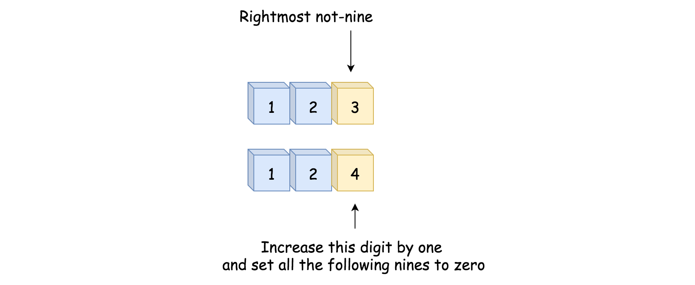
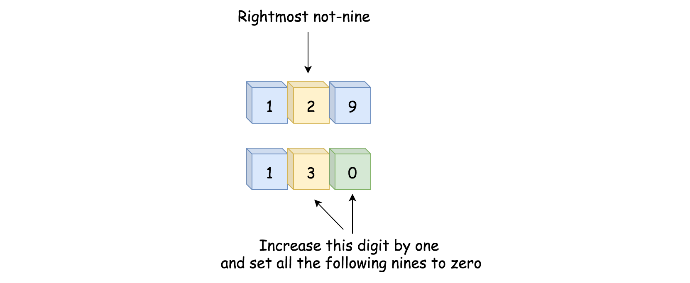
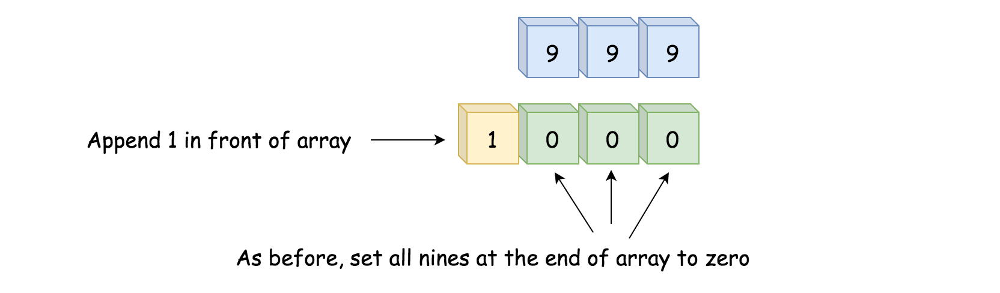
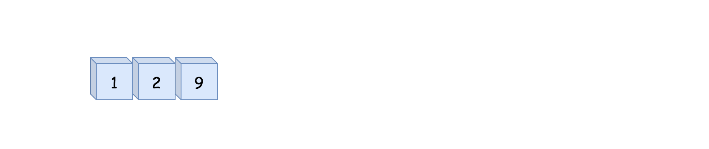
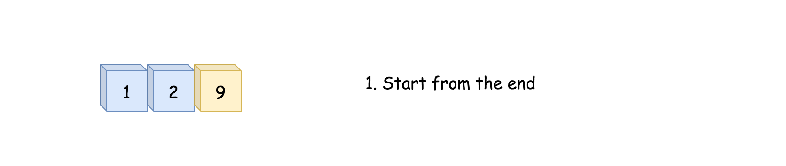
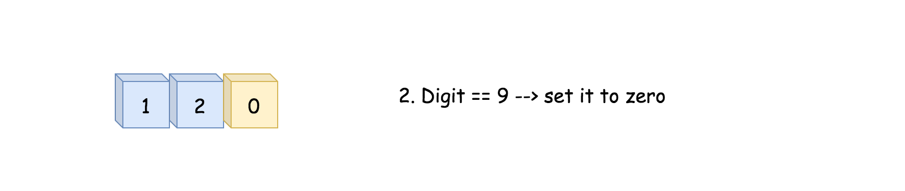
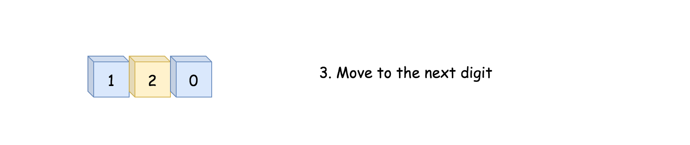
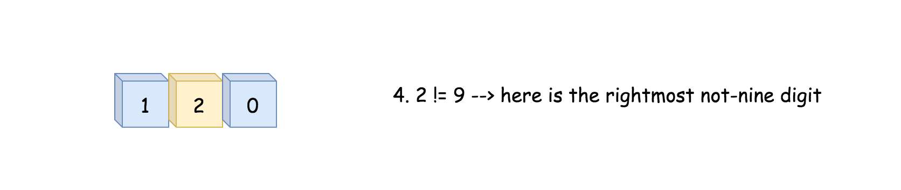
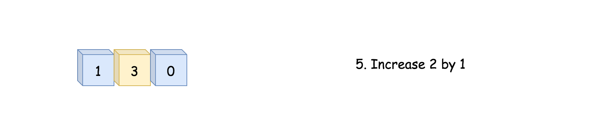
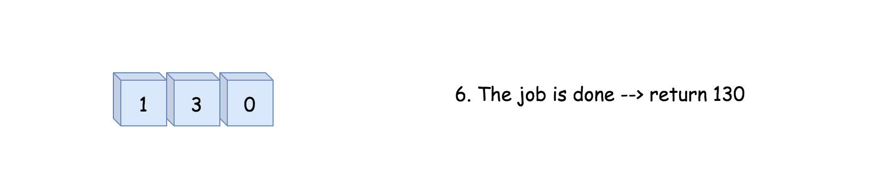

[TOC]

## Solution

---

### Overview

"Plus One" is a subset of the problem set "Add Number", which shares the same solution pattern.

All these problems could be solved in linear time, and the question here is how to solve it without using the addition operation or how to solve it in constant space complexity.

The choice of the algorithm should be based on the format of the input. Here we list a few examples:

1. Integers

    Usually, the addition operation is not allowed for such a case. Use the Bit Manipulation Approach. Here is an example: [Add Binary](https://leetcode.com/articles/add-binary/).

2. Strings

    Use bit-by-bit computation. Note, sometimes it might not be feasible to come up with a solution with the constant space for languages with immutable strings, _e.g._ for Java and Python. Here is an example: [Add Binary](https://leetcode.com/articles/add-binary/).

3. Linked Lists

    Sentinel Head + Schoolbook Addition with Carry. Here is an example: [Plus One Linked List](https://leetcode.com/articles/plus-one-linked-list/).

4. Arrays (also the current problem)

    Schoolbook addition with carry.

> Note that a straightforward idea to convert everything into integers and then apply the addition could be risky, especially for the implementation in Java, due to the potential integer overflow issue.

As one can imagine, once the array gets long, the result of the conversion cannot fit into the data type of Integer, Long, or even [BigInteger](https://docs.oracle.com/javase/8/docs/api/java/math/BigInteger.html).

<br />
<br />

---
### Approach 1: Schoolbook Addition with Carry

**Intuition**

Let us identify the rightmost digit which is not equal to nine and increase that digit by one. All the following consecutive digits of nine should be set to zero.

Here is the simplest use case which works fine.



Here is a slightly complicated case that still passes.



And here is the case which breaks everything, because _all_ the digits are nines.


In this case, we need to set all nines to zero and append 1 to the left side of the array.



**Algorithm**

- Move along the input array starting from the end of the array.

- Set all the nines at the end of the array to zero.

- If we meet a not-nine digit, we would increase it by one. The job is done - return `digits`.

- We're here because **_all_** the digits were equal to nine. Now they have all been set to zero. We then append the digit `1` in front of the other digits and return the result.

**Implementation**















```python
class Solution:
    def plusOne(self, digits: List[int]) -> List[int]:
        n = len(digits)

        # move along the input array starting from the end
        for i in range(n):
            idx = n - 1 - i

            # Set all the nines at the end of the array to zeros
            if digits[idx] == 9:
                digits[idx] = 0

            # Here we have the rightmost not-nine
            else:
                # Increase this rightmost not-nine by 1
                digits[idx] += 1

                # and the job is done
                return digits

        # We're here because all the digits are nines
        return [1] + digits
```

**Complexity Analysis**

Let $N$ be the number of elements in the input list.

* Time complexity: $\mathcal{O}(N)$ since it's not more than one pass along the input list.

* Space complexity: $\mathcal{O}(N)$

  - Although we perform the operation **in-place** (_i.e._ on the input list itself),
  in the worst scenario, we would need to allocate an intermediate space to hold the result,
  which contains the $N+1$ elements.
  Hence the overall space complexity of the algorithm is $\mathcal{O}(N)$.