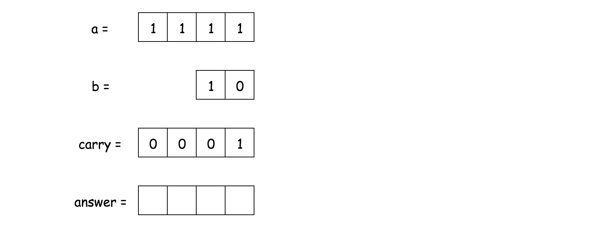
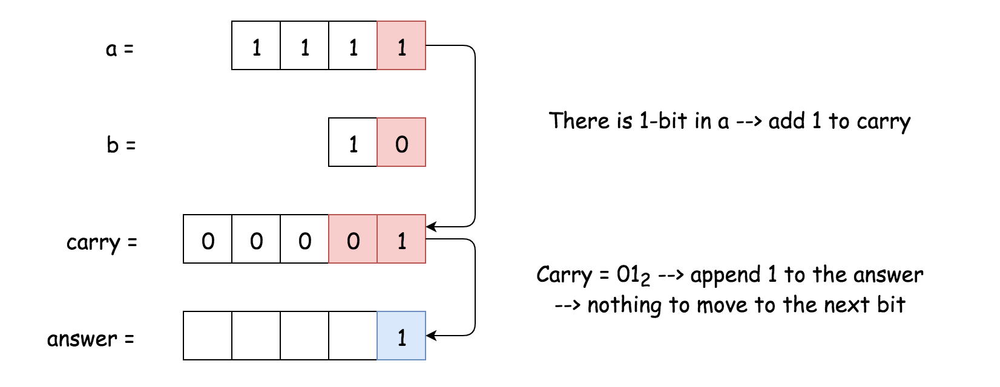
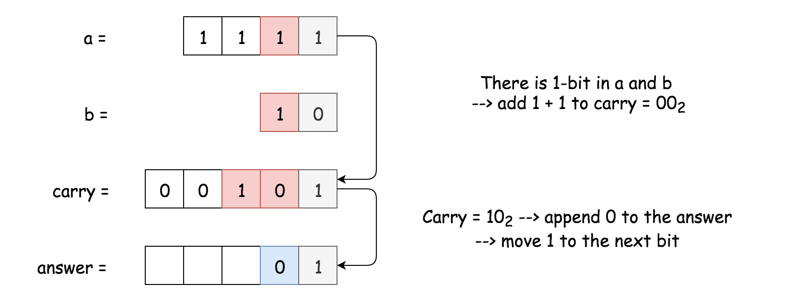
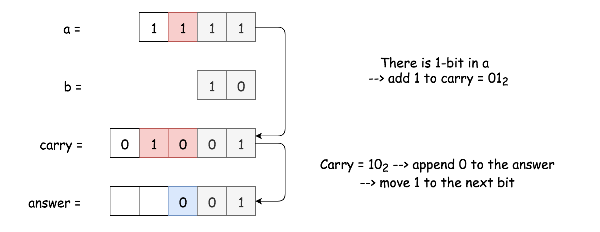
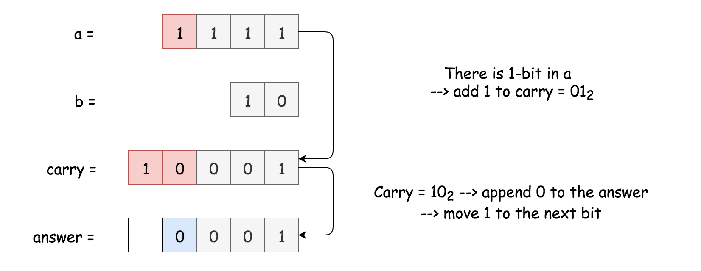
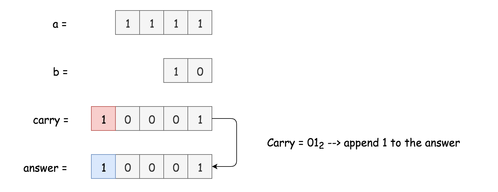
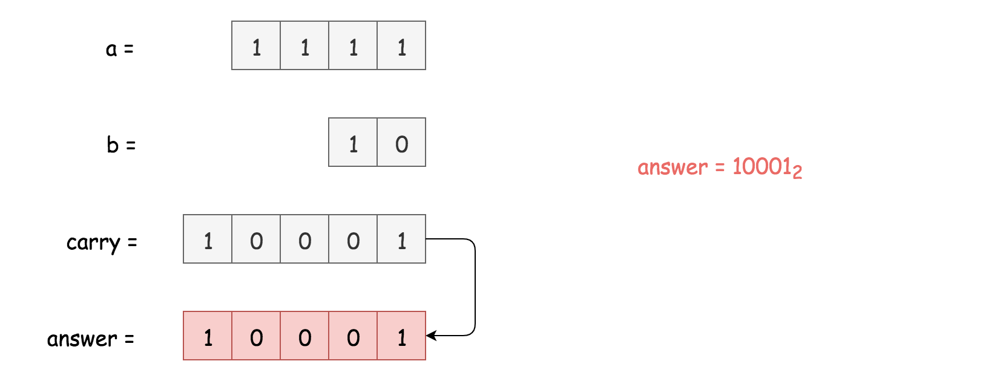
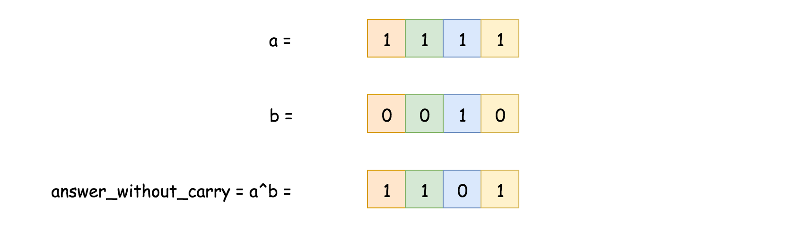
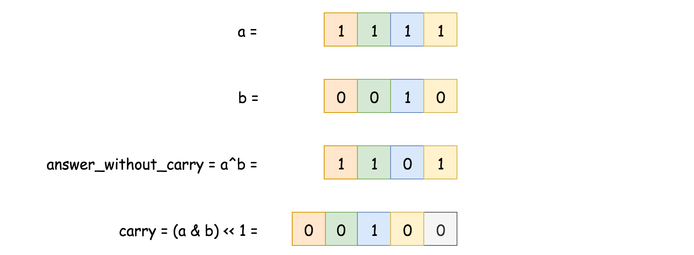

## Solution

---

### Overview

There is a simple way to use built-in functions:

- Convert a and b into integers.

- Compute the sum.

- Convert the sum back into binary form.

```python
class Solution:
    def addBinary(self, a, b) -> str:
        return "{0:b}".format(int(a, 2) + int(b, 2))
```

The overall algorithm has $\mathcal{O}(N + M)$ time complexity and has two drawbacks that could be used against you during the interview.

> 1. In Java, this approach is limited by the length of the input strings a and b. Once the string is long enough, the result of conversion into integers will not fit into Integer, Long, or BigInteger:

- 33 1-bits - and b doesn't fit into Integer.

- 65 1-bits - and b doesn't fit into Long.

- [2147483647](https://docs.oracle.com/javase/8/docs/api/java/math/BigInteger.html) 1-bits - and b doesn't fit into BigInteger.

To fix the issue, one could use a standard Bit-by-Bit Computation approach which is suitable for quite long input strings.

> 2. This method has quite low performance in the case of large input numbers.

One could use the Bit Manipulation approach to speed up the solution.

---
### Approach 1: Bit-by-Bit Computation

**Algorithm**

That's a good old classical algorithm, and there is no conversion from binary string to decimal and back here. Let's consider the numbers bit by bit starting from the lowest one and compute the carry this bit will add.

Start from carry = 0. If a number a has 1-bit in this lowest bit, add 1 to the carry. The same is true for number b: if number b has 1-bit in the lowest bit, add 1 to the carry. At this point, the carry for the lowest bit could be equal to $(00)_2$, $(01)_2$, or $(10)_2$.

Now append the lowest bit of the carry to the answer, and move the highest bit of the carry to the next order bit.

Repeat the same steps again, and again, till all bits in a and b are used up. If there is still nonzero carry to add, add it. Now reverse the answer string and the job is done.















**Implementation**

```python
class Solution:
    def addBinary(self, a, b) -> str:
        n = max(len(a), len(b))
        a, b = a.zfill(n), b.zfill(n)

        carry = 0
        answer = []
        for i in range(n - 1, -1, -1):
            if a[i] == "1":
                carry += 1
            if b[i] == "1":
                carry += 1

            if carry % 2 == 1:
                answer.append("1")
            else:
                answer.append("0")

            carry //= 2

        if carry == 1:
            answer.append("1")
        answer.reverse()

        return "".join(answer)
```

**Complexity Analysis**

* Time complexity: $\mathcal{O}(\max(N, M))$, where $N$ and $M$ are lengths of the input strings a and b.

* Space complexity: $\mathcal{O}(\max(N, M))$ to keep the answer.

---
### Approach 2: Bit Manipulation

**Intuition**

Here the input is more adapted to push towards Approach 1, but there is a popular Facebook variation of this problem when the interviewer provides you with two numbers and asks to sum them up without using the addition operation.

> No addition? OK, bit manipulation then.

How to start? There is an interview tip for bit manipulation problems: if you don't know how to start, start by computing XOR for your input data. Strangely, that helps to go out for quite a lot of problems, [Single Number II](https://leetcode.com/articles/single-number-ii/), [Single Number III](https://leetcode.com/articles/single-number-iii/), [Maximum XOR of Two Numbers in an Array](https://leetcode.com/articles/maximum-xor-of-two-numbers-in-an-array/), [Repeated DNA Sequences](https://leetcode.com/articles/repeated-dna-sequences/), [Maximum Product of Word Lengths](https://leetcode.com/articles/maximum-product-of-word-lengths/), etc.

Here XOR is a key as well because it's a sum of two binaries without taking carry into account.



To find the current carry is quite easy as well, it's AND of two input numbers, shifted one bit to the left.



Now the problem is reduced: one has to find the sum of answers without carry and carry. It's the same problem - to sum two numbers, and hence one could solve it in a loop with the condition statement "while carry is not equal to zero".

**Algorithm**

- Convert a and b into integers x and y, x will be used to keep an answer, and y for the carry.

- While carry is nonzero: $y \neq 0$:

- Current answer without carry is XOR of x and y: $answer = x^y$.

- Current carry is left-shifted AND of x and y: $carry = (x \& y) << 1$.

- Job is done, prepare the next loop: $x = answer$, $y = carry$.

- Return x in the binary form.

**Implementation**

```python
class Solution:
    def addBinary(self, a, b) -> str:
        x, y = int(a, 2), int(b, 2)
        while y:
            answer = x ^ y
            carry = (x & y) << 1
            x, y = answer, carry
        return bin(x)[2:]
```

This solution could be written as a 4-liner in Python

```
class Solution:
    def addBinary(self, a, b) -> str:
        x, y = int(a, 2), int(b, 2)
        while y:
            x, y = x ^ y, (x & y) << 1
        return bin(x)[2:]
```

**Performance Discussion**

Here we deal with input numbers which are greater than $2^{100}$. That forces to use slow [BigInteger](https://docs.oracle.com/javase/8/docs/api/java/math/BigInteger.html) in Java, and hence the performance gain will be present for the Python solution only. Provided here Java solution could do its best with Integers or Longs, but not with BigIntegers.

**Complexity Analysis**

* Time complexity: $\mathcal{O}(N + M)$, where $N$ and $M$ are lengths of the input strings a and b.

* Space complexity: $\mathcal{O}(\max(N, M))$ to keep the answer.