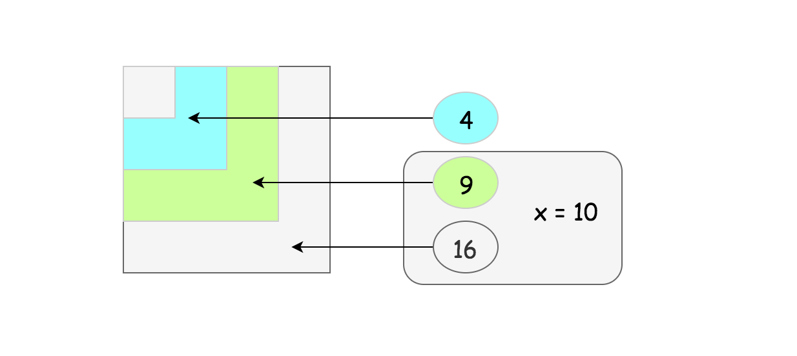
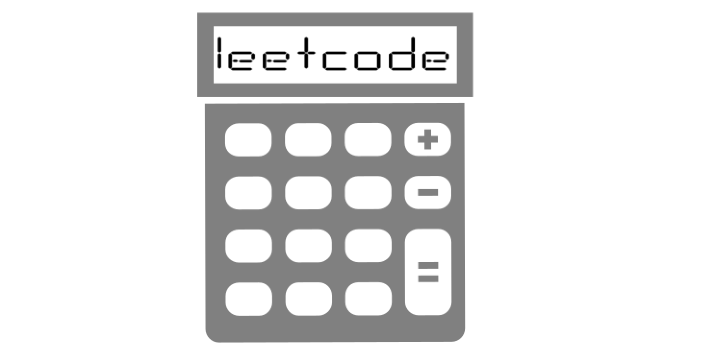
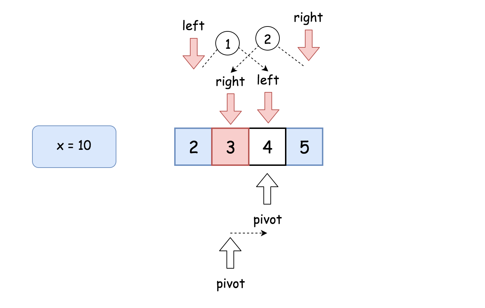
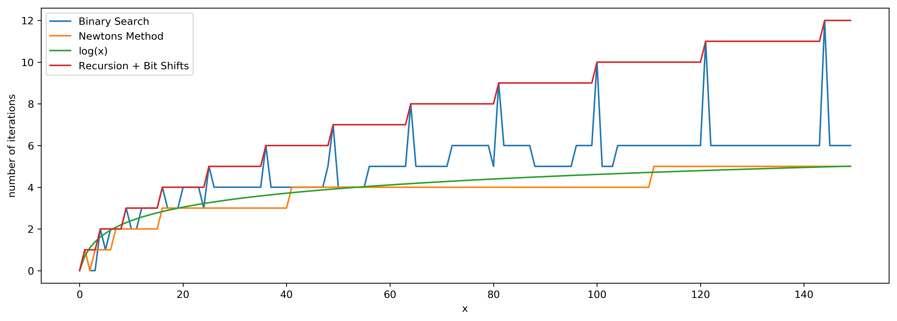

## Solution

---

### Integer Square Root

The value $a$ we're supposed to compute could be defined as $a^2 \le x < (a + 1)^2$. It is called _integer square root_. From a geometrical point of view, it's the side of the largest integer-side square with a surface less than x.

 

<br />
<br />

---
### Approach 1: Pocket Calculator Algorithm

Before going to the serious stuff, let's first have some fun and implement the [algorithm used by the pocket calculators](https://en.wikipedia.org/wiki/Methods_of_computing_square_roots#Exponential_identity).

Usually, a pocket calculator computes well exponential functions and natural logarithms by having logarithm tables hardcoded or by other means. Hence the idea is to reduce the square root computation to these two algorithms as well

$\sqrt{x} = e^{\frac{1}{2} \log x}$

That's some sort of cheat because of non-elementary function usage but it's how that actually works in real life.



**Implementation**

```python
from math import e, log

class Solution:
    def mySqrt(self, x: int) -> int:
        if x < 2:
            return x

        left = int(e ** (0.5 * log(x)))
        right = left + 1
        return left if right * right > x else right
```

**Complexity Analysis**

* Time complexity: $\mathcal{O}(1)$.

* Space complexity: $\mathcal{O}(1)$.
<br />
<br />

---
### Approach 2: Binary Search

**Intuition**

Let's go back to the interview context. For $x \ge 2$ the square root is always smaller than $x / 2$ and larger than 0 : $0 < a < x / 2$. Since $a$ is an integer, the problem goes down to the iteration over the sorted set of integer numbers. Here the binary search enters the scene.



**Algorithm**

- If `x < 2`, return `x`.

- Set the left boundary to $left = 2$, and the right boundary to $right = x / 2$.

- While $left \le right$:

- Take $num = (left + right) / 2$ as a guess. Compute $num * num$ and compare it with `x`:

- If $num * num > x$, move the right boundary `$right = pivot - 1$

- Else, if $num * num < x$, move the left boundary $left = pivot + 1$

- Otherwise $num * num = x$, the integer square root is here, let's return it.

- Return `right`

**Implementation**

```python
class Solution:
    def mySqrt(self, x: int) -> int:
        if x < 2:
            return x

        left, right = 2, x // 2

        while left <= right:
            pivot = left + (right - left) // 2
            num = pivot * pivot
            if num > x:
                right = pivot - 1
            elif num < x:
                left = pivot + 1
            else:
                return pivot

        return right
```

**Complexity Analysis**

* Time complexity : $\mathcal{O}(\log N)$.

    Let's compute time complexity with the help of [master theorem](https://en.wikipedia.org/wiki/Master_theorem_(analysis_of_algorithms)) $T(N) = aT\left(\frac{N}{b}\right) + \Theta(N^d)$. The equation represents dividing the problem up into $a$ subproblems of size $\frac{N}{b}$ in $\Theta(N^d)$ time. Here at step, there is only one subproblem $a = 1$, its size is half of the initial problem $b = 2$, and all this happens in a constant time $d = 0$. That means that $\log_b{a} = d$ and hence we're dealing with [case 2](https://en.wikipedia.org/wiki/Master_theorem_(analysis_of_algorithms)#Case_2_example) that results in $\mathcal{O}(n^{\log_b{a}} \log^{d + 1} N)$ = $\mathcal{O}(\log N)$ time complexity.

* Space complexity : $\mathcal{O}(1)$.
<br />
<br />

---
### Approach 3: Recursion + Bit Shifts

**Intuition**

Let's use recursion. Bases cases are $\sqrt{x} = x$ for $x < 2$. Now the idea is to decrease $x$ recursively at each step to go down to the base cases.

> How to go down?

For example, let's notice that $\sqrt{x} = 2 \times \sqrt{\frac{x}{4}}$, and hence square root could be computed recursively as

$\textrm{mySqrt}(x) = 2 \times \textrm{mySqrt}\left(\frac{x}{4}\right)$

One could already stop here, but let's use [left and right shifts](https://wiki.python.org/moin/BitwiseOperators), which are quite fast manipulations with bits

$x << y \qquad \textrm{that means} \qquad x \times 2^y$

$x >> y \qquad \textrm{that means} \qquad \frac{x}{2^y}$

That means one could rewrite the recursion above as

$\textrm{mySqrt}(x) = \textrm{mySqrt}(x >> 2) << 1$

in order to speed up the computations.

**Implementation**

```python
class Solution:
    def mySqrt(self, x: int) -> int:
        if x < 2:
            return x

        left = self.mySqrt(x >> 2) << 1
        right = left + 1
        return left if right * right > x else right
```

**Complexity Analysis**

* Time complexity: $\mathcal{O}(\log N)$.

    Let's compute time complexity with the help of [master theorem](https://en.wikipedia.org/wiki/Master_theorem_(analysis_of_algorithms)) $T(N) = aT\left(\frac{N}{b}\right) + \Theta(N^d)$. The equation represents dividing the problem up into $a$ subproblems of size $\frac{N}{b}$ in $\Theta(N^d)$ time. Here at step, there is only one subproblem $a = 1$, its size is half of the initial problem $b = 2$, and all this happens in a constant time $d = 0$. That means that $\log_b{a} = d$ and hence we're dealing with [case 2](https://en.wikipedia.org/wiki/Master_theorem_(analysis_of_algorithms)#Case_2_example) that results in $\mathcal{O}(n^{\log_b{a}} \log^{d + 1} N)$ = $\mathcal{O}(\log N)$ time complexity.

* Space complexity: $\mathcal{O}(\log N)$ to keep the recursion stack.
<br />
<br />

---
### Approach 4: Newton's Method

**Intuition**

One of the best and most widely used methods to compute sqrt is [Newton's Method](https://en.wikipedia.org/wiki/Newton%27s_method). Here we'll implement the version without the seed trimming to keep things simple. However, seed trimming is a bit of math and a lot of fun, so [here is a link](https://en.wikipedia.org/wiki/Methods_of_computing_square_roots#Rough_estimation) if you'd like to dive in.

Let's keep the [mathematical proofs](https://en.wikipedia.org/wiki/Newton%27s_method) outside of the article and just use the textbook fact that the set

$x_{k + 1} = \frac{1}{2}\left[x_k + \frac{x}{x_k}\right]$

converges to $\sqrt{x}$ if $x_0 = x$. Then things are straightforward: define that the error should be less than 1 and proceed iteratively.

**Implementation**

```python
class Solution:
    def mySqrt(self, x: int) -> int:
        if x < 2:
            return x

        x0 = x
        x1 = (x0 + x / x0) / 2
        while abs(x0 - x1) >= 1:
            x0 = x1
            x1 = (x0 + float(x) / x0) / 2

        return int(x1)
```

**Complexity Analysis**

* Time complexity: $\mathcal{O}(\log N)$ since the set converges quadratically.

* Space complexity: $\mathcal{O}(1)$.
<br />
<br />

---
### Compare Approaches 2, 3 and 4

Here we have three algorithms with a time performance $\mathcal{O}(\log N)$, and it's a bit confusing.

> Which one is performing fewer iterations?

Let's run tests for the range of x in order to check that. ,,,,,,,Here are the results. The best one is Newton's method.

