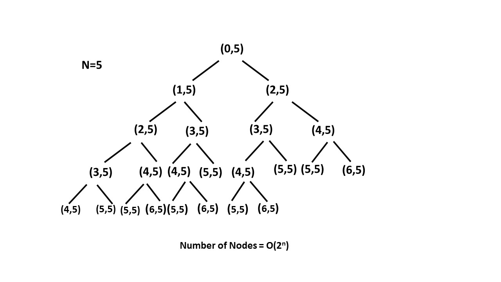
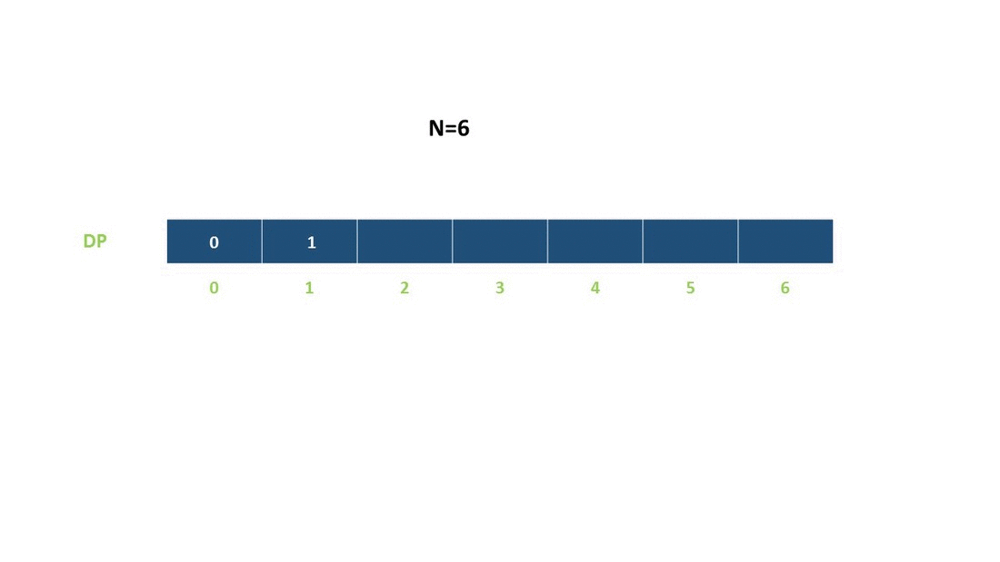
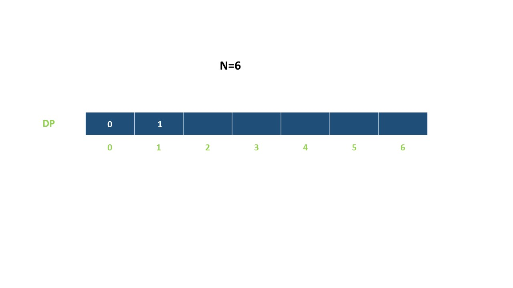
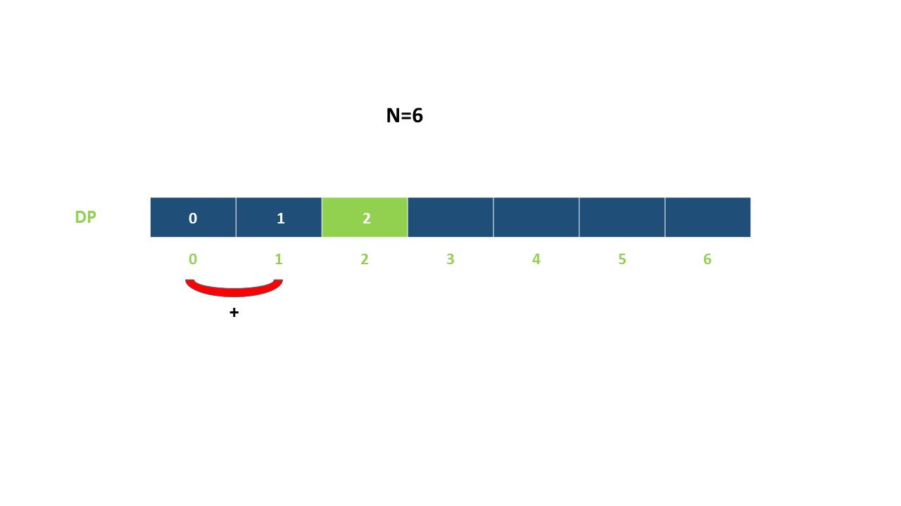
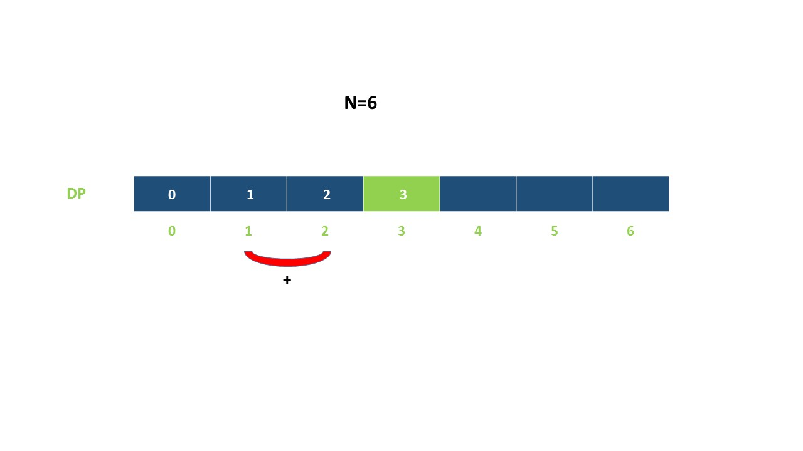
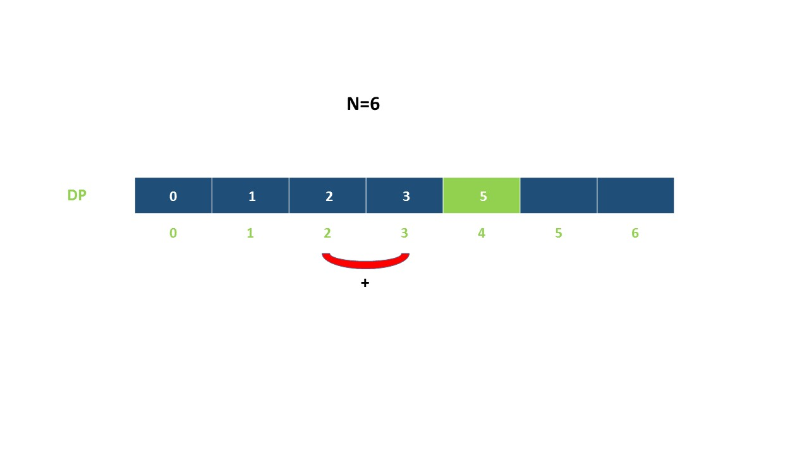
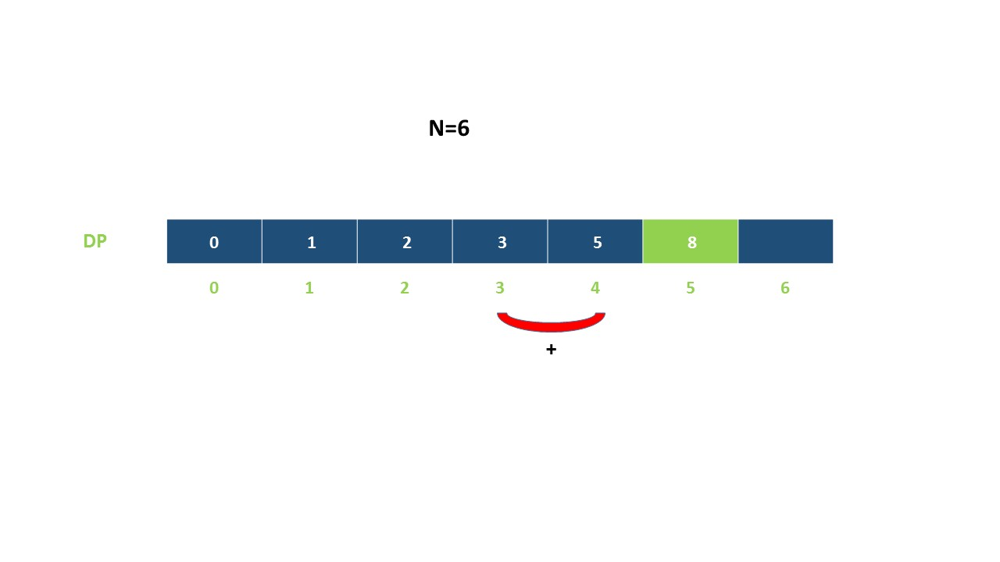
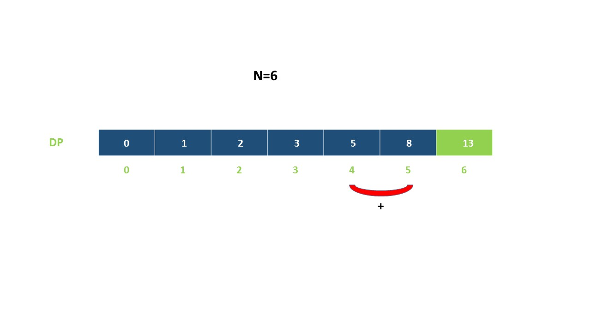
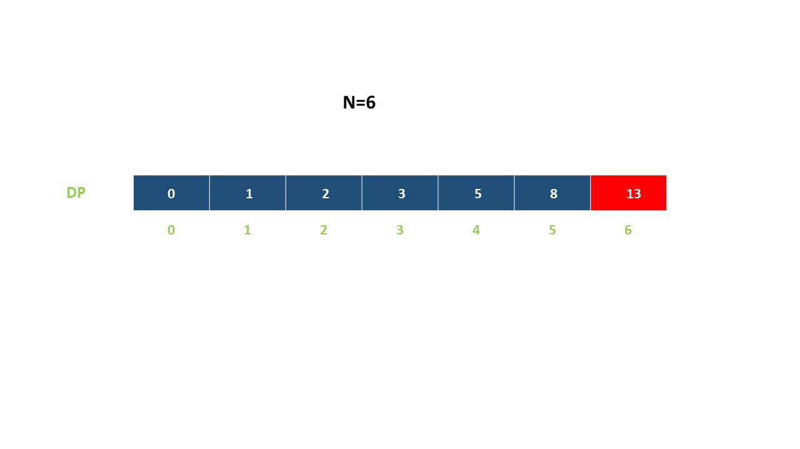
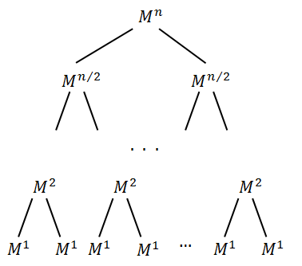

## Summary

You are climbing a stair case. It takes n steps to reach to the top.

Each time you can either climb 1 or 2 steps. In how many distinct ways can you climb to the top?

## Solution

---
### Approach 1: Brute Force

#### Algorithm

In this brute force approach we take all possible step combinations i.e. 1 and 2, at every step. At every step we are calling the function $climbStairs$ for step $1$ and $2$, and return the sum of returned values of both functions.

$climbStairs(i, n) = climbStairs(i + 1, n) + climbStairs(i + 2, n)$

where $i$ defines the current step and $n$ defines the destination step.

#### Implementation

```python
# Python3
class Solution:
    def climbStairs(self, n: int) -> int:
        return self.climb_Stairs(0, n)

    def climb_Stairs(self, i: int, n: int) -> int:
        if i > n:
            return 0
        if i == n:
            return 1
        return self.climb_Stairs(i + 1, n) + self.climb_Stairs(i + 2, n)
```

#### Complexity Analysis

* Time complexity : $O(2^n)$. Size of recursion tree will be $2^n$.

    Recursion tree for n=5 would be like this:

    

* Space complexity : $O(n)$. The depth of the recursion tree can go upto $n$.
<br />
<br />

---

### Approach 2: Recursion with Memoization

#### Algorithm

In the previous approach we are redundantly calculating the result for every step. Instead, we can store the result at each step in $memo$ array and directly returning the result from the memo array whenever that function is called again.

In this way we are pruning recursion tree with the help of $memo$ array and reducing the size of recursion tree upto $n$.

#### Implementation

```python
class Solution:
    def climbStairs(self, n: int) -> int:
        memo = [0] * (n + 1)
        return self.climb_Stairs(0, n, memo)

    def climb_Stairs(self, i: int, n: int, memo: List[int]) -> int:
        if i > n:
            return 0
        if i == n:
            return 1
        if memo[i] > 0:
            return memo[i]
        memo[i] = self.climb_Stairs(i + 1, n, memo) + self.climb_Stairs(
            i + 2, n, memo
        )
        return memo[i]
```

#### Complexity Analysis

* Time complexity : $O(n)$. Size of recursion tree can go up to $n$.

* Space complexity : $O(n)$. The depth of recursion tree can go up to $n$.
<br />
<br />

---

### Approach 3: Dynamic Programming

#### Algorithm

As we can see this problem can be broken into subproblems, and it contains the optimal substructure property i.e. its optimal solution can be constructed efficiently from optimal solutions of its subproblems, we can use dynamic programming to solve this problem.

One can reach $i^{th}$ step in one of the two ways:

1. Taking a single step from $(i-1)^{th}$ step.

2. Taking a step of $2$ from $(i-2)^{th}$ step.

So, the total number of ways to reach $i^{th}$ is equal to sum of ways of reaching $(i-1)^{th}$ step and ways of reaching $(i-2)^{th}$ step.

Let $\text{dp}[i]$ denotes the number of ways to reach on $i^{th}$ step:

$\text{dp}[i]=dp[i-1]+dp[i-2]$

Example:

<!---->















#### Implementation

```python
# Python3
class Solution:
    def climbStairs(self, n: int) -> int:
        if n == 1:
            return 1
        dp = [0 for _ in range(n + 1)]
        dp[1] = 1
        dp[2] = 2
        for i in range(3, n + 1):
            dp[i] = dp[i - 1] + dp[i - 2]
        return dp[n]
```

#### Complexity Analysis

* Time complexity : $O(n)$. Single loop up to $n$.

* Space complexity : $O(n)$. $dp$ array of size $n$ is used.
<br />
<br />

---

### Approach 4: Fibonacci Number

#### Algorithm

In the above approach we have used $dp$ array where $\text{dp}[i]=dp[i-1]+dp[i-2]$. It can be easily analysed that $\text{dp}[i]$ is nothing but $i^{th}$ fibonacci number.

$Fib(n)=Fib(n-1)+Fib(n-2)$

Now we just have to find $n^{th}$ number of the fibonacci series having $1$ and $2$ their first and second term respectively, i.e. $Fib(1)=1$ and $Fib(2)=2$.

#### Implementation

```python
class Solution(object):
    def climbStairs(self, n):
        """
        :type n: int
        :rtype: int
        """
        if n == 1:
            return 1
        first = 1
        second = 2
        for i in range(3, n + 1):
            third = first + second
            first = second
            second = third
        return second
```

#### Complexity Analysis

* Time complexity : $O(n)$. Single loop upto $n$ is required to calculate $n^{th}$ fibonacci number.

* Space complexity : $O(1)$. Constant space is used.
<br />
<br />

---

### Approach 5: Binets Method

#### Algorithm

This is an interesting solution which uses matrix multiplication to obtain the $n^{th}$ Fibonacci Number. The matrix takes the following form:

$\left[ {\begin{array}{cc} F_{n+1} \& F_n \\  F_n \& F_{n-1}     \end{array} } \right] = \left[ {\begin{array}{cc} 1 \& 1 \\  1 \& 0     \end{array} } \right]$

Let's say $Q=\left[ {\begin{array}{cc} F_{n+1} \& F_n \\  F_n \& F_{n-1}     \end{array} } \right]$. As per the method, the $n^{th}$ Fibonacci Number is given by $Q^{n-1}[0,0]$.

Let's look at the proof of this method.

We can prove this method using Mathematical Induction. We know, this matrix gives the correct result for the $3^{rd}$ term(base case). Since $Q^2 = \left[ {\begin{array}{cc} 2 \& 1 \\  1 \& 1     \end{array} } \right]$. This proves that the base case holds.

Assume that this method holds for finding the $n^{th}$ Fibonacci Number, i.e. $F_n=Q^{n-1}[0,0]$, where
$Q^{n-1}=\left[ {\begin{array}{cc} F_{n} \& F_{n-1} \\  F_{n-1} \& F_{n-2}     \end{array} } \right]$

Now, we need to prove that with the above two conditions holding true, the method is valid for finding the $(n+1)^{th}$ Fibonacci Number, i.e. $F_{n+1}=Q^{n}[0,0]$.

Proof: $Q^{n} = \left[ {\begin{array}{cc} F_{n} \& F_{n-1} \\  F_{n-1} \& F_{n-2}     \end{array} } \right]\left[ {\begin{array}{cc} 1 \& 1 \\  1 \& 0     \end{array} } \right]$.
 $Q^{n} = \left[ {\begin{array}{cc} F_{n}+F_{n-1} \& F_n \\  F_{n-1}+F_{n-2} \& F_{n-1}    \end{array} } \right]$
 $Q^{n} = \left[ {\begin{array}{cc} F_{n+1} \& F_n \\  F_n \& F_{n-1}     \end{array} } \right]$

 Thus, $F_{n+1}=Q^{n}[0,0]$. This completes the proof of this method.

 The only variation we need to do for our problem is that we need to modify the initial terms to 2 and 1 instead of 1 and 0 in the Fibonacci series. Or, another way is to use the same initial $Q$ matrix and use $result = Q^{n}[0,0]$ to get the final result. This happens because the initial terms we have to use are the 2nd and 3rd terms of the otherwise normal Fibonacci Series.

#### Implementation

```python
# Python3
class Solution:
    def climbStairs(self, n: int) -> int:
        q = [[1, 1], [1, 0]]
        res = self.pow(q, n)
        return res[0][0]

    def pow(self, a: [[int]], n: int) -> [[int]]:
        ret = [[1, 0], [0, 1]]
        while n > 0:
            if (n & 1) == 1:
                ret = self.multiply(ret, a)
            n >>= 1
            a = self.multiply(a, a)
        return ret

    def multiply(self, a: [[int]], b: [[int]]) -> [[int]]:
        c = [[0, 0], [0, 0]]
        for i in range(2):
            for j in range(2):
                c[i][j] = a[i][0] * b[0][j] + a[i][1] * b[1][j]
        return c
```

#### Complexity Analysis

* Time complexity : $O(\log n)$. Traversing on $\log n$ bits.

* Space complexity : $O(1)$. Constant space is used.

Proof of Time Complexity:

Let's say there is a  matrix $M$ to be raised to  power $n$. Suppose, $n$ is the power of 2. Thus, $n = 2^i$, $i\in\mathbb{N}$, where $\mathbb{N}$ represents the set of natural numbers(including 0). We can represent  in the form of a tree:



Meaning that: $M^n = M^{n/2}.M^{n/2} = .... = \prod_{1}^{n} M^{1}$

So, to calculate  $M^{n}$ matrix, we should calculate $M^{n/2}$  matrix and multiply it by itself. To calculate $M^{n/2}$ we would have to do the same with $M^{n/4}$ and so on.

Obviously, the tree height is $\log_{2} n$.

Let’s estimate $M^{n}$ calculation time. $M$ matrix is of the same size in any power. Therefore, we can perform the multiplication of two matrices in any power in $O(1)$. We should perform $\log_2 n$ of such multiplications. So, $M^{n}$ calculation complexity is $O(\log_{2} n)$.

In case, the number $n$ is not a power of two, we can break it in terms of powers of 2 using its binary representation:

$n= \sum_{p\in P} 2^{p}, \text{where }P\subset\mathbb{N}$

Thus, we can obtain the final result using:

$M^{n} = \prod_{p\in P} M^{2^{p}}$

This is the method we've used in our implementation. Again, the complexity remains $O(\log_{2} n)$ as we have limited the number of multiplications to $O(\log_{2} n)$.<br /><br />

---
### Approach 6: Fibonacci Formula

#### Algorithm

We can find a [closed-form expression](https://en.wikipedia.org/wiki/Fibonacci_number#Closed-form_expression) to calculate the $n^{th}$ Fibonacci number:

$F_n = (\psi ^ {n} - \phi ^ {n}) / {\sqrt5} \space \text{where} \space \phi = \left(\frac{1+\sqrt{5}}{2}\right) \text{and} \space \psi = \left(\frac{1-\sqrt{5}}{2}\right)$

> **Note:** We will consider $F_0$ and $F_1$ to be 1 (instead of $F_0$ to be  0 and $F_1$ to be 1). This is why the formula derived below includes a plus 1 in the exponent.

For the given problem, the Fibonacci sequence is defined by $F_0 = 1$, $F_1= 1$,  $F_1= 2$, $F_{n+2}= F_{n+1} + F_n$. A standard method of trying to solve such recursion formulas is assume $F_n$ of the form $F_n= a^n$. Then, of course, $F_{n+1} = a^{n+1}$ and $F_{n+2}= a^{n+2}$ so the equation becomes $a^{n+2}= a^{n+1}+ a^n$. If we divide the entire equation by $a^{n}$ we arrive at $a^2= a + 1$ or the quadratic equation $a^2 - a- 1= 0$.

Solving this by the quadratic formula, we get:

$a=\frac{1\pm \sqrt{5}}{2}$

Notice that the two possible values for $a$ are $\phi$ and $\psi$. Thus, the general solution takes the form:

$F_n = A\cdot{\phi}^{n} + B\cdot{\psi}^{n} \space \text{where A and B are constants.}$

To solve for $A$ and $B$, let's use two known values $F_0 = 1$ and $F_1 = 1$.

For $n=0$, we get $A + B = 1$

For $n=1$, we get $A \cdot \phi + B \cdot \psi = 1$

Solving the above equations, we get:

$A = \left(\frac{1 - \psi}{\phi - \psi}\right), B = \left(\frac{\phi - 1}{\phi - \psi}\right)$

Putting these values of $A$ and $B$ in the above general solution equation, we get:

$F_n = \left(\frac{1 - \psi}{\phi - \psi}\right) \cdot \phi ^ {n} + \left(\frac{\phi - 1}{\phi - \psi}\right) \cdot \psi ^ {n}$

<details>

<summary>We can perform a few algebra steps (click to show) to simplify the above equation:</summary>

To simplify, we will use these two equations:

$\bold{(1)} \space \phi + \psi = \frac{1}{2} + \frac{\sqrt5}{2} + \frac{1}{2} - \frac{\sqrt5}{2} = 1$

$\bold{(2)} \space \phi - \psi = \frac{1}{2} + \frac{\sqrt5}{2} - \frac{1}{2} + \frac{\sqrt5}{2} = \sqrt5$

Equation $1$ tells us that $1 - \psi = -\phi$ and $\phi - 1= \psi$, substituting these values in for the numerators, we get:

$F_n = \left(\frac{-\phi}{\phi - \psi}\right) \cdot \phi ^ {n} + \left(\frac{\psi}{\phi - \psi}\right) \cdot \psi ^ {n}$

And equation $2$ tells us that the denominator equals $\sqrt5$:

$F_n = (-\phi \cdot \phi ^ {n} + \psi \cdot \psi ^ {n}) / \sqrt5$

Which simplifies to:

</details>

<br>

$F_n = (\psi ^ {n + 1} - \phi ^ {n + 1}) / {\sqrt5}$

<br>

#### Implementation

```python
# Python 3
class Solution:
    def climbStairs(self, n: int) -> int:
        sqrt5 = 5**0.5
        phi = (1 + sqrt5) / 2
        psi = (1 - sqrt5) / 2
        return int((phi ** (n + 1) - psi ** (n + 1)) / sqrt5)
```

#### Complexity Analysis

* Time complexity: $O(\log n)$. $\text{pow}$ method takes $\log n$ time.

* Space complexity: $O(1)$. Constant space is used.