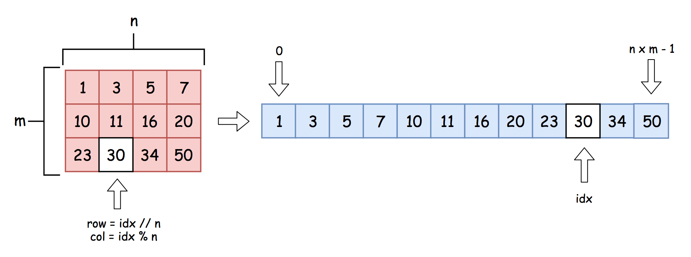
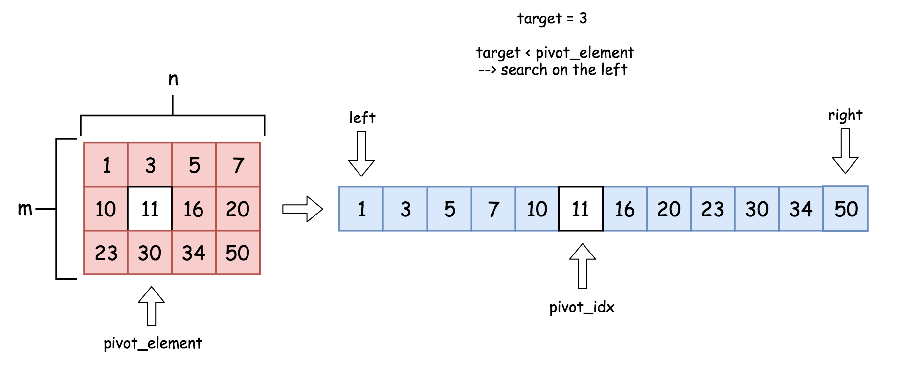
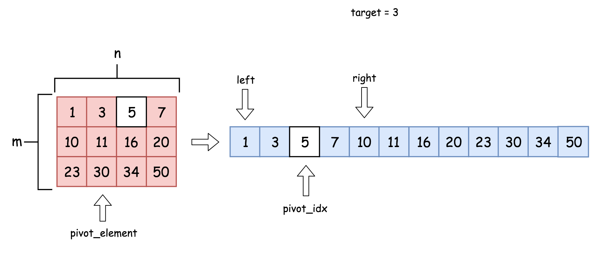
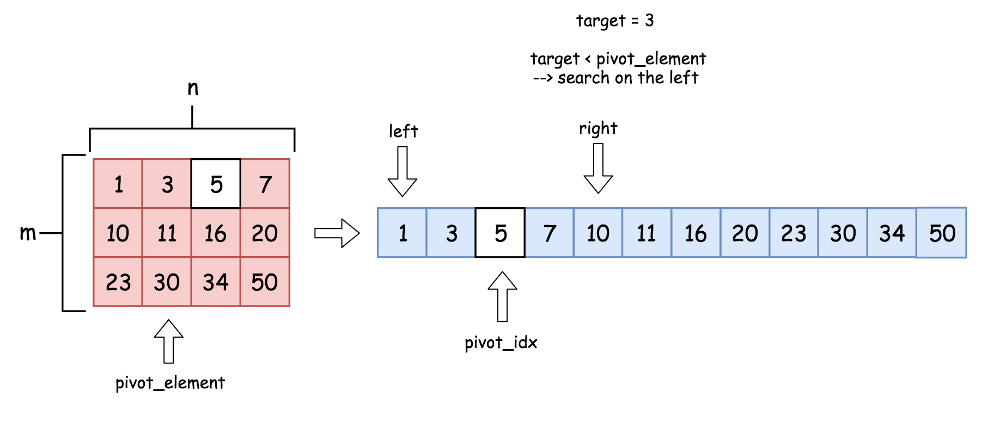
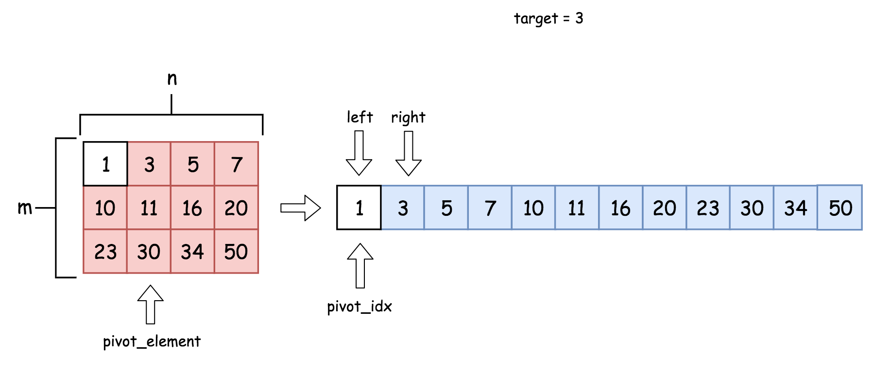
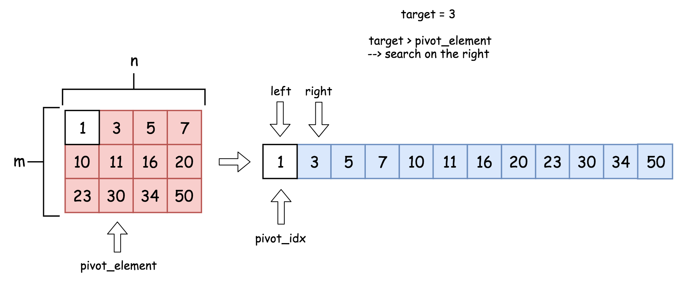
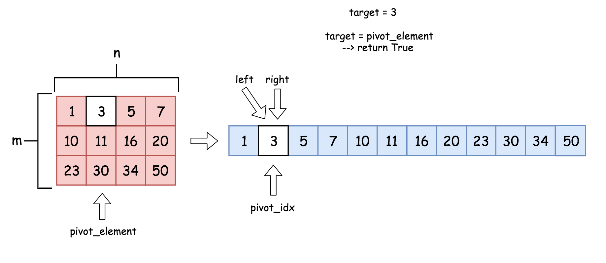

[TOC]

## Solution

---

### Approach 1: Binary Search

**Intuition**

One could notice that the input matrix `m x n` could be considered as a sorted array of length `m x n`.



Sorted array is a perfect candidate for the binary search because the element index in this _virtual_ array (_for sure we're not going to construct it for real_) could be easily transformed into the row and column in the initial matrix

> $row = idx // n$ and $col = idx \% n$.

**Algorithm**

The algorithm is a standard binary search :

* Initialise left and right indexes $left = 0$ and $right = m x n - 1$.

* While $left \le right$ :

* Pick up the index in the middle of the virtual array as a pivot index: $\text{pivot}_{idx} = (left + right) / 2$.

* The index corresponds to $row = \text{pivot}_{idx} // n$ and $col = \text{pivot}_{idx} \% n$ in the initial matrix, and hence one could get the $\text{pivot}_{element}$. This element splits the virtual array into two parts.

* Compare $\text{pivot}_{element}$ and `target` to identify in which part one has to look for `target`.

**Implementation**














```python
class Solution:
    def searchMatrix(self, matrix: List[List[int]], target: int) -> bool:
        m = len(matrix)
        if m == 0:
            return False
        n = len(matrix[0])

        # binary search
        left, right = 0, m * n - 1
        while left <= right:
            pivot_idx = (left + right) // 2
            pivot_element = matrix[pivot_idx // n][pivot_idx % n]
            if target == pivot_element:
                return True
            else:
                if target < pivot_element:
                    right = pivot_idx - 1
                else:
                    left = pivot_idx + 1
        return False
```

**Complexity Analysis**

* Time complexity : $\mathcal{O}(\log(m n))$ since it's a standard binary search.

* Space complexity : $\mathcal{O}(1)$.

---