## Solution

---

### Approach 1: One Pass

**Intuition**

The problem is known as [Dutch National Flag Problem](https://en.wikipedia.org/wiki/Dutch_national_flag_problem) and first was proposed by [Edsger W. Dijkstra](https://en.wikipedia.org/wiki/Edsger_W._Dijkstra). The idea is to attribute a color to each number and then arrange them following the order of colors on the Dutch flag.

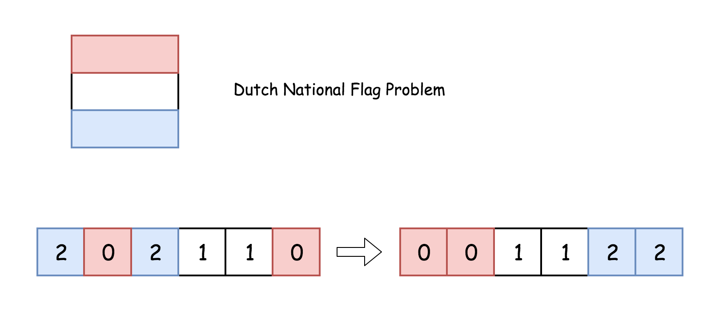

Let's use a three-pointer to track the rightmost boundary of zeros, the leftmost boundary of twos, and the current element under consideration.

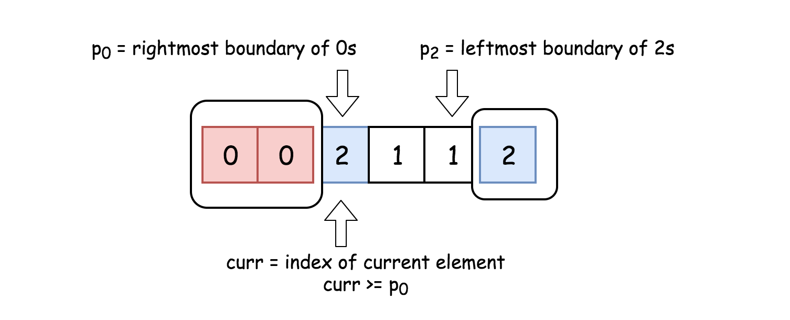

The idea of a solution is to move `curr` pointer along the array, if $\text{nums}[curr] = 0$ - swap it with $\text{nums}[p0]$, if $\text{nums}[curr] = 2$ - swap it with $\text{nums}[p2]$.

**Algorithm**

- Initialise the rightmost boundary of zeros: $p0 = 0$. During the algorithm execution $nums[idx < p0] = 0$.

- Initialise the leftmost boundary of twos: $p2 = n - 1$. During the algorithm execution $nums[idx > p2] = 2$.

- Initialise the index of the current element to consider: $curr = 0$.

- While $curr \le p2$ :

- If $\text{nums}[curr] = 0$: swap `curr`th and `p0`th elements and move both pointers to the right.

- If $\text{nums}[curr] = 2$: swap `curr`th and `p2`th elements. Move pointer `p2` to the left.

- If $\text{nums}[curr] = 1$: move pointer `curr` to the right.

**Implementation**

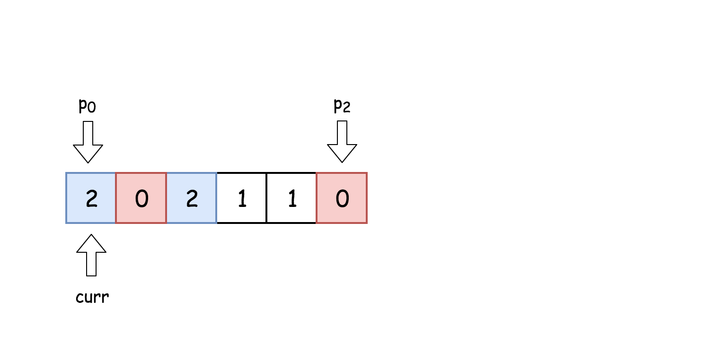

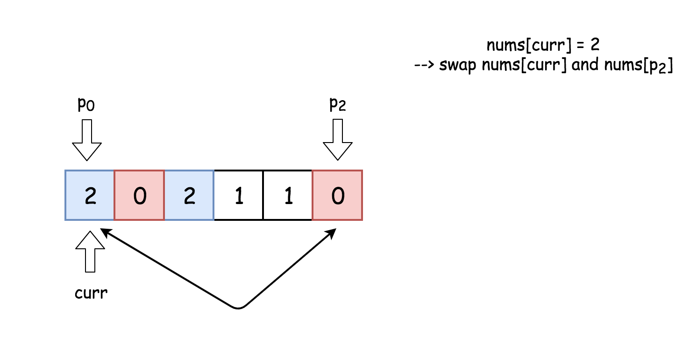

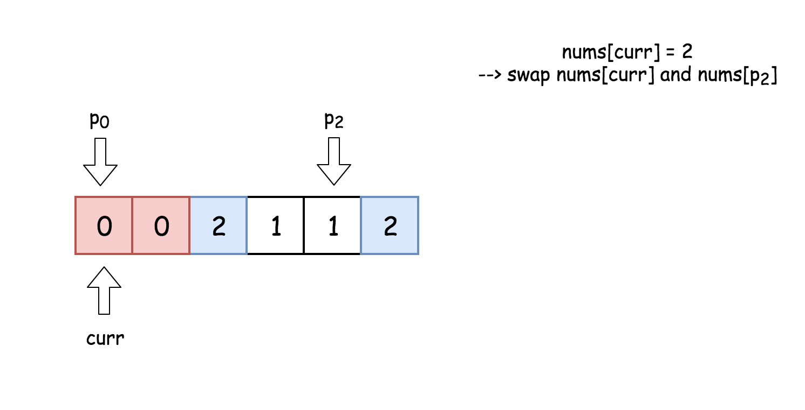

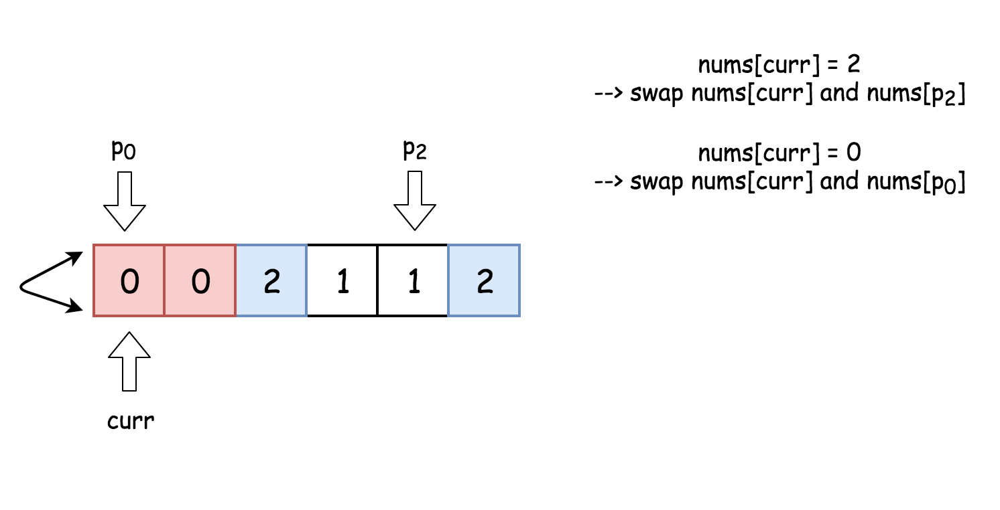

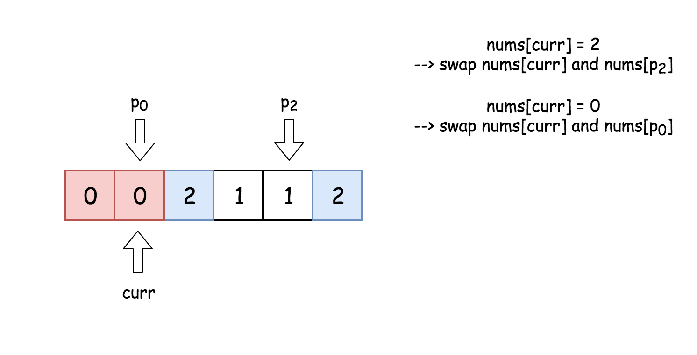

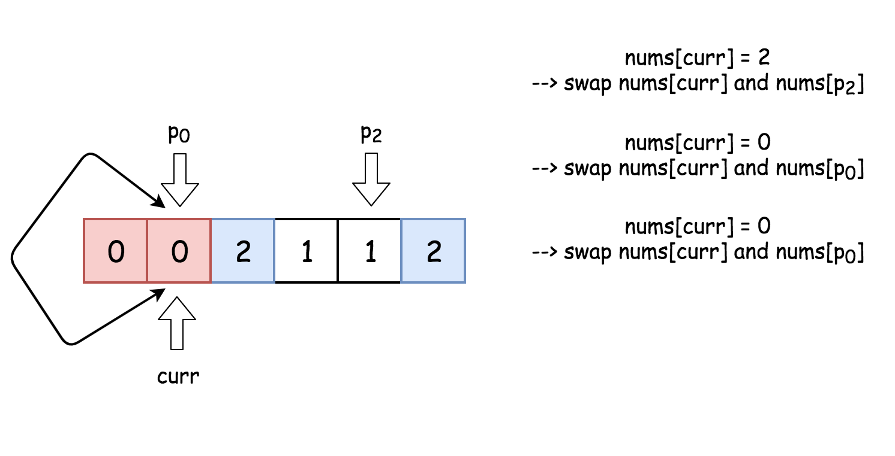

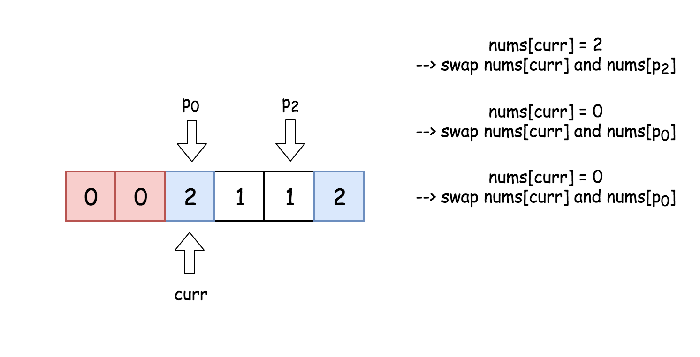

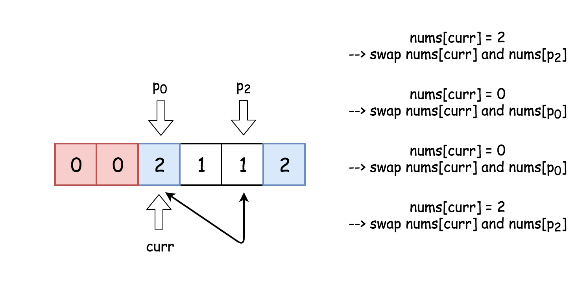

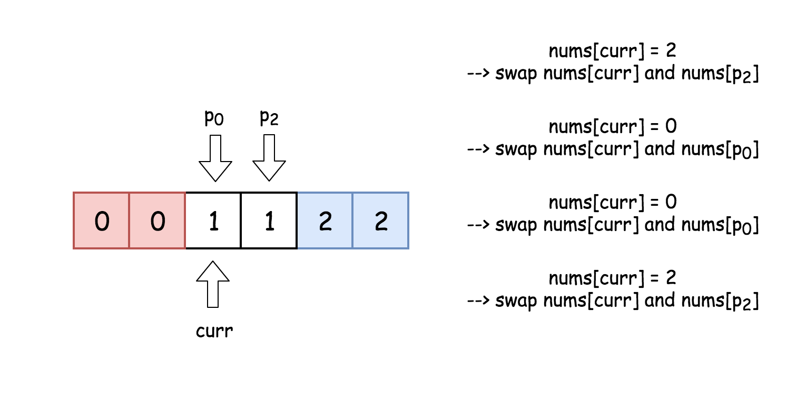

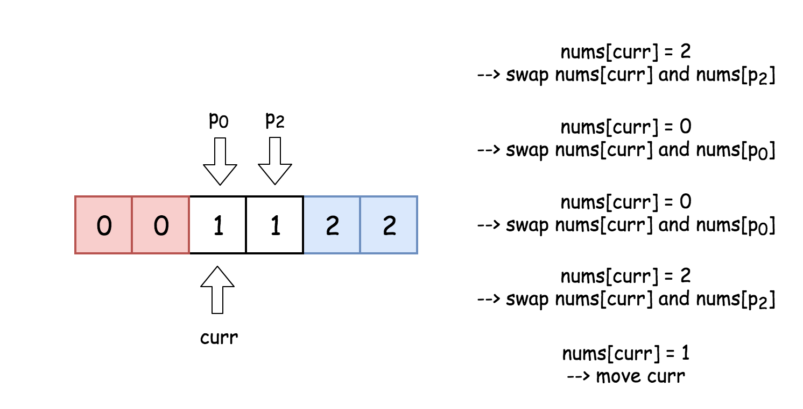

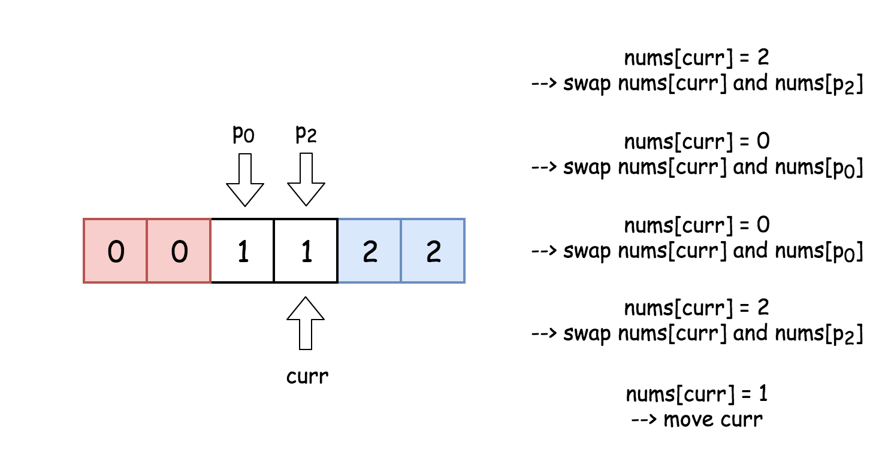

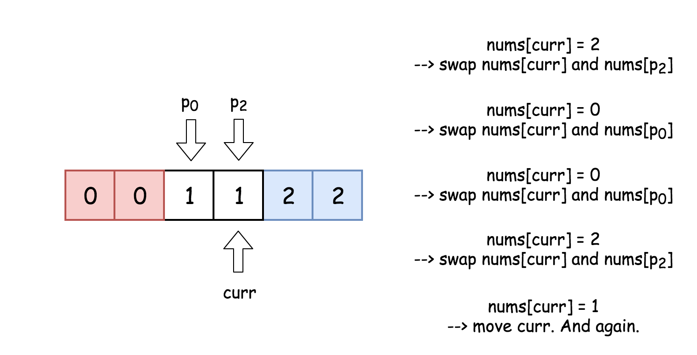

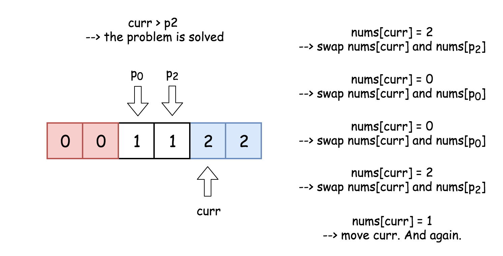

```python
class Solution:
    def sortColors(self, nums: List[int]) -> None:
        """
        Dutch National Flag problem solution.
        """
        # For all idx < p0 : nums[idx < p0] = 0
        # curr is an index of elements under consideration
        p0 = curr = 0

        # For all idx > p2 : nums[idx > p2] = 2
        p2 = len(nums) - 1

        while curr <= p2:
            if nums[curr] == 0:
                nums[p0], nums[curr] = nums[curr], nums[p0]
                p0 += 1
                curr += 1
            elif nums[curr] == 2:
                nums[curr], nums[p2] = nums[p2], nums[curr]
                p2 -= 1
            else:
                curr += 1
```

**Complexity Analysis**

* Time complexity : $\mathcal{O}(N)$ since it's one pass along the array of length $N$.

* Space complexity : $\mathcal{O}(1)$ since it's a constant space solution.