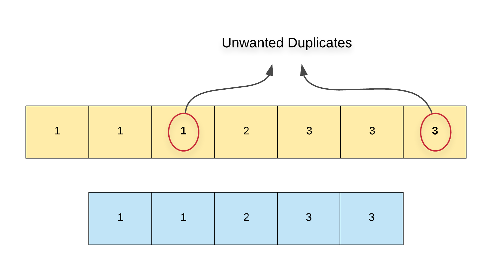
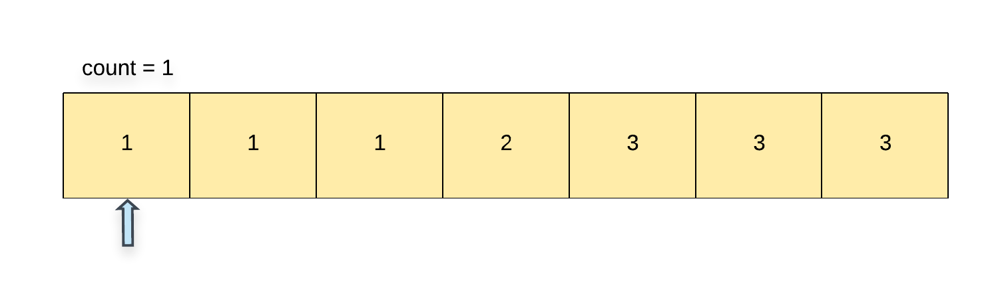
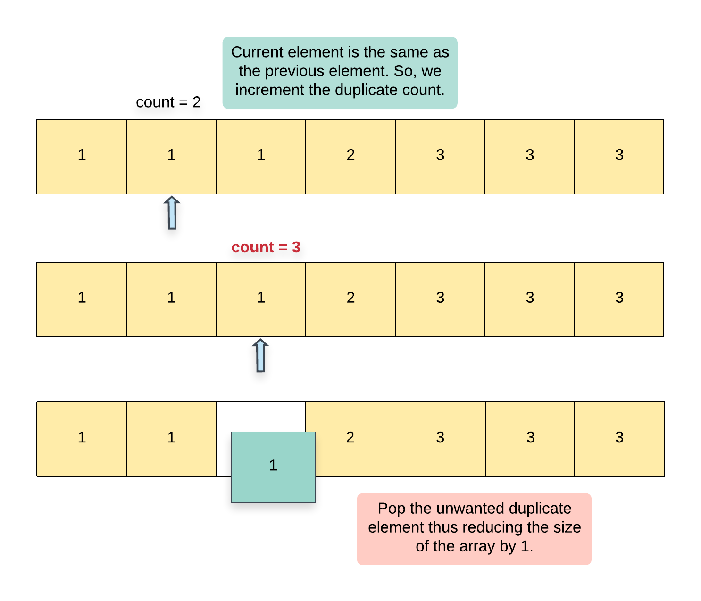
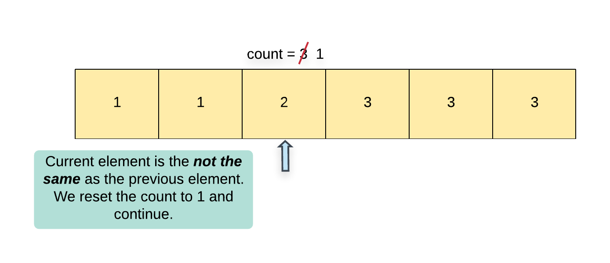
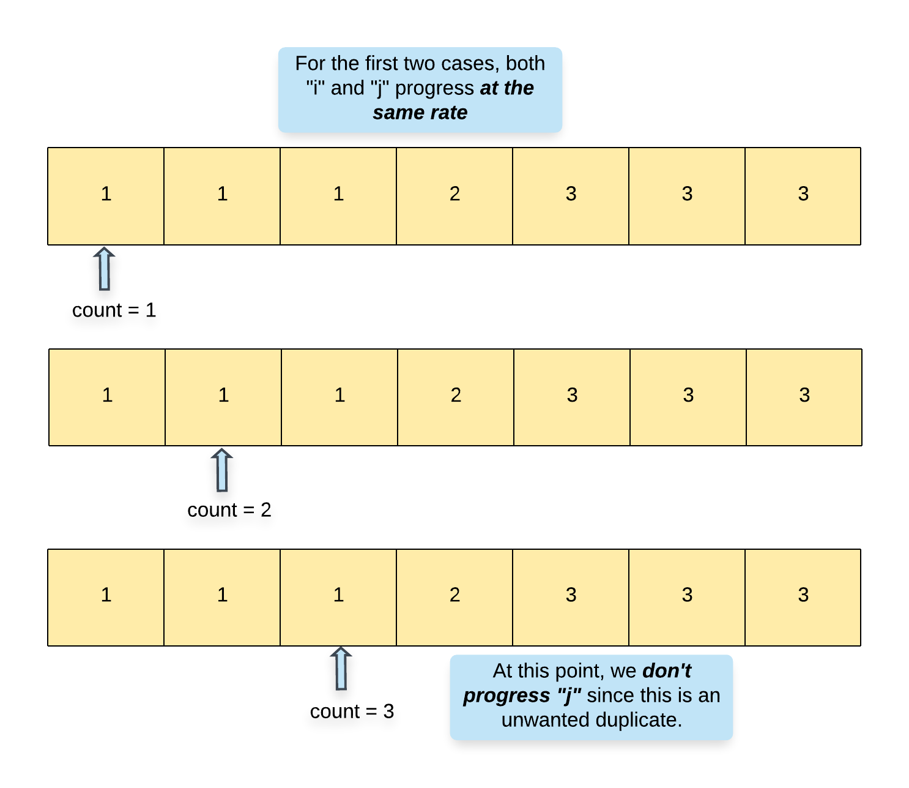
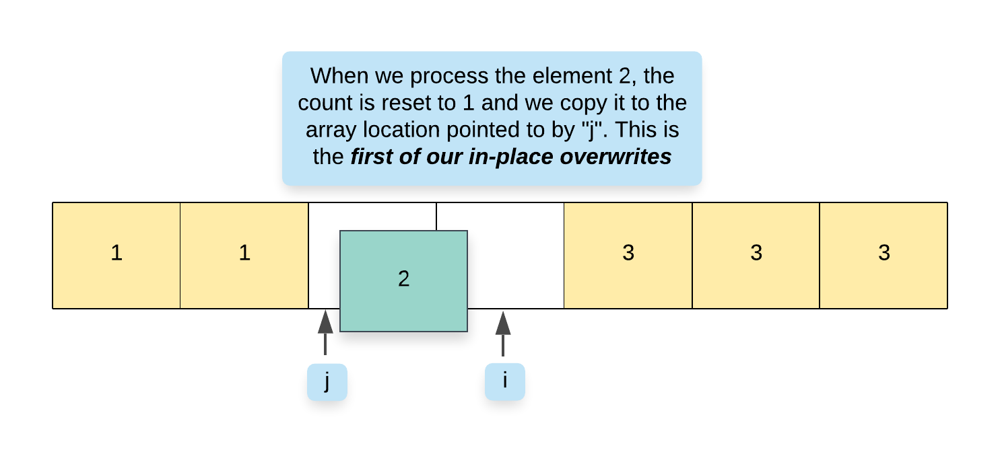
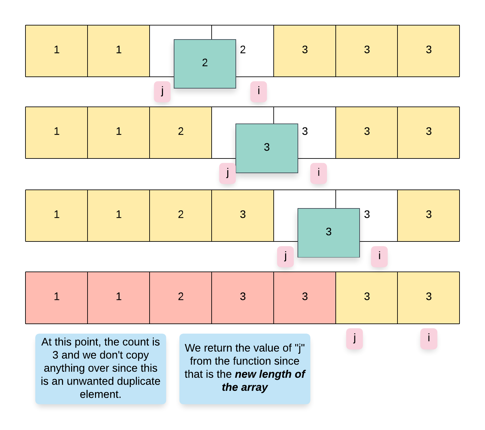

## Solution

### Approach 1: Popping Unwanted Duplicates

**Intuition**

The input array is already sorted and hence, all the duplicates appear next to each other. The problem statement mentions that we are not allowed to use any additional space and we have to modify the array in-place. The easiest approach for in-place modifications would be to get rid of all the unwanted duplicates. For every number in the array, if we detect `> 2` duplicates, we simply remove them from the list of elements and we do this for all the elements in the array.

<center>

</center>

**Algorithm**

1. The implementation is slightly tricky so to say since we will be removing elements from the array and iterating over it at the same time. So, we need to keep updating the array's indexes as and when we pop an element else we'll be accessing invalid indexes.
2. Say we have two variables, `i` which is the array pointer and `count` which keeps track of the count of a particular element in the array. Note that the minimum count would always be 1.

    <center>
    
    </center>

3. We start with index `1` and process one element at a time in the array.
4. If we find that the current element is the *same* as the previous element i.e. $\text{nums}[i] = nums[i - 1]$, then we increment the `count`. If the value of `count > 2`, then we have encountered an unwanted duplicate element and we can remove it from the array. Since we know the index of this element, we can use the `del` or `pop` or `remove` operation (or whatever corresponding operation is supported in your language of choice) to delete the element at index `i` from the array. Since we popped an element, we decrement the index by 1 as well.

    <center>
    
    </center>

5. If we encounter that the current element is *not* the same as the previous element i.e. $\text{nums}[i] \neq nums[i - 1]$, then it means we have a new element at hand and so accordingly, we update $count = 1$.

    <center>
    
    </center>

6. Since we are removing all the unwanted duplicates from the original array, the final array that remains after process all the elements will only contain the valid elements and hence we simply return the length of this array.

```python
class Solution:
    def removeDuplicates(self, nums: List[int]) -> int:
        # Check for edge case where list is empty
        if not nums:
            return 0

        # Pointer for current index in the list
        i = 1
        # Count of the current element occurrences
        count = 1

        # Iterate through the list starting from the second element
        while i < len(nums):
            # Check if the current element is same as the previous one
            if nums[i] == nums[i - 1]:
                # Increment count for the current element
                count += 1
                # If count exceeds 2, remove the current element
                if count > 2:
                    nums.pop(i)
                    i -= 1
                    count -= 1
            else:
                # Reset count for new element
                count = 1
            # Move to the next element
            i += 1

        # Return the new list length
        return len(nums)
```

**Complexity Analysis**

* Time Complexity: Let's see what the costly operations in our array are:
- We have to iterate over all the elements in the array. Suppose that the original array contains `N` elements, the time taken here would be $O(N)$.
- Next, for every unwanted duplicate element, we will have to perform a delete operation and deletions in arrays are also $O(N)$.
- The worst case would be when all the elements in the array are the same. In that case, we would be performing $N - 2$ deletions thus giving us $O(N^2)$ complexity for deletions
- Overall complexity = $O(N) +$\mathcal{O}(N^2)$\equiv O(N^2)$.
* Space Complexity: $O(1)$ since we are modifying the array in-place.
<br>
<br>

---
### Approach 2: Overwriting unwanted duplicates

**Intuition**

The second approach is really inspired by the fact that the problem statement asks us to return the *new length of the array* from the function. If all we had to do was *remove elements*, the function would not really ask us to return the updated length. However, in our scenario, this is really an indication that we don't need to actually remove elements from the array. Instead, we can do something better and simply overwrite the duplicate elements that are unwanted.

> We won't be able to achieve this using a single pointer. We will be using a two-pointer approach where one pointer iterates over the original set of elements and another one that keeps track of the next "empty" location in the array or the next location that can be overwritten in the array.

**Algorithm**

1. We define two pointers, `i` and `j` for our algorithm. The pointer `i` iterates of the array processing one element at a time and `j` keeps track of the next location in the array where we can overwrite an element.
2. We also keep a variable `count` which keeps track of the count of a particular element in the array. Note that the minimum count would always be 1.
3. We start with index `1` and process one element at a time in the array.
4. If we find that the current element is the *same* as the previous element i.e. $\text{nums}[i] = nums[i - 1]$, then we increment the `count`. If the value of `count > 2`, then we have encountered an unwanted duplicate element. In this case, we simply move forward i.e. we increment `i` but not `j`.
5. However, if the count is $\le 2$, then we can move the element from index `i` to index `j`.

    <center>
    
    </center>

6. If we encounter that the current element is *not* the same as the previous element i.e. $\text{nums}[i] \neq nums[i - 1]$, then it means we have a new element at hand and so accordingly, we update $count = 1$ and also move this element to index `j`.

    <center>
    
    </center>

7. It goes without saying that whenever we copy a new element to $\text{nums}[j]$, we have to update the value of `j` as well since `j` always points to the location where the next element can be copied to in the array.

    <center>
    
    </center>

```python
class Solution:
    def removeDuplicates(self, nums: List[int]) -> int:
        if not nums:
            return 0

        i = 1
        j = 1
        count = 1

        while i < len(nums):
            if nums[i] == nums[i - 1]:
                count += 1
                if count > 2:
                    i += 1
                    continue
            else:
                count = 1
            nums[j] = nums[i]
            j += 1
            i += 1

        del nums[j:]
        return len(nums)
```

**Complexity Analysis**

* Time Complexity: $O(N)$ since we process each element exactly once.
* Space Complexity: $O(1)$.
<br>
<br>