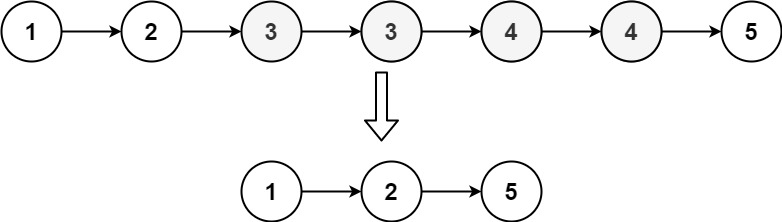
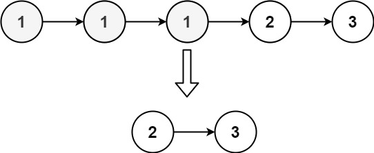

## Description

Given the `head` of a sorted linked list, *delete all nodes that have duplicate numbers, leaving only distinct numbers from the original list*. Return *the linked list **sorted** as well*.
### Function Contract

**Inputs**

- `head`: The first node of an ascending linked list, or `null` for an empty list.

**Return value**

Return the head of the sorted list containing exactly those original values that occurred once.

### Examples
#### Example 1

- **Input:** $head = [1,2,3,3,4,4,5]$
- **Output:** `[1,2,5]`
#### Example 2

- **Input:** $head = [1,1,1,2,3]$
- **Output:** `[2,3]`
### Constraints

- The number of nodes in the list is in the range `[0, 300]`.

- $-100 \le \text{Node.val} \le 100$

- The list is guaranteed to be **sorted** in ascending order.