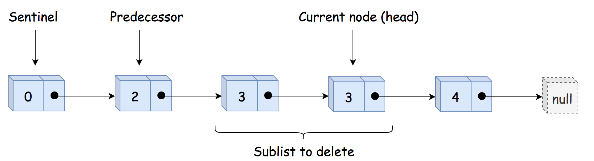
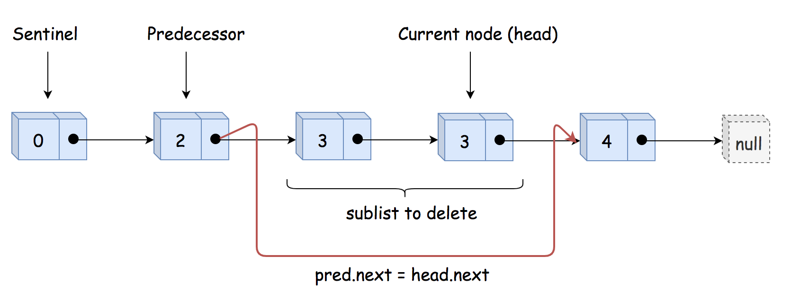

## Solution

---

### Approach 1: Sentinel Head + Predecessor

**Sentinel Head**

Let's start from the most challenging situation: the list head is to be removed.


*Figure 1. The list head is to be removed.*

The standard way to handle this use case is to use the so-called [Sentinel Node](https://en.wikipedia.org/wiki/Sentinel_node). Sentinel nodes are widely used for trees and linked lists such as pseudo-heads, pseudo-tails, etc. They are purely functional and usually don't hold any data. Their primary purpose is to standardize the situation to avoid edge case handling.

For example, let's use here a pseudo-head with zero value to ensure that the situation "delete the list head" could never happen, and all nodes to delete are "inside" the list.

**Delete Internal Nodes**

The input list is sorted, and we can determine if a node is a duplicate by comparing its value to the node *after* it in the list. Step by step, we could identify the current sublist of duplicates.

Now it's time to delete it using pointer manipulations. Note that the first node in the duplicates sublist should be removed as well. That means that we have to track the predecessor of the duplicates sublist, *i.e.*, the last node *before* the sublist of duplicates.


*Figure 2. The sentinel head, the predecessor, and the sublist of duplicates to delete.*

Having predecessor, we skip the entire duplicate sublist and make the predecessor point to the node *after* the sublist.


*Figure 2. Delete the sublist of duplicates.*

**Implementation**

```python
class Solution:
    def deleteDuplicates(self, head: ListNode) -> ListNode:
        # sentinel
        sentinel = ListNode(0, head)

        # predecessor = the last node
        # before the sublist of duplicates
        pred = sentinel

        while head:
            # If it's the beginning of a duplicates sublist
            # skip all duplicates
            if head.next and head.val == head.next.val:
                # move till the end of duplicates sublist
                while head.next and head.val == head.next.val:
                    head = head.next

                # Skip all duplicates
                pred.next = head.next

            # Otherwise, move predecessor
            else:
                pred = pred.next

            # move forward
            head = head.next

        return sentinel.next
```

**Complexity Analysis**

* Time complexity: $\mathcal{O}(N)$ since it's one pass along the input list.

* Space complexity: $\mathcal{O}(1)$ because we don't allocate any additional data structure.