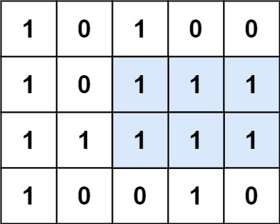

### 1. Description

Given a `rows x cols` binary `matrix` filled with `0`'s and `1`'s, find the largest rectangle containing only `1`'s and return *its area*.

### 2. Function Contract

**Inputs**

- `matrix`: A non-empty rectangular grid of `"0"` and `"1"` characters.

**Return value**

Return the maximum number of cells in an axis-aligned all-`1` rectangle.

### 3. Examples

#### Example 1

- **Input:** $matrix = [["1","0","1","0","0"],["1","0","1","1","1"],["1","1","1","1","1"],["1","0","0","1","0"]]$
- **Output:** `6`
- **Explanation:** The maximal rectangle is shown in the above picture.

#### Example 2

- **Input:** $matrix = [["0"]]$
- **Output:** `0`

#### Example 3

- **Input:** $matrix = [["1"]]$
- **Output:** `1`

### 4. Constraints

- $rows = \text{matrix.length}$

- $cols = \text{matrix}[i].length$

- $1 \le rows, cols \le 200$

- $\text{matrix}[i][j]$ is `'0'` or `'1'`.
