[TOC]

## Solution

---

### Approach 1: Brute Force

**Algorithm**

Trivially we can enumerate every possible rectangle. This is done by iterating over all possible combinations of coordinates `(x1, y1)` and `(x2, y2)` and letting them define a rectangle with the coordinates being opposite corners. This is too slow to pass all test cases.

**Complexity Analysis**

* Time complexity : $O(N^3M^3)$, with `N` being the number of rows and `M` the number of columns.

    Iterating over all possible coordinates is $O(N^2M^2)$, and iterating over the rectangle defined by two coordinates is an additional $O(NM)$. $O(NM) *$\mathcal{O}(N^2M^2)$= O(N^3M^3)$.

* Space complexity : $O(1)$.

---

### Approach 2: Dynamic Programming - Better Brute Force on Histograms

**Algorithm**

We can compute the maximum width of a rectangle that ends at a given coordinate in constant time. We do this by keeping track of the number of consecutive ones each square in each row. As we iterate over each row we update the maximum possible width at that point. This is done using $\text{row}[i] = row[i - 1] + 1 if \text{row}[i] = '1'$.

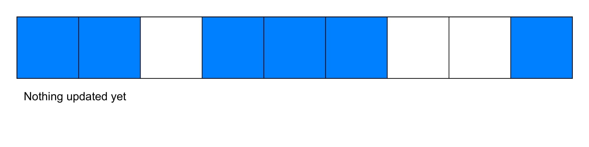

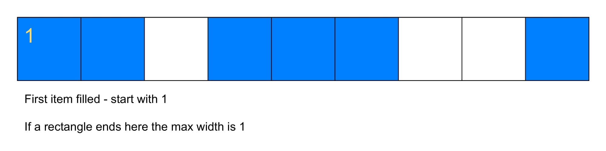

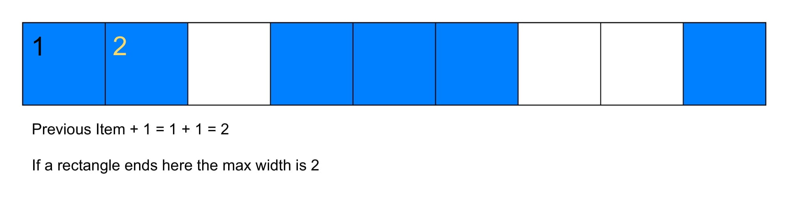

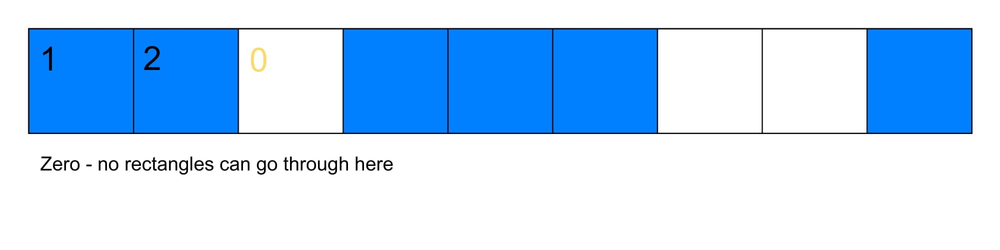


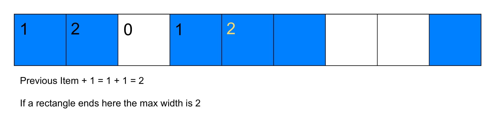

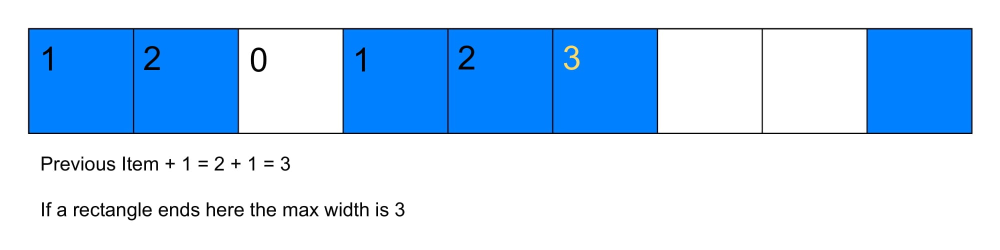

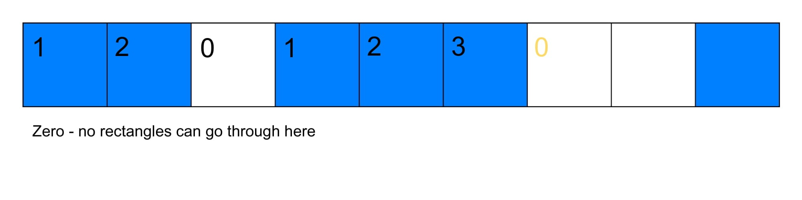

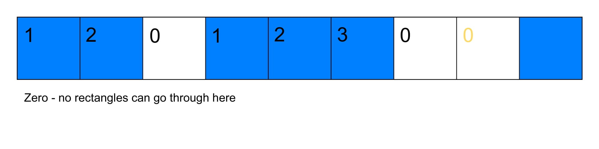

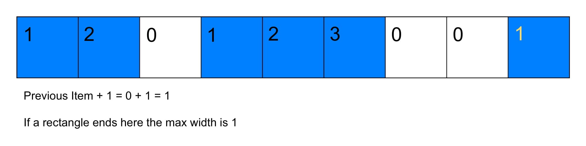

Once we know the maximum widths for each point above a given point, we can compute the maximum rectangle with the lower right corner at that point in linear time. As we iterate up the column, we know that the maximal width of a rectangle spanning from the original point to the current point is the running minimum of each maximal width we have encountered.

We define:

$maxWidth = min(maxWidth, widthHere)$

$curArea = maxWidth * (currentRow - originalRow + 1)$

$maxArea = max(maxArea, curArea)$

The following animation makes this more clear. Given the maximal width of all points above it, let's calculate the maximum area of any rectangle at the bottom yellow square:

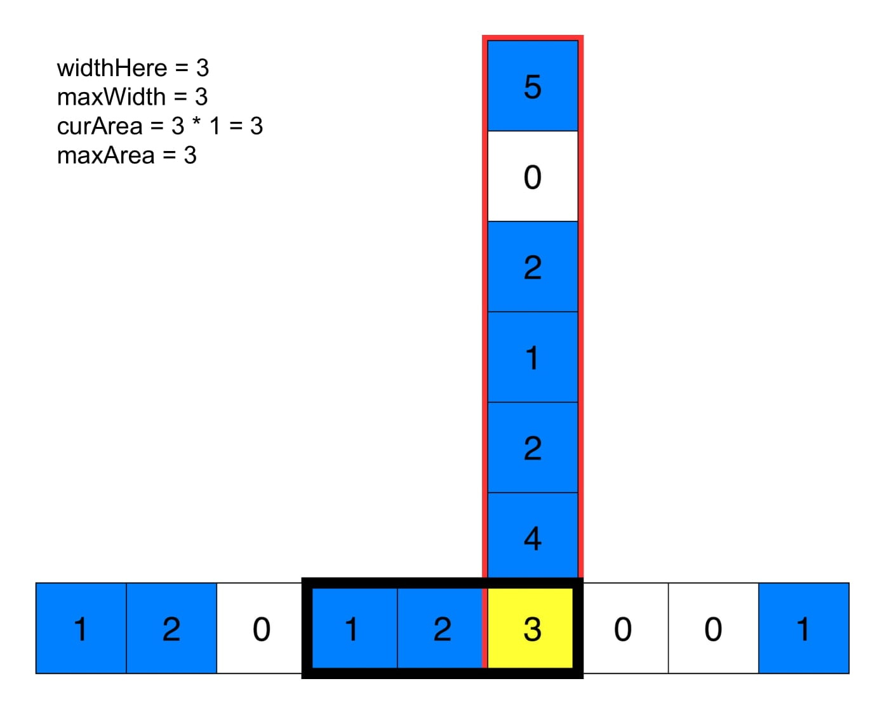

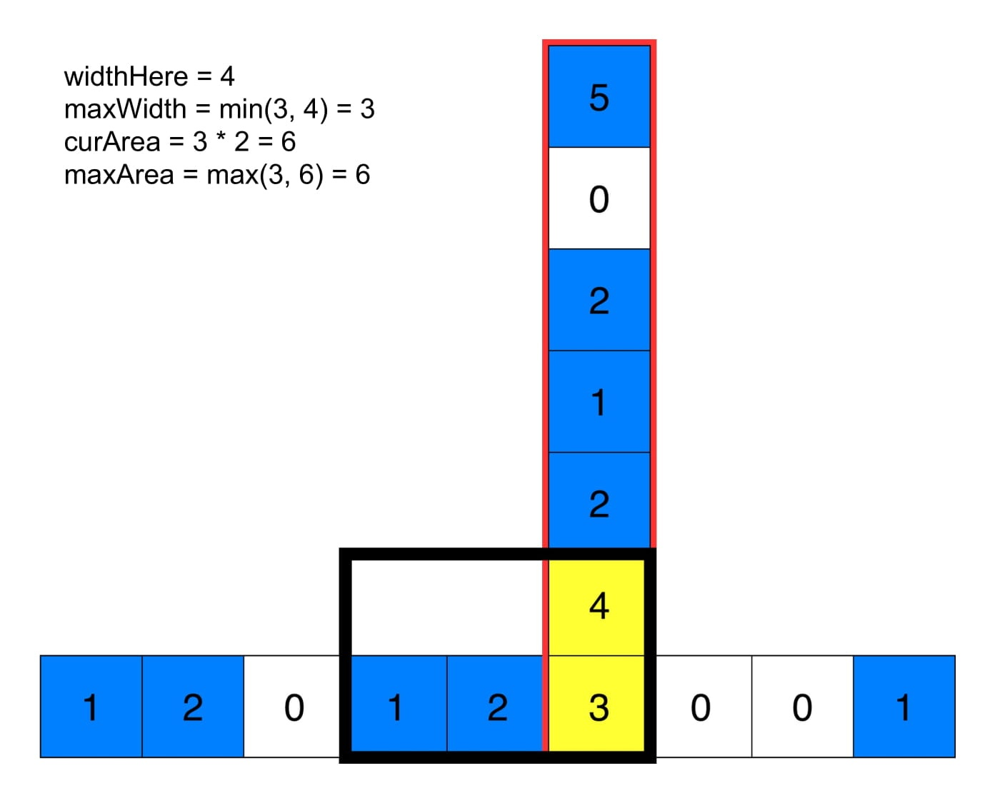

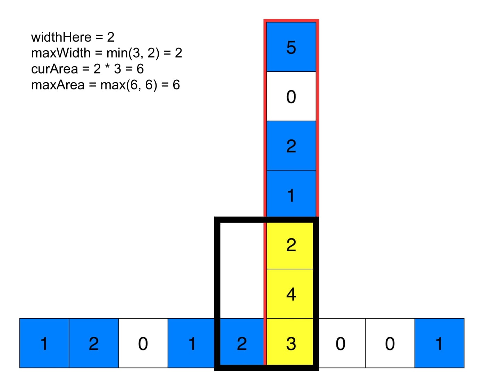

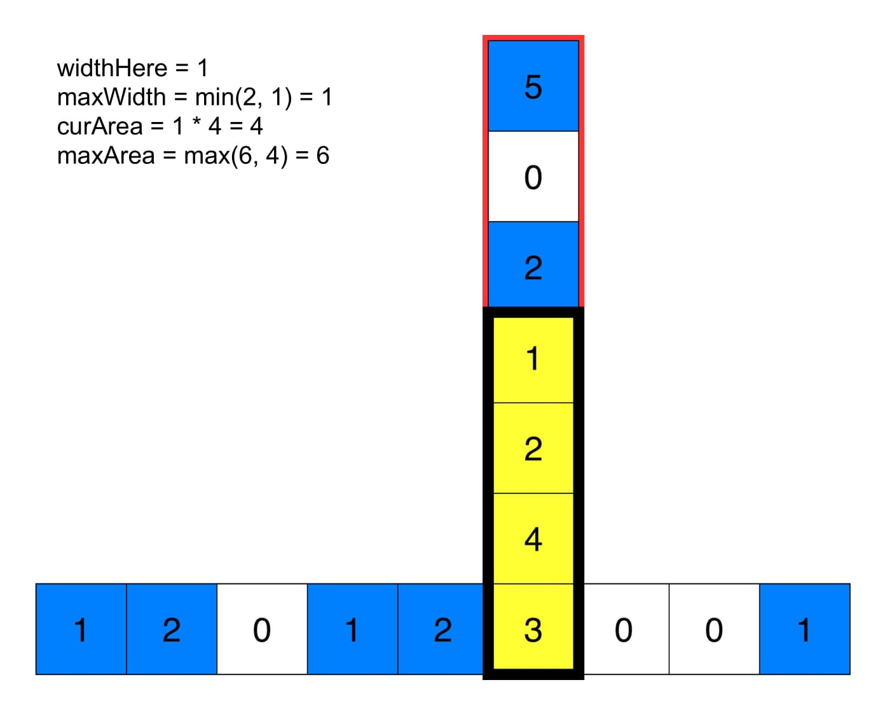

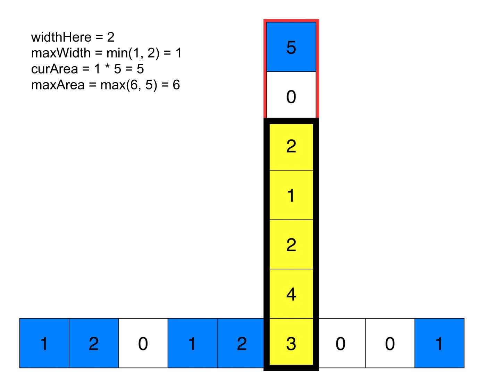

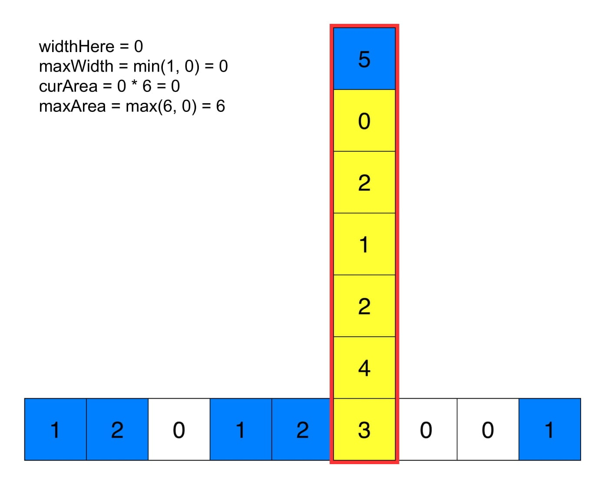

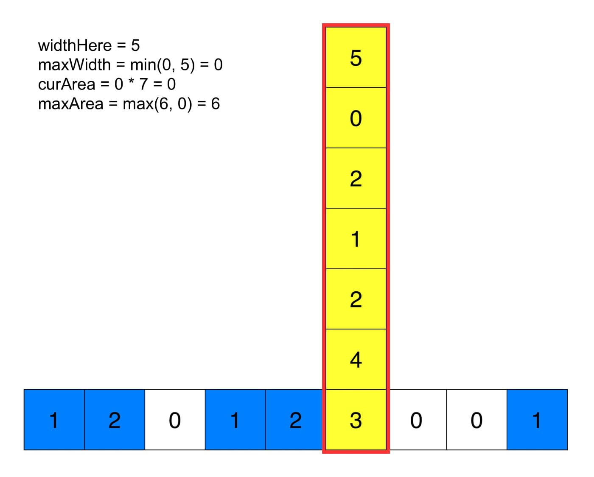

Repeating this process for every point in our input gives us the global maximum.

Note that our method of precomputing our maximum width essentially breaks down our input into a set of histograms, with each column being a new histogram. We are computing the maximal area for each histogram.

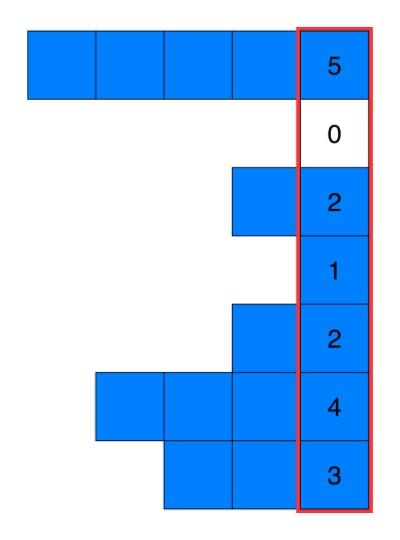

As a result, the above approach is essentially a repeated use of the better brute force approach detailed in [84 - Largest Rectangle in Histogram](https://leetcode.com/problems/largest-rectangle-in-histogram/solution/).

```python
class Solution:
    def maximalRectangle(self, matrix: List[List[str]]) -> int:
        maxarea = 0

        dp = [[0] * len(matrix[0]) for _ in range(len(matrix))]
        for i in range(len(matrix)):
            for j in range(len(matrix[0])):
                if matrix[i][j] == "0":
                    continue

                # compute the maximum width and update dp with it
                width = dp[i][j] = dp[i][j - 1] + 1 if j else 1

                # compute the maximum area rectangle with a lower right corner at [i, j]
                for k in range(i, -1, -1):
                    width = min(width, dp[k][j])
                    maxarea = max(maxarea, width * (i - k + 1))
        return maxarea
```

**Complexity Analysis**

* Time complexity : $O(N^2M)$. Computing the maximum area for one point takes $O(N)$ time, since it iterates over the values in the same column. This is done for all $N * M$ points, giving $O(N) *$\mathcal{O}(NM)$= O(N^2M)$.

* Space complexity : $O(NM)$. We allocate an equal sized array to store the maximum width at each point.

---

### Approach 3: Using Histograms - Stack

**Algorithm**

In the previous approach we discussed breaking the input into a set of histograms - one histogram representing the substructure at each column. To compute the maximum area in our rectangle, we merely have to compute the maximum area of each histogram and find the global maximum (note that the below approach builds a histogram for each row instead of each column, but the idea is still the same).

Since [Largest Rectangle in Histogram](https://leetcode.com/problems/largest-rectangle-in-histogram/) is already a problem on leetcode, we can just borrow the fastest stack-based solution [here](https://leetcode.com/problems/largest-rectangle-in-histogram/solution/) and apply it onto each histogram we generate. For an in-depth explanation on how the Largest Rectangle in Histogram algorithm works, please use the links above.

```python
class Solution:

    # Get the maximum area in a histogram given its heights
    def leetcode84(self, heights):
        stack = [-1]

        maxarea = 0
        for i in range(len(heights)):

            while stack[-1] != -1 and heights[stack[-1]] >= heights[i]:
                maxarea = max(
                    maxarea, heights[stack.pop()] * (i - stack[-1] - 1)
                )
            stack.append(i)

        while stack[-1] != -1:
            maxarea = max(
                maxarea, heights[stack.pop()] * (len(heights) - stack[-1] - 1)
            )
        return maxarea

    def maximalRectangle(self, matrix: List[List[str]]) -> int:

        if not matrix:
            return 0

        maxarea = 0
        dp = [0] * len(matrix[0])
        for i in range(len(matrix)):
            for j in range(len(matrix[0])):

                # update the state of this row's histogram using the last row's histogram
                # by keeping track of the number of consecutive ones

                dp[j] = dp[j] + 1 if matrix[i][j] == "1" else 0

            # update maxarea with the maximum area from this row's histogram
            maxarea = max(maxarea, self.leetcode84(dp))
        return maxarea
```

Note that the code under the function `leetcode84` is a direct copy paste from the final solution in [84 - Largest Rectangle in Histogram](https://leetcode.com/problems/largest-rectangle-in-histogram/solution/).

**Complexity Analysis**

* Time complexity : $O(NM)$. Running `leetcode84` on each row takes `M` (length of each row) time. This is done `N` times for $O(NM)$.

* Space complexity : $O(M)$. We allocate an array the size of the the number of columns to store our widths at each row.

---

### Approach 4: Dynamic Programming - Maximum Height at Each Point

**Intuition**

Imagine an algorithm where for each point we computed a rectangle by doing the following:

 * Finding the maximum height of the rectangle by iterating upwards until a 0 is reached

 * Finding the maximum width of the rectangle by iterating outwards left and right until a height that doesn't accommodate the maximum height of the rectangle

 For example finding the rectangle defined by the yellow point:

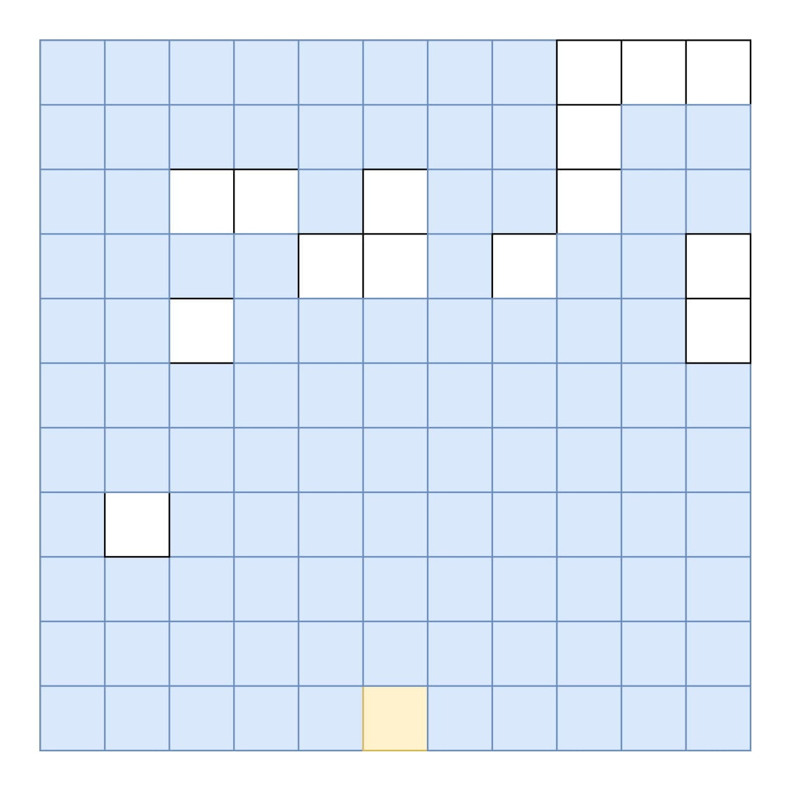


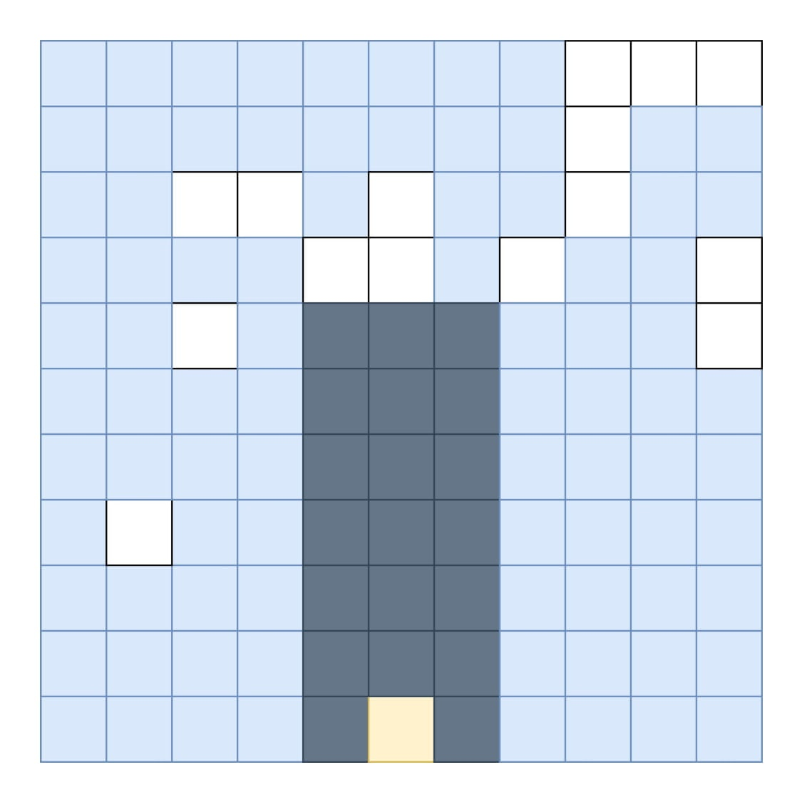

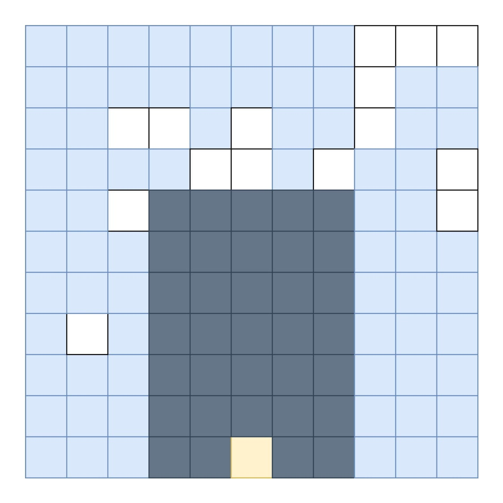

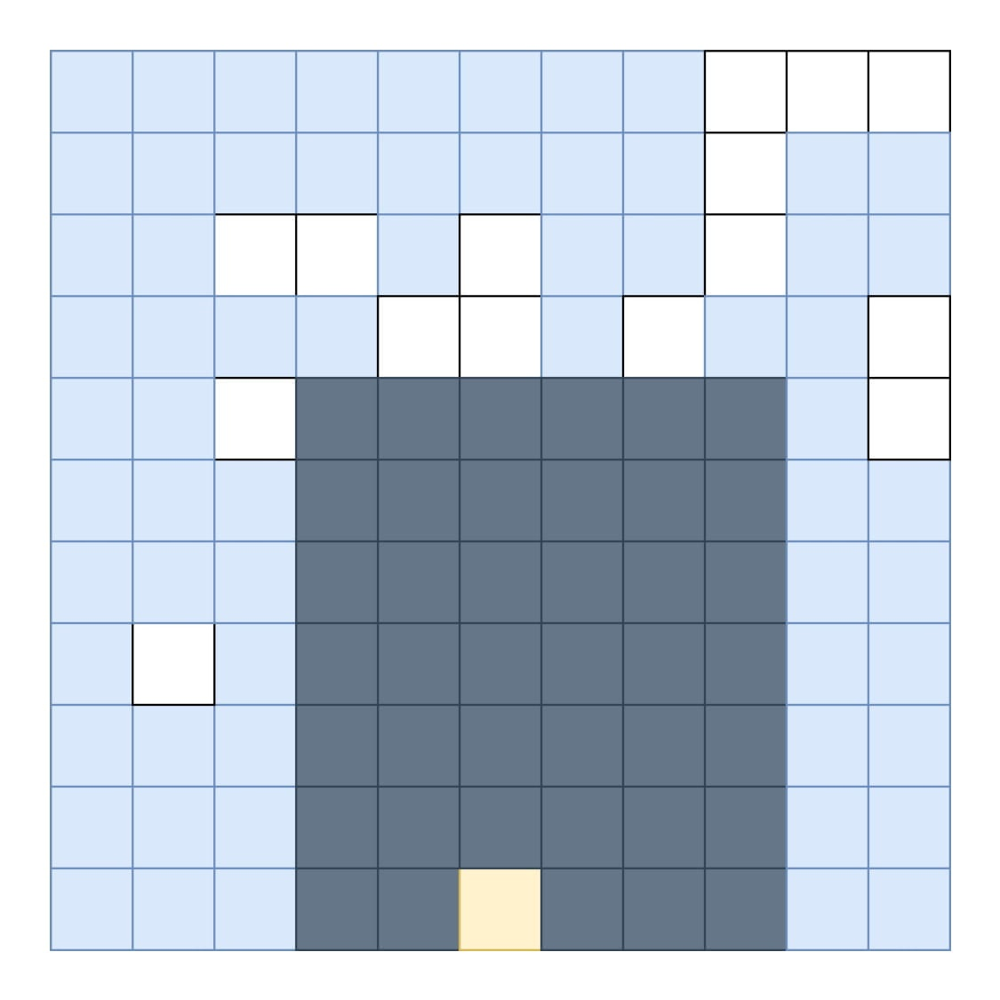

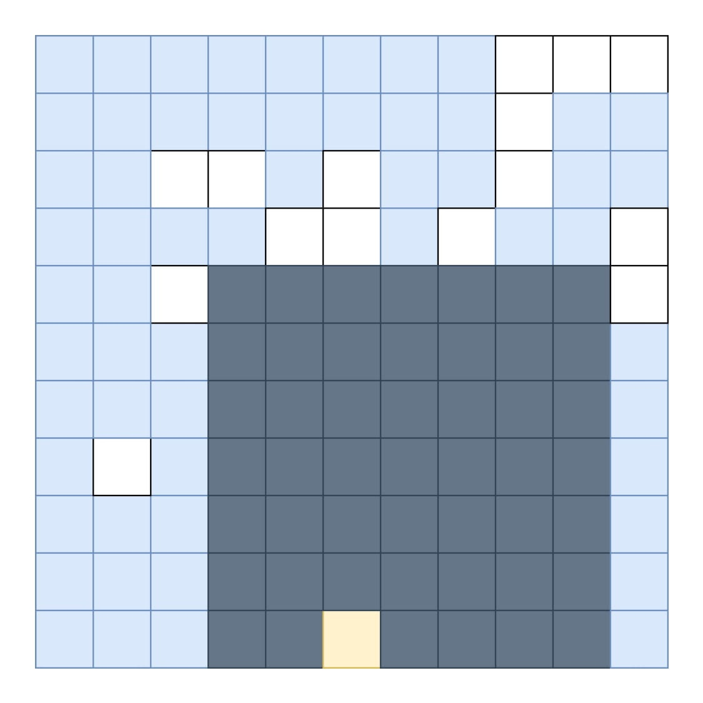

 We know that the maximal rectangle must be one of the rectangles constructed in this manner.

 Given a maximal rectangle with height `h`, left bound `l`, and right bound `r`, there must be a point on the interval `[l, r]` on the rectangle's base where the number of consecutive ones (height) above the point is $\le h$. If this point exists, then the rectangle defined by the point in the above manner will be the maximal rectangle, as it will reach height `h` iterating upward and then expand to the bounds of `[l, r]` as all heights within those bounds must accommodate `h` for the rectangle to exist.

 If this point does not exist, then the rectangle cannot be maximum, as you would be able to create a bigger rectangle by simply increasing the height of original rectangle, since all heights on the interval `[l, r]` would be greater than `h`.

 As a result for each point you only need to compute `h`, `l`, and `r` - the height, left bound, and right bound of the rectangle it defines.

 Using dynamic programming, we can use the `h`, `l`, and `r` of each point in the previous row to compute the `h`, `l`, and `r` for every point in the next row in linear time.

**Algorithm**

Given row $\text{matrix}[i]$, we keep track of the `h`, `l`, and `r` of each point in the row by defining three arrays - `height`, `left`, and `right`.

$\text{height}[j]$ will correspond to the height of $\text{matrix}[i][j]$, and so on and so forth with the other arrays.

The question now becomes how to update each array.

Height:

This one is easy. `h` is defined as the number of continuous ones in a line from our point. We explored how to compute this in Approach 2 in one row with:

    row[j] = row[j - 1] + 1 if row[j] == '1'

We can just make a minor modification for it to work for us here:

    new_height[j] = old_height[j] + 1 if row[j] == '1' else 0

Left:

Consider what causes changes to the left bound of our rectangle. Since all instances of zeros occurring in the row above the current one have already been factored into the current version of `left`, the only thing that affects our `left` is if we encounter a zero in our current row.

As a result we can define:

    new_left[j] = max(old_left[j], cur_left)

$\text{cur}_{left}$ is one greater than rightmost occurrence of zero we have encountered. When we "expand" the rectangle to the left, we know it can't expand past that point, otherwise it'll run into the zero.

Right:

Here we can reuse our reasoning in `left` and define:

    new_right[j] = min(old_right[j], cur_right)

$\text{cur}_{right}$ is the leftmost occurrence of zero we have encountered. For the sake of simplicity, we don't decrement $\text{cur}_{right}$ by one (like how we increment $\text{cur}_{left}$) so we can compute the area of the rectangle with $\text{height}[j] * (\text{right}[j] - \text{left}[j])$ instead of $\text{height}[j] * (\text{right}[j] + 1 - \text{left}[j])$.

This means that _technically_ the base of the rectangle is defined by the half-open interval `[l, r)` instead of the closed interval `[l, r]`, and `right` is really one greater than right boundary. Although the algorithm will still work if we don't do this with `right`, doing it this way makes the area calculation a little cleaner.

Note that to keep track of our $\text{cur}_{right}$ correctly, we must iterate from right to left, so this is what is done when updating `right`.

With our `left`, `right`, and `height` arrays appropriately updated, all that there is left to do is compute the area of each rectangle.

Since we know the bounds and height of rectangle `j`, we can trivially compute it's area with $\text{height}[j] * (\text{right}[j] - \text{left}[j])$, and change our $\text{max}_{area}$ if we find that rectangle `j`'s area is greater.

```python
class Solution:

    def maximalRectangle(self, matrix: List[List[str]]) -> int:
        if not matrix:
            return 0

        m = len(matrix)
        n = len(matrix[0])

        left = [0] * n  # initialize left as the leftmost boundary possible
        right = [n] * n  # initialize right as the rightmost boundary possible
        height = [0] * n

        maxarea = 0

        for i in range(m):

            cur_left, cur_right = 0, n
            # update height
            for j in range(n):
                if matrix[i][j] == "1":
                    height[j] += 1
                else:
                    height[j] = 0
            # update left
            for j in range(n):
                if matrix[i][j] == "1":
                    left[j] = max(left[j], cur_left)
                else:
                    left[j] = 0
                    cur_left = j + 1
            # update right
            for j in range(n - 1, -1, -1):
                if matrix[i][j] == "1":
                    right[j] = min(right[j], cur_right)
                else:
                    right[j] = n
                    cur_right = j
            # update the area
            for j in range(n):
                maxarea = max(maxarea, height[j] * (right[j] - left[j]))

        return maxarea
```

The code and idea for the above solution originates from user [morrischen2008](https://leetcode.com/morrischen2008/).

**Complexity Analysis**

* Time complexity : $O(NM)$. In each iteration over `N` we iterate over `M` a constant number of times.

* Space complexity : $O(M)$. `M` is the length of the additional arrays we keep.