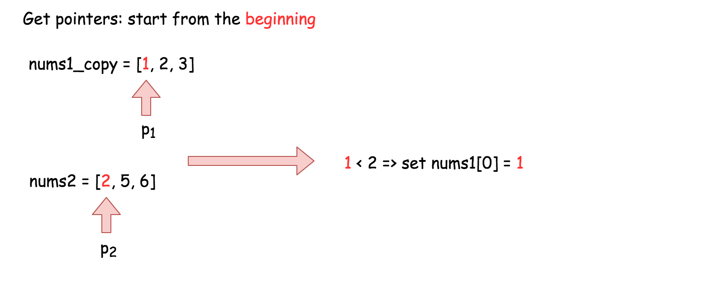
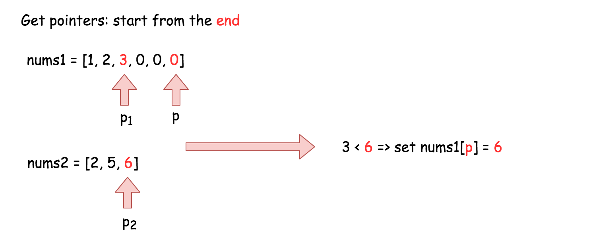
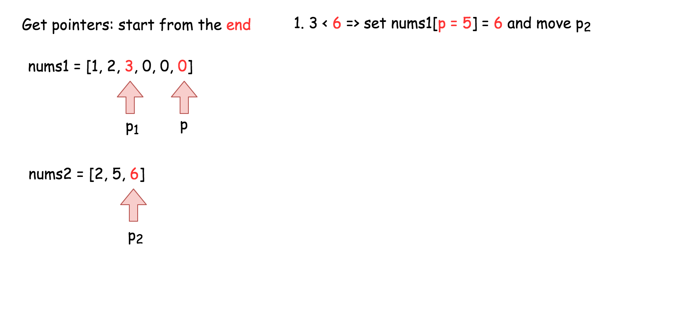
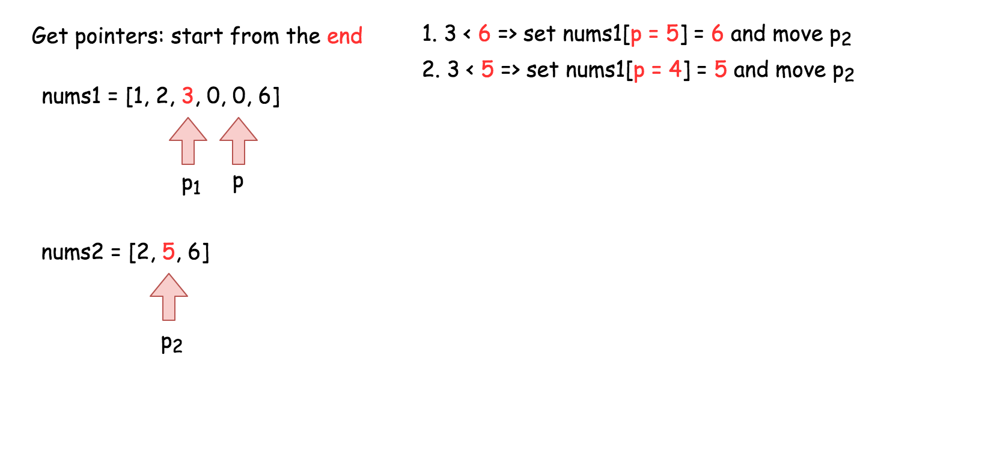
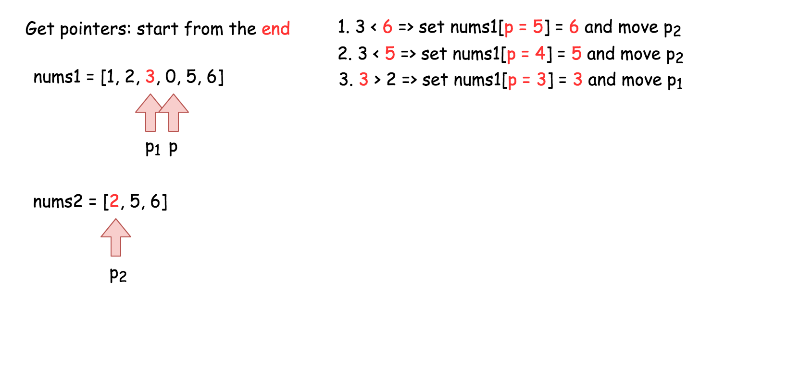
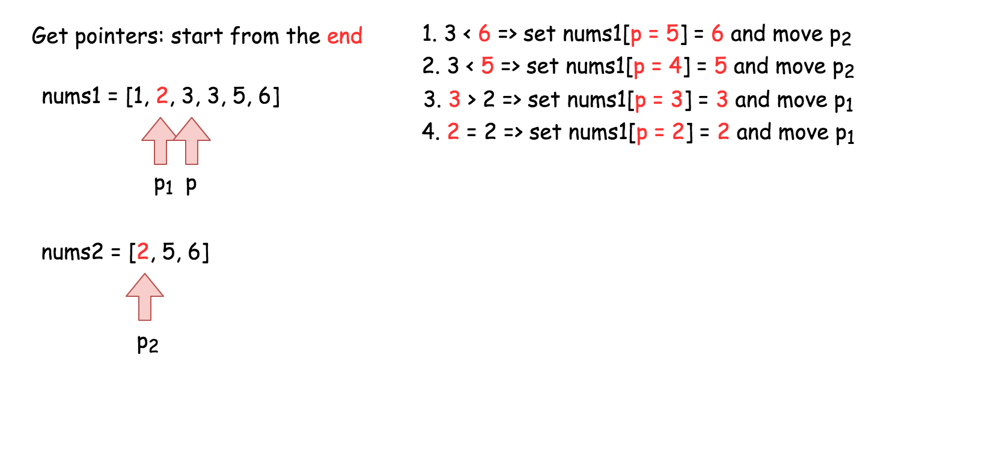
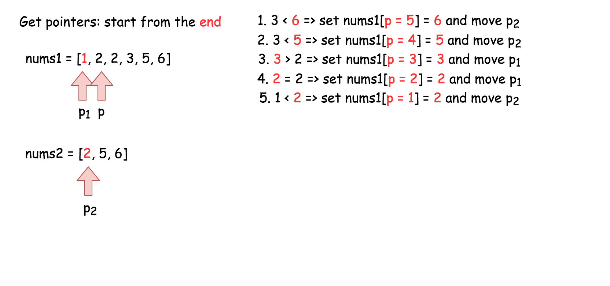
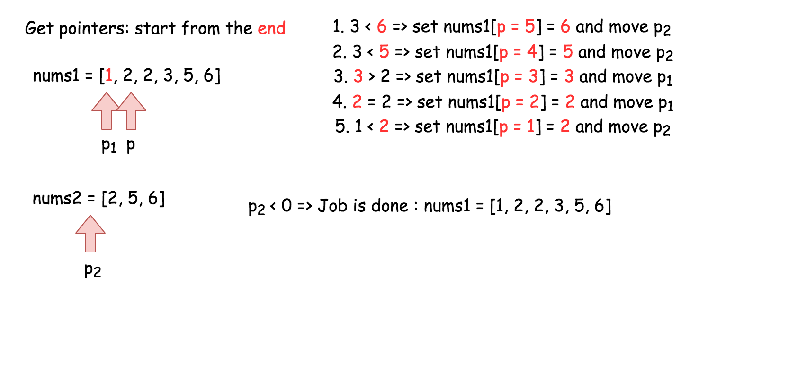

## Solution

---

### Approach 1: Merge and sort

**Intuition**

A naive approach would be to simply write the values from `nums2` into the end of `nums1`, and then sort `nums1`. Remember that we do not need to return a value, as we should modify `nums1` in-place. While straightforward to code, this approach has a high time complexity as we're not taking advantage of the existing sorting.

**Implementation**

```python
class Solution:
    def merge(self, nums1: List[int], m: int, nums2: List[int], n: int) -> None:
        """
        Do not return anything, modify nums1 in-place instead.
        """
        # Write the elements of num2 into the end of nums1.
        for i in range(n):
            nums1[i + m] = nums2[i]

        # Sort nums1 list in-place.
        nums1.sort()
```

* Time complexity: $\mathcal{O}((n + m)\log(n + m))$.

    The cost of sorting a list of length $x$ using a built-in sorting algorithm is $\mathcal{O}(x \log x)$. Because in this case, we're sorting a list of length $m + n$, we get a total time complexity of $\mathcal{O}((n + m) \log (n + m))$.

* Space complexity: $\mathcal{O}(n)$, but it can vary.

    Most programming languages have a built-in sorting algorithm that uses $\mathcal{O}(n)$ space.

<br />

---

### Approach 2: Three Pointers (Start From the Beginning)

**Intuition**

Because each array is already sorted, we can achieve an $\mathcal{O}(n + m)$ time complexity with the help of the _two-pointer technique_.

**Algorithm**

The simplest implementation would be to make a *copy* of the values in `nums1`, called `nums1Copy`, and then use two __read__ pointers and one __write__ pointer to read values from `nums1Copy` and `nums2` and write them into `nums1`.

- Initialize `nums1Copy` to a new array containing the first `m` values of `nums1`.
- Initialize the read pointer `p1` to the beginning of `nums1Copy`.
- Initialize the read pointer `p2` to the beginning of `nums2`.
- Initialize the write pointer `p` to the beginning of `nums1`.
- While `p` is still within `nums1`:
  - If $\text{nums1Copy}[p1]$ exists and is less than or equal to $\text{nums2}[p2]$:
- Write $\text{nums1Copy}[p1]$ into $\text{nums1}[p]$, and increment `p1` by `1`.
  - Else
- Write $\text{nums2}[p2]$ into $\text{nums1}[p]$, and increment `p2` by `1`.
  - Increment `p` by `1`.



**Implementation**

```python
class Solution:
    def merge(self, nums1: List[int], m: int, nums2: List[int], n: int) -> None:
        """
        Do not return anything, modify nums1 in-place instead.
        """
        # Make a copy of the first m elements of nums1.
        nums1_copy = nums1[:m]

        # Read pointers for nums1Copy and nums2 respectively.
        p1 = 0
        p2 = 0

        # Compare elements from nums1Copy and nums2 and write the smallest to nums1.
        for p in range(n + m):
            # We also need to ensure that p1 and p2 aren't over the boundaries
            # of their respective arrays.
            if p2 >= n or (p1 < m and nums1_copy[p1] <= nums2[p2]):
                nums1[p] = nums1_copy[p1]
                p1 += 1
            else:
                nums1[p] = nums2[p2]
                p2 += 1
```

**Complexity Analysis**

* Time complexity: $\mathcal{O}(n + m)$.

    We are performing $n + 2 \cdot m$ reads and $n + 2 \cdot m$ writes. Because constants are ignored in Big O notation, this gives us a time complexity of $\mathcal{O}(n + m)$.

* Space complexity: $\mathcal{O}(m)$.

    We are allocating an additional array of length $m$.

<br />

---

### Approach 3: Three Pointers (Start From the End)

**Intuition**

> **Interview Tip**: This is a medium-level solution to an easy-level problem. Many of LeetCode's easy-level problems have more difficult solutions, and good candidates are expected to find them.

Approach 2 already demonstrates the best possible time complexity, $\mathcal{O}(n + m)$, but still uses additional space. This is because the elements of array `nums1` have to be stored somewhere so that they aren't overwritten.

So, what if instead we start to overwrite `nums1` from the end, where there is no information yet?

The algorithm is similar to before, except this time we set `p1` to point at index $m - 1$ of `nums1`, `p2` to point at index $n - 1$ of `nums2`, and `p` to point at index $m + n - 1$ of `nums1`. This way, it is guaranteed that once we start overwriting the first `m` values in `nums1`, we will have already written each into its new position. In this way, we can eliminate the additional space.

> **Interview Tip**: Whenever you're trying to solve an array problem in place, always consider the possibility of iterating backwards instead of forwards through the array. It can completely change the problem, and make it a lot easier.



**Implementation**













```python
class Solution:
    def merge(self, nums1: List[int], m: int, nums2: List[int], n: int) -> None:
        """
        Do not return anything, modify nums1 in-place instead.
        """

        # Set p1 and p2 to point to the end of their respective arrays.
        p1 = m - 1
        p2 = n - 1

        # And move p backward through the array, each time writing
        # the largest value pointed at by p1 or p2.
        for p in range(n + m - 1, -1, -1):
            if p2 < 0:
                break
            if p1 >= 0 and nums1[p1] > nums2[p2]:
                nums1[p] = nums1[p1]
                p1 -= 1
            else:
                nums1[p] = nums2[p2]
                p2 -= 1
```

**Complexity Analysis**

* Time complexity: $\mathcal{O}(n + m)$.

    Same as Approach 2.

* Space complexity: $\mathcal{O}(1)$.

    Unlike Approach 2, we're not using an extra array.

**Proof (optional)**

You might be a bit skeptical of this claim. Does it really work in every case? Is it safe to be making such a bold claim?

> This way, it is guaranteed that once we start overwriting the first `m` values in `nums1`,
we will have already written each into its new position. In this way, we can eliminate the additional space.

Great question! So, why does this work? To prove it, we need to ensure that `p` never overwrites a value in `nums1` that `p1` hasn't yet read from `nums1`.

> **Words of Advice**: Terrified of proofs? Many software engineers are. Good proofs are simply a series of logical assertions, each building on the next. In this way, we can go from "obvious" statements, all the way to the one we want to prove. I recommend reading each statement one by one, ensuring that you understand each before moving to the next.

1. *We know that* upon initialization, `p` is `n` steps ahead of `p1` (in other words, $p1 + n = p$).

2. *We also know that* during each of the `p` iterations this algorithm performs, `p` is always decremented by `1`, and *either* `p1` *or* `p2` is decremented by `1`.

3. *We can deduce that* when `p1` decremented, the gap between `p` and `p1` stays the same, so there can't be an "overtake" in that case.

4. *We can also deduce that* when `p2` is decremented though, the gap between `p` and `p1` shrinks by `1` as `p` moves, but not `p1`.

5. *And from that, we can deduce that* the maximum number of times that `p2` can be decremented is `n`. In other words, the gap between `p` and `p1` can shrink by `1`, at most `n` times.

6. *In conclusion*, it's impossible for an overtake to occur, as they started `n` apart. And when $p = p1$, the gap has to have shrunk `n` times. This means that all of `nums2` have been merged in, so there is nothing more to do.