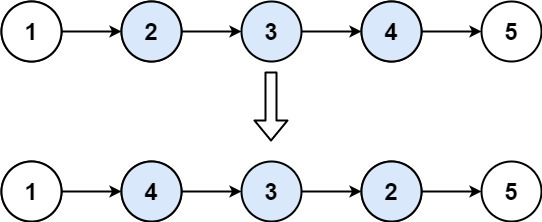

### 1. Description

Given the `head` of a singly linked list and two integers `left` and `right` where $left \le right$, reverse the nodes of the list from position `left` to position `right`, and return *the reversed list*.

### 2. Function Contract

**Inputs**

- `head`: The first node of a non-empty singly linked list.
- `left`: The one-based first position of the segment to reverse.
- `right`: The one-based final position of the segment to reverse.

**Return value**

Return the head after reversing the inclusive segment `[left, right]` and leaving all other nodes in place.

### 3. Examples

#### Example 1

- **Input:** $head = [1,2,3,4,5], left = 2, right = 4$
- **Output:** `[1,4,3,2,5]`
#### Example 2

- **Input:** $head = [5], left = 1, right = 1$
- **Output:** `[5]`

### 4. Constraints

- The number of nodes in the list is `n`.

- $1 \le n \le 500$

- $-500 \le \text{Node.val} \le 500$

- $1 \le left \le right \le n$

**Follow up:** Could you do it in one pass?