## Solution

---
### Approach 1: Recursive Approach

The first method to solve this problem is using recursion. This is the classical method and is straightforward. We can define a helper function to implement recursion.

```python
# Definition for a binary tree node.
# class TreeNode:
#     def __init__(self, val=0, left=None, right=None):
#         self.val = val
#         self.left = left
#         self.right = right

class Solution:
    def inorderTraversal(self, root):
        res = []
        self.helper(root, res)
        return res

    def helper(self, root, res):
        if root is not None:
            self.helper(root.left, res)
            res.append(root.val)
            self.helper(root.right, res)
```

**Complexity Analysis**

Time complexity: $O(n)$

  - The time complexity is $O(n)$ because the recursive function is $T(n) = 2 \cdot T(n/2)+1$.

Space complexity: $O(n)$

  - The worst case space required is $O(n)$, and in the average case it's $O(\log n)$ where $n$ is number of nodes.

<br />

---

### Approach 2: Iterating method using Stack

The strategy is very similiar to the first method, the different is using stack.

Here is an illustration:

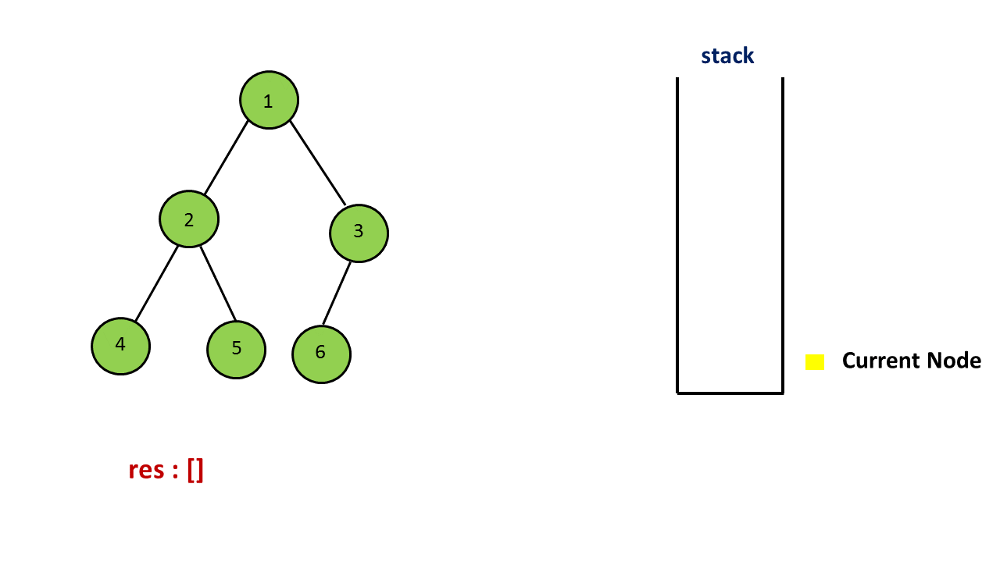

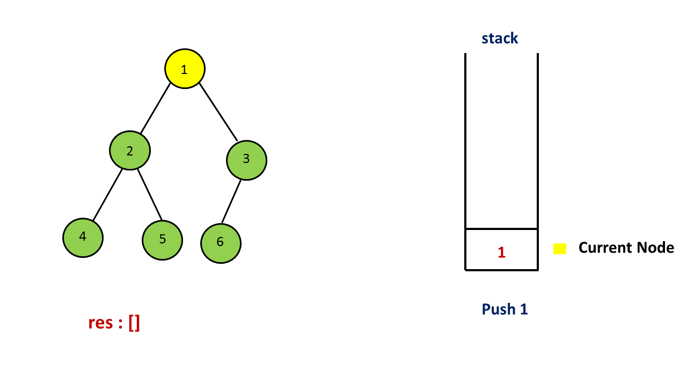

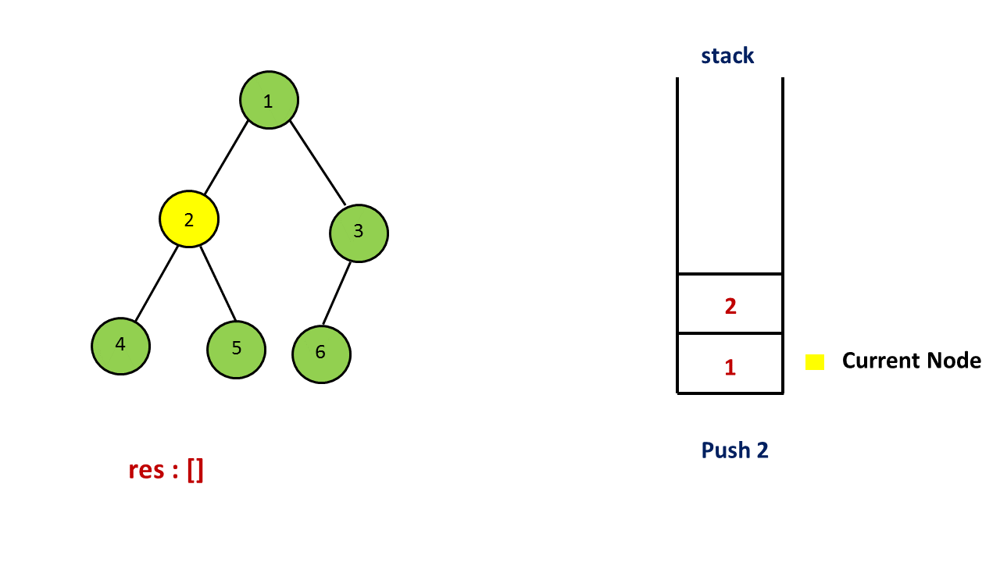

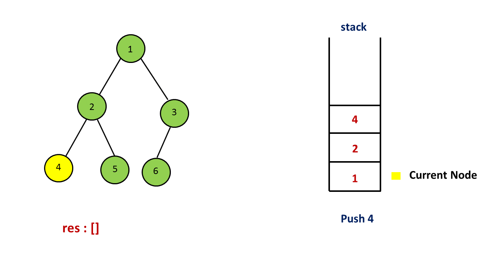

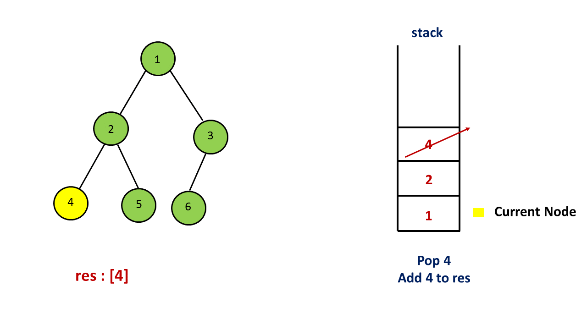

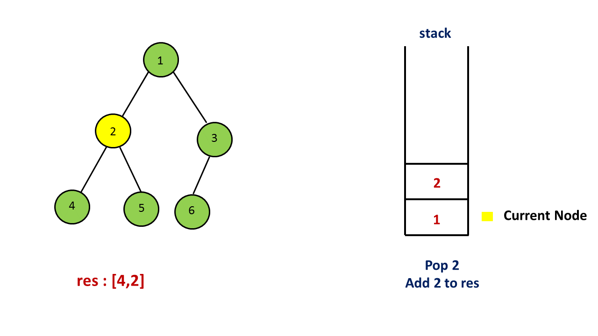

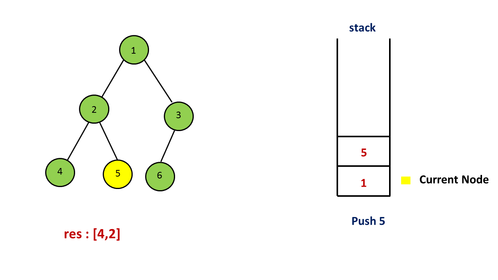

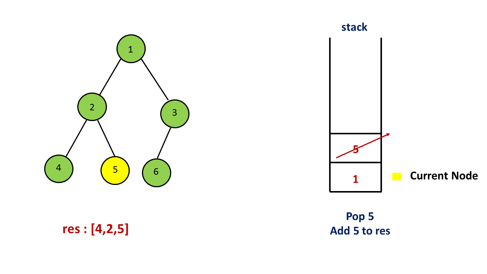

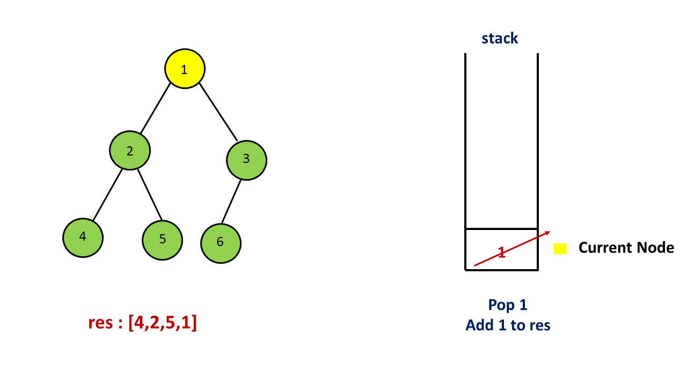

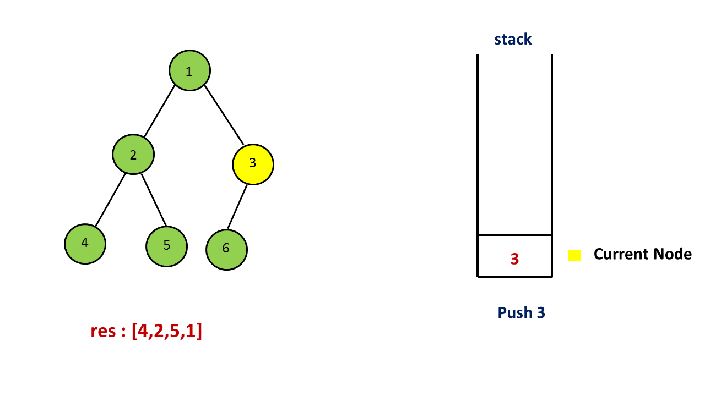

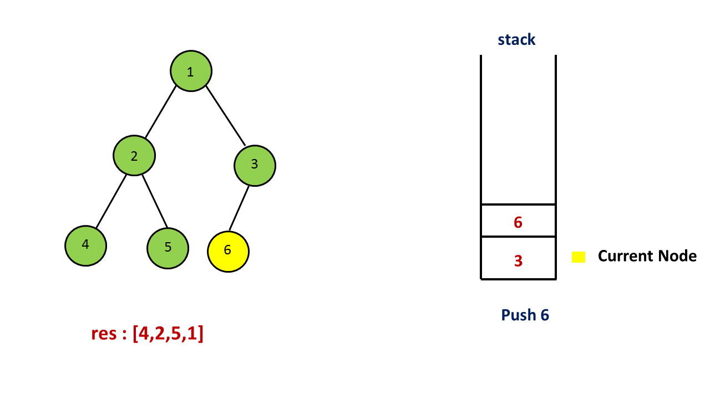

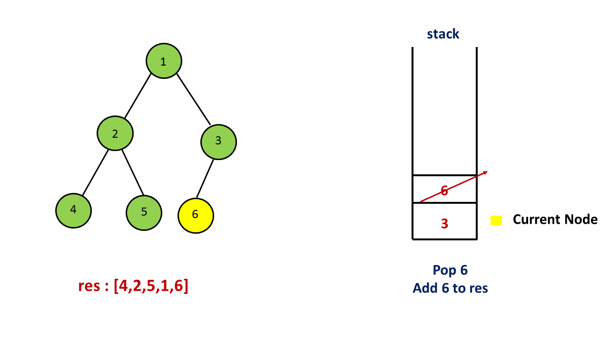

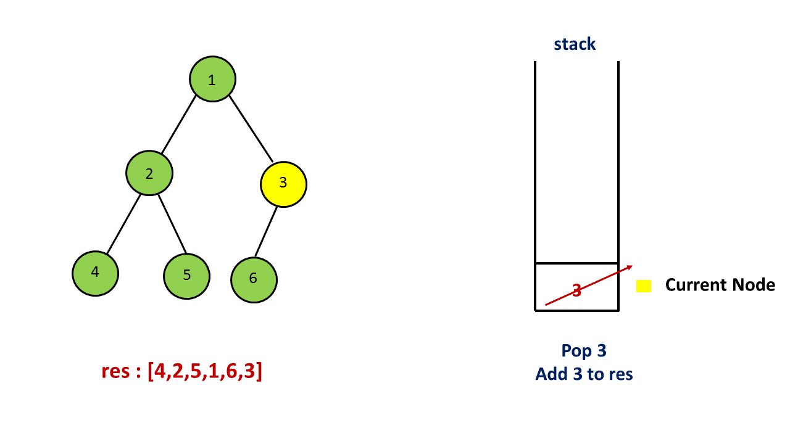

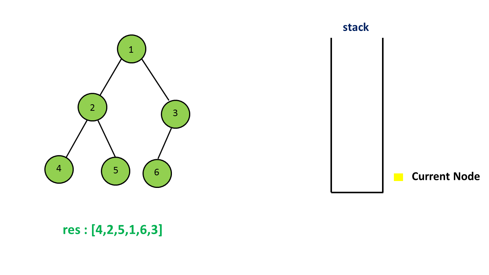

```python
# Definition for a binary tree node.
# class TreeNode:
#     def __init__(self, val=0, left=None, right=None):
#         self.val = val
#         self.left = left
#         self.right = right

class Solution:
    def inorderTraversal(self, root):
        res = []
        stack = []
        curr = root
        while curr or stack:
            while curr:
                stack.append(curr)
                curr = curr.left
            curr = stack.pop()
            res.append(curr.val)
            curr = curr.right
        return res
```

**Complexity Analysis**

Time complexity: $O(n)$

Space complexity: $O(n)$

<br />

---

### Approach 3: Morris Traversal

In this method, we have to use a new data structure - Threaded Binary Tree, and the strategy is as follows:

>Step 1: Initialize current as root
>
>Step 2: While current is not NULL,
>
>     If current does not have left child
>
>         a. Add current’s value
>
>         b. Go to the right, i.e., current = current.right
>
>     Else
>
>         a. In current's left subtree, make current the right child of the rightmost node
>
>         b. Go to this left child, i.e., current = current.left

For example:
```

          1
        /   \
       2     3
      / \   /
     4   5 6

```
First, 1 is the root, so initialize 1 as current, 1 has left child which is 2, the current's left subtree is

```
         2
        / \
       4   5
```
 So in this subtree, the rightmost node is 5, then make the current(1) as the right child of 5. Set current = current.left (current = 2).
The tree now looks like:
```
         2
        / \
       4   5
            \
             1
              \
               3
              /
             6
```
For current 2, which has left child 4, we can continue with the same process as we did above
```
        4
         \
          2
           \
            5
             \
              1
               \
                3
               /
              6
```
 then add 4 because it has no left child, then add 2, 5, 1, 3 one by one, for node 3 which has left child 6, do the same as above.
Finally, the inorder traversal is [4,2,5,1,6,3].

For more details, please check
[Threaded binary tree](https://en.wikipedia.org/wiki/Threaded_binary_tree) and
[Explanation of Morris Method](https://stackoverflow.com/questions/5502916/explain-morris-inorder-tree-traversal-without-using-stacks-or-recursion)

```python
# Definition for a binary tree node.
# class TreeNode:
#     def __init__(self, val=0, left=None, right=None):
#         self.val = val
#         self.left = left
#         self.right = right

class Solution:
    def inorderTraversal(self, root: TreeNode) -> List[int]:
        res = []
        curr = root

        while curr is not None:
            if curr.left is None:
                res.append(curr.val)
                curr = curr.right  # move to next right node
            else:
                pre = curr.left
                while pre.right is not None and pre.right != curr:  # find rightmost
                    pre = pre.right

                if pre.right is None:
                    # establish a link back to the current node
                    pre.right = curr
                    curr = curr.left
                else:
                    # restore the tree structure
                    pre.right = None
                    res.append(curr.val)
                    curr = curr.right

        return res
```

**Complexity Analysis**

Time complexity: $O(n)$

  - To prove that the time complexity is $O(n)$, the biggest problem lies in finding the time complexity of finding the predecessor nodes of all the nodes in the binary tree. Intuitively, the complexity is $O(n \log n)$, because to find the predecessor node for a single node related to the height of the tree. But in fact, finding the predecessor nodes for all nodes only needs $O(n)$ time. Because a binary Tree with $n$ nodes has $n-1$ edges, the whole processing for each edges up to 2 times, one is to locate a node, and the other is to find the predecessor node. So the complexity is $O(n)$.

Space complexity: $O(1)$

  - Extra space is only allocated for the ArrayList of size $n$, however the output does not count towards the space complexity.