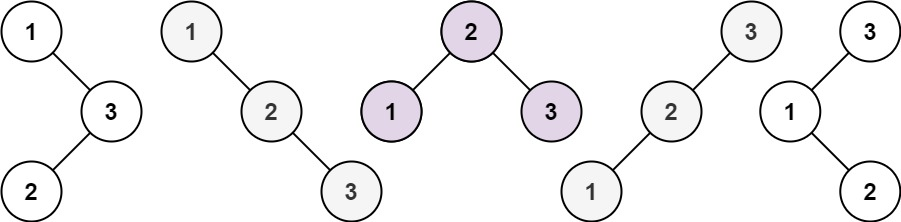

## Description

Given an integer `n`, return *all the structurally unique **BST'**s (binary search trees), which has exactly *`n`* nodes of unique values from* `1` *to* `n`. Return the answer in **any order**.
### Function Contract

**Inputs**

- `n`: The number of nodes and the greatest value in each tree.

**Return value**

Return all structurally unique BST roots using each value from `1` through `n` exactly once.

### Examples

#### Example 1

- **Input:** $n = 3$
- **Output:** `[[1,null,2,null,3],[1,null,3,2],[2,1,3],[3,1,null,null,2],[3,2,null,1]]`
#### Example 2

- **Input:** $n = 1$
- **Output:** `[[1]]`
### Constraints

- $1 \le n \le 8$