[TOC]

## Solution

---

### Approach 1: Sort an Almost Sorted Array Where Two Elements Are Swapped

**Intuition**

Let's start from straightforward but not optimal solution with a linear time and space complexity. This solution serves to identify and discuss all subproblems.

It's known that [inorder traversal of BST is an array sorted in the ascending order](https://leetcode.com/articles/delete-node-in-a-bst/). Here is how one could compute an inorder traversal

```python
def inorder(r: TreeNode) -> List[int]:
    return inorder(r.left) + [r.val] + inorder(r.right) if r else []
```

Here two nodes are swapped, and hence inorder traversal is an almost sorted array where only two elements are swapped. To identify two swapped elements in a sorted array is a classical problem that could be solved in linear time. Here is a solution code

```python
def find_two_swapped(nums: List[int]) -> (int, int):
    n = len(nums)
    x = y = (
        None  # Initialize x and y as a value that cannot be the value of a node.
    )

    for i in range(n - 1):
        if nums[i + 1] < nums[i]:
            y = nums[i + 1]
            # The first swap occurrence
            if x is None:
                x = nums[i]
            # The second swap occurrence
            else:
                break
    return x, y
```

When swapped nodes are known, one could traverse the tree again and swap their values.

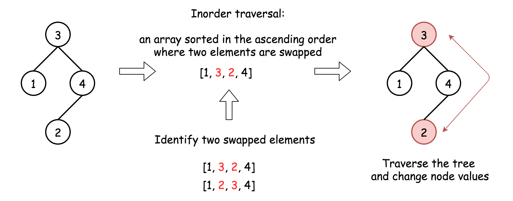

**Algorithm**

Here is the algorithm:

1. Construct inorder traversal of the tree. It should be an almost sorted list where only two elements are swapped.

2. Identify two swapped elements x and y in an almost sorted array in linear time.

3. Traverse the tree again. Change value x to y and value y to x.

**Implementation**

```python
class Solution:
    def recoverTree(self, root: TreeNode) -> None:
        def inorder(r: TreeNode) -> List[int]:
            return inorder(r.left) + [r.val] + inorder(r.right) if r else []

        def find_two_swapped(nums: List[int]) -> (int, int):
            n = len(nums)
            x = y = (
                None  # Initialize x and y as a value that cannot be the value of a node.
            )

            for i in range(n - 1):
                if nums[i + 1] < nums[i]:
                    y = nums[i + 1]
                    # The first swap occurrence
                    if x is None:
                        x = nums[i]
                    # The second swap occurrence
                    else:
                        break
            return x, y

        def recover(r: TreeNode, count: int) -> None:
            if r:
                if r.val == x or r.val == y:
                    r.val = y if r.val == x else x
                    count -= 1
                    if count == 0:
                        return
                recover(r.left, count)
                recover(r.right, count)

        nums = inorder(root)
        x, y = find_two_swapped(nums)
        recover(root, 2)
```

**Complexity Analysis**

* Time complexity: $\mathcal{O}(N)$. To compute inorder traversal takes $\mathcal{O}(N)$ time, to identify and to swap back swapped nodes $\mathcal{O}(N)$ in the worst case.

* Space complexity: $\mathcal{O}(N)$ since we keep inorder traversal `nums` with N elements.

---
### What Is Coming Next

In approach 1 we discussed three easy subproblems of this hard problem:

1. Construct inorder traversal.

2. Find swapped elements in an almost sorted array where only two elements are swapped.

3. Swap values of two nodes.

Now we will discuss three more approaches, and basically they are all the same :

- Merge steps 1 and 2, i.e. identify swapped nodes during the inorder traversal.

- Swap node values.

The difference in-between the following approaches is in a chosen method to implement inorder traversal :

- Approach 2 : Iterative.

- Approach 3 : Recursive.

- Approach 4 : Morris.

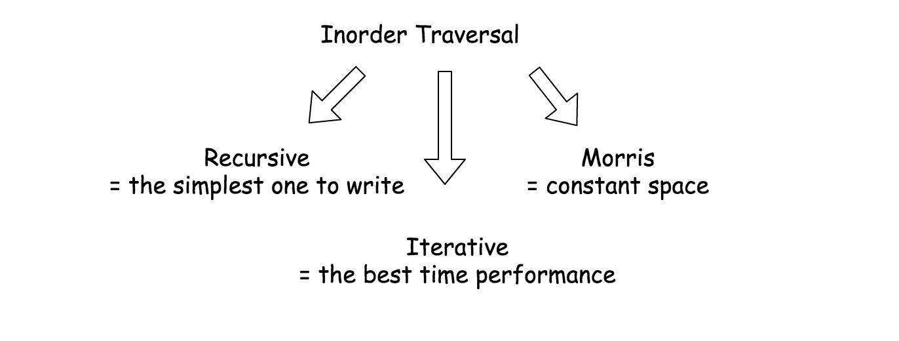

Iterative and recursive approaches here do less than _one pass_, and they both need up to $\mathcal{O}(H)$ space to keep stack, where H is a tree height.

Morris approach is _two pass_ approach, but it's a constant-space one.

---
### Approach 2: Iterative Inorder Traversal

**Intuition**

Here we construct inorder traversal by iterations and identify swapped nodes at the same time, in one pass.

> Iterative inorder traversal is simple: go left as far as you can, then one step right. Repeat till the end of nodes in the tree.

To identify swapped nodes, track the last node `pred` in the inorder traversal (i.e. the _predecessor_ of the current node) and compare it with current node value. If the current node value is smaller than its predecessor `pred` value, the swapped node is here.

There are only two swapped nodes here, and hence one could break after having the second node identified.

Doing so, one could get directly nodes (and not only their values), and hence swap node values in $\mathcal{O}(1)$ time, drastically reducing the time needed for step 3.


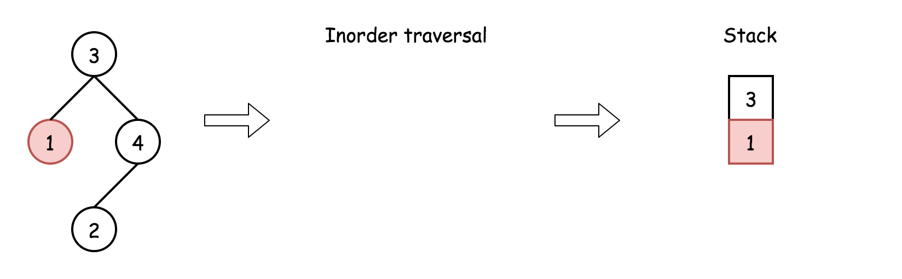


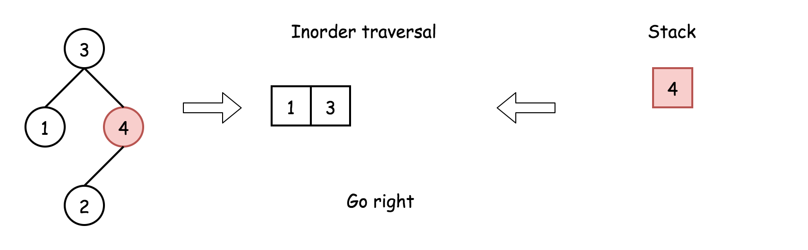

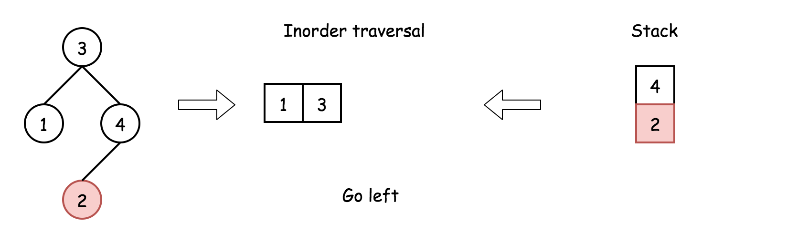


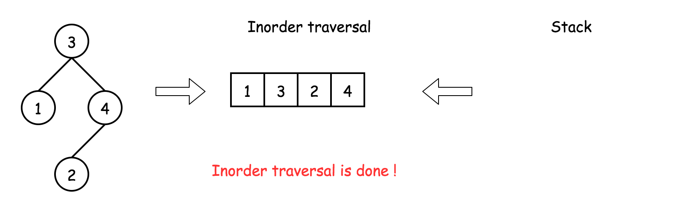

**Implementation**

[Don't use Stack in Java, use ArrayDeque instead](https://docs.oracle.com/javase/8/docs/api/java/util/Stack.html).

```python
class Solution:
    def recoverTree(self, root: TreeNode) -> None:
        stack = []
        x = y = pred = None

        while stack or root:
            while root:
                stack.append(root)
                root = root.left
            root = stack.pop()
            if pred and root.val < pred.val:
                y = root
                if x is None:
                    x = pred
                else:
                    break
            pred = root
            root = root.right

        x.val, y.val = y.val, x.val
```

**Complexity Analysis**

* Time complexity: $\mathcal{O}(N)$ in the worst case when one of the swapped nodes is a rightmost leaf.

* Space complexity : up to $\mathcal{O}(N)$ to keep the stack in the worst case when the tree is completely lean.

---
### Approach 3: Recursive Inorder Traversal

Iterative approach 2 could be converted into recursive one.

Recursive inorder traversal is extremely simple: follow `Left->Node->Right` direction, i.e. do the recursive call for the _left_ child, then do all the business with the node (= if the node is the swapped one or not), and then do the recursive call for the _right_ child.

On the following figure the nodes are numerated in the order you visit them, please follow `1-2-3-4-5` to compare different DFS strategies.


**Implementation**

```python
class Solution:
    def recoverTree(self, root: TreeNode) -> None:
        def find_two_swapped(root: TreeNode):
            nonlocal x, y, pred
            if root is None:
                return

            find_two_swapped(root.left)
            if pred and root.val < pred.val:
                y = root
                # The first swap occurence
                if x is None:
                    x = pred
                # The second swap occurence
                else:
                    return
            pred = root
            find_two_swapped(root.right)

        x = y = pred = None
        find_two_swapped(root)
        x.val, y.val = y.val, x.val
```

**Complexity Analysis**

* Time complexity: $\mathcal{O}(N)$ in the worst case when one of the swapped nodes is a rightmost leaf.

* Space complexity : up to $\mathcal{O}(N)$ to keep the stack in the worst case when the tree is completely lean.

---
### Approach 4: Morris Inorder Traversal

We discussed already iterative and recursive inorder traversals, which both have great time complexity though use up to $\mathcal{O}(N)$ to keep stack. We could trade in performance to save space.

The idea of Morris inorder traversal is simple: to use no space but to traverse the tree.

> How that could be even possible? At each node one has to decide where to go: left or right, traverse left subtree or traverse right subtree. How one could know that the left subtree is already done if no additional memory is allowed?

The idea of [Morris](https://www.sciencedirect.com/science/article/pii/0020019079900681) algorithm is to set the _temporary link_ between the node and its
[predecessor](https://leetcode.com/articles/delete-node-in-a-bst/): $\text{predecessor.right} = root$. So one starts from the node, computes its predecessor and verifies if the link is present.

- There is no link? Set it and go to the left subtree.

- There is a link? Break it and go to the right subtree.

There is one small issue to deal with : what if there is no left child, i.e. there is no left subtree? Then go straightforward to the right subtree.

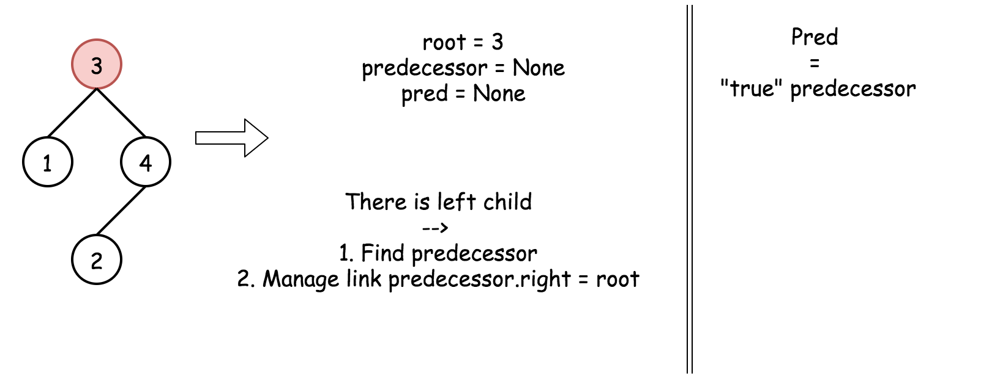

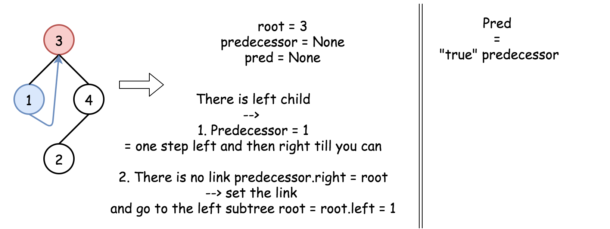

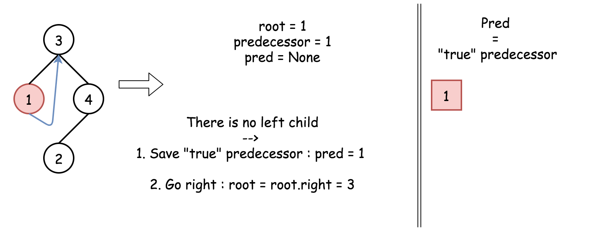

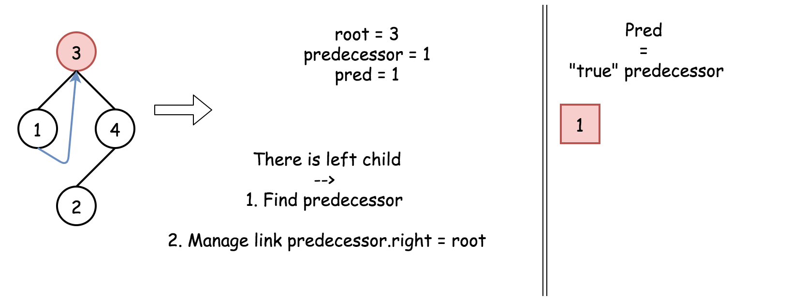

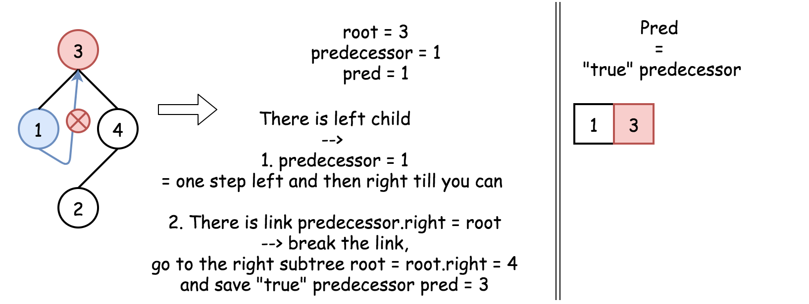

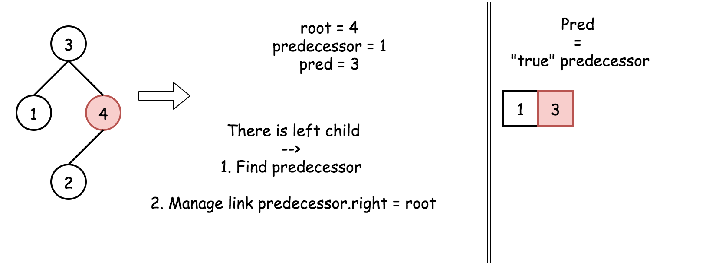

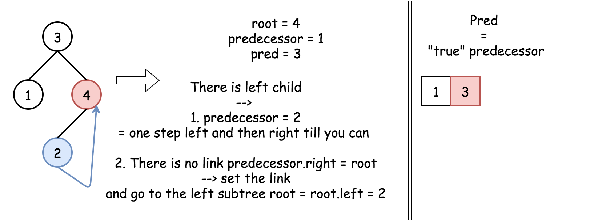

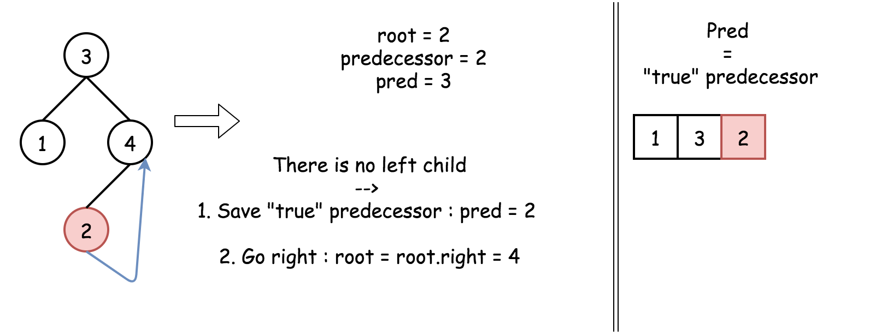

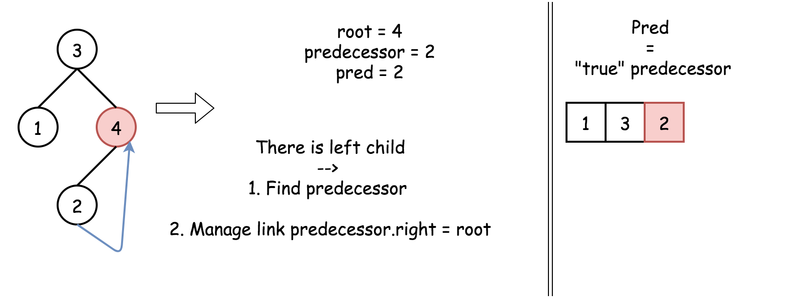

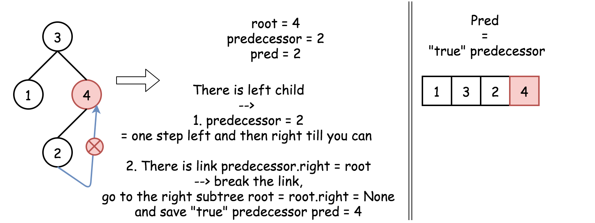

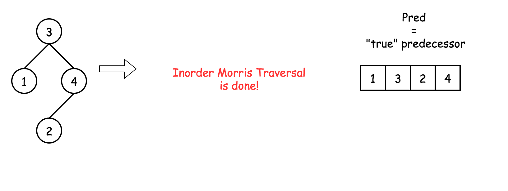

**Implementation**

```python
class Solution:
    def recoverTree(self, root: TreeNode) -> None:
        # The predecessor is a Morris predecessor.
        # In the 'loop' cases it could be equal to the node itself predecessor == root.
        # pred is a 'true' predecessor,
        # the previous node in the inorder traversal.
        x = y = predecessor = pred = None

        while root:
            # If there is a left child
            # then compute the predecessor.
            # If there is no link predecessor.right = root --> set it.
            # If there is a link predecessor.right = root --> break it.
            if root.left:
                # Predecessor node is one step left
                # and then right till you can.
                predecessor = root.left
                while predecessor.right and predecessor.right != root:
                    predecessor = predecessor.right

                # Set the link predecessor.right = root
                # and go to explore left subtree
                if predecessor.right is None:
                    predecessor.right = root
                    root = root.left
                # Break the link predecessor.right = root
                # link is broken : time to change subtree and go right
                else:
                    # check for the swapped nodes
                    if pred and root.val < pred.val:
                        y = root
                        if x is None:
                            x = pred
                    pred = root

                    predecessor.right = None
                    root = root.right
            # If there is no left child
            # then just go right.
            else:
                # Check for the swapped nodes
                if pred and root.val < pred.val:
                    y = root
                    if x is None:
                        x = pred
                pred = root

                root = root.right

        x.val, y.val = y.val, x.val
```

**Complexity Analysis**

* Time complexity : $\mathcal{O}(N)$ since we visit each node up to two times.

* Space complexity : $\mathcal{O}(1)$.