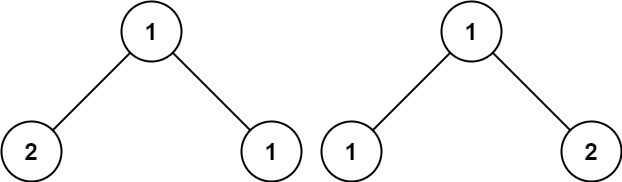

### 1. Description

Given the roots of two binary trees `p` and `q`, write a function to check if they are the same or not.

Two binary trees are considered the same if they are structurally identical, and the nodes have the same value.

### 2. Function Contract

**Inputs**

- `p`: The first binary-tree root, or `null`.
- `q`: The second binary-tree root, or `null`.

**Return value**

Return `true` if `p` and `q` have identical structure and values; otherwise return `false`.

### 3. Examples

#### Example 1

- **Input:** $p = [1,2,3], q = [1,2,3]$
- **Output:** `true`

#### Example 2

- **Input:** $p = [1,2], q = [1,null,2]$
- **Output:** `false`

#### Example 3

- **Input:** $p = [1,2,1], q = [1,1,2]$
- **Output:** `false`

### 4. Constraints

- The number of nodes in both trees is in the range `[0, 100]`.

- $-10^{4} \le \text{Node.val} \le 10^{4}$
