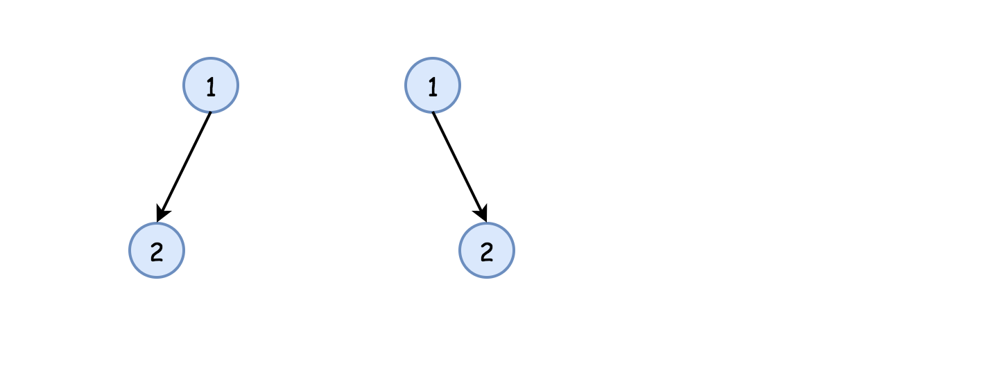
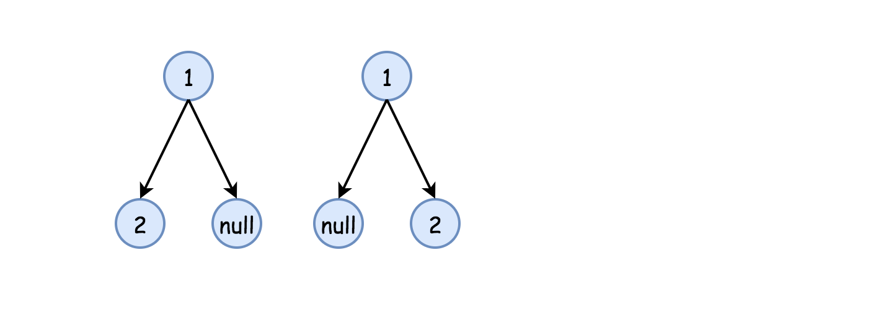
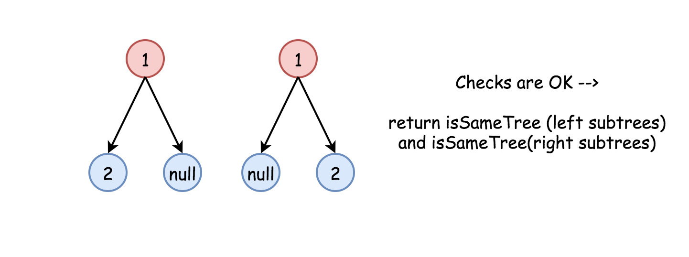
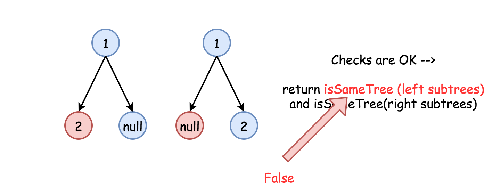
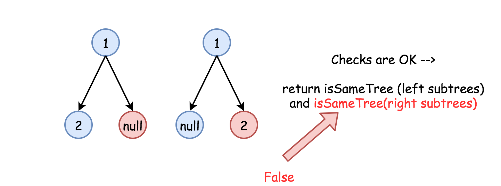
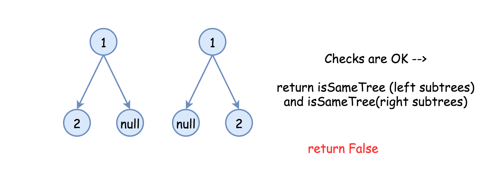

## Solution

---

### Approach 1: Recursion

**Intuition**

The simplest strategy here is to use recursion.
Check if `p` and `q` nodes are not `None`, and their values are equal.
If all checks are OK, do the same for the child nodes
recursively.

**Implementation**













```python
class Solution:
    def isSameTree(self, p: TreeNode, q: TreeNode) -> bool:
        # p and q are both None
        if not p and not q:
            return True
        # one of p and q is None
        if not q or not p:
            return False
        if p.val != q.val:
            return False
        return self.isSameTree(p.right, q.right) and self.isSameTree(
            p.left, q.left
        )
```

**Complexity Analysis**

* Time complexity : $O(N)$,
where N is a number of nodes in the tree, since one visits
each node exactly once.

* Space complexity : $O(N)$ in the worst case of completely unbalanced tree, to keep a recursion stack.
<br />
<br />

---
### Approach 2: Iteration

**Intuition**

Start from the root and then at each iteration
pop the current node out of the deque. Then do the same checks as in
 the approach 1 :

- `p` and `p` are not `None`,

- `p.val` is equal to `q.val`,

and if checks are OK, push the child nodes.

**Implementation**

```python
from collections import deque

class Solution:
    def isSameTree(self, p: TreeNode, q: TreeNode) -> bool:
        def check(p: TreeNode, q: TreeNode) -> bool:
            # if both are None
            if not p and not q:
                return True
            # one of p and q is None
            if not q or not p:
                return False
            if p.val != q.val:
                return False
            return True

        deq = deque(
            [
                (p, q),
            ]
        )
        while deq:
            p, q = deq.popleft()
            if not check(p, q):
                return False

            if p:
                deq.append((p.left, q.left))
                deq.append((p.right, q.right))

        return True
```

**Complexity Analysis**

* Time complexity : $O(N)$ since each node is visited
exactly once.

* Space complexity : $O(N)$ in the worst case, where the tree is a perfect fully balanced binary tree, since BFS will have to store at least an entire level of the tree in the queue, and the last level has $O(N)$ nodes.