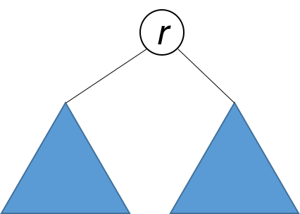
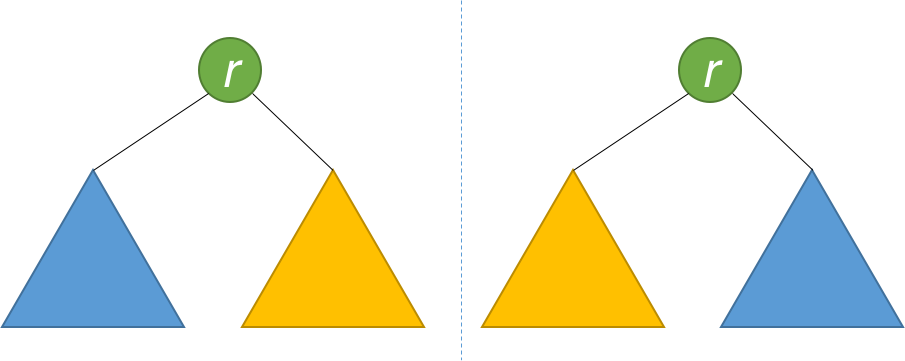

## Solution Article

---

### Approach 1: Recursive

A tree is symmetric if the left subtree is a mirror reflection of the right subtree.

{:width="200px"}

Therefore, the question is: when are two trees a mirror reflection of each other?

Two trees are a mirror reflection of each other if:

1. Their two roots have the same value.
2. The right subtree of each tree is a mirror reflection of the left subtree of the other tree.

{:width="400px"}

This is like a person looking at a mirror. The reflection in the mirror has the same head, but the reflection's right arm corresponds to the actual person's left arm, and vice versa.

The explanation above translates naturally to a recursive function as follows.

```python
class Solution:
    def isSymmetric(self, root):
        return self.isMirror(root, root)

    def isMirror(self, t1, t2):
        if t1 is None and t2 is None:
            return True
        if t1 is None or t2 is None:
            return False
        return (
            (t1.val == t2.val)
            and self.isMirror(t1.right, t2.left)
            and self.isMirror(t1.left, t2.right)
        )
```

**Complexity Analysis**

* Time complexity: $O(n)$. Because we traverse the entire input tree once, the total run time is $O(n)$, where $n$ is the total number of nodes in the tree.

* Space complexity: The number of recursive calls is bound by the height of the tree. In the worst case, the tree is linear and the height is in $O(n)$. Therefore, space complexity due to recursive calls on the stack is $O(n)$ in the worst case.
<br />
<br />

---

### Approach 2: Iterative

Instead of recursion, we can also use iteration with the aid of a queue. Each two consecutive nodes in the queue should be equal, and their subtrees a mirror of each other. Initially, the queue contains `````root````` and `````root`````. Then the algorithm works similarly to BFS, with some key differences. Each time, two nodes are extracted and their values are compared. Then, the right and left children of the two nodes are inserted in the queue in opposite order. The algorithm is done when either the queue is empty, or we detect that the tree is not symmetric (i.e. we pull out two consecutive nodes from the queue that are unequal).

```python
from collections import deque

class Solution:
    def isSymmetric(self, root):
        q = deque([root, root])
        while q:
            t1 = q.popleft()
            t2 = q.popleft()
            if t1 is None and t2 is None:
                continue
            if t1 is None or t2 is None:
                return False
            if t1.val != t2.val:
                return False
            q.append(t1.left)
            q.append(t2.right)
            q.append(t1.right)
            q.append(t2.left)
        return True
```

**Complexity Analysis**

* Time complexity: $O(n)$. Because we traverse the entire input tree once, the total run time is $O(n)$, where $n$ is the total number of nodes in the tree.

* Space complexity: There is additional space required for the search queue. In the worst case, we have to insert $O(n)$ nodes in the queue. Therefore, space complexity is $O(n)$.