## Solution

---

### How to traverse the tree

There are two general strategies to traverse a tree:

- *Depth First Search* (`DFS`)

    In this strategy, we adopt `depth` as the priority, so that one would start from a root and reach all the way down to a certain leaf, and then back to root to reach another branch.

    The DFS strategy can further be distinguished as `preorder`, `inorder`, and `postorder` depending on the relative order among the root node, left node, and right node.

- *Breadth First Search* (`BFS`)

    We scan through the tree level by level, following the order of height, from top to bottom. The nodes on higher levels would be visited before the ones with lower levels.

In the following figure, the nodes are enumerated in the order you visit them, please follow ```1-2-3-4-5``` to compare different strategies.


Here the problem is to implement split-level BFS traversal: `[[1], [2, 3], [4, 5]]`.
<br />
<br />

---
### Approach 1: Recursion

**Algorithm**

The simplest way to solve the problem is to use a recursion. Let's first ensure that the tree is not empty, and then call recursively the function `helper(node, level)`, which takes the current node and its level as the arguments.

This function does the following :

- The output list here is called `levels`, and hence the current level is just a length of this list `len(levels)`. Compare the number of a current level `len(levels)` with a node level `level`. If you're still on the previous level - add the new one by adding a new list into `levels`.

- Append the node value to the last list in `levels`.

- Process recursively child nodes if they are not `None`: $helper(\text{node.left} / \text{node.right}, level + 1)$.

**Implementation**

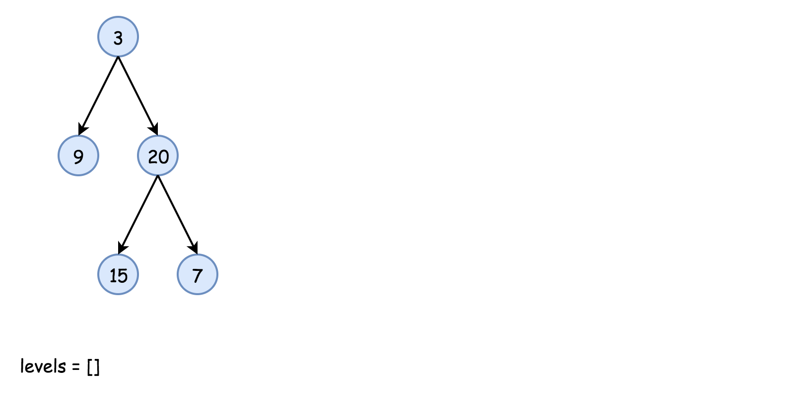

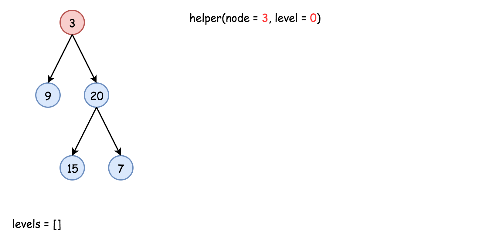

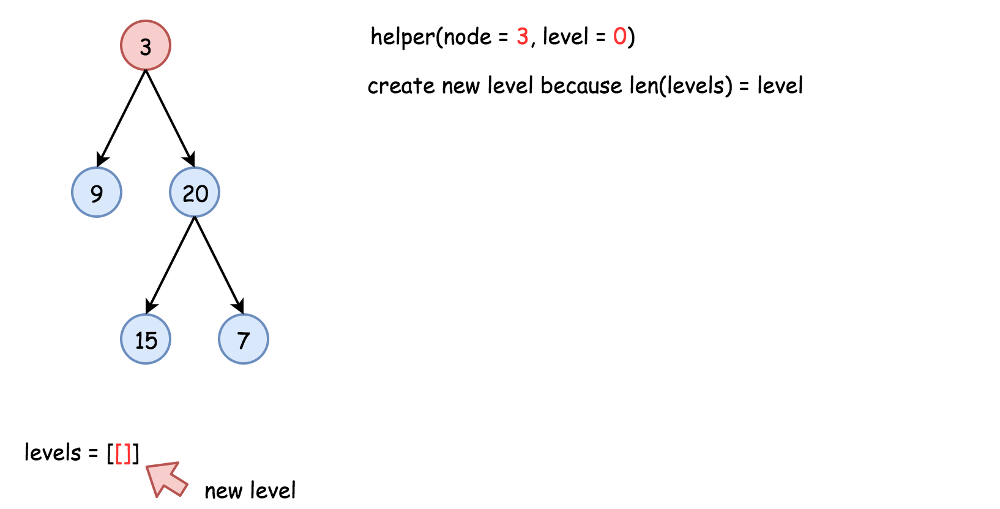

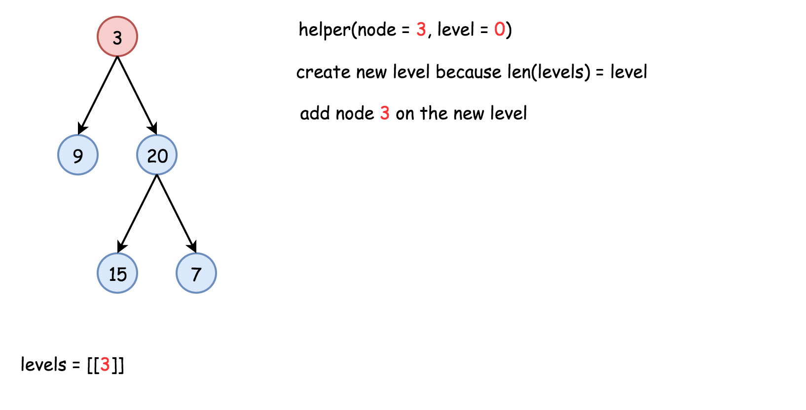

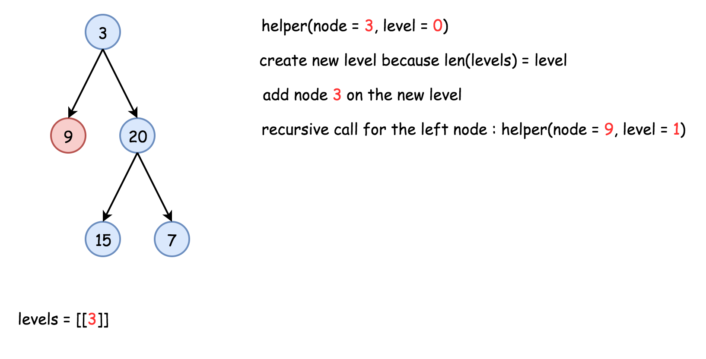

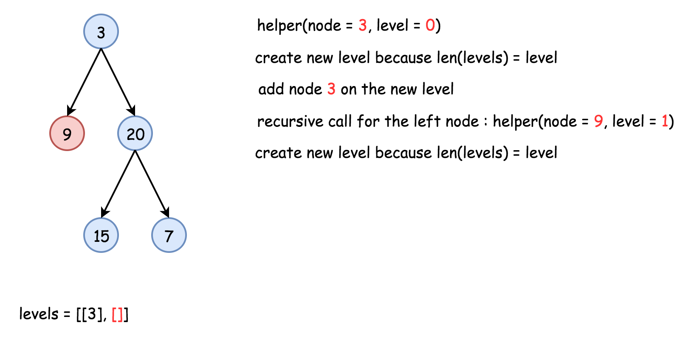

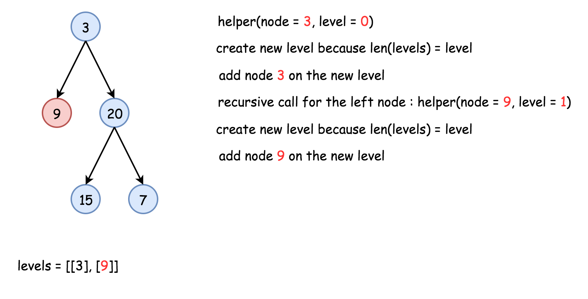

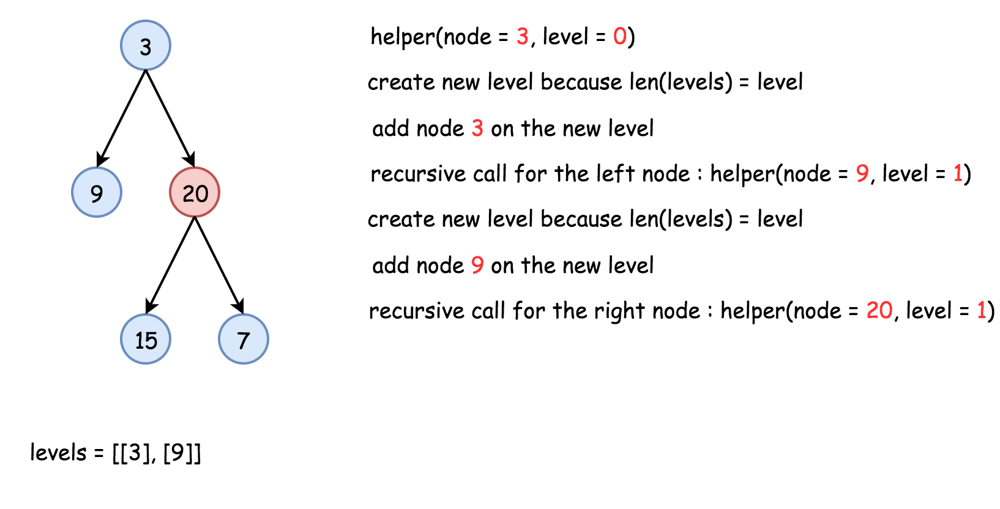

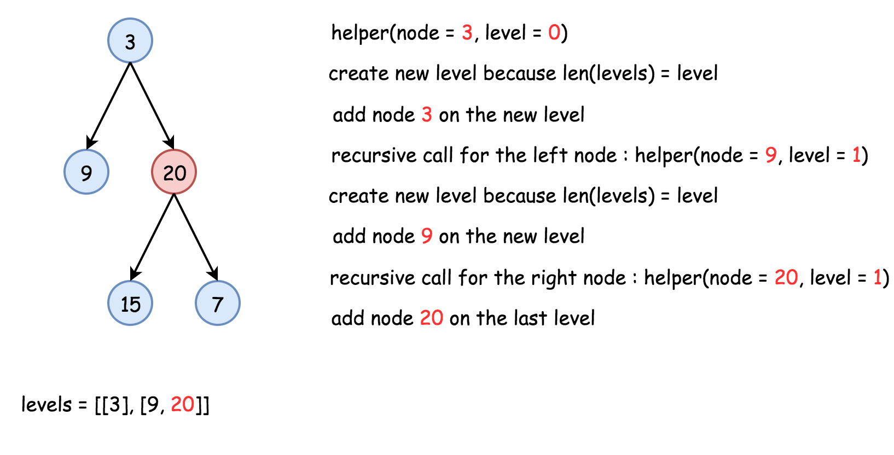

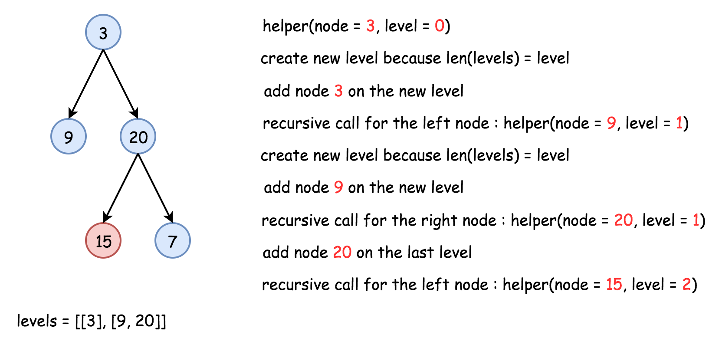

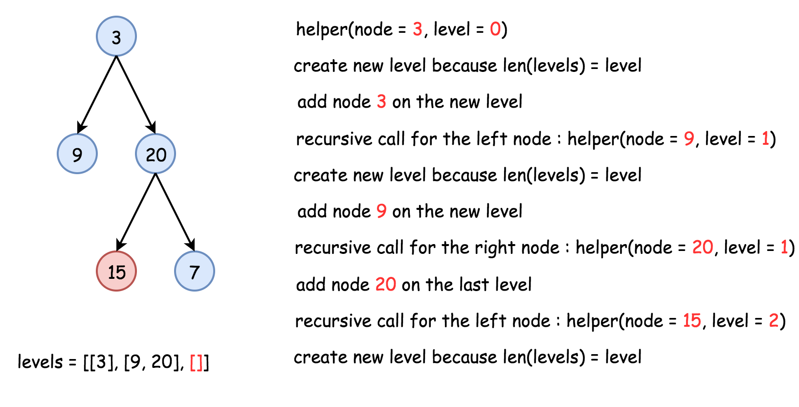

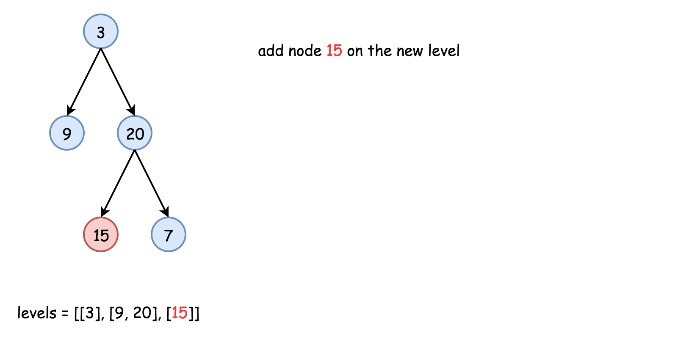

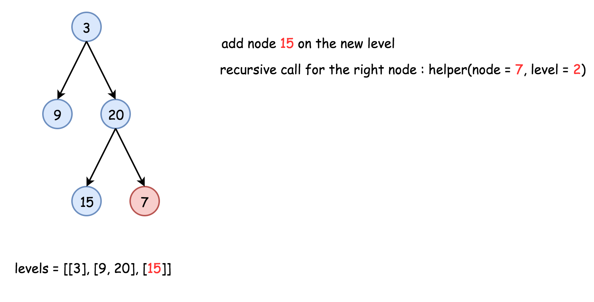

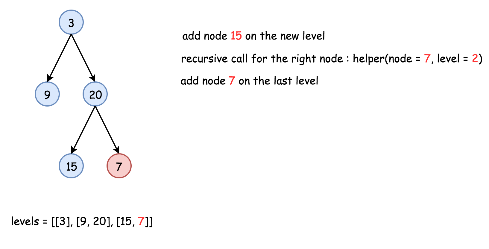

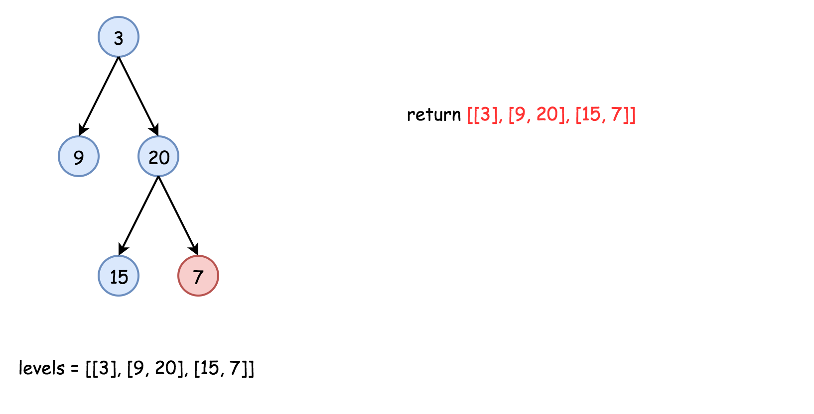

```python
class Solution:
    def levelOrder(self, root: TreeNode) -> List[List[int]]:
        levels = []
        if not root:
            return levels

        def helper(node: TreeNode, level: int) -> None:
            # start the current level
            if len(levels) == level:
                levels.append([])

            # append the current node value
            levels[level].append(node.val)

            # process child nodes for the next level
            if node.left:
                helper(node.left, level + 1)
            if node.right:
                helper(node.right, level + 1)

        helper(root, 0)
        return levels
```

**Complexity Analysis**

* Time complexity: $\mathcal{O}(N)$ since each node is processed exactly once.

* Space complexity: $\mathcal{O}(N)$ to keep the output structure which contains `N` node values.
<br />
<br />

---
### Approach 2: Iteration

**Algorithm**

The recursion above could be rewritten in the iteration form.

Let's keep nodes of each tree level in the _queue_ structure, which typically orders elements in a FIFO (first-in-first-out) manner. In Java one could use [`LinkedList` implementation of the `Queue` interface](https://docs.oracle.com/javase/7/docs/api/java/util/Queue.html). In Python using [`Queue` structure](https://docs.python.org/3/library/queue.html) would be an overkill since it's designed for a safe exchange between multiple threads and hence requires locking which leads to a performance loss. In Python, the queue implementation with a fast atomic `append()` and `popleft()` is [`deque`](https://docs.python.org/3/library/collections.html#collections.deque).

The zero level contains only one node `root`. The algorithm is simple :

- Initiate queue with a `root` and start from the level number `0`: $level = 0$.

- While the queue is not empty :

* Start the current level by adding an empty list into the output structure `levels`.

* Compute how many elements should be on the current level: it's a queue length.

* Pop out all these elements from the queue and add them to the current level.

* Push their child nodes into the queue for the next level.

* Go to the next level `level++`.

**Implementation**

```python
from collections import deque

class Solution:
    def levelOrder(self, root: TreeNode) -> List[List[int]]:
        levels = []
        if not root:
            return levels

        level = 0
        queue = deque(
            [
                root,
            ]
        )
        while queue:
            # start the current level
            levels.append([])
            # number of elements in the current level
            level_length = len(queue)

            for i in range(level_length):
                node = queue.popleft()
                # fulfill the current level
                levels[level].append(node.val)

                # add child nodes of the current level
                # in the queue for the next level
                if node.left:
                    queue.append(node.left)
                if node.right:
                    queue.append(node.right)

            # go to next level
            level += 1

        return levels
```

**Complexity Analysis**

* Time complexity: $\mathcal{O}(N)$ since each node is processed exactly once.

* Space complexity: $\mathcal{O}(N)$ to keep the output structure which contains `N` node values.