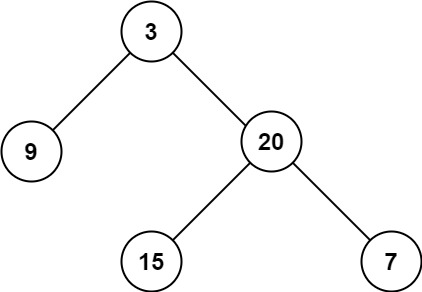

## Description

Given the `root` of a binary tree, return *its maximum depth*.

A binary tree's **maximum depth** is the number of nodes along the longest path from the root node down to the farthest leaf node.
### Function Contract

**Inputs**

- `root`: The root of the binary tree, or `null` for an empty tree.

**Return value**

Return the number of nodes on the longest root-to-leaf path. An empty tree has depth `0`.

### Examples
#### Example 1

- **Input:** `root = [3,9,20,null,null,15,7]`
- **Output:** `3`
#### Example 2

- **Input:** `root = [1,null,2]`
- **Output:** `2`
### Constraints

- The number of nodes in the tree is in the range $[0, 10^{4}]$.

- $-100 \le \text{Node.val} \le 100$