[TOC]

## Video Solution

---
 <div>
    <div class="video-container">
      <iframe src="https://player.vimeo.com/video/888870976?texttrack=en-x-autogenerated" frameborder="0"
        allow="autoplay; fullscreen"></iframe>
    </div>
</div>

## Solution

**Tree definition**

First of all, here is the definition of the ```TreeNode``` which we would use.

```python
class TreeNode(object):
    """Definition of a binary tree node."""

    def __init__(self, x):
        self.val = x
        self.left = None
        self.right = None
```

<br />
<br />

---
### Approach 1: Recursion

**Intuition**
By definition, the maximum depth of a binary tree is the maximum number of steps to reach a leaf node from the root node.

>From the definition, an intuitive idea would be to traverse the tree and record the maximum depth during the traversal.

**Algorithm**

<!--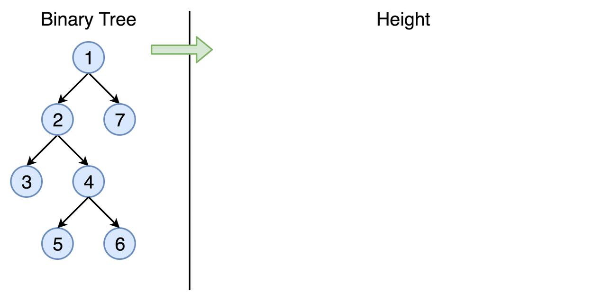-->

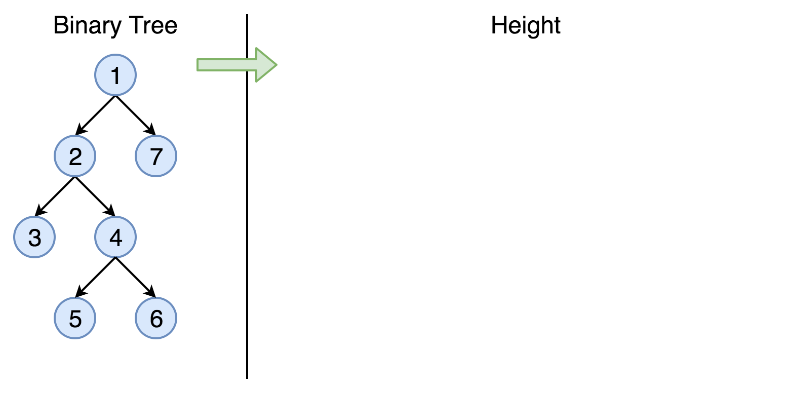

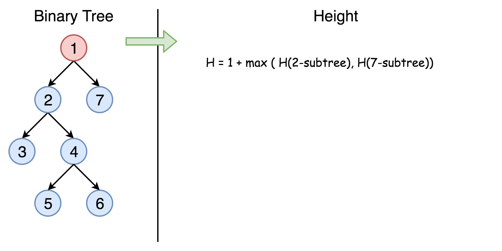

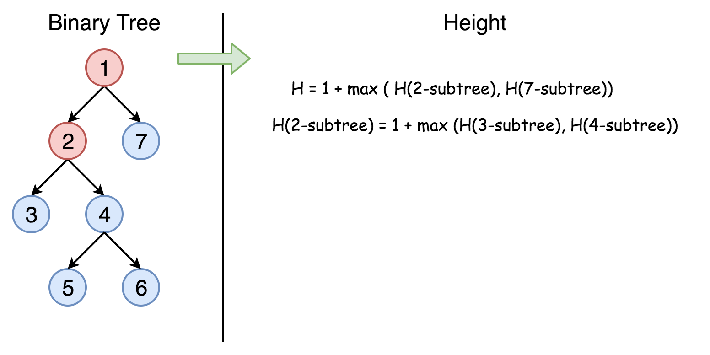

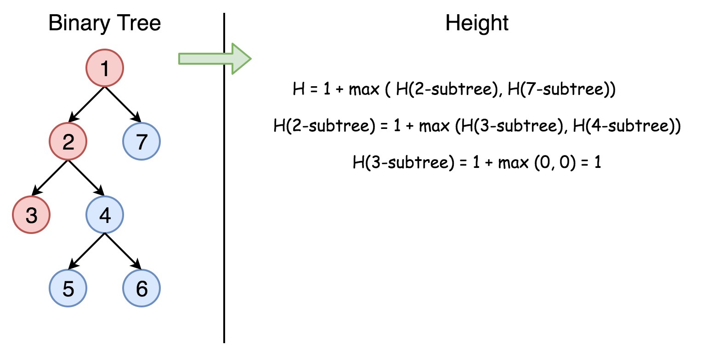

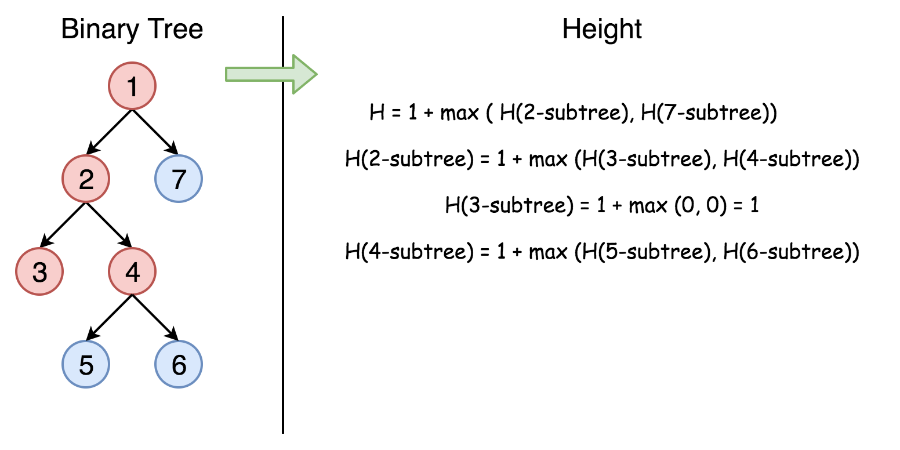

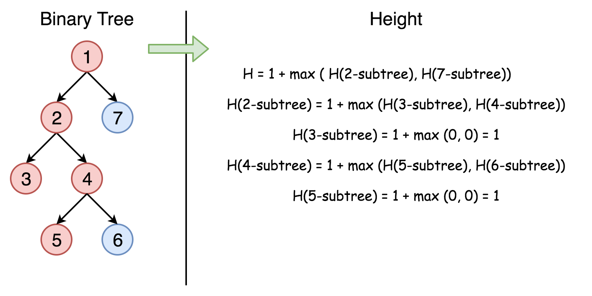

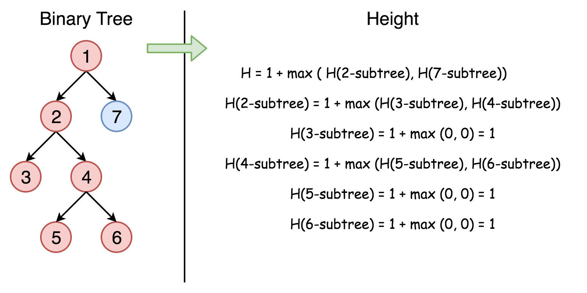

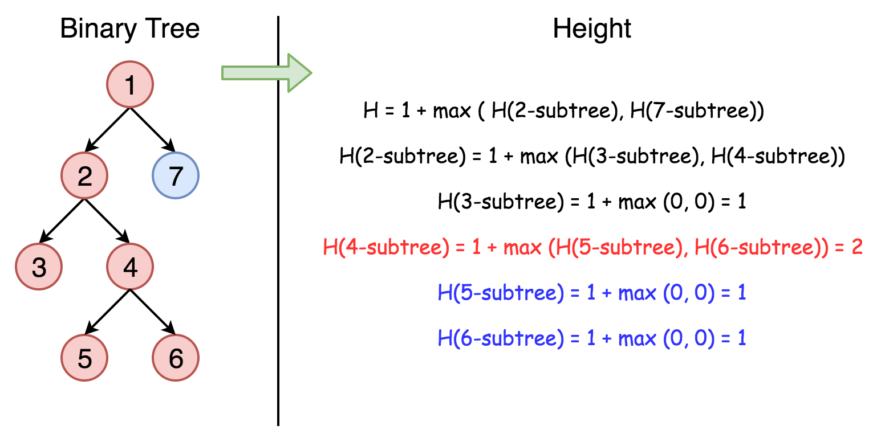

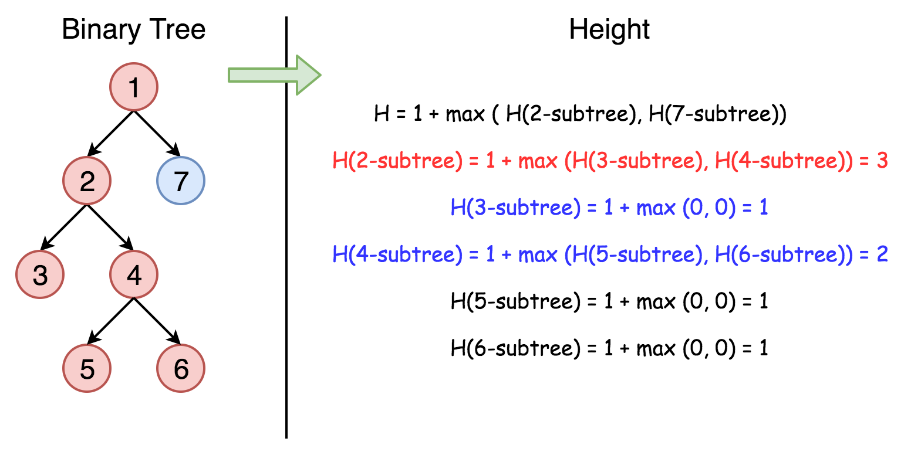

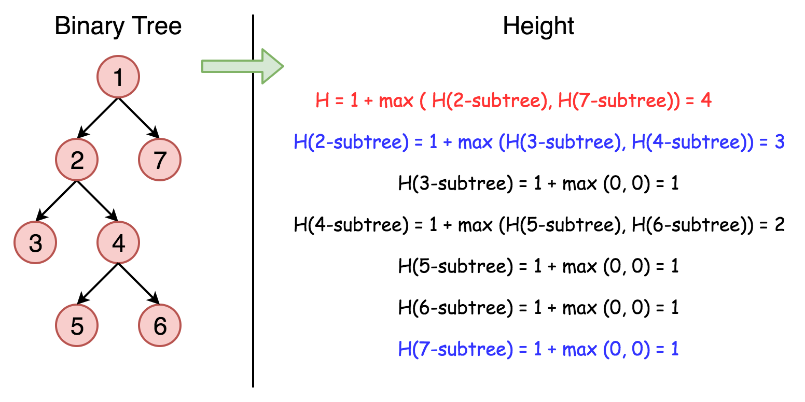

One could traverse the tree either by Depth-First Search (DFS) strategy or Breadth-First Search (BFS) strategy.
For this problem, either way would do.
Here we demonstrate a solution that is implemented with the **DFS** strategy and **recursion**.

```python
class Solution:
    def maxDepth(self, root: TreeNode) -> int:
        if root is None:
            return 0
        else:
            left_height = self.maxDepth(root.left)
            right_height = self.maxDepth(root.right)
            return max(left_height, right_height) + 1
```

**Complexity analysis**

* Time complexity: we visit each node exactly once, thus the time complexity is $\mathcal{O}(N)$, where $N$ is the number of nodes.

* Space complexity: in the worst case, the tree is completely unbalanced, *e.g.* each node has only left child node, the recursion call would occur $N$ times (the height of the tree), therefore the storage to keep the call stack would be $\mathcal{O}(N)$. But in the best case (the tree is completely balanced), the height of the tree would be $\log(N)$. Therefore, the space complexity in this case would be $\mathcal{O}(\log(N))$.
<br />
<br />

---
### Approach 2: Tail Recursion + BFS

One might have noticed that the above recursion solution is probably not the most optimal one in terms of space complexity, and in the extreme case, the overhead of the call stack might even lead to *stack overflow*.

To address the issue, one can tweak the solution a bit to make it **tail recursion**, which is a specific form of recursion where the recursive call is the last action in the function.

The benefit of having tail recursion is that for certain programming languages (*e.g.* `C++`) the compiler could optimize the memory allocation of the call stack by reusing the same space for every recursive call, rather than creating the space for each one. As a result, one could obtain the constant space complexity $\mathcal{O}(1)$ for the overhead of the recursive calls.

Here is a sample solution. Note that the optimization of tail recursion is not supported by Python or Java.

```python
class Solution:
    def __init__(self):
        # The queue that contains the next nodes to visit,
        # along with the level/depth that each node is located.
        self.next_items = []
        self.max_depth = 0

    def next_maxDepth(self):
        if not self.next_items:
            return self.max_depth
        next_node, next_level = self.next_items.pop(0)
        next_level += 1
        self.max_depth = max(self.max_depth, next_level)
        # Add the nodes to visit in the following recursive calls.
        if next_node.left:
            self.next_items.append((next_node.left, next_level))
        if next_node.right:
            self.next_items.append((next_node.right, next_level))
        # The last action should be the ONLY recursive call
        # in the tail-recursion function.
        return self.next_maxDepth()

    def maxDepth(self, root):
        if not root:
            return 0
        # Clear the previous queue.
        self.next_items = []
        self.max_depth = 0
        # Push the root node into the queue to kick off the next visit.
        self.next_items.append((root, 0))
        return self.next_maxDepth()
```

**Complexity analysis**

* Time complexity: $\mathcal{O}(N)$, still we visit each node once and only once.

* Space complexity: $\mathcal{O}(2^{(log_{2N}-1)})=\mathcal{O}(N/2)=\mathcal{O}(N)$, *i.e.* the maximum number of nodes at the same level (the number of leaf nodes in a full binary tree), since we traverse the tree in the **BFS** manner.

As one can see, this probably is not the best example to apply the *tail recursion* technique. Because though we did gain the constant space complexity for the recursive calls, we pay the price of $\mathcal{O}(N)$ complexity to maintain the state information for recursive calls. This defeats the purpose of applying tail recursion.

However, we would like to stress the point that the tail recursion is a useful form of recursion that could eliminate the space overhead incurred by the recursive function calls.

*Note: a function cannot be tail recursion if there are multiple occurrences of recursive calls in the function, even if the last action is the recursive call.* Because the system has to maintain the function call stack for the sub-function calls that occur within the same function.
<br />
<br />

---
### Approach 3: Iteration

**Intuition**

We could also convert the above recursion into iteration, with the help of the *stack* data structure. Similar to the behaviors of the function call stack, the stack data structure follows the pattern of FILO (First-In-Last-Out), *i.e.* the last element that is added to a stack would come out first.

With the help of the *stack* data structure, one could mimic the behaviors of the function call stack that is involved in the recursion, to convert a recursive function to a function with iteration.

**Algorithm**

>The idea is to keep the next nodes to visit in a stack.
Due to the FILO behavior of the stack, one would get the order of visits the same as the one in recursion.

We start from a stack that contains the root node and the corresponding depth which is ```1```. Then we proceed to the iterations: pop the current node out of the stack and push the child nodes. The depth is updated at each step.

```python
class Solution:
    def maxDepth(self, root: TreeNode) -> int:
        stack = []
        if root is not None:
            stack.append((1, root))

        depth = 0
        while stack != []:
            current_depth, root = stack.pop()
            if root is not None:
                depth = max(depth, current_depth)
                stack.append((current_depth + 1, root.left))
                stack.append((current_depth + 1, root.right))

        return depth
```

**Complexity analysis**

* Time complexity: $\mathcal{O}(N)$.

* Space complexity: in the worst case, the tree is completely unbalanced, *e.g.* each node has only the left child node, the recursion call would occur $N$ times (the height of the tree), the storage to keep the call stack would be $\mathcal{O}(N)$. But in the average case (the tree is balanced), the height of the tree would be $\log(N)$. Therefore, the space complexity in this case would be $\mathcal{O}(\log(N))$.