## Solution

---
### Overview

> This problem examines your understanding of preorder and inorder binary tree traversals. If you are not familiar with them, feel free to visit our [Explore Cards](https://leetcode.com/explore/learn/card/data-structure-tree/) where you will see all the ways to traverse a binary tree including preorder, inorder, postorder, and level-order traversals :)

A tree has a recursive structure because it has subtrees which are trees themselves. Let's take a look at the inorder traversal of a binary tree, and you will see the built-in recursive structure.

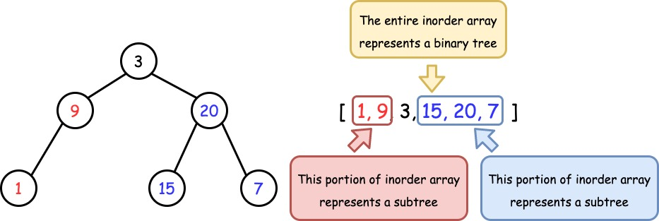

*Figure 1. The recursive structure in a Tree.*

Henceforth, we will leverage this property and find a way to recursively construct the tree.

</br>

---

### Approach: Recursion

#### Intuition

The two key observations are:
1. Preorder traversal follows `Root -> Left -> Right`, therefore, given the preorder array `preorder`, we have easy access to the root which is $\text{preorder}[0]$.

2. Inorder traversal follows `Left -> Root -> Right`, therefore if we know the position of `Root`, we can recursively split the entire array into two subtrees.

Now the idea should be clear enough. We will design a recursion function: it will set the first element of `preorder` as the root, and then construct the entire tree. To find the left and right subtrees, it will look for the root in `inorder`, so that everything on the left should be the left subtree, and everything on the right should be the right subtree. Both subtrees can be constructed by making another recursion call.

It is worth noting that, while we recursively construct the subtrees, we should choose the next element in `preorder` to initialize as the new roots. This is because the current one has already been initialized to a parent node for the subtrees.


*Figure 2. Always use the next element in `preorder` to initialize a root.*

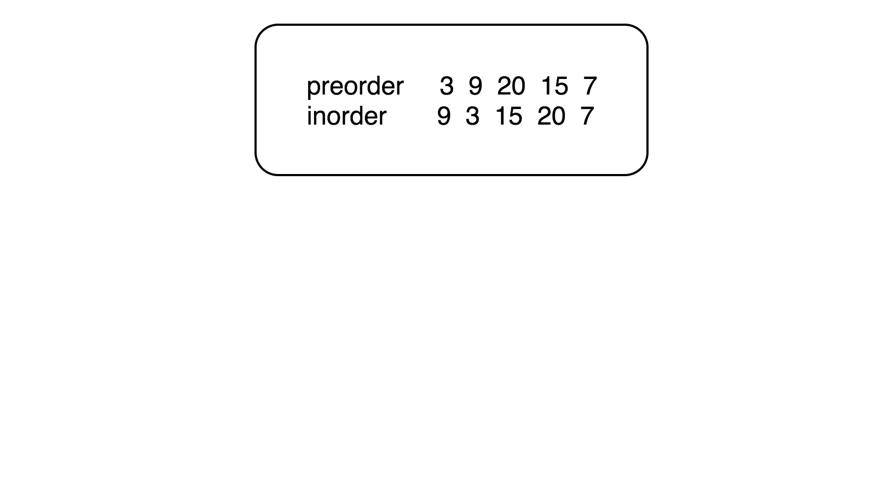

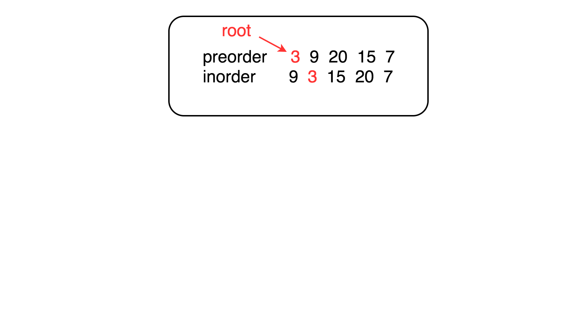

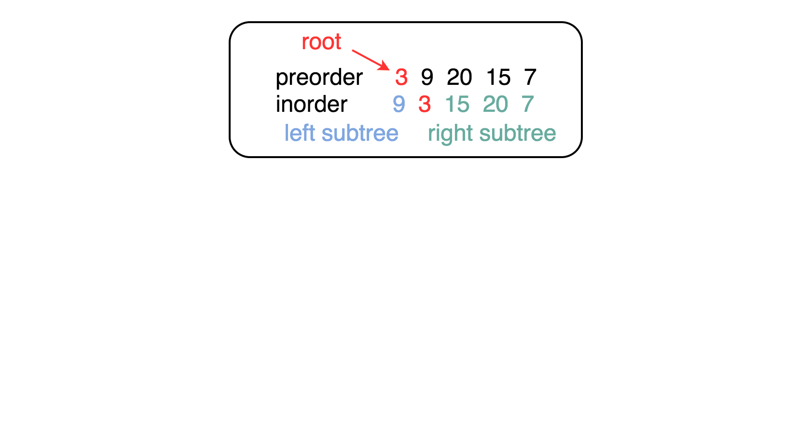

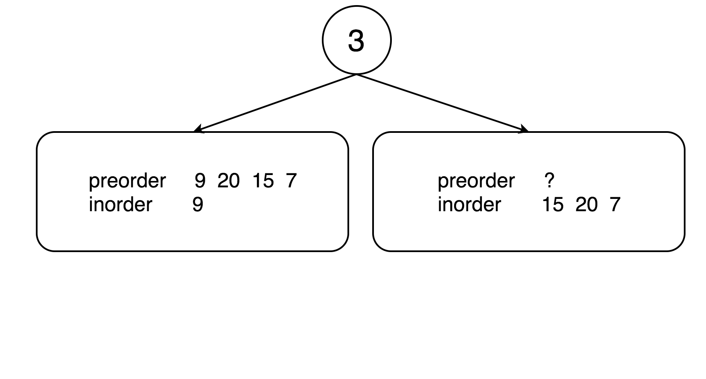

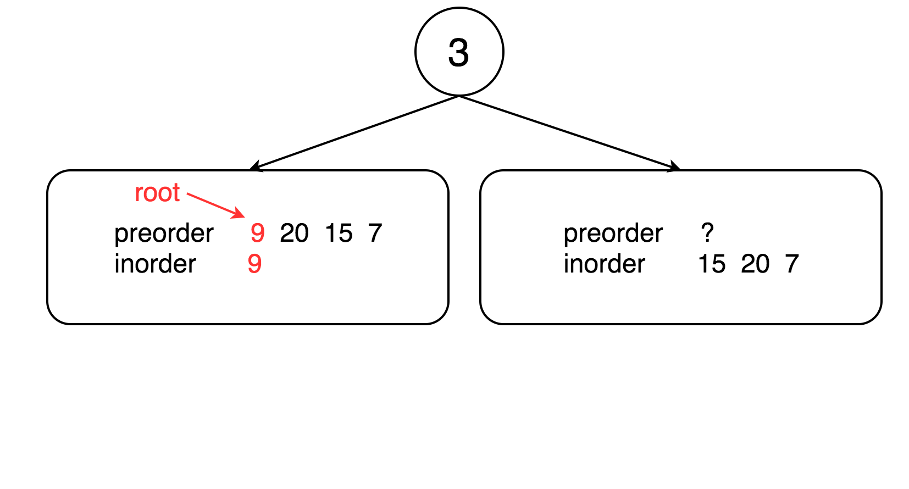

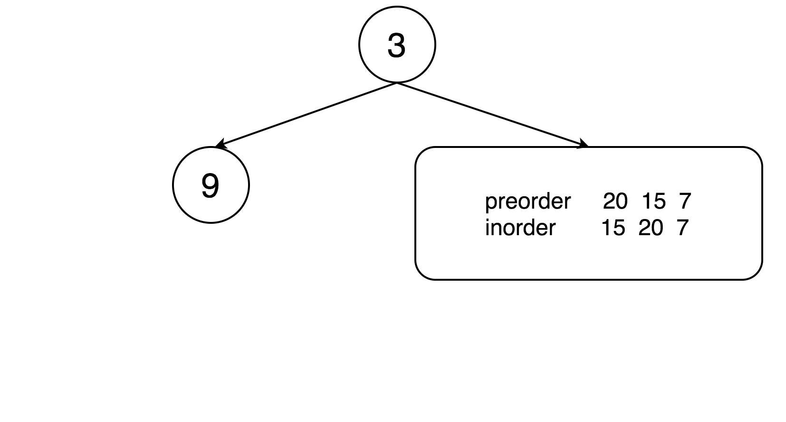

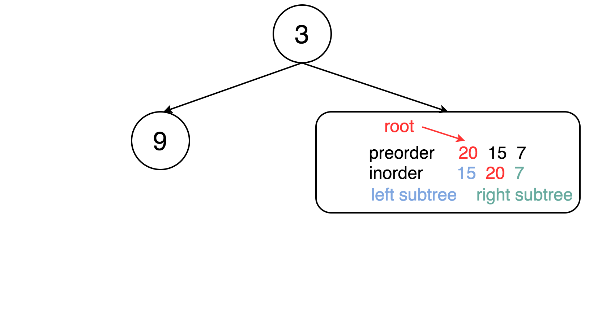

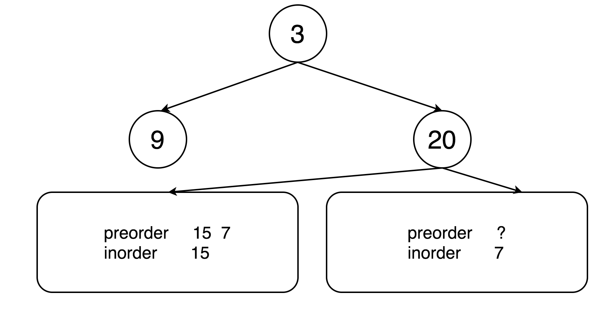

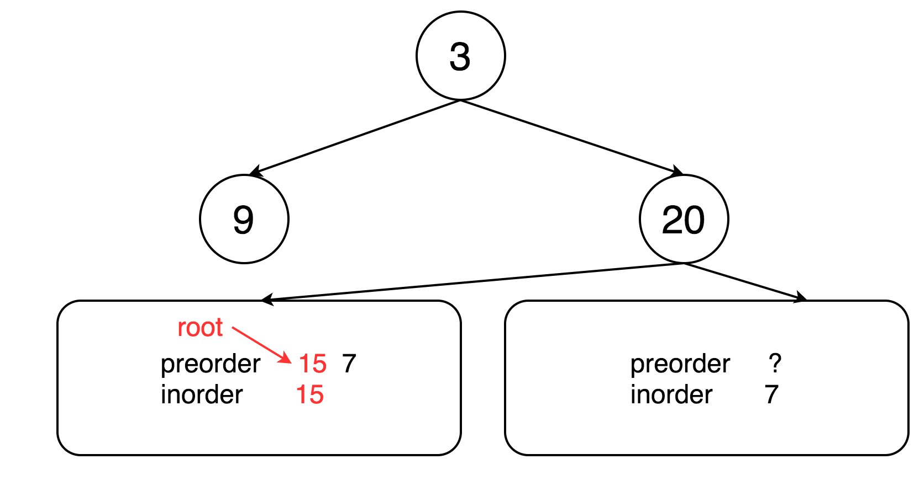

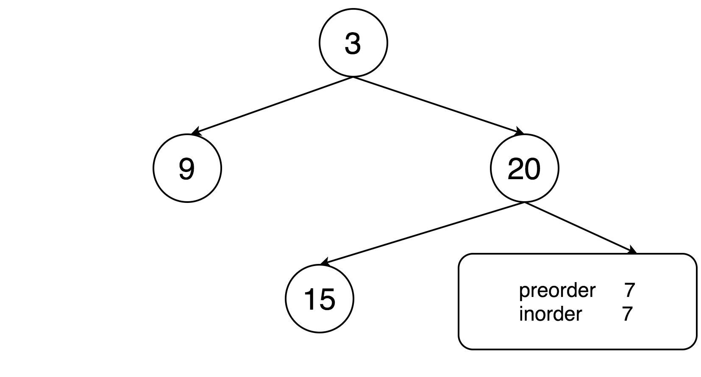

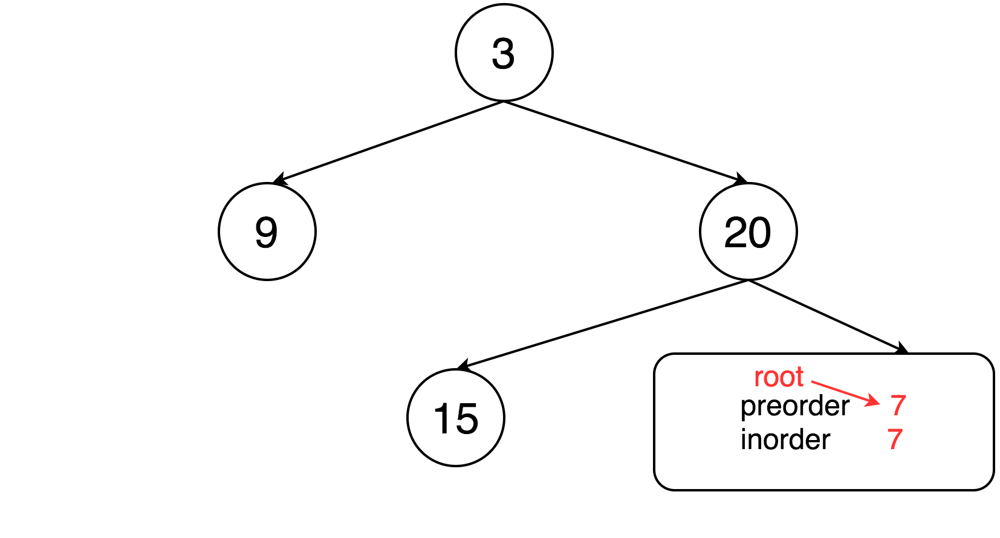

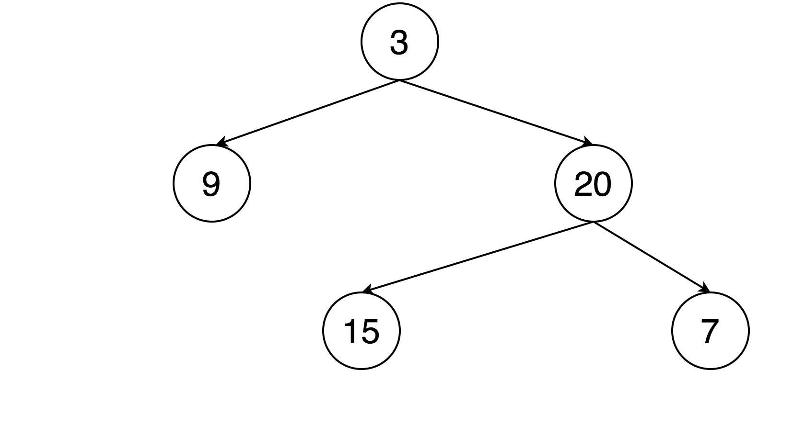

#### Algorithm

- Build a hashmap to record the relation of `value -> index` for `inorder`, so that we can find the position of root in constant time.
- Initialize an integer variable `preorderIndex` to keep track of the element that will be used to construct the root.
- Implement the recursion function `arrayToTree` which takes a range of `inorder` and returns the constructed binary tree:
  - if the range is empty, return `null`;
  - initialize the root with $\text{preorder}[preorderIndex]$ and then increment `preorderIndex`;
  - recursively use the left and right portions of `inorder` to construct the left and right subtrees.
- Simply call the recursion function with the entire range of `inorder`.

```python
class Solution:
    def buildTree(self, preorder: List[int], inorder: List[int]) -> TreeNode:

        def array_to_tree(left, right):
            nonlocal preorder_index
            # if there are no elements to construct the tree
            if left > right:
                return None

            # select the preorder_index element as the root and increment it
            root_value = preorder[preorder_index]
            root = TreeNode(root_value)

            preorder_index += 1

            # build left and right subtree
            # excluding inorder_index_map[root_value] element because it's the root
            root.left = array_to_tree(left, inorder_index_map[root_value] - 1)
            root.right = array_to_tree(inorder_index_map[root_value] + 1, right)

            return root

        preorder_index = 0

        # build a hashmap to store value -> its index relations
        inorder_index_map = {}
        for index, value in enumerate(inorder):
            inorder_index_map[value] = index

        return array_to_tree(0, len(preorder) - 1)
```

**Complexity analysis**

Let $N$ be the length of the input arrays.

* Time complexity : $O(N)$.

  Building the hashmap takes $O(N)$ time, as there are $N$ nodes to add, and adding items to a hashmap has a cost of $O(1)$, so we get $N \cdot$\mathcal{O}(1)$= O(N)$.

  Building the tree also takes $O(N)$ time. The recursive helper method has a cost of $O(1)$ for each call (it has no loops), and it is called _once_ for each of the $N$ nodes, giving a total of $O(N)$.

  Taking both into consideration, the time complexity is $O(N)$.

* Space complexity : $O(N)$.

  Building the hashmap and storing the entire tree each requires $O(N)$ memory. The size of the implicit system stack used by recursion calls depends on the height of the tree, which is $O(N)$ in the worst case and $O(\log N)$ on average. Taking both into consideration, the space complexity is $O(N)$.

---