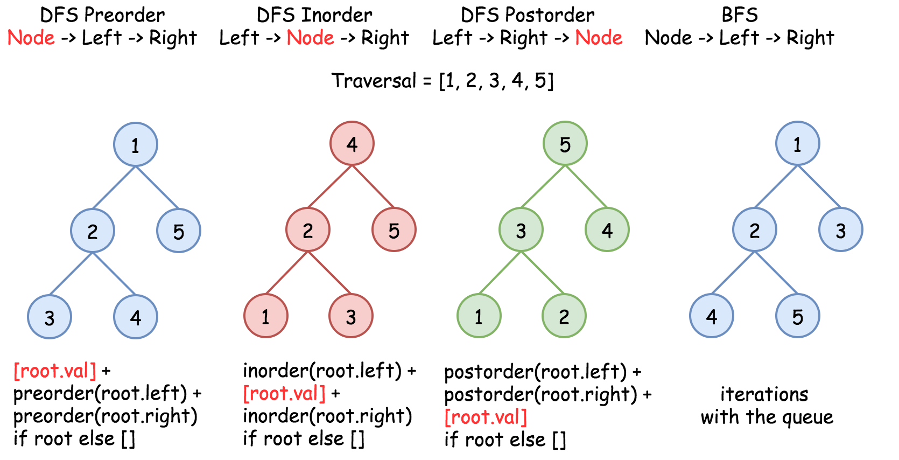
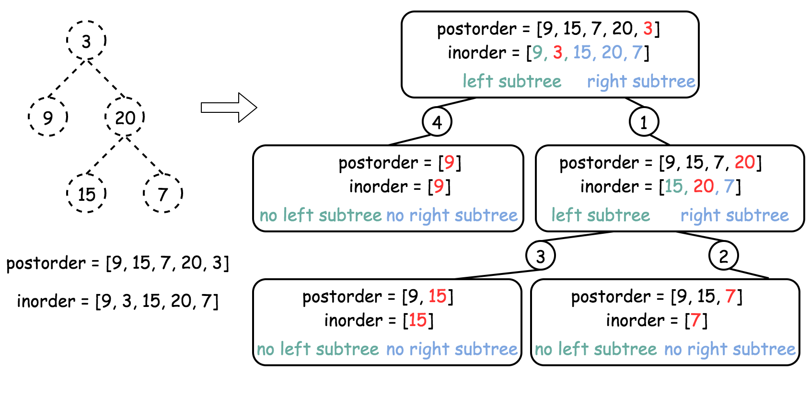
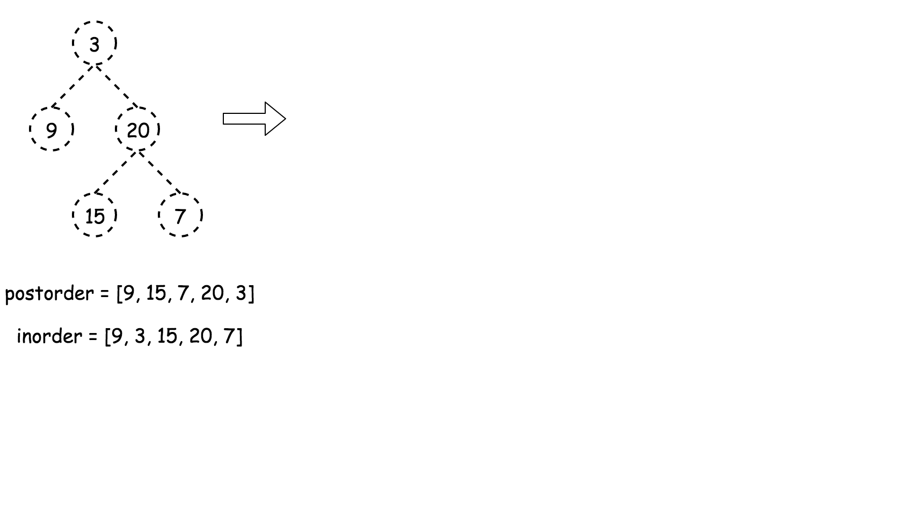
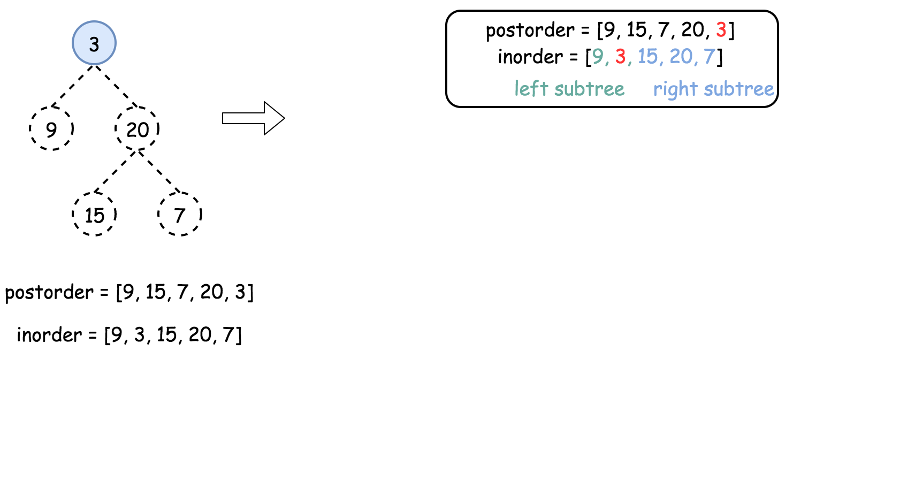
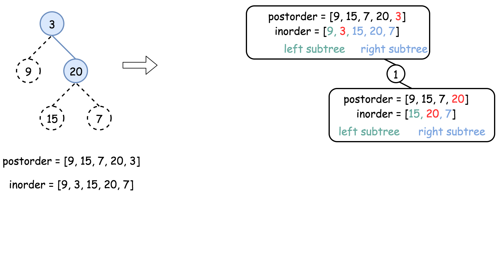
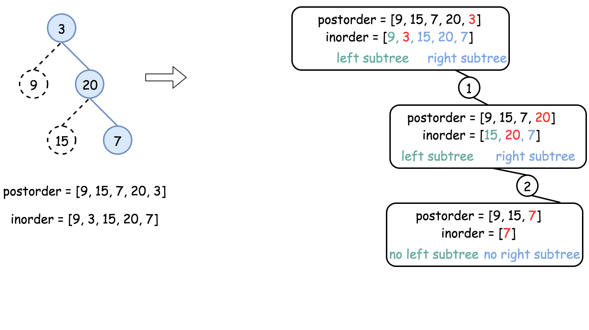
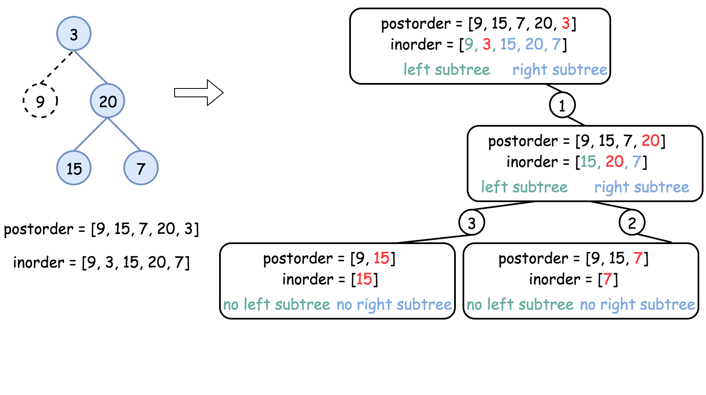
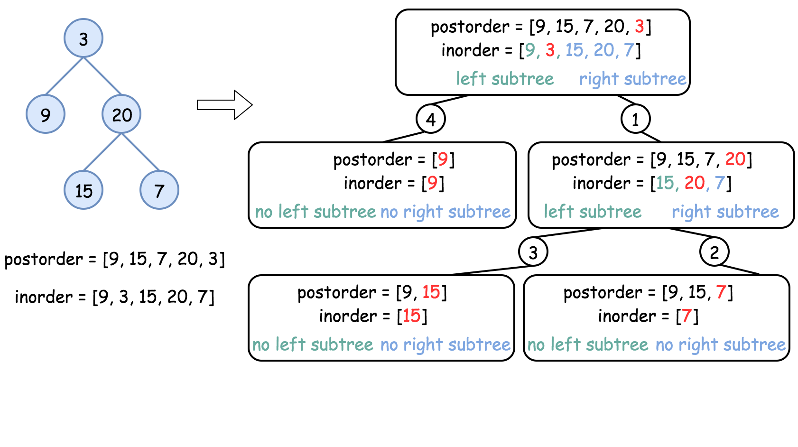
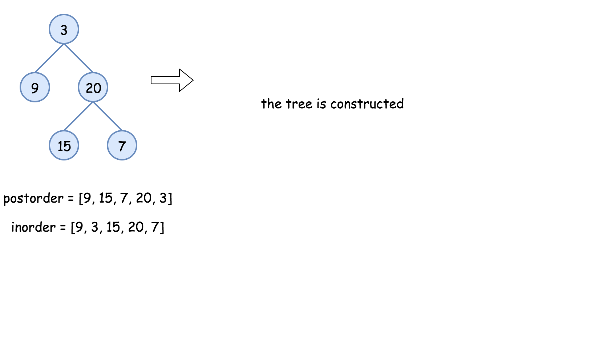

[TOC]

## Solution

---

### How to traverse the tree

There are two general strategies to traverse a tree:

- *Depth First Search* (`DFS`)

    In this strategy, we adopt the `depth` as the priority, so that one would start from a root and reach all the way down to a certain leaf, and then back to the root to reach another branch.

    The DFS strategy can further be distinguished as `preorder`, `inorder`, and `postorder` depending on the relative order among the root node, left node, and right node.

- *Breadth First Search* (`BFS`)

    We scan through the tree level by level, following the order of height, from top to bottom. The nodes on higher levels would be visited before the ones with lower levels.

In the following figure, the nodes are enumerated in the order you visit them, please follow `1-2-3-4-5` to compare different strategies.



> In this problem one deals with inorder and postorder traversals.

<br />
<br />

---
### Approach 1: Recursion

**How to construct the tree from two traversals: inorder and preorder/postorder/etc**

Problems like this one are often at Facebook interviews and could be solved in $\mathcal{O}(N)$ time:

- Start from not inorder traversal, usually it's a preorder or postorder one, and use the traversal picture above to define the strategy to pick the nodes. For example, for preorder traversal the _first_ value is a root, then its left child, then its right child, etc. For postorder traversal the _last_ value is a root, then its right child, then its left child, etc.

- The value picked from preorder/postorder traversal splits the inorder traversal into left and right subtrees. The only information one needs from inorder - if the current subtree is empty (= return `None`) or not (= continue to construct the subtree).



**Algorithm**

- Build hashmap `value -> its index` for inorder traversal.

- Return `helper` function which takes as the arguments the left and right boundaries for the current subtree in the inorder traversal. These boundaries are used only to check if the subtree is empty or not. Here is how it works $helper(\text{in}_{left} = 0, \text{in}_{right} = n - 1)$:

- If $\text{in}_{left} > \text{in}_{right}$, the subtree is empty, return `None`.

- Pick the last element in postorder traversal as a root.

- Root value has index `index` in the inorder traversal, elements from $\text{in}_{left}$ to $index - 1$ belong to the left subtree, and elements from $index + 1$ to $\text{in}_{right}$ belong to the right subtree.

- Following the postorder logic, proceed recursively first to construct the right subtree $helper(index + 1, \text{in}_{right})$ and then to construct the left subtree $helper(\text{in}_{left}, index - 1)$.

- Return `root`.

**Implementation**















```python
class Solution:
    def buildTree(self, inorder: List[int], postorder: List[int]) -> TreeNode:
        def helper(in_left: int, in_right: int) -> TreeNode:
            # if there are no elements to construct subtrees
            if in_left > in_right:
                return None

            # pick up the last element as a root
            val = postorder.pop()
            root = TreeNode(val)

            # root splits inorder list
            # into left and right subtrees
            index = idx_map[val]

            # build the right subtree
            root.right = helper(index + 1, in_right)
            # build the left subtree
            root.left = helper(in_left, index - 1)
            return root

        # build a hashmap value -> its index
        idx_map = {val: idx for idx, val in enumerate(inorder)}
        return helper(0, len(inorder) - 1)
```

**Complexity Analysis**

* Time complexity : $\mathcal{O}(N)$. Let's compute the solution with the help of [master theorem](https://en.wikipedia.org/wiki/Master_theorem_(analysis_of_algorithms)) $T(N) = aT\left(\frac{b}{N}\right) + \Theta(N^d)$. The equation represents dividing the problem up into $a$ subproblems of size $\frac{N}{b}$ in $\Theta(N^d)$ time. Here one divides the problem into two subproblems $a = 2$, the size of each subproblem (to compute the left and right subtree) is half of the initial problem $b = 2$, and all this happens in a constant time $d = 0$. That means that $\log_b(a) > d$ and hence we're dealing with [case 1](https://en.wikipedia.org/wiki/Master_theorem_(analysis_of_algorithms)#Case_1_example) that means $\mathcal{O}(N^{\log_b(a)}) = \mathcal{O}(N)$ time complexity.

* Space complexity : $\mathcal{O}(N)$, since we store the entire tree.