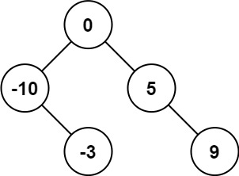

### 1. Description

Given an integer array `nums` where the elements are sorted in **ascending order**, convert *it to a ****height-balanced*** *binary search tree*.

### 2. Function Contract

**Inputs**

- `nums`: A strictly increasing array of integers.

**Return value**

Return the root of any height-balanced binary search tree containing the values of `nums`. App results display a returned tree in level order.

### 3. Examples

#### Example 1

- **Input:** `nums = [-10,-3,0,5,9]`
- **Output:** `[0,-3,9,-10,null,5]`
- **Explanation:** [0,-10,5,null,-3,null,9] is also accepted:

#### Example 2

- **Input:** `nums = [1,3]`
- **Output:** `[3,1]`
- **Explanation:** [1,null,3] and [3,1] are both height-balanced BSTs.

### 4. Constraints

- $1 \le \text{nums.length} \le 10^{4}$

- $-10^{4} \le \text{nums}[i] \le 10^{4}$

- `nums` is sorted in a **strictly increasing** order.
