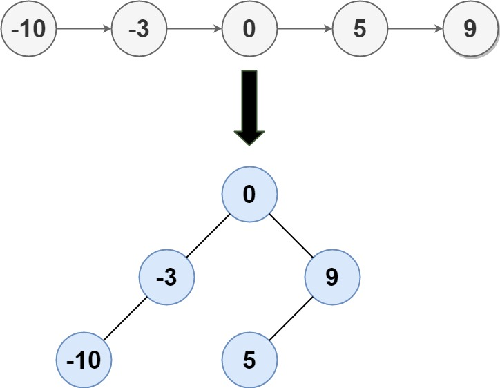

### 1. Description

Given the `head` of a singly linked list where elements are sorted in **ascending order**, convert *it to a ****height-balanced*** *binary search tree*.

### 2. Function Contract

**Inputs**

- `head`: The first node of the ascending singly linked list, or `null` for an empty list.

**Return value**

Return the root of any height-balanced binary search tree representing the list. App results display a returned tree in level order.

### 3. Examples

#### Example 1

- **Input:** $head = [-10,-3,0,5,9]$
- **Output:** `[0,-3,9,-10,null,5]`
- **Explanation:** One possible answer is [0,-3,9,-10,null,5], which represents the shown height balanced BST.
#### Example 2

- **Input:** $head = []$
- **Output:** `[]`

### 4. Constraints

- The number of nodes in `head` is in the range $[0, 2 * 10^{4}]$.

- $-10^{5} \le \text{Node.val} \le 10^{5}$