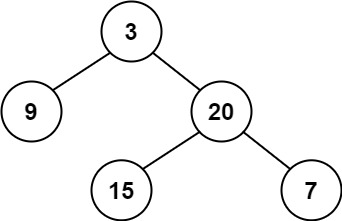

## Description

Given a binary tree, determine if it is **height-balanced**.
### Function Contract

**Inputs**

- `root`: The root of the binary tree, or `null` for an empty tree.

**Return value**

Return `true` if the height-balance condition holds at every node; otherwise return `false`.

### Examples
#### Example 1

- **Input:** `root = [3,9,20,null,null,15,7]`
- **Output:** `true`
#### Example 2

- **Input:** `root = [1,2,2,3,3,null,null,4,4]`
- **Output:** `false`
#### Example 3

- **Input:** `root = []`
- **Output:** `true`
### Constraints

- The number of nodes in the tree is in the range `[0, 5000]`.

- $-10^{4} \le \text{Node.val} \le 10^{4}$