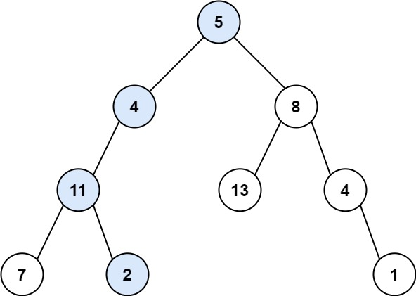

## Description

Given the `root` of a binary tree and an integer `targetSum`, return `true` if the tree has a **root-to-leaf** path such that adding up all the values along the path equals `targetSum`.

A **leaf** is a node with no children.
### Function Contract

**Inputs**

- `root`: The root of the binary tree, or `null` for an empty tree.
- `targetSum`: The required sum of the values on one complete root-to-leaf path.

**Return value**

Return `true` if at least one root-to-leaf path sums to `targetSum`; otherwise return `false`.

### Examples

#### Example 1

- **Input:** `root = [5,4,8,11,null,13,4,7,2,null,null,null,1], targetSum = 22`
- **Output:** `true`
- **Explanation:** The root-to-leaf path with the target sum is shown.
#### Example 2

- **Input:** `root = [1,2,3], targetSum = 5`
- **Output:** `false`
- **Explanation:** There are two root-to-leaf paths in the tree:
(1 --> 2): The sum is 3.
(1 --> 3): The sum is 4.
There is no root-to-leaf path with sum = 5.
#### Example 3

- **Input:** `root = [], targetSum = 0`
- **Output:** `false`
- **Explanation:** Since the tree is empty, there are no root-to-leaf paths.
### Constraints

- The number of nodes in the tree is in the range `[0, 5000]`.

- $-1000 \le \text{Node.val} \le 1000$

- $-1000 \le targetSum \le 1000$