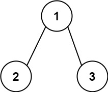

## Description

Given the `root` of a binary tree and an integer `targetSum`, return *all **root-to-leaf** paths where the sum of the node values in the path equals *`targetSum`*. Each path should be returned as a list of the node **values**, not node references*.

A **root-to-leaf** path is a path starting from the root and ending at any leaf node. A **leaf** is a node with no children.
### Function Contract

**Inputs**

- `root`: The root of the binary tree, or `null` for an empty tree.
- `targetSum`: The required sum for each returned root-to-leaf path.

**Return value**

Return a list of all qualifying paths, with each path represented by its node values from root to leaf.

### Examples
#### Example 1

- **Input:** `root = [5,4,8,11,null,13,4,7,2,null,null,5,1], targetSum = 22`
- **Output:** `[[5,4,11,2],[5,8,4,5]]`
- **Explanation:** There are two paths whose sum equals targetSum:
5 + 4 + 11 + 2 = 22
5 + 8 + 4 + 5 = 22
#### Example 2

- **Input:** `root = [1,2,3], targetSum = 5`
- **Output:** `[]`
#### Example 3

- **Input:** `root = [1,2], targetSum = 0`
- **Output:** `[]`
### Constraints

- The number of nodes in the tree is in the range `[0, 5000]`.

- $-1000 \le \text{Node.val} \le 1000$

- $-1000 \le targetSum \le 1000$