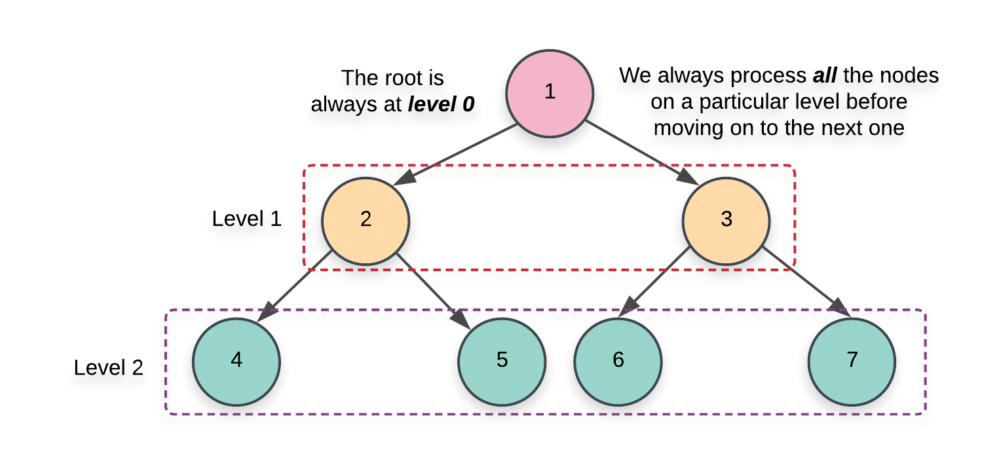
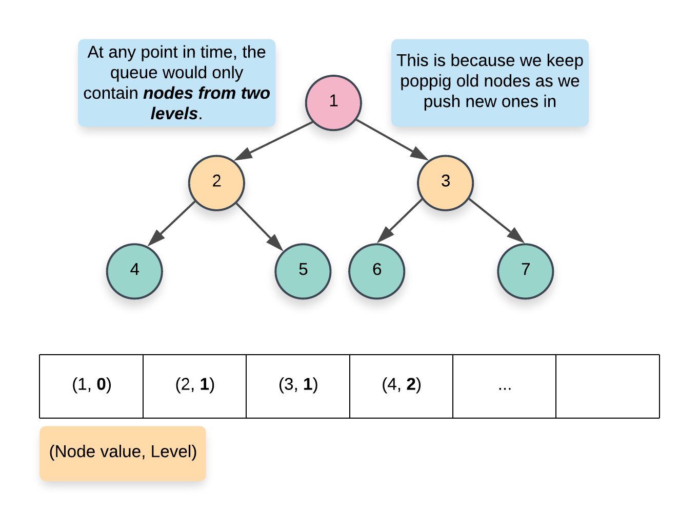
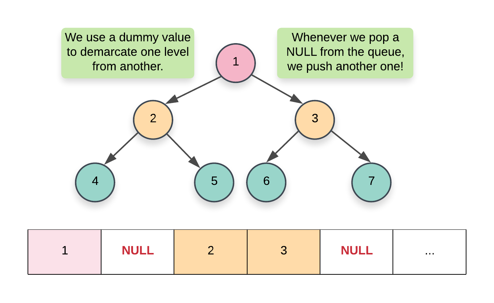
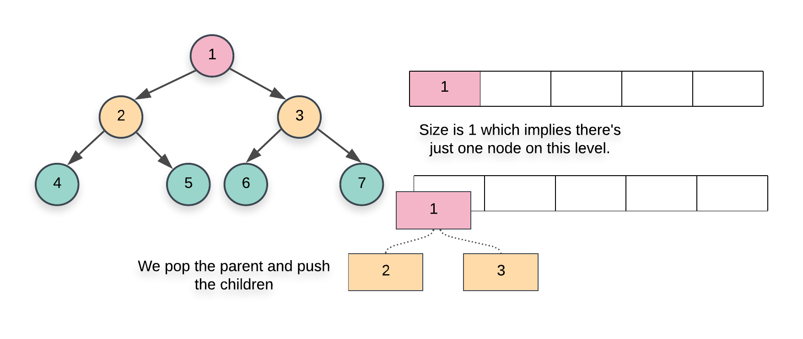
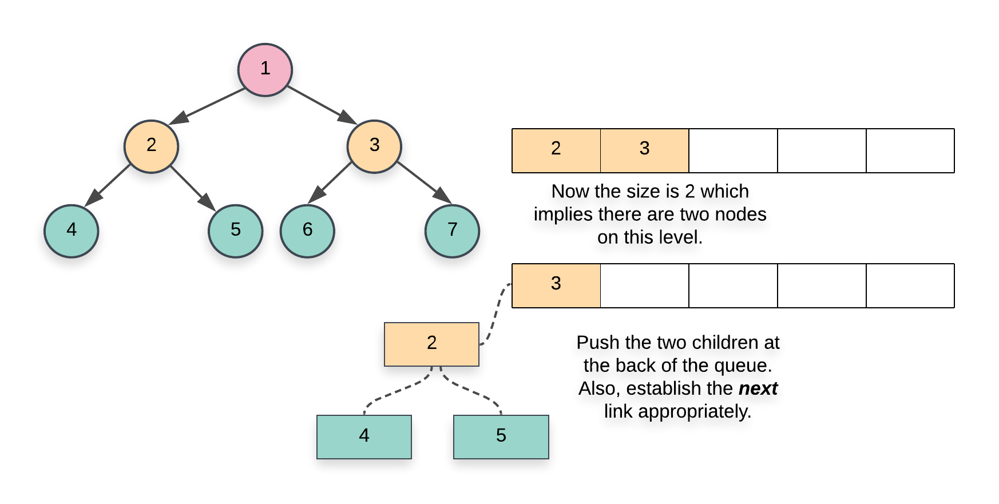
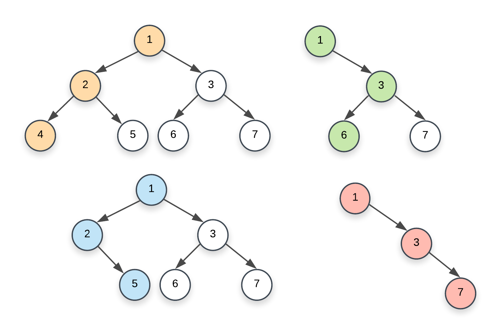
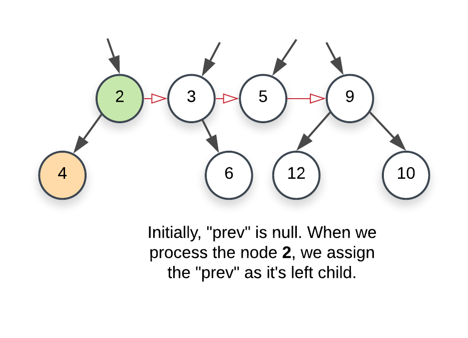
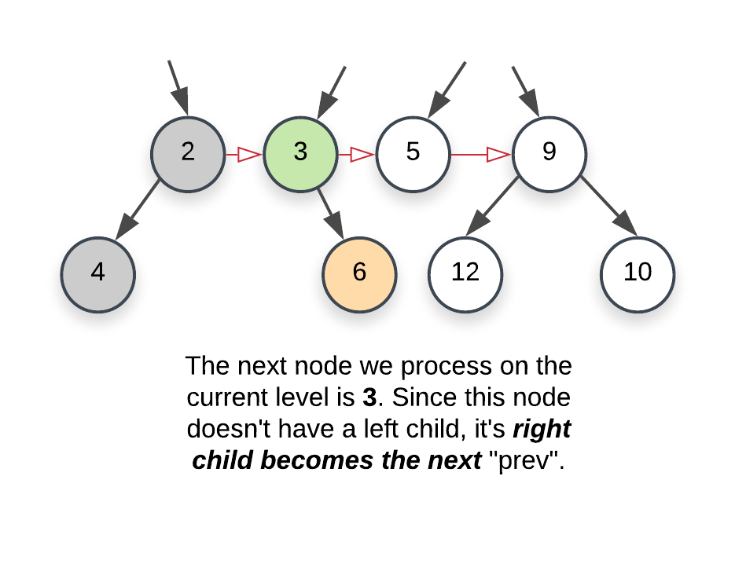
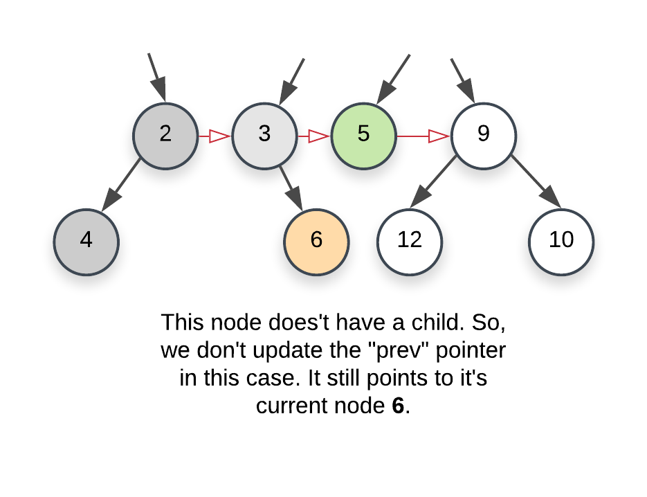
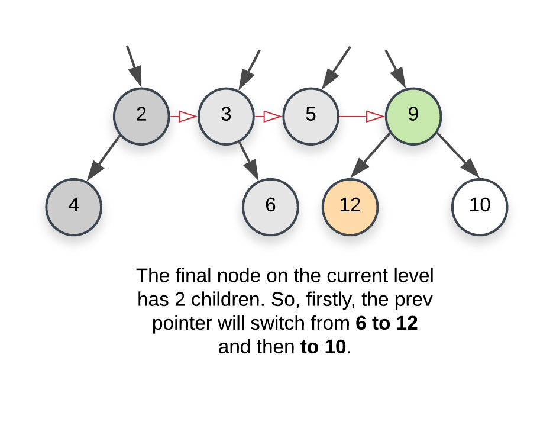

## Solution

### Approach 1: Level Order Traversal

**Intuition**

There are two basic kinds of traversals on a tree or a graph. One is where we explore the tree in a depth first manner i.e. one branch at a time. The other one is where we traverse the tree breadth-wise i.e. we explore one level of the tree before moving on to the next one. For trees, we have further classifications of the depth first traversal approach called `preorder`, `inorder`, and the `postorder` traversals. Breadth first approach to exploring a tree is based on the concept of the `level` of a node. The `level` of a node is its depth or distance from the root node. We process all the nodes on one level before moving on to the next one.

<center>

</center>

Now that we have the basics out of the way, it's pretty evident that the problem statement strongly hints at a breadth first kind of a solution. We need to link all the nodes together which lie on the `same level` and the level order or the breadth first traversal gives us access to all such nodes which lie on the same level.

**Algorithm**

1. Initialize a queue, `Q` which we will be making use of during our traversal. There are multiple ways to implement the level order traversal especially when it comes to identifying the level of a particular node.
1. We can add a pair of $(node, level)$ to the queue and whenever we add the children of a node, we add $\text (node.left, \;\; parent\_level + 1)$ and $(node.right,\;\; parent\_level + 1)$. This approach wouldn't be very efficient for our algorithm since we need *all* the nodes on the same level and we would need another data structure just for that.

        <center>
        
        </center>

2. A more memory efficient way of segregating the same level nodes is to use some demarcation between the levels. Usually, we insert a `NULL` entry in the queue which marks the end of the previous level and the start of the next level. This is a great approach but again, it would still consume some memory proportional to the number of levels in the tree.

        <center>
        
        </center>

3. The approach we will be using here would have a nested loop structure to get around the requirement of a `NULL` pointer. Essentially, at each step, we record the size of the queue and that always corresponds to ***all*** the nodes on a particular level. Once we have this size, we only process these many elements and no more. By the time we are done processing `size` number of elements, the queue would contain ***all*** the nodes on the next level. Here's a pseudocode for the same:
        <pre>
        while (!Q.empty())
        {
            size = Q.size()
            for i in range 0..size
            {
                node = Q.pop()
                Q.push(node.left)
                Q.push(node.right)
            }
        }
        </pre>

2. We start off by adding the root of the tree in the queue. Since there is just one node on the level 0, we don't need to establish any connections and can move onto the `while` loop.

    <center>
    
    </center>

3. The first `while` loop from the pseudocode above essentially iterates over each level one by one and the inner for loop iterates over all the nodes on the particular level. Since we have access to all the nodes on the same level, we can establish the next pointers easily.
4. When we `pop` a node inside the `for` loop from the pseudocode above, we add its children at the back of the queue. Also, the element at the head of the queue is the `next` element in order, on the current level. So, we can easily establish the new pointers.

    <center>
    
    </center>

```python
class Solution:
    def connect(self, root: Optional["Node"]) -> Optional["Node"]:

        if not root:
            return root

        # Initialize a queue data structure which contains
        # just the root of the tree
        Q = collections.deque([root])

        # Outer while loop which iterates over
        # each level
        while Q:

            # Note the size of the queue
            size = len(Q)

            # Iterate over all the nodes on the current level
            for i in range(size):

                # Pop a node from the front of the queue
                node = Q.popleft()

                # This check is important. We don't want to
                # establish any wrong connections. The queue will
                # contain nodes from 2 levels at most at any
                # point in time. This check ensures we only
                # don't establish next pointers beyond the end
                # of a level
                if i < size - 1:
                    node.next = Q[0]

                # Add the children, if any, to the back of
                # the queue
                if node.left:
                    Q.append(node.left)
                if node.right:
                    Q.append(node.right)

        # Since the tree has now been modified, return the root node
        return root
```

**Complexity Analysis**

* Time Complexity: $O(N)$ since we process each node exactly once. Note that processing a node in this context means popping the node from the queue and then establishing the next pointers.
* Space Complexity: $O(N)$. This is a perfect binary tree which means the last level contains $N/2$ nodes. The space complexity for breadth first traversal is the maximum space occupied and the space occupied by the queue is dependent upon the maximum number of nodes in particular level. So, in this case, the space complexity would be $O(N)$.
<br>
<br>

---
### Approach 2: Using previously established next pointers

**Intuition**

We have to process all the nodes of the tree. So we can't reduce the time complexity any further. However, we can try and reduce the space complexity. The reason we need a queue here is because we don't have any idea about the structure of the tree and the kind of branches it has and we need to access all the nodes on a common level, together, and establish connections between them.

Once we are done establishing the `next` pointers between the nodes, don't they kind of represent a linked list? After the `next` connections are established, all the nodes on a particular level actually form a linked list via these `next` pointers. Based on this idea, we have the following intuition for our space efficient algorithm:

> We only move on to the level N+1 when we are done establishing the next pointers for the level N. So, since we have access to all the nodes on a particular level via the next pointers, we can use these next pointers to establish the connections for the next level or the level containing their children.

**Algorithm**

1. We start at the root node. Since there are no more nodes to process on the first level or level `0`, we can establish the next pointers on the next level i.e. level 1. An important thing to remember in this algorithm is that we establish the next pointers for a level $N$ while we are still on level $N-1$ and once we are done establishing these new connections, we move on to $N$ and do the same thing for $N+1$.
2. As we just said, when we go over the nodes of a particular level, their next pointers are already established. This is what helps get rid of the queue data structure from the previous approach and helps save space. To start on a particular level, we just need the `leftmost` node. From there on its just a linked list traversal.
3. Based on these ideas, our algorithm will have the following pseudocode:

    <pre>
    leftmost = root
    while (leftmost != null)
    {
        curr = leftmost
        prev = NULL
        while (curr != null)
        {
            → process left child
            → process right child
            → set leftmost for the next level
            curr = curr.next
        }
    }
    </pre>

4. Before we proceed with the steps in our algorithm, we need to understand some of the variables we have used above in the pseudocode since they will be important in understanding the implementation.
1. **leftmost:** represents the corresponding variable on each level. This node is important to discover on each level since this would act as our head of the linked list and we will start our traversal of all the nodes on a level from this node onwards. Since the structure of the tree can be anything, we don't really know what the leftmost node on a level would be. Let's look at a few tree structures and the corresponding leftmost nodes on each level.

        <center>
        
        </center>

        Oh, in case you are interested in a fun problem that find out all such nodes (rightmost instead of leftmost), check out [this problem](https://leetcode.com/problems/binary-tree-right-side-view/description/).

2. **curr:** As we can see in the pseudocode, this is just the variable we use to traverse all the nodes on the `current` level. It starts off with `leftmost` and then follows the `next` pointers all the way to the very end.
3. **prev:** This is the pointer to the `leading` node on the `next` level. We need this pointer because whenever we update the node `curr`, we assign `prev.next` to the left child of `curr` if one exists, otherwise the right child. When we do so, we also update the `prev` pointer. Let's consider an example that highlights how the `prev` pointer is updated. Namely, the following example will highlight the 4 possible scenarios for pointer updates:

          - The first case is when the `prev` pointer is assigned a non-null value for the very first time i.e. when it is initialized. We start with a `null` value and when we find the first node on the *next* level i.e whenever we find the very first node on the current level that has at least one child, we assign the leftmost child to `prev`.

          <center>
          
          </center>

          - Next is when the node on the current level doesn't have a left child. We then point `prev` to the right child of the current node. An important thing to remember in this illustration is that the level `2, 3, 5, 9` already has their `next` pointers properly established.

          <center>
          
          </center>

          - Moving on, we have a node with no children. Here, we don't update the `prev` pointer.

          <center>
          
          </center>

          - And finally, we come across a node with 2 children. We first update `prev` to the left child and once the necessary processing is done, we update it to the right child.

          <center>
          
          </center>

5. Once we are done with the current level, we move on to the next one. One last thing that's left here to update the `leftmost` node. We need that node to start traversal on a particular level. Think of it as the head of the linked list. This is easy to do by using the `prev` pointer. Whenever we set the value for `prev` pointer for the first time corresponding to a level i.e. whenever we set it to it's first node, we also set the head or the `leftmost` to that node. So, in the following image, `leftmost` originally was `2` and now it would change to `4`.

    <center>
    
    </center>

```python
class Solution:

    def processChild(self, childNode, prev, leftmost):
        if childNode:

            # If the "prev" pointer is alread set i.e. if we
            # already found atleast one node on the next level,
            # setup its next pointer
            if prev:
                prev.next = childNode
            else:
                # Else it means this child node is the first node
                # we have encountered on the next level, so, we
                # set the leftmost pointer
                leftmost = childNode
            prev = childNode
        return prev, leftmost

    def connect(self, root: Optional["Node"]) -> Optional["Node"]:

        if not root:
            return root

        # The root node is the only node on the first level
        # and hence its the leftmost node for that level
        leftmost = root

        # We have no idea about the structure of the tree,
        # so, we keep going until we do find the last level.
        # The nodes on the last level won't have any children
        while leftmost:

            # "prev" tracks the latest node on the "next" level
            # while "curr" tracks the latest node on the current
            # level.
            prev, curr = None, leftmost

            # We reset this so that we can re-assign it to the leftmost
            # node of the next level. Also, if there isn't one, this
            # would help break us out of the outermost loop.
            leftmost = None

            # Iterate on the nodes in the current level using
            # the next pointers already established.
            while curr:

                # Process both the children and update the prev
                # and leftmost pointers as necessary.
                prev, leftmost = self.processChild(curr.left, prev, leftmost)
                prev, leftmost = self.processChild(curr.right, prev, leftmost)

                # Move onto the next node.
                curr = curr.next

        return root
```

**Complexity Analysis**

* Time Complexity: $O(N)$ since we process each node exactly once.
* Space Complexity: $O(1)$ since we don't make use of any additional data structure for traversing nodes on a particular level like the previous approach does.
<br>
<br>