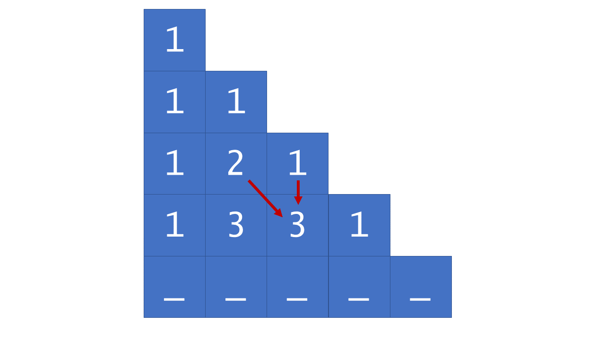

## Solution Article

### Approach 1: Dynamic Programming

**Intuition**

If we have the a row of Pascal's triangle, we can easily compute the next
row by each pair of adjacent values.

**Algorithm**

Although the algorithm is very simple, the iterative approach to constructing
Pascal's triangle can be classified as dynamic programming because we
construct each row based on the previous row.

First, we generate the overall `triangle` list, which will store each row as
a sublist. Then, we check for the special case of $0$, as we would otherwise
return `[1]`. Since $numRows$ is always greater than $0$, we can initialize `triangle` with `[1]`
as its first row, and proceed to fill the rows as follows:





```python
class Solution:
    def generate(self, num_rows: int) -> List[List[int]]:
        triangle = []

        for row_num in range(num_rows):
            # The first and last row elements are always 1.
            row = [None for _ in range(row_num + 1)]
            row[0], row[-1] = 1, 1

            # Each triangle element is equal to the sum of the elements
            # above-and-to-the-left and above-and-to-the-right.
            for j in range(1, len(row) - 1):
                row[j] = triangle[row_num - 1][j - 1] + triangle[row_num - 1][j]

            triangle.append(row)

        return triangle
```

**Complexity Analysis**

* Time complexity: $O(numRows^2)$

    Although updating each value of `triangle` happens in constant time, it
    is performed $O(numRows^2)$ times. To see why, consider how many
    overall loop iterations there are. The outer loop obviously runs
    $numRows$ times, but for each iteration of the outer loop, the inner
    loop runs $rowNum$ times. Therefore, the overall number of `triangle` updates
    that occur is $1 + 2 + 3 + \ldots + numRows$, which, according to Gauss' formula,
    is

    $$
    \begin{aligned}
        \frac{numRows(numRows+1)}{2} &= \frac{numRows^2 + numRows}{2} \\
        &= \frac{numRows^2}{2} + \frac{numRows}{2} \\
        &= $\mathcal{O}(numRows^2)$
    \end{aligned}
    $* Space complexity:$O(1)$While$O(numRows^2)$$ space is used to store the output, the input and output generally do not count towards the space complexity.