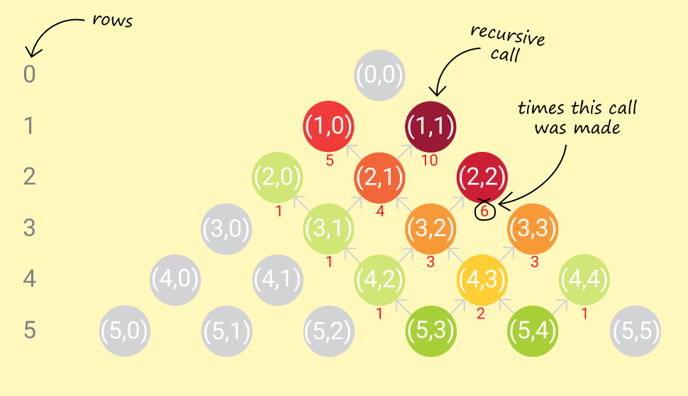
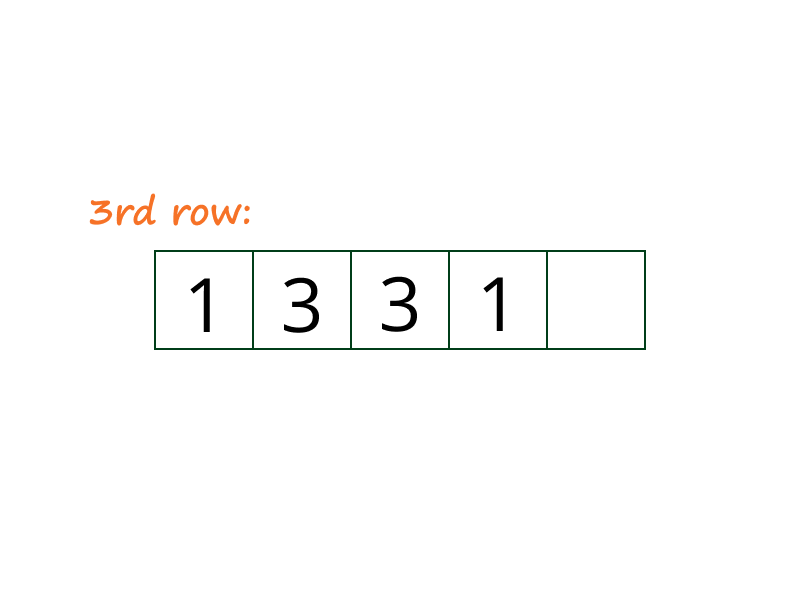
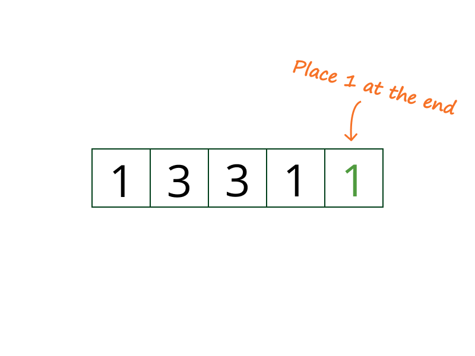
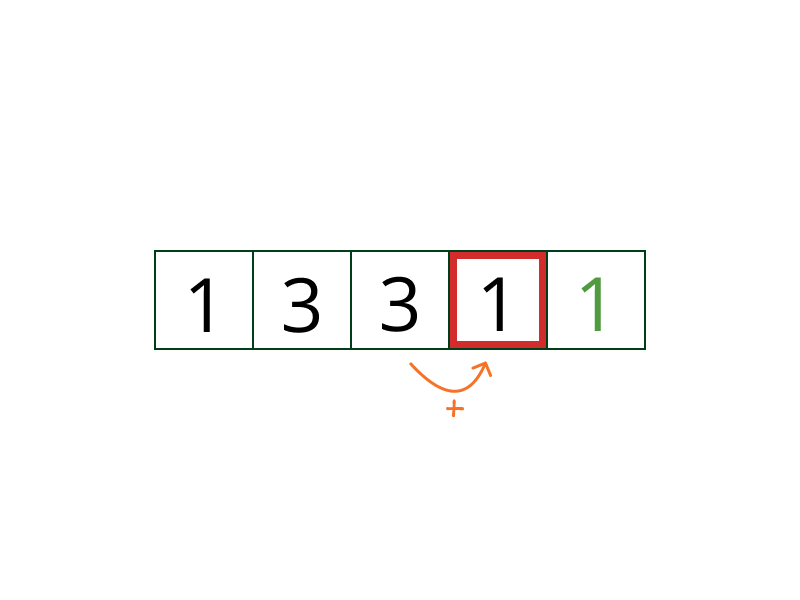
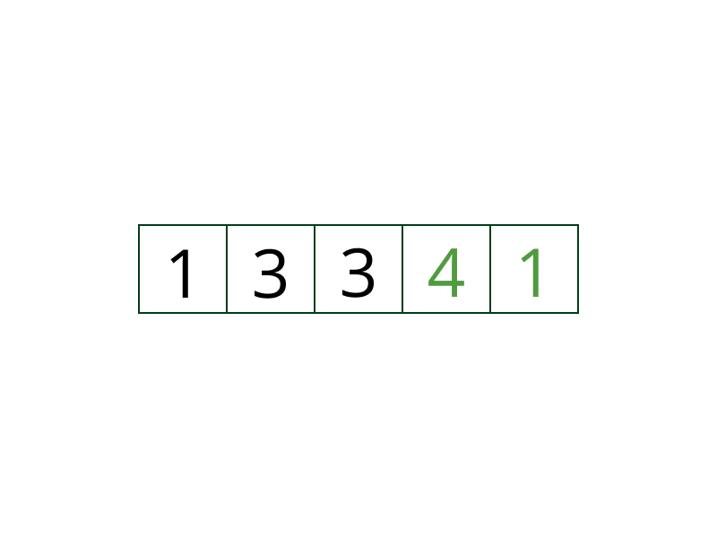
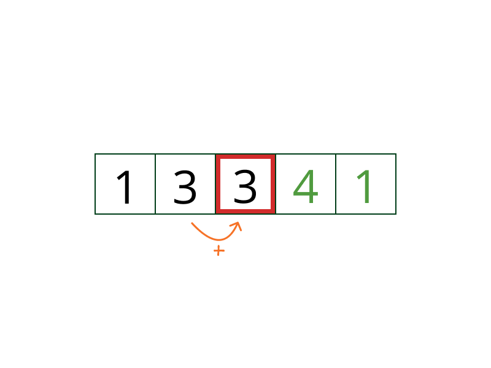
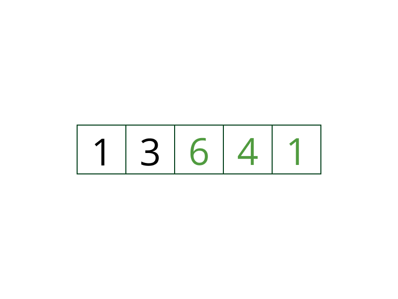
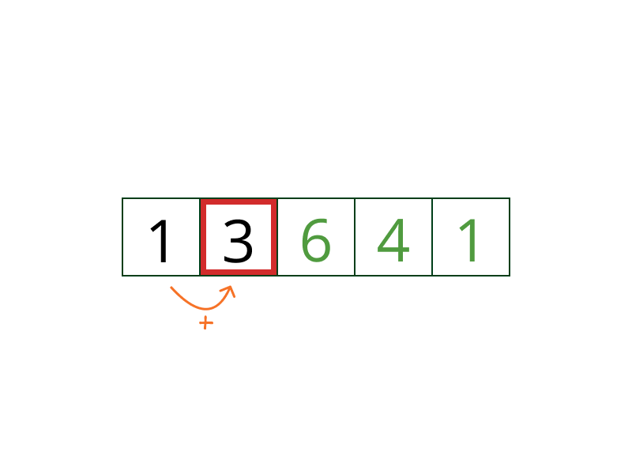
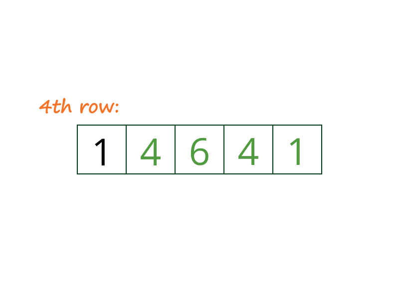

## Solution

> If you haven't attempted [118. Pascal's Triangle](https://leetcode.com/problems/pascals-triangle/), I would strongly recommend that you try that first.

---

### Approach 1: Brute Force Recursion

**Intuition**

We'll utilize a nice little property of Pascal's Triangle (given in the problem description):


> In Pascal's triangle, each number is the sum of the two numbers directly above it.

[Approach 4](#approach-4-math-specifically-combinatorics) will expand more on why it is so.

**Algorithm**

Let's say we had a function `getNum(rowIndex, colIndex)`, which gave us the `colIndex`<sup>th</sup> number in the `rowIndex`<sup>th</sup> row, we could simply build the $k^{th}$ row by repeatedly calling `getNum(...)` for columns $0$ to $k$.

We can formulate our intuition into the following recursion:

$$
\begin{aligned}
\text{getNum}(\text{rowIndex}, \text{colIndex}) &= \text{getNum}(\text{rowIndex}-1, \text{colIndex}-1) \\
&\quad + \text{getNum}(\text{rowIndex}-1, \text{colIndex})
\end{aligned}
$$

The recursion ends in some known base cases:
1. The first row is just a single $1$, i.e. $\text{getNum(0, ...) = 1}$

2. The first and last number of each row is $1$, i.e. $\text{getNum(k, 0) = getNum(k, k) = 1}$

```python
class Solution:
    def getNum(self, row, col):
        if row == 0 or col == 0 or row == col:
            return 1
        return self.getNum(row - 1, col - 1) + self.getNum(row - 1, col)

    def getRow(self, rowIndex):
        ans = []
        for i in range(rowIndex + 1):
            ans.append(self.getNum(rowIndex, i))
        return ans
```

**Complexity Analysis**

* Time complexity : $O(2^k)$. The time complexity recurrence is straightforward:

    $T(k,i) = T(k-1,i) + T(k-1,i-1) +$\mathcal{O}(1)$\quad \ni \quad T(k,k) = T(k,0) = O(1)$

    Thus, $\text{T(k, m)}$ takes ${k \choose m}$ units of constant time. [^note-1]

    For the $k^{th}$ row, total time required is:

    $$
    T(k, 0) + T(k, 1) + ... + T(k, k-1) + T(k, k)  \\
    \begin{aligned}
    &= \sum_{m=0}^k T(k, m)                        \\
    &\simeq \sum_{m=0}^k $\mathcal{O}({k \choose m})$         \\
    &\simeq $\mathcal{O}(\sum_{m=0}^k {k \choose m})$         \\
    &= $\mathcal{O}(2^k)$
    \end{aligned}
    $* Space complexity :$O(k) + $\mathcal{O}(k)$ \simeq O(k)$$.
* We need $O(k)$ space to store the output of the $k^{th}$ row.
* At worst, the recursive call stack has a maximum of $k$ calls in memory, each call taking constant space. That's $O(k)$ worst case recursive call stack space.

<br />

---

### Approach 2: Dynamic Programming

**Intuition**

In the previous approach, we end up making the same recursive calls repeatedly.



For example, to calculate `getNum(5, 3)` and `getNum(5, 4)`, we end up calling `getNum(3, 2)` thrice. To generate, the entire fifth row (`0`-based row indexing), we'd have to call `getNum(3, 2)` four times.

It makes sense to store the results of intermediate recursive calls for later use.

**Algorithm**

Simple memoization caches results of deep recursive calls and provides significant savings on runtime.

```python
class Solution:
    # initially, the cache is empty
    cache = {}

    # Internal helper function to calculate the number of ways
    def getNum(self, row, col):
        # store the position as a tuple, which will be used as a key in the cache
        rowCol = (row, col)
        # if the key is already in the cache, then return the cached value
        if rowCol in self.cache:
            return self.cache[rowCol]
        # if the row or column is 0, or if the row and column are the same, then there is only one way
        if row == 0 or col == 0 or row == col:
            self.cache[rowCol] = 1
            return 1
        # otherwise, the number of ways is the sum of the number of ways from the cell above and the cell to the left
        self.cache[rowCol] = self.getNum(row - 1, col - 1) + self.getNum(
            row - 1, col
        )
        return self.cache[rowCol]

    # Function to return the row of Pascal's Triangle
    def getRow(self, rowIndex):
        ans = []
        for i in range(rowIndex + 1):
            ans.append(self.getNum(rowIndex, i))
        return ans
```

But, it is worth noting that generating a number for a particular row requires only two numbers from the previous row. Consequently, generating a row only requires numbers from the previous row.

Thus, we could reduce our memory footprint by only keeping the latest row generated, and use that to generate a new row.

```python
class Solution:
    def getRow(self, rowIndex: int) -> List[int]:
        prev = [1]
        for i in range(1, rowIndex + 1):
            curr = [1] * (i + 1)
            for j in range(1, i):
                curr[j] = prev[j - 1] + prev[j]
            prev = curr
        return prev
```

> The `std::move()` operator on vectors in C++ is an $O(1)$ operation. [^note-2]

**Complexity Analysis**

* Time complexity : $O(k^2)$.
* Simple memoization would make sure that a particular element in a row is only calculated once. Assuming that our memoization cache allows constant time lookup and updation (like a hash-map), it takes constant time to calculate each element in Pascal's triangle.
* Since calculating a row requires calculating all the previous rows as well, we end up calculating $1 + 2 + 3 + ... + (k+1) = \dfrac {(k+1)(k+2)}{2} \simeq k^2$ elements for the $k^{th}$ row.

* Space complexity : $O(k) +$\mathcal{O}(k)$\simeq O(k)$.
* Simple memoization would need to hold all $1 + 2 + 3 + ... + (k+1) = \dfrac {(k+1)(k+2)}{2}$ elements in the worst case. That would require $O(k^2)$ space.
* Saving space by keeping only the latest generated row, we need only $O(k)$ extra space, other than the $O(k)$ space required to store the output.

<br />

---

### Approach 3: Memory-efficient Dynamic Programming

**Intuition**

Notice that in the previous approach, we have maintained the previous row in memory on the premise that we need terms from it to build the current row. This is true, but not _wholly._

What we actually need, to generate a term in the current row, is _just_ the two terms above it (present in the previous row).

Formally, in memory,
```
pascal[i][j] = pascal[i-1][j-1] + pascal[i-1][j]
```
where $\text{pascal}[i][j]$ is the number in _i_<sup>th</sup> row and _j_<sup>th</sup> column of Pascal's triangle.

So, trying to compute $\text{pascal}[i][j]$, only the memory regions of `pascal[i-1][j-1]` and `pascal[i-1][j]` are required to be accessed.

**Algorithm**

Let's take a step back and analyze the circumstances under which $\text{pascal}[i][j]$ might be accessed. Given that we have already employed DP to save us valuable run-time, the access pattern for $\text{pascal}[i][j]$ looks a bit like this:

+ `WRITE` $\text{pascal}[i][j]$ (after generating it from `pascal[i-1][j-1]` and `pascal[i-1][j]`)
+ `READ` $\text{pascal}[i][j]$ to generate `pascal[i+1][j]`
+ `READ` $\text{pascal}[i][j]$ to generate `pascal[i+1][j+1]`

That's it! Once we've written out $\text{pascal}[i][j]$:
1. We don't ever need to modify it.
2. It's only read a _fixed_ number of times, i.e. __twice__ (thanks to DP).

Hypothetically, if we kept the the current row (in the process of being generated) and the previous row, in the same memory block, what kind of access patterns would we see (assume $\text{pascal}[j]$ means the _j_<sup>th</sup> number in a row)?

+ $\text{pascal}[j]$ was somehow generated in a previous instance. Currently, it holds the previous row value.

+ $\text{pascal}[j]$ (which holds the _j_<sup>th</sup> number of the previous row) must be read when writing out $\text{pascal}[j]$ (the _j_<sup>th</sup> number of the current row).
    + Obviously they are the same memory location, so a conflict exists: the previous row value of $\text{pascal}[j]$ will be lost after the write-out.
    + Is that ok? If we don't need to read the previous row value of $\text{pascal}[j]$ anymore, is there any harm in writing out the current row value in its place?

+ $\text{pascal}[j]$ (which holds the _j_<sup>th</sup> number of the previous row) must be read when writing out `pascal[j+1]` (the _j+1_<sup>th</sup> number of the current row). These are two different memory locations, so there is no conflict.

If we managed to keep all read accesses on the previous row value of $\text{pascal}[j]$, __before__ any write access to $\text{pascal}[j]$ for the current row value, we should be good! That's possible by evaluating each row from the end, instead of the beginning. Thus, a new row value of `pascal[j+1]` must be generated _before_ doing so for $\text{pascal}[j]$.

The following animation demonstrates the above algorithm, used to generate the 4<sup>th</sup> row of Pascal's Triangle, from an existing 3<sup>rd</sup> row:

















```python
class Solution:
    def getRow(self, rowIndex: int) -> List[int]:
        # initialize row with all elements as 1
        row = [1] * (rowIndex + 1)
        # populate each row element
        for i in range(1, rowIndex):
            for j in range(i, 0, -1):
                # current element is sum of current and previous element in above row
                row[j] += row[j - 1]
        return row
```

**Complexity Analysis**

* Time complexity : $O(k^2)$. Same as the previous dynamic programming approach.

* Space complexity : $O(k)$. No extra space is used other than that required to hold the output.

* Although there is no savings in theoretical computational complexity, in practice there are some minor wins:
* We have one vector/array instead of two. So memory consumption is roughly half.
* No time wasted in swapping references to vectors for previous and current row.
* Locality of reference shines through here. Since every read is for consecutive memory locations in the array/vector, we get a performance boost.

<br />

---

### Approach 4: Math! (specifically, Combinatorics)

**Intuition**

Let's go back to the definition of a Pascal's Triangle:

> In mathematics, Pascal's triangle is a triangular array of the binomial coefficients.
> ...
> The entry in the *n*<sup>th</sup> row and *r*<sup>th</sup> column of Pascal's triangle is denoted $\tbinom {n}{r}$.

As a refresher, ${n \choose r} = \tfrac {n!}{r!(n-r)!}$.

Binomial coefficients have an additive property, known as [Pascal's rule](https://en.wikipedia.org/wiki/Pascal%27s_rule):

${n \choose r} = {n-1 \choose r-1} + {n-1 \choose r} \quad \forall \quad r, n \in \N^0, \space 0 \leq r \leq n$

If you notice carefully, the terms ${n-1 \choose r-1}$ and ${n-1 \choose r}$, are the two numbers directly above the number ${n \choose r}$ in Pascal's triangle. This recurrence is same as the intuition for [Approach 1](#approach-1-brute-force-recursion).

**Algorithm**

While knowing Pascal's rule does not give us any benefits over previous approaches, knowing that the numbers in Pascal's triangle are just binomial coefficients will come in handy.

Successive binomial coefficients ${n \choose r-1}$ and ${n \choose r}$ differ by a factor of:

$$
\dfrac {n \choose r}{n \choose r-1} =
\dfrac {\dfrac {n!}{r! \cdot (n-r)!}}{\dfrac {n!}{(r-1)! \cdot (n-r+1)!}} = \dfrac {n-r+1}{r}
$$

Thus, we can derive the next term in a row in Pascal's triangle, from a preceding term. Running a loop should give us the required row.

+ We know that each row starts with a $1$, so we have a starting point.
+ We also know that the $k^{th}$ row has exactly $k+1$ terms, so we know how long we need to run the loop.

```python
class Solution:
    def getRow(self, n):
        row = [1]
        for k in range(1, n + 1):
            row.append(int((row[-1] * (n - k + 1)) / k))
        return row
```

**Complexity Analysis**

* Time complexity : $O(k)$. Each term is calculated once, in constant time.

* Space complexity : $O(k)$. No extra space required other than that required to hold the output.

---

### Further Thoughts

+ The symmetry of a row in Pascal's triangle allows us to get away with computing just half of each row.

> Pop Quiz: Are there any computational complexity benefits of doing this?

> Pop Quiz: Can you prove _why_ these rows are symmetrical?

---

[^note-1]: This [Stack Overflow answer](https://stackoverflow.com/a/26229383/2844164) has a good explanation. See the parallel between the time complexity recurrence and [Pascal's rule](https://en.wikipedia.org/wiki/Pascal%27s_rule).

[^note-2]: Starting C++11, `std:move()` can be used to move resources across arguments or references. Since underlying representations are simply moved, and _not_ copied, this can be a very efficient operation to transfer elements across collections or containers. See this [Stack Overflow answer](https://stackoverflow.com/a/12613436/2844164) for more.