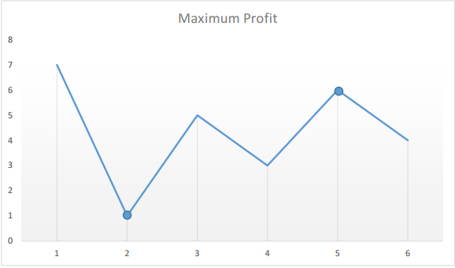

## Solution Article

We need to find out the maximum difference (which will be the maximum profit) between two numbers in the given array. Also, the second number (selling price) must be larger than the first one (buying price).

In formal terms, we need to find $\max(\text{\text{prices}[j]} - \text{\text{prices}[i]})$, for every $i$ and $j$ such that $j > i$.

---

### Approach 1: Brute Force (Time Limit Exceeded)

```python
class Solution:
    def maxProfit(self, prices: List[int]) -> int:
        max_profit = 0
        for i in range(len(prices) - 1):
            for j in range(i + 1, len(prices)):
                profit = prices[j] - prices[i]
                if profit > max_profit:
                    max_profit = profit

        return max_profit
```

#### Complexity Analysis

* Time complexity: $O(n^2)$. Loop runs $\dfrac{n (n-1)}{2}$ times.

* Space complexity: $O(1)$. Only two variables - $\text{maxprofit}$ and $\text{profit}$ are used.

---

### Approach 2: One Pass

#### Algorithm

Say the given array is:

```
[7, 1, 5, 3, 6, 4]
```

If we plot the numbers of the given array on a graph, we get:



The points of interest are the peaks and valleys in the given graph. We need to find the largest price following each valley, which difference could be the max profit.
We can maintain two variables - minprice and maxprofit corresponding to the smallest valley and maximum profit (maximum difference between selling price and minprice) obtained so far respectively.

```python
class Solution:
    def maxProfit(self, prices: List[int]) -> int:
        min_price = float("inf")
        max_profit = 0
        for i in range(len(prices)):
            if prices[i] < min_price:
                min_price = prices[i]
            elif prices[i] - min_price > max_profit:
                max_profit = prices[i] - min_price

        return max_profit
```

#### Complexity Analysis

* Time complexity: $O(n)$. Only a single pass is needed.

* Space complexity: $O(1)$. Only two variables are used.